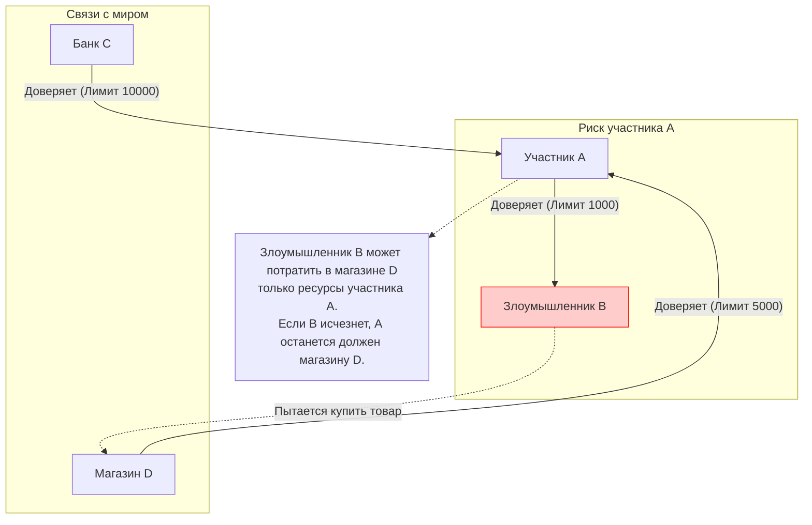
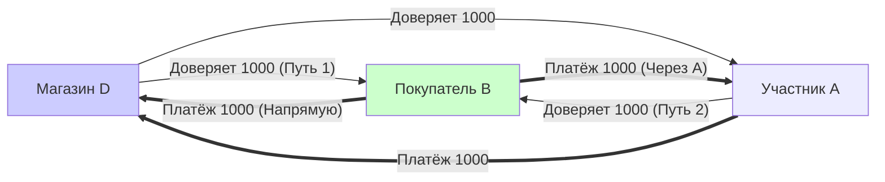
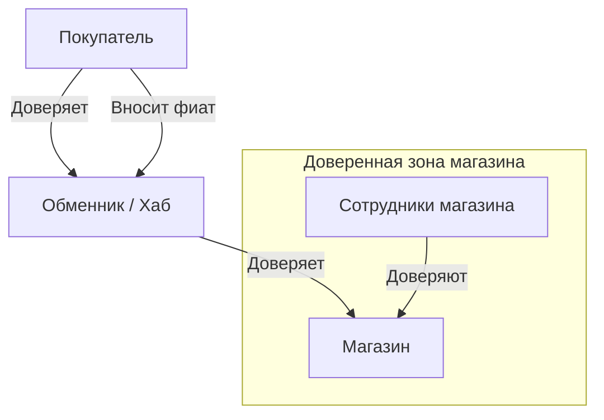
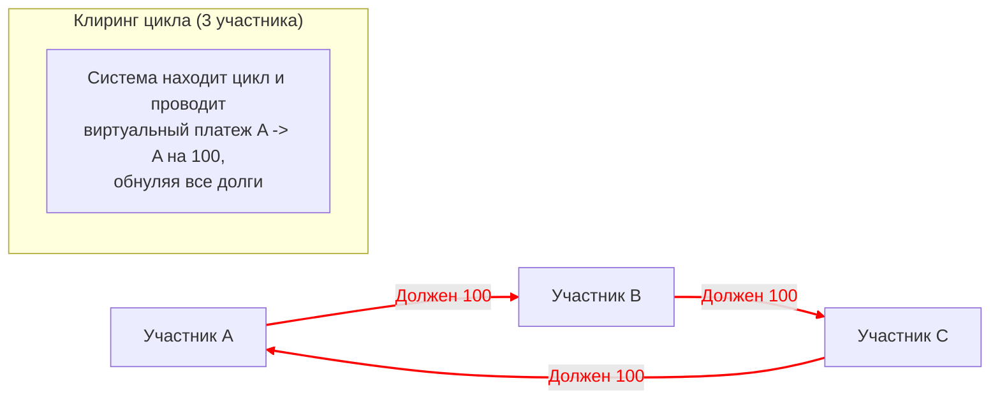

# Диалог с Димой Чижевским о механике доверия, рисках и клиринге

*Дата: 05.05.2021*
*Участники: Slawa Gorobets, Dima Chizhevsky*

Данный документ содержит отформатированный лог переписки с Димой Чижевским (архитектор GEO Protocol) с добавленными схемами для иллюстрации обсуждаемых механик.

---

## 1. Линии доверия и риск мошенничества

**Slawa Gorobets:**
Дмитрий, когда-то давно общались касательно GEO с вами и Максом. Не будет ли у вас 15 минут объяснить мне про линии доверия и дать ссылку, где их работу можно исследовать в коде протокола? Меня интересует защита от мошенничества:

Случай, когда какой-то человек открывает линии доверия мошенникам, которые покупают в кредит реальные товары у других участников системы и исчезают из системы...

**Dima Chizhevsky:**
Случай о котором вы пишете — возможен. На то они и линии доверия)

**Slawa Gorobets:**
Мне интересно алгоритмически какие для этого есть предохранители в протоколе и где о них почитать или посмотреть в коде?

**Dima Chizhevsky:**
Предохранитель для чего? Можете описать последовательность действий от которой хотите защититься?

**Slawa Gorobets:**
Линия доверия — это лимит кредита, который я открываю человеку. То есть сумма средств, на которую он может купить у меня товаров, имея нулевой баланс на счету. Правильно?

**Dima Chizhevsky:**
Как только вы открыли кому-то ЛД (Линию Доверия) — его возможности (не баланс) увеличились на сумму ЛД.
Баланса как такового в системе нет. То, что в классическом банкинге называют балансом это — по сути значение вашей ЛД к банку. Одной единственной.

Этот человек становится способен воспользоваться долгом всех, кто доверил вам ЛД, или имеет перед вами долговые обязательства, которые можно списать.

**Slawa Gorobets:**
То есть, предохранителя нет от того, чтобы человек зарегистрировался в системе, открыл 1000 мошенникам по 1000 гривен, которые те использовали на покупку реальных товаров у других участников системы?

**Dima Chizhevsky:**
То, что вы называете покупкой реальных товаров и услуг скорее всего тоже является результатом наличия определенного доверия, или скорее фин. обязательств перед этим человеком.

Давайте определим контекст:
*   **А** — это честный человек
*   **В** — злоумышленник
*   **С** — платежная система, банк, или любой эмитент
*   **Д** — магазин с реальными товарами

Для того чтобы **В** мог что-то купить по доверию от **А**, **А** и сам должен иметь эту возможность. А это значит, что он должен или пополнить баланс через конвертацию фиата используя **С**, или зайти в долг (опять же доверенный) относительно **Д**.

**В** не сможет использовать больше, чем максимальное из 2х чисел (доверие от **А** к **В**; поток от **А** в магазин).

То, что вы называете предохранителем существует не в протоколе, а в интерфейсе пользователя: им следует напоминать, что линия доверия это возможность другому человеку воспользоваться их балансом. На определенную сумму. **А** сам определяет на сколько и кому доверять и, соотв. сам контролирует риск.

---

## 2. Расчет доступного потока (Max Flow)

**Slawa Gorobets:**
"Для того чтобы В мог что-то купить по доверию от А, А и сам должен иметь эту возможность." — об этом я не знал.
А что такое "поток от А в магазин"?

**Dima Chizhevsky:**
Суммарная возможность генерации долговых обязательств.

Представим, что **В** — не злоумышленник.
1.  **Д** доверяет **А** на 1000.
2.  **Д** доверяет **В** на 1000.
3.  **А** доверяет **В** на 1000.

В таком случае поток от **В** к **Д** — **2000**.
Одна тыс. по собственной ЛД с **Д**, а другая тысяча через **А**.

**Dima Chizhevsky:**
Задача протокола — посчитать эти возможности, показать их и дать возможность воспользоваться.

---

## 3. Аналогия с банковской картой

**Dima Chizhevsky:**
Про ваш первый запрос могу объяснить иначе.

Представьте, что у вас есть счет в банке на 10000 грн. По сути, это ЛД от вас к банку. Банк начислил вам 10000, а вы доверяете ему, что по первому же запросу он направит ваши средства дальше, куда вы скажете. Он может это и не сделать, поэтому тут именно про доверие.

А теперь представьте, что эмитируете карту, которая привязана к этому счету, но на которой стоит лимит по операциям на 1000 грн. И отдаете карту жене, или дочке. Так вот карта в данном случае это — ЛД.

**Slawa Gorobets:**
На этом примере, если **Д** никто не доверяет, то фактически "**В**" сможет воспользоваться только 1000.
А если "**А**" тоже никто не доверяет, то "**В**" вообще не будет иметь кредита для оплаты (или перевода)?

**Dima Chizhevsky:**
Да, сможет воспользоваться только 1000, но только относительно **А**. Купить товар или услугу у **А**, а не у **Д**.
Потому что нет потока от **В** к **Д**, если у **Д** нет связей с миром. И, да. В таком случае у **Д** никто ничего купить не может.

---

## 4. Архитектура для магазинов (Хабы и Обменники)

**Slawa Gorobets:**
Ага, теперь уже понятнее :) То есть, если **А** — это магазин, а **В** — покупатель, то фактически магазин должен открывать линии доверия всем покупателям, которые хотят приобрести у него товар.

**Dima Chizhevsky:**
Возможны варианты. ЛД к покупателям — возможно, но лучше не надо, потому что все же магазин не должен был бы никому доверять.

Лучше, когда магазин доступен при посредничестве другой сущности, которая служит обменником. Люди доверяют обменнику. Приносят гривну, получают экв. на свои ЛД. Обменник связан с магазином.

Или:
1.  Магазин доверяет владельцу и сотрудникам.
2.  Владелец имеет людей, которым доверяет. И т.д.
3.  Постоянным клиентам, и тому подобное.
4.  Также сюда ложатся системы лояльности и другие вещи, которыми люди готовы рисковать.

---

## 5. Клиринг (Взаимозачёт)

**Slawa Gorobets:**
Интересует поиск взаимозадолженности всех участников и выявление возможности клиринга при проведении транзакций...

**Dima Chizhevsky:**
Клиринг присутствует. Он автоматический.
Если коротко: клирятся циклы из **3-х, 4-х, 5-ти и 6-ти участников**.
*   3 и 4 ищутся после каждой операции.
*   5 и 6 ищутся и процессингуются раз в сутки (из-за вычислительной сложности операции).

Клиринг реализован как сочетание 2-х операций: поиск цикла и запуск платежной операции на самого себя если цикл найден.

В коде вам следует посмотреть платежную транзакцию, или набор классов с ключевым словом `Cycle`. Там они разбиты отдельно для 3-х, 4-х, 5-ти и 6-ти размерных циклов.

---

## 6. Полезные ссылки и вдохновение

**Dima Chizhevsky:**
Я кстати сейчас общаюсь с бывшим членом команды Ripple об этом же. Вот сайт его проекта, я думаю, вы мыслите об общих вещах:

*   **Federated Bookkeeping**: [https://federatedbookkeeping.org/](https://federatedbookkeeping.org/)
*   **LedgerLoops**: Cryptographically triggered IOUs [https://ledgerloops.com/](https://ledgerloops.com/)

Мы вдохновлялись идеями Райана Фьюгера (Ryan Fugger), оригинального автора концепции Ripple (до создания компании Ripple Labs).
