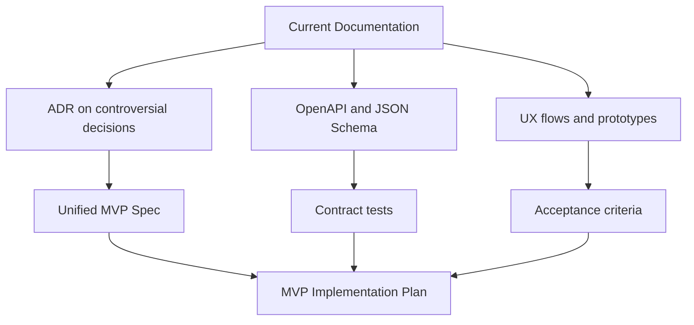

# GEOv0-PROJECT — Documentation Clarifications and Gaps for "First Time Right" Development

**Goal:** Assess if the current repository documentation is sufficient to implement MVP "right the first time" and capture a list of clarifications/details/improvements.

**MVP Boundary for this assessment (by agreement):** GEO Hub backend + minimal Web Client/PWA (no Flutter) to pass the full user flow.

**Note:** This document **consolidates** my gap list with comments and suggestions from an external recommendations document that is **missing from the current repository** (link removed).

---

## 0. Key Documents Reviewed

Base set (RU):

- [`docs/en/00-overview.md`](../00-overview.md)
- [`docs/en/01-concepts.md`](../01-concepts.md)
- [`docs/en/02-protocol-spec.md`](../02-protocol-spec.md)
- [`docs/en/03-architecture.md`](../03-architecture.md)
- [`docs/en/04-api-reference.md`](../04-api-reference.md)
- [`docs/en/05-deployment.md`](../05-deployment.md)
- [`docs/en/06-contributing.md`](../06-contributing.md)

Additional (stack requirements, reports, and analyses):

- `docs/en/concept/08-technology-stack-requirements.md` (if available)
- `docs/en/concept/project-analysis-comprehensive-report.md` (if available)
- `docs/en/archive/07-gaps-analysis.md` (if available)
- External recommendations document (missing from current repository)

---

## 1. Final Conclusion on Data Sufficiency

**Verdict:** **Probably No** — *not due to lack of ideas or basic specification*, but due to **insufficient "stitching" of documentation into a single source of truth for MVP** (especially at interfaces: node model/coordination → 2PC protocol → API/contracts → UX/keys/recovery → acceptance criteria).

**Important:** This does **not contradict** the conclusion "development can start" (from the external recommendations document; document missing from current repository):
- **You can start** (project skeleton, migrations, basic CRUD, infrastructure, API contract, testbed).
- But **"right the first time"** (without rework after 1–3 weeks) — probability is low until controversial decisions, default configuration, edge-cases, and test plan are fixed.

### 1.1. What is already well developed (not to lose it)

Collectively, the following are strongly developed:

- **Concept and Vision:** philosophy, motivation, comparison with analogs, target audience.
- **Protocol Specification:** key entities, invariants, Ed25519/SHA-256, 2PC, routing/multi-path, clearing.
- **Architecture:** logic of Hub-centric MVP, evolution/roadmap, layering.
- **API Reference:** main REST endpoints, request/response formats, WS notifications, errors.
- **Data Model:** SQL schemas and indexing (as a base for Alembic migrations).

So the problem is not "empty" documentation, but **normative MVP boundaries and implementation reproducibility** (contracts, tests, configs, edge-cases, arbitration, operational procedures).

### Why "Probably No", despite many materials

Documents contain much useful info (entities, invariants, DB schemas, API examples, deployment). But for "first time right" MVP implementation, missing are:

1) **Finalized MVP scope** (which algorithms and modes are definitely in/out).

2) **Clear "operational model" of a participant in MVP**: is a participant just an account in the hub or a separate node with independent storage/message confirmation?

3) **Product artifacts** (user stories, UX flows, prototypes, community texts and rules), necessary for minimal PWA, not just for "protocol core".

4) **Contracts suitable for autogeneration/contract tests** (OpenAPI/JSON Schema + test vectors for signatures/canonicalization).

5) **Acceptance criteria and test plan**, tied to invariants and main user scenarios.

---

## 2. 5–10 Critical Clarifications to Start MVP

Below are clarifications without which the risk of rework in the first 1–3 weeks is high.

1) **Node Model in MVP (account vs node)**
   - **Why important:** defines 2PC/locks implementation, client online requirements, threat model.
   - **Risk:** building "quasi-p2p" code and then simplifying (or vice versa), breaking protocol/UX.
   - **Fix:** 1-page MVP participant model spec + sequence diagram of payment/clearing in selected model.

2) **Unified MVP scope: routing + clearing + multipath**
   - **Why important:** documentation shows varying complexity levels (BFS, k-shortest, max-flow; cycles 3–4 vs 3–6).
   - **Risk:** team starts implementing "extras" or incompatible approaches.
   - **Fix:** scope table "in/out" + ADR on routing and clearing (what we do in v0.1 and why).

3) **Normative Debt Model and Invariants (especially debt symmetry)**
   - **Why important:** DB schema suggests `amount > 0` and separate records, but invariant prohibits bilateral debts; clear netting policy needed.
   - **Risk:** desync of balance/limit calculations, incorrect clearing, migration errors.
   - **Fix:** rules table "how we represent debt" + transformation examples (A owes B / B owes A) + invariant test cases.

4) **Key Management in PWA (storage, backup, transfer, recovery)**
   - **Why important:** safe registration/login/signing is impossible without this.
   - **Risk:** user access loss, key compromise, refusal to sign, security model degradation.
   - **Fix:** UX flow and threat model for keys + key/seed export format description + recovery policy.

5) **Unified API Contract (OpenAPI level) + Contract Tests**
   - **Why important:** API Reference is useful, but "first time right" needs machine-readable contract.
   - **Risk:** backend↔PWA incompatibility, integration cost growth.
   - **Fix:** OpenAPI 3.0 + JSON Schema for WS events + Postman/Insomnia collection + contract tests.

6) **Community Policies and Default Parameters**
   - **Why important:** many decisions are "social" (auto_clearing, verification levels, default limits, anti-spam/anti-sybil measures).
   - **Risk:** unpredictable pilot economy and conflicting participant expectations.
   - **Fix:** community config spec (YAML/JSON) + user-visible rules.

7) **Dispute/Arbitration Process and Compensating Transaction Boundaries**
   - **Why important:** protocol allows compensation, but governance is needed.
   - **Risk:** "manual balance edits" without audit or inability to fix obvious errors.
   - **Fix:** SOP + roles/rights + audit log + user stories for dispute.

8) **Acceptance Criteria and Invariant-Based Test Strategy**
   - **Why important:** system easily breaks on edge-cases (timeouts, multipath, clearing).
   - **Risk:** "almost works", but unstable during pilot.
   - **Fix:** acceptance criteria set + test matrix (unit/integration/e2e/property) + load checks.

9) **Test Scenarios Set (20–30) as MVP "Through-Check"**
   - **Why important:** scenarios "ground" the protocol to real user actions.
   - **Risk:** implementing "by specs" but not covering behavior in real flow (onboarding → trustline → payment → clearing → history/disputes).
   - **Fix:** document `docs/en/08-test-scenarios.md` (or similar) with preconditions/steps/expected result + minimal e2e autotests for top-5 scenarios.

10) **Configuration Parameters and Defaults List (Protocol/Clearing/Security/DB/Integrity)**
   - **Why important:** without explicit defaults, team will "hardcode" parameters.
   - **Risk:** hidden dependencies, chaotic values across environments, pilot instability.
   - **Fix:** document `docs/en/config-reference.md` (or similar) + example `geo-hub-config.yaml`.

---

## 3. Gaps and Questions by Category

Format for each item:

- **What to clarify / fix**
- **Why important**
- **Risk if missing**
- **Expected artifact**

---

### 3.1. Product / Domain

**PD-1. Pilot Community and Launch Context**
- **What:** who is the real pilot (community type, roles, processes), priority exchange scenarios.
- **Why important:** without real context, it's easy to make "technically correct" but "doesn't fly".
- **Risk:** wrong UX model, unsuitable defaults, onboarding failure.
- **Artifact:** MVP Product Brief + user story map + list of top-10 pilot scenarios.

**PD-2. Equivalents for MVP and Usage Rules**
- **What:** list of equivalents, precision, who can create, naming rules, moderation.
- **Why important:** affects data, UX, and analytics.
- **Risk:** "zoo of equivalents", incompatible calculation rules.
- **Artifact:** "Equivalents policy" spec + fields table + migration seed data.

**PD-3. Verification Levels and Product Meaning**
- **What:** how we treat `verification_level`, who assigns, operation limits.
- **Why important:** basic anti-sybil/anti-fraud lever in MVP.
- **Risk:** spam participants, toxic trust graph, increased default risk.
- **Artifact:** verification policy + admin flow + admin action logging requirements.

**PD-4. "Community Rules" as Part of Product**
- **What:** default recommendations/restrictions: starting limits, trust concentration, behavior on participant disappearance.
- **Why important:** GEO depends on social rules as much as on code.
- **Risk:** pilot collapses due to wrong rules, even if code works.
- **Artifact:** Community Rules v0.1 document + UI hint texts.

---

### 3.2. Protocol / Cryptography / Consensus

**PC-1. MVP Interpretation of 2PC in Hub-Centric Model**
- **What:** who exactly responds to PREPARE/COMMIT in MVP (client? server on behalf of participant? DB locks only?).
- **Why important:** affects correctness, client online necessity, latency UX.
- **Risk:** impossible assumptions (client must be online to pay) or loss of semantic guarantees.
- **Artifact:** sequence diagram of payment and clearing in MVP + timeouts/retries description.

**PC-2. Normative Test Vectors for Signature and Canonicalization**
- **What:** examples of payload → canonical JSON → signature (expected bytes/base64).
- **Why important:** otherwise implementations (PWA/server) will "sign different things".
- **Risk:** mass `Invalid signature` errors, payment blocking.
- **Artifact:** test vectors set + minimal canonicalization library used in both server and PWA.

**PC-3. tx_id: UUID or Content Hash — and what exactly to hash**
- **What:** unified rule for forming `tx_id` and `msg_id` (and where idempotency is required).
- **Why important:** defines deduplication and resilience during retries.
- **Risk:** duplicate operations or inability to safely retry request.
- **Artifact:** identifier spec + API contract (Idempotency-Key/tx_id rules).

**PC-4. Trustline Policies (`policy`) as Contract and Enforcement**
- **What:** which policy fields are actually supported in MVP and how they affect routing/clearing.
- **Why important:** otherwise policy becomes "garbage field" without behavior.
- **Risk:** UX shows one thing, system does another.
- **Artifact:** policy fields table (support/defaults/validation) + unit tests.

**PC-5. Clearing: Triggers, Frequency, Limits, and Consent**
- **What:** when to trigger cycle search, which cycles in MVP (3–4?), min_amount, limits on count/time.
- **Why important:** clearing is key GEO "magic", but easy to overload system and UX.
- **Risk:** performance degradation, unexpected debt write-offs without clear explanation.
- **Artifact:** ClearingEngine MVP spec + state diagram + UX notification rules.

---

### 3.3. API / Contracts

**AC-1. OpenAPI as "Single Source of Truth" for REST**
- **What:** formal OpenAPI 3.0 spec (incl. security schemes, pagination, errors).
- **Why important:** PWA needs stable contracts and client autogeneration.
- **Risk:** API drift and manual integration cost growth.
- **Artifact:** OpenAPI file + contract tests + versioning rules changelog.

**AC-2. WebSocket: Formal Event Scheme and Subscriptions**
- **What:** list of event types, payload schemas, delivery guarantees, reconnect/replay policy.
- **Why important:** real UX for payments/clearing requires realtime.
- **Risk:** event loss, UI inconsistency, "lost payments".
- **Artifact:** JSON Schema for WS + reconnect documentation + testbed.

**AC-3. Error Semantics and HTTP↔Domain Error Mapping**
- **What:** unified error table (codes/HTTP/retryability/user texts).
- **Why important:** PWA must understand what to retry and what not.
- **Risk:** incorrect retries (duplicates) or "silent" errors.
- **Artifact:** Error Catalog + UI copy + autotests for errors.

**AC-4. Admin APIs and Operator Actions**
- **What:** operations available to operator/admin in MVP (freeze participant, manage equivalents, audit).
- **Why important:** pilot usually doesn't survive without operator.
- **Risk:** "impossible to service" pilot without direct DB access.
- **Artifact:** admin API spec + RBAC matrix + audit requirements.

---

### 3.4. Data / Models

**DM-1. Unified Debt Representation (Netting) and "Bilateral Debt" Ban**
- **What:** rule: store 1 record per pair (with signed amount) or 2 records, or strict netting on every change.
- **Why important:** invariant correctness and available_credit calculation depend on this.
- **Risk:** negative values where positive expected; incorrect limits.
- **Artifact:** Data Model ADR + SQL constraints + migrations + test cases.

**DM-2. Derived Fields (`used`, `available`, aggregates) — Formulas and Sources**
- **What:** how we calculate `used/available` and aggregates for participant, where cached.
- **Why important:** central part of UX.
- **Risk:** UI shows wrong limits/balances.
- **Artifact:** formula document + materialized views/queries + test examples.

**DM-3. Operation History and Transaction Immutability**
- **What:** which fields stored in `transactions.payload`, what can be "edited", retention.
- **Why important:** audit and dispute resolution.
- **Risk:** inability to investigate incidents and legal risks.
- **Artifact:** audit trail spec + retention policy + migrations.

**DM-4. Seed Data for Pilot Deployment**
- **What:** how we initialize equivalents, system roles, default policies.
- **Why important:** impossible to reproducibly deploy pilot without seed procedures.
- **Risk:** manual steps, environment errors.
- **Artifact:** `init` spec + seed files (YAML/JSON) + idempotent CLI.

---

### 3.5. UX / User Flows

**UX-1. Onboarding and Trust Model Explanation**
- **What:** how we explain "trust line = your risk", how we warn about consequences.
- **Why important:** without this users will open limits incorrectly.
- **Risk:** rapid defaults/conflicts and loss of trust in product.
- **Artifact:** UX prototypes (Figma) + interface texts + user tests plan.

**UX-2. Trustline Creation Flow and Counterparty Selection**
- **What:** participant search, identification, error prevention (wrong PID).
- **Why important:** PID as string is inconvenient for humans.
- **Risk:** trust and payment errors.
- **Artifact:** UX flow + search/filter requirements + minimal profile fields.

**UX-3. Payment: Capacity Pre-check and Route Explainability**
- **What:** do we show route/intermediaries to user, how we explain rejection.
- **Why important:** "network magic" must be explainable.
- **Risk:** mistrust in system and growth of operator support tickets.
- **Artifact:** user stories + UI screens "capacity", "error", "payment details".

**UX-4. Clearing: Notifications, Consent, Debt Change History**
- **What:** how user sees "what changed" after clearing, how confirms/rejects.
- **Why important:** clearing changes debts without "payment", transparent UX needed.
- **Risk:** feeling "something was deducted from me".
- **Artifact:** UX flow + notification models + history requirements.

**UX-5. Key Management in PWA**
- **What:** where key is stored (IndexedDB/WebCrypto), how we backup/restore, what if device lost.
- **Why important:** without this "keys at user" model becomes decorative.
- **Risk:** account loss and crypto-binding abandonment.
- **Artifact:** key UX spec + security review + recovery scenarios.

---

### 3.6. Security / Threats

**SEC-1. Threat Model for Hub-Centric MVP**
- **What:** threat list (sybil, DoS, admin compromise, PII leak, replay attacks), and mitigations.
- **Why important:** hub is single point of failure and "trust point".
- **Risk:** pilot compromise and reputational damage.
- **Artifact:** Threat Model (STRIDE) + security requirements list + pen-test plan (minimal).

**SEC-2. Server Secret and Key Management**
- **What:** where we store `SECRET_KEY`, field encryption keys, rotation.
- **Why important:** encryption at rest doesn't work as promised without this.
- **Risk:** token/PII leaks.
- **Artifact:** Secrets management guide + rotation SOP.

**SEC-3. Admin Data Access Policy and Action Audit**
- **What:** who has access to transactions/PII, which actions logged.
- **Why important:** community trust.
- **Risk:** internal abuse.
- **Artifact:** RBAC + Audit log spec + review procedures.

---

### 3.7. Infrastructure / Operations

**OPS-1. Pilot Environment and SLO/SLA**
- **What:** target SLO (uptime, latency) and pilot infrastructure limits.
- **Why important:** defines architectural decisions (caching, background jobs).
- **Risk:** system "sort of works" but fails under real load.
- **Artifact:** SLO/SLA document + capacity plan.

**OPS-2. Runbooks for Incidents**
- **What:** step-by-step instructions: stuck payments, invariant violation, backup recovery.
- **Why important:** incidents inevitable in pilot.
- **Risk:** long downtime and user trust loss.
- **Artifact:** runbook set (markdown) + regular drills.

**OPS-3. Update and Migration Policy**
- **What:** how to safely roll out schema/protocol changes, rollback.
- **Why important:** pilot cannot be "broken".
- **Risk:** data loss, downtime.
- **Artifact:** release process + migration policy + compatibility rules.

---

### 3.8. Testing / Acceptance

**QA-1. Acceptance Criteria for Key User Stories**
- **What:** formalized criteria for: registration, trustline, payment, clearing, history.
- **Why important:** otherwise "done" will be subjective.
- **Risk:** endless edits and disputes on readiness.
- **Artifact:** user stories + acceptance criteria + acceptance checklist.

**QA-2. Invariant-Oriented Test Strategy**
- **What:** tests for zero-sum, trust limit, clearing neutrality, idempotency.
- **Why important:** protocol primarily about correctness.
- **Risk:** "silent" state corruption.
- **Artifact:** test matrix + property-based tests + integration tests.

**QA-3. Load Tests for Routing/Clearing**
- **What:** load scenarios within MVP limits (10–500 participants, peak up to 10 tx/s).
- **Why important:** routing and SQL cycle search can become bottlenecks.
- **Risk:** unpredictable UX latencies.
- **Artifact:** load plan + reproducible graph and scenario generator.

---

### 3.9. Legal / Compliance

**LEGAL-1. MVP Positioning: What is it Legally**
- **What:** is MVP "local mutual credit system" without conversion/fiat promises.
- **Why important:** affects KYC/AML requirements, data storage, agreements.
- **Risk:** project blocking or urgent registration process rework.
- **Artifact:** legal memo (1–2 pages) + UI disclaimers.

**LEGAL-2. GDPR: Controller/Processor Roles and Procedures**
- **What:** who is controller, how we perform export/delete/anonymize, retention periods.
- **Why important:** GDPR rights mentioned, but need specifics for pilot.
- **Risk:** data subject rights violation.
- **Artifact:** GDPR DPIA light + procedures + request templates.

**LEGAL-3. KYC: "Not Needed" or "Needed Later" — Fix It**
- **What:** do we need identity checks for pilot (and if not — what limits compensate).
- **Why important:** defines verification architecture and UX.
- **Risk:** late KYC addition breaks data model and onboarding.
- **Artifact:** decision (ADR) + minimal hooks/data model even if KYC deferred.

---

## 4. Cross-Cutting Documentation Improvements (to reduce "not first time right" risk)

**DOC-1. "Single Source of Truth" for MVP**
- **Problem:** many documents with overlaps and varying degrees of "normativity".
- **Risk:** developers choose different interpretations.
- **Artifact:** 1 MVP Spec document (or ADR set) + link map "where is truth".

**DOC-2. Contradiction Matrix and Resolution**
- **Problem:** diverging statements found (algorithms, scope, roles).
- **Risk:** architectural forks without clear decision.
- **Artifact:** table "was/became" + ADR for each fork.

**DOC-3. Attach "Minimal End-to-End Example"**
- **Problem:** no single short scenario linking protocol → API → data → UI.
- **Risk:** hard to start "first vertical slice".
- **Artifact:** Walkthrough document: registration → trustline → payment → clearing (with real JSON examples and expected DB changes).

**DOC-4. Fix "Edge Cases Catalog" as Separate Artifact**
- **Problem:** many edge cases listed but not consolidated into decision table.
- **Risk:** each developer solves their own way, breaking invariants.
- **Artifact:** edge-cases catalog with solution and link to test (unit/integration).

**DOC-5. Machine-Readable API Spec (OpenAPI) + WS Schemas**
- **Problem:** text spec quickly drifts from implementation.
- **Risk:** expensive PWA integration.
- **Artifact:** `api/openapi.yaml` + JSON Schema for WS events + client autogeneration + contract tests.

**DOC-6. "Config Reference" and Default Pilot Configuration**
- **Problem:** parameters scattered and not formatted as contract.
- **Risk:** unexpected timeouts/limits, instability.
- **Artifact:** `docs/en/config-reference.md` + example `geo-hub-config.yaml`.

---

## 5. Mini-Diagram of Proposed Artifact Set (MVP Readiness)



---

## 6. Prioritized Action Plan (Phase 0: Preparation, 1–2 weeks)

Phase Goal: close "holes" that **almost guaranteed** lead to rework, and make implementation reproducible.

1) **Scenarios and Acceptance**
   - Create `docs/en/08-test-scenarios.md` (20–30 scenarios) + acceptance checklist.
2) **Edge Cases**
   - Consolidate edge cases into decision catalog (table), add to `docs/en/02-protocol-spec.md` as section or separate document.
3) **Contracts**
   - Generate/format `api/openapi.yaml` from `docs/en/04-api-reference.md` + WS schemas.
4) **Config and Defaults**
   - Describe `docs/en/config-reference.md` and configuration example (see section 7.3 below).
5) **Seed Data**
   - Prepare `seeds/` with equivalents/participants/trustlines for reproducible local testbed.
6) **Migrations**
   - Define Alembic migration structure and initial migration for SQL schema.
7) **Admin Wireframes / Operator Flows**
   - Minimal screens: participants, equivalents, trustlines, transactions, audit, freeze/unfreeze.
8) **MVP Success Metrics**
   - List of functional and non-functional metrics (latency p99, SLO, pilot volume).

---

## 7. Maximum Independent Work: What I Can Do Myself vs What Need from Project Owner

### 7.1. What I can refine independently (with explicit assumptions)

Even without answers from owner, I can prepare artifacts "draft → quick clarify and approve":

1) **OpenAPI 3.0** from current API Reference + JSON Schema for WS.
2) **Edge Cases Catalog** (table) and proposed solutions + link to tests.
3) **Test Scenarios Set** (20–30) + basic e2e scenarios.
4) **`config-reference`** with parameter list and starting defaults (see 7.3).
5) **Seed Data** for local testbed (participants/equivalents/trustlines/transaction example).
6) **ADR Package** on controversial decisions (node vs account, routing/clearing scope, tx_id/idempotency, key mgmt).
7) **SLO/SLA Draft + Runbooks Skeleton** for pilot (incidents, backup/restore, migrations).

All materials can be made "with margin" and then quickly adjusted after owner answers.

### 7.2. What requires Project Owner decision (minimum decisions without which correctness cannot be guaranteed)

Below are decisions the owner must **approve** (they concern product risk, legal, and governance). To avoid wasting time on "checkbox questions", options and recommended choice are already proposed in separate document:

- `docs/en/archive/08-decisions-and-defaults-recommendations.md` (if translated)

Decisions for approval list:

1) **MVP Scope (normative):** routing (BFS/shortest-path), multipath (limited), clearing (automatic), path/cycle length limits.
2) **MVP Node Model:** hub-centric model (participant = account in hub) + mandatory client signatures; 2PC as state protocol on hub side.
3) **Community Rules and Risk Profile:** limits, anti-spam, dispute/arbitration regulation, operator roles.
4) **Pilot Equivalents:** list, precision, naming rules, moderation (in MVP — via admin).
5) **Verification:** verification levels and related restrictions (KYC as external process — not in MVP, but keep "hooks").
6) **Pilot Legal Positioning:** disclaimers, storage/retention, geography/jurisdictions.
7) **Target Pilot Volumes:** range N participants, activity, typical amounts/frequencies (for default calibration).

### 7.3. What data I need to justify defaults and limits (not just "eyeballing")

If goal is setting defaults that are safe but "don't kill UX":

1) **Pilot Parameters:** size (N participants), expected graph density (avg trustlines per participant), expected activity (tx/day).
2) **Equivalents and Amount Scales:** median payment amounts and upper quantiles (p95/p99) per equivalent.
3) **Risk Appetite:** max allowed exposure per participant and community (in equivalent).
4) **Verification Model:** levels, their requirements and limits (amount/frequency limits, creating trustlines).
5) **Pilot Infrastructure Assumptions:** default design for **1 VPS / 1 hub**; if cluster/queues/HA planned — affects architecture and SLO immediately.
6) **Key Management Requirements:** default private key stored at user (PWA) + export/import provided; operator-recovery requires separate policy.
7) **Legal/PII:** which profile fields allowed, retention periods, export/delete requirements.

### 7.4. Starting Defaults/Limits (Hypotheses for Typical Pilot)

Below are "reasonable defaults" for pilot start (need confirm/tweak after owner answers). Values chosen to:
- limit risk/spam;
- leave working UX;
- not complicate implementation.

```yaml
# geo-hub-config.yaml (starting hypotheses)

protocol:
  max_path_length: 6
  max_paths_per_payment: 3
  route_cache_ttl_seconds: 30
  prepare_timeout_ms: 3000
  commit_timeout_ms: 5000
  max_clock_skew_seconds: 300

clearing:
  enabled: true
  trigger_cycles_max_length: 4
  periodic_cycles_5_interval_seconds: 3600
  periodic_cycles_6_interval_seconds: 86400
  min_clearing_amount: 0.01
  max_cycles_per_run: 200

limits:
  # values below must be tied to selected equivalents and risk profile
  max_trustlines_per_participant: 50
  default_trustline_limit:
    fiat_like: 100
    time_like_hours: 2
  max_trustline_limit_without_admin_approval:
    fiat_like: 1000
    time_like_hours: 10
  max_payment_amount:
    fiat_like: 200
    time_like_hours: 4

security:
  jwt_access_token_expire_minutes: 60
  jwt_refresh_token_expire_days: 30
  rate_limits:
    auth_login: 5/minute
    payments: 30/minute
    default: 100/minute

database:
  pool_size: 20
  max_overflow: 10
  pool_timeout_seconds: 30

integrity:
  check_interval_seconds: 300
  checkpoint_interval_seconds: 3600
```

**What to confirm with owner on defaults:**
- which equivalents will really be in pilot and their scales;
- acceptable risk levels (trust/payment limits);
- need for additional limits by verification level;
- multipath restrictions (path count, cost/time limit) and route explainability requirements;
- automatic clearing parameters (limits/freq/min_amount) and explanation requirements in user history.

Detailed recommended solution options (without "checkbox questions") moved to separate document (if available).