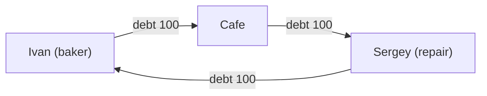

# GEO Project — 10. Target Community and Marketing Strategy

> **Goal:** Determine key segments for launch and marketing strategy for user acquisition.
> **Tasks:**
> - Determine target segments for experiment.
> - Develop marketing strategy for user attraction.

## Best Starting Conditions for Community

### Key System Attractiveness Principle

> **"System attractiveness depends primarily on possibility to connect unsatisfied demand with reserve resources"**
> 
> Reserve resources are those currently unused but available for economic circulation at any time.

Attractiveness ensured by **diversification** — when demand has maximum chances to meet supply. This depends on participant count and activity diversity.

### Target Segments for Experiment

**Priority #1: Small and Medium Producers**

> ⚠️ **Critical error** (from marketing materials): connecting only consumers and large stores — this is wrong approach:
> - Consumers have no way to **EARN** GEO
> - Large stores have no way to **SPEND** GEO
> - Need for exchanges appears → transaction cost increases → local currency effect is nullified

**Correct focus:**
1. **Small and medium producers** — they can both earn and spend within system
2. **Local communities** — cooperatives, communes, resident associations
3. **Professional networks** — freelancers, artisans, specialists
4. **Time bank, LETS system participants** — already understand mechanics

### Optimal Scale: Critical Mass

**Goal:** Build critical mass of users until GEO information spreads through "word of mouth" without marketing costs.

> **"When not being in System becomes embarrassing"** — indicator of reaching critical mass

**MVP scale:** 10–500 participants in one community

### Structural Conditions (ideal)

| Parameter | Optimal Value | Why Important |
|-----------|---------------|---------------|
| Size | 30-100 participants | Sufficient for 3-6 node cycles, manageable |
| Connectivity | Already existing economic connections | Participants already trade with each other |
| Geography | Local compactness | Reduces costs, strengthens trust |
| Diversity | Different goods/services | Ensures cycles for clearing |
| Infrastructure | "Anchor" nodes exist | Warehouse, store, production |
| **Territory** | **Limited** | Maximum user concentration |

### Social Conditions (mandatory)

- **High initial mutual trust level** — participants know each other personally
- **Collective decision experience** — cooperatives, communities, professional associations
- **2-3 active leaders** — ready to become "hubs" and infrastructure nodes
- **Mutual aid culture** — understanding that "minus = promise of future work"

### Economic Conditions (triggers)

- **Liquidity problems** — motivation exists to seek banking credit alternative
- **Regular mutual transactions** — not one-off, but repeating exchanges
- **"Leaky bucket effect"** — money quickly flows out of community
- **Reserve resources** — unused capacities exist that can be engaged

### Legal Form (recommended)

**Consumer cooperative** — provided by Ukrainian legislation:
> "Consumer cooperative is an enterprise owned and democratically managed by consumers. Cooperatives are created to satisfy needs and aspirations of their members. They operate within market system, independently of state, as form of mutual aid oriented toward providing quality services, not profit earning."

---

---

## Effective Zero-to-Launch Marketing Strategies

### New User Attraction Methods (from marketing materials)

1. **Unique product at unique price**
   > Offer unique product or service of wide user interest AT UNIQUE price.
   > 
   > **Goal — play on curiosity:** potential users should start asking: "HOW to get such service at such price?" and "What is GEO?"

2. **Technical settlement means**
   - In addition to smartphone: payment card, smart card, NFC device, payment terminal
   - Should be understandable to wide range of people

3. **Agent-consultant network**
   > Example — PrivatBank, where such approach worked brilliantly: now almost everyone switched to terminal work, and cashiers (and queues near them) almost disappeared.

---

### Strategy 1: "Anchor hub + acute pain" (most realistic)

**Essence:** According to architecture B (community-hub), first connect 1-2 key participants through whom many transactions pass.

**Ideal "anchors":**
- Cooperative warehouse facility
- Wholesale supplier with payment deferrals
- Large producer with small buyer network

**Steps:**
1. Identify "pain point" — long payment deferrals, cash gaps
2. Propose anchor participant become hub: supplier loyalty in exchange for trustlines
3. Newcomers connect through trust lines to hub — minimal entry barrier
4. Gradually participants open lines between themselves, network organically grows

**Configuration (from "Architecture" document):**
```
Cooperative (central node)
         ↕
   [Participants]
```

**Message:** *"Get goods today — pay when you can, without banks and interest"*

---

### Strategy 2: "Community payment card" (real Pishchanska community case)

**Essence:** Unite settlements into single economic space through community payment card.

**Real example from marketing materials:**

> *"Each community resident can get Pishchanska community payment card to buy and sell local production goods.*
> 
> *To order fresh bread from local bakery, meat or milk from store, tractor for plot processing, no longer need to wait for salary or pension. You don't need hryvnias at all.*
> 
> *To earn local conventional unit need to correspondingly sell your goods or service to community, e.g. — deliver harvest from your garden to procurement office."*

**Expected results:**
- Local production demand grows
- Overhead costs decrease
- Retail price decreases
- Job count increases
- Goods and services quality and assortment improves
- Community relationships and cooperation level improves

**Statistics:** World already has 500+ local payment systems. Economic effect — **local economy growth up to 1500% in 2-3 years**.

**Message:** *"Community villages unite into single economic space"*

---

### Strategy 3: "Pilot group + quick win" (for skeptics)

**Essence:** According to "GEO Project — 1" document, start with small 5-10 person group, visualize first clearing as "wow effect".

**Steps:**
1. Select 5-10 participants with **already existing** mutual obligations
2. Conduct 2-3 hour workshop:
   - Explain: "trust line = your personal risk"
   - Open small limits (50-100 c.u.)
3. In first week conduct 5-10 real transactions
4. **Show first clearing visually** — how debts "collapsed" without money (this is key moment!)
5. Document and tell success story to others

**Example from documentation (cycle A→B→C→A):**

After clearing: **all debts = 0**, goods already received.

**Message:** *"Look — it works! Ivan gave bread to cafe, cafe paid Sergey for repair, Sergey brought Ivan firewood — and nobody owes anybody"*

---

### Strategy 4: "Crisis moment + ready solution" (high conversion)

**Essence:** Use economic crisis or seasonal cash gap as trigger.

**Ideal moments:**

- Sowing season (need seeds but no money until harvest)
- Off-season in tourist regions
- Supply/liquidity crisis

**Steps:**
1. Identify acute liquidity shortage moment
2. Propose GEO as "temporary measure" for internal settlements
3. Form minimal rules:
   - Default limits (not more than monthly turnover)
   - Mandatory return to neutral balance deadline
4. After successful crisis passage — establish system as permanent

**From "Article2" document:**
> *"In 1934, in midst of Great Depression, when regular money physically didn't exist, Swiss entrepreneurs agreed: 'Let's credit each other ourselves'. They created WIR unit equal to franc... Almost hundred years passed, and WIR system still works."*

**Message:** *"No money now? No problem — work on credit to each other, settle with goods after harvest"*

---

### Strategy 5: "Reputation as capital" (philosophical approach)

**Essence:** Position GEO not as payment system, but as system where main capital is reputation and social level.

**From Demyanyuk interview:**
> *"We offer system where each individual, business or payment agent can create their personal payment means.*
> 
> *Thus, any activity of people-participants in this environment stimulates them toward more effective interaction. In other words, not amount of money you have, but your reputation and social level — WHO you are and how much people find you trustworthy — become your main capital.*
> 
> *Consequently, this develops your motivation level and way you do your work: you benefit from honesty, and trusting people will probably be profitable, same as being trusted."*

**Key arguments:**
1. Payment means access shouldn't be privilege of limited group
2. Money shouldn't be perceived as something exclusive and unattainable
3. Honesty and trust become economically beneficial

**Message:** *"Your reputation is your main capital. Being honest is profitable."*

---

## Critical Success Factors

### What NOT to do (critical mistakes)

1. **Don't connect ONLY consumers** — they have no way to earn GEO
2. **Don't connect ONLY large stores** — they have no way to spend GEO
3. **Don't create exchanges** — this increases transaction cost and nullifies effect

> **"Local currency must remain in own ecosystem, without conversion through other payment units when making transactions"**

### Mandatory elements:

1. **Simple UI/UX** — participants must understand their balance, who they trust and for how much
2. **Training** — minimum 1 workshop explaining "trust line = your personal risk"
3. **Clearing visualization** — show cycle collapse, this is main "wow effect"
4. **Social pressure** — regular meetings/reports on network state

### Minimum Rule Set for Cooperative (from documentation):

**Technically:**
- Backups for all participants (seed phrase in 2 places)
- Duplication for key nodes (warehouse, fund)

**Organizationally:**
- Social recovery (2-3 trusted persons)
- "Disappearance" regulation (6 months — freeze, 12 months — debt write-off)
- Internal arbitration (3-5 people)

**Economically:**
- Starting limits for newcomers: 50-100 c.u.
- Not more than 20% trust to one counterparty
- Special infrastructure node status (transparency, possibly collateral)

**Culturally:**
- Understanding that debt is work/goods promise, not "virtual money"
- Soft personal "minus" limits (not more than 1-2 monthly contributions)