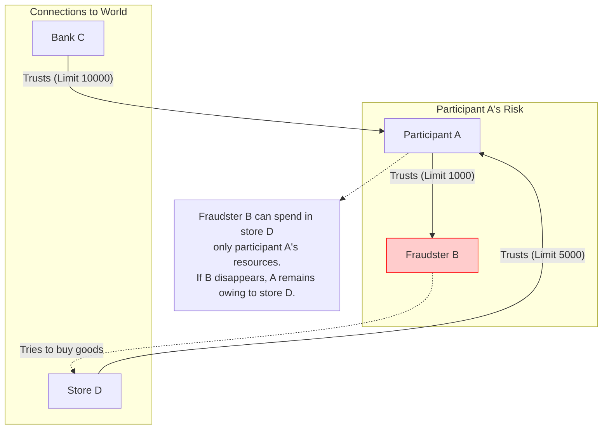
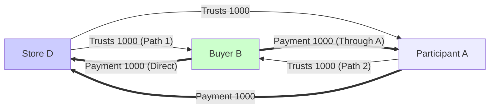
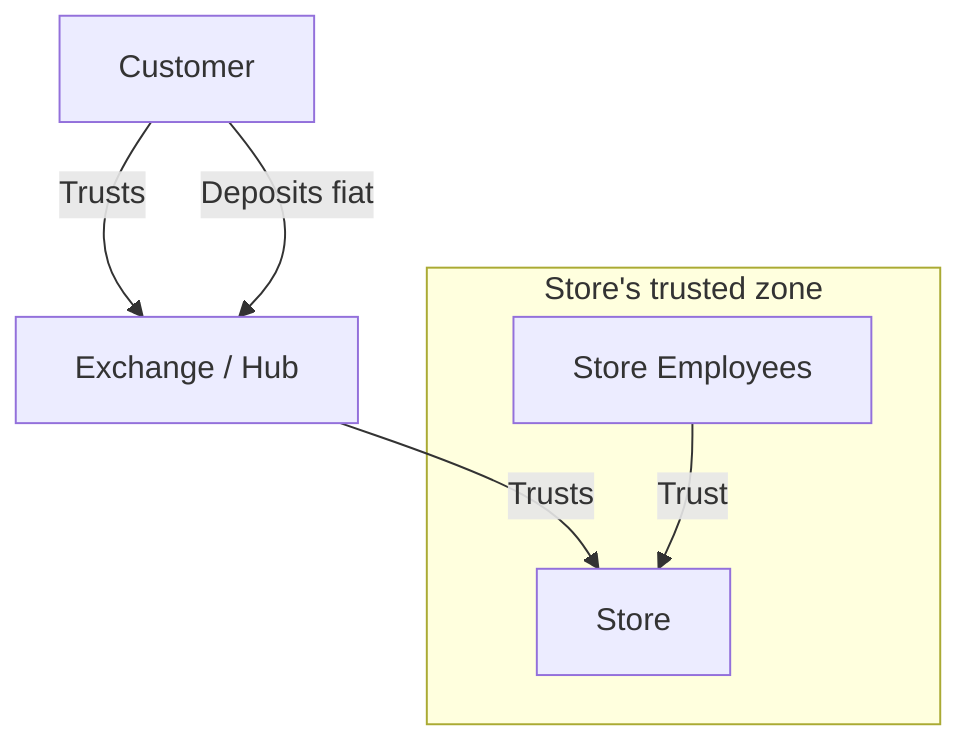
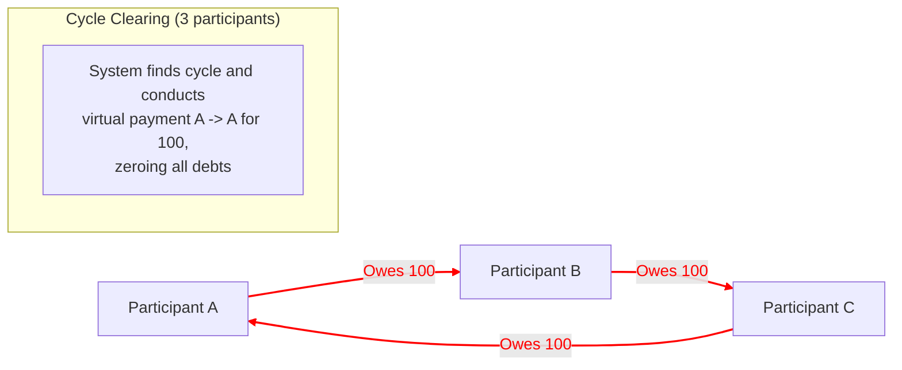

# Dialogue with Dima Chizhevsky on Trust Mechanics, Risks and Clearing

*Date: 05.05.2021*
*Participants: Slawa Gorobets, Dima Chizhevsky*

This document contains a formatted log of correspondence with Dima Chizhevsky (GEO Protocol architect) with added diagrams to illustrate the discussed mechanics.

---

## 1. Trust Lines and Fraud Risk

**Slawa Gorobets:**
Dmitry, we once discussed GEO with you and Max. Would you have 15 minutes to explain trust lines to me and provide a link where their operation can be researched in the protocol code? I'm interested in fraud protection:

A case when someone opens trust lines to fraudsters who buy real goods on credit from other system participants and disappear from the system...

**Dima Chizhevsky:**
The case you describe is possible. That's what trust lines are for)

**Slawa Gorobets:**
I'm interested algorithmically what safeguards exist for this in the protocol and where to read about them or see them in code?

**Dima Chizhevsky:**
Safeguard for what? Can you describe the sequence of actions you want to protect from?

**Slawa Gorobets:**
A trust line is a credit limit I open to a person. That is, the amount of money for which they can buy goods from me having zero account balance. Right?

**Dima Chizhevsky:**
As soon as you opened a TL (Trust Line) to someone — their capabilities (not balance) increased by the TL amount.
There's no balance as such in the system. What in classical banking is called balance is — essentially the value of your TL to the bank. A single one.

This person becomes able to use the debt of everyone who entrusted you with TL, or has debt obligations to you that can be written off.

**Slawa Gorobets:**
So there's no safeguard against a person registering in the system, opening 1000 fraudsters 1000 hryvnias each, which they used to buy real goods from other system participants?

**Dima Chizhevsky:**
What you call buying real goods and services is also likely the result of having certain trust, or rather financial obligations to this person.

Let's define context:
*   **A** — honest person
*   **B** — fraudster
*   **C** — payment system, bank, or any issuer
*   **D** — store with real goods

For **B** to be able to buy something on trust from **A**, **A** must have this capability himself. This means he must either top up balance through fiat conversion using **C**, or go into debt (again trusted) relative to **D**.

**B** cannot use more than the maximum of 2 numbers (trust from **A** to **B**; flow from **A** to store).

What you call a safeguard exists not in the protocol, but in the user interface: they should be reminded that a trust line is the ability for another person to use their balance. For a certain amount. **A** himself determines how much and to whom to trust and, accordingly, controls the risk himself.

---

## 2. Available Flow Calculation (Max Flow)

**Slawa Gorobets:**
"For B to be able to buy something on trust from A, A must have this capability himself." — I didn't know about this.
What is "flow from A to store"?

**Dima Chizhevsky:**
Total capability of debt obligation generation.

Imagine that **B** — is not a fraudster.
1.  **D** trusts **A** for 1000.
2.  **D** trusts **B** for 1000.
3.  **A** trusts **B** for 1000.

In this case flow from **B** to **D** is **2000**.
One thousand by own TL with **D**, and another thousand through **A**.

**Dima Chizhevsky:**
The protocol's task is to calculate these capabilities, show them and enable their use.

---

## 3. Bank Card Analogy

**Dima Chizhevsky:**
About your first request, I can explain differently.

Imagine you have a bank account with 10000 hrn. Essentially, this is a TL from you to the bank. The bank credited you 10000, and you trust that on first request it will direct your funds further, wherever you say. It may not do this, so it's precisely about trust.

Now imagine you issue a card linked to this account, but with an operation limit of 1000 hrn. And give the card to your wife or daughter. So the card in this case is a TL.

**Slawa Gorobets:**
In this example, if no one trusts **D**, then effectively **B** can only use 1000.
And if no one trusts **A** either, then **B** won't have any credit for payment (or transfer)?

**Dima Chizhevsky:**
Yes, can only use 1000, but only relative to **A**. Buy goods or services from **A**, not from **D**.
Because there's no flow from **B** to **D** if **D** has no connections to the world. And yes. In this case no one can buy anything from **D**.

---

## 4. Architecture for Stores (Hubs and Exchanges)

**Slawa Gorobets:**
Ah, now it's clearer :) So if **A** is a store and **B** is a buyer, then effectively the store must open trust lines to all buyers who want to purchase from it.

**Dima Chizhevsky:**
There are options. TL to buyers — possible, but better not, because the store shouldn't have to trust anyone.

Better when the store is accessible through mediation of another entity that serves as an exchange. People trust the exchange. Bring hryvnia, get equivalent on their TL. Exchange is connected to the store.

Or:
1.  Store trusts owner and employees.
2.  Owner has people he trusts. Etc.
3.  Regular customers, and so on.
4.  Also loyalty systems and other things people are willing to risk fit here.

---

## 5. Clearing (Netting)

**Slawa Gorobets:**
I'm interested in finding mutual debts of all participants and identifying clearing opportunities when conducting transactions...

**Dima Chizhevsky:**
Clearing is present. It's automatic.
In short: cycles of **3, 4, 5 and 6 participants** are cleared.
*   3 and 4 are searched after each operation.
*   5 and 6 are searched and processed once a day (due to computational complexity).

Clearing is implemented as a combination of 2 operations: cycle search and launching a payment operation to oneself if a cycle is found.

In code you should look at payment transaction, or set of classes with keyword `Cycle`. There they are broken down separately for 3-, 4-, 5- and 6-dimensional cycles.

---

## 6. Useful Links and Inspiration

**Dima Chizhevsky:**
I'm actually now communicating with a former Ripple team member about the same thing. Here's his project site, I think you're thinking about common things:

*   **Federated Bookkeeping**: [https://federatedbookkeeping.org/](https://federatedbookkeeping.org/)
*   **LedgerLoops**: Cryptographically triggered IOUs [https://ledgerloops.com/](https://ledgerloops.com/)

We were inspired by ideas of Ryan Fugger, the original author of Ripple concept (before Ripple Labs company creation).