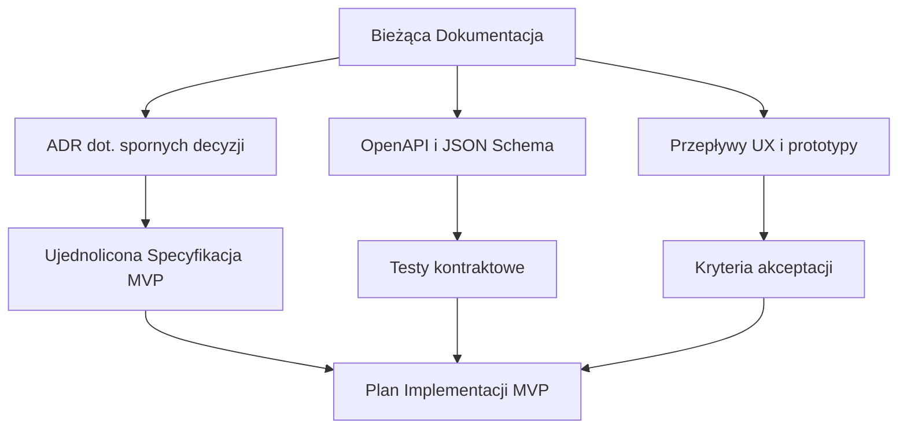

# GEOv0-PROJECT — Wyjaśnienia i luki w dokumentacji dla rozwoju „za pierwszym razem”

**Cel:** Ocenić, czy bieżąca dokumentacja repozytorium jest wystarczająca, aby zrealizować MVP „poprawnie za pierwszym razem”, oraz sporządzić listę wyjaśnień/szczegółów/ulepszeń.

**Granica MVP dla tej oceny (zgodnie z umową):** Backend GEO Hub + minimalny Klient Web/PWA (bez Flutter), aby przejść pełny przepływ użytkownika.

**Uwaga:** Ten dokument **łączy** moją listę luk z uwagami i sugestiami z zewnętrznego dokumentu z zaleceniami, którego **brakuje w bieżącym repozytorium** (link usunięty).

---

## 0. Przegląd kluczowych dokumentów

Zestaw podstawowy (RU):

- [`docs/pl/00-overview.md`](../00-overview.md)
- [`docs/pl/01-concepts.md`](../01-concepts.md)
- [`docs/pl/02-protocol-spec.md`](../02-protocol-spec.md)
- [`docs/pl/03-architecture.md`](../03-architecture.md)
- [`docs/pl/04-api-reference.md`](../04-api-reference.md)
- [`docs/pl/05-deployment.md`](../05-deployment.md)
- [`docs/pl/06-contributing.md`](../06-contributing.md)

Dodatkowe (wymagania dot. stosu, raporty i analizy):

- `docs/pl/concept/08-wymagania-stosu-technologicznego.md` (jeśli dostępny)
- `docs/pl/concept/analiza-projektu-geo-raport-kompleksowy.md` (jeśli dostępny)
- `docs/pl/archive/07-gaps-analysis.md` (jeśli dostępny)
- Zewnętrzny dokument z zaleceniami (brak w bieżącym repozytorium)

---

## 1. Ostateczny wniosek dotyczący wystarczalności danych

**Werdykt:** **Raczej Nie** — *nie z powodu braku pomysłów czy podstawowej specyfikacji*, ale z powodu **niewystarczającego „zszycia” dokumentacji w jedno źródło prawdy dla MVP** (szczególnie na stykach: model węzła/koordynacja → protokół 2PC → API/kontrakty → UX/klucze/odzyskiwanie → kryteria akceptacji).

**Ważne:** To **nie jest sprzeczne** z wnioskiem „można rozpocząć rozwój” (z zewnętrznego dokumentu z zaleceniami; brak dokumentu w bieżącym repozytorium):
- **Można zacząć** (szkielet projektu, migracje, podstawowe CRUD, infrastruktura, kontrakt API, środowisko testowe).
- Ale **„poprawnie za pierwszym razem”** (bez przeróbek po 1–3 tygodniach) — prawdopodobieństwo jest niskie, dopóki nie zostaną ustalone sporne decyzje, domyślna konfiguracja, przypadki brzegowe i plan testów.

### 1.1. Co jest już dobrze opracowane (żeby tego nie stracić)

Łącznie, następujące elementy są mocno opracowane:

- **Koncepcja i Wizja:** filozofia, motywacja, porównanie z analogami, grupa docelowa.
- **Specyfikacja Protokołu:** kluczowe encje, niezmienniki, Ed25519/SHA-256, 2PC, routing/multi-path, kliring.
- **Architektura:** logika modelu Hub-centrycznego MVP, ewolucja/roadmap, podział na warstwy.
- **API Reference:** główne punkty końcowe REST, formaty żądań/odpowiedzi, powiadomienia WS, błędy.
- **Model Danych:** Schematy SQL i indeksowanie (jako baza dla migracji Alembic).

Więc problemem nie jest „pusta” dokumentacja, ale **normatywne granice MVP i powtarzalność implementacji** (kontrakty, testy, konfiguracje, przypadki brzegowe, arbitraż, procedury operacyjne).

### Dlaczego „Raczej Nie”, mimo dużej ilości materiałów

Dokumenty zawierają wiele przydatnych informacji (encje, niezmienniki, schematy DB, przykłady API, wdrożenie). Ale do realizacji MVP „poprawnie za pierwszym razem” brakuje:

1) **Ostatecznie ustalonego zakresu MVP** (które algorytmy i tryby na pewno wchodzą/nie wchodzą).

2) **Jasnego „modelu operacyjnego” uczestnika w MVP**: czy uczestnik to tylko konto w hubie, czy oddzielny węzeł z niezależnym przechowywaniem/potwierdzaniem wiadomości?

3) **Artefaktów produktowych** (user stories, przepływy UX, prototypy, teksty i zasady społeczności), niezbędnych dla minimalnego PWA, a nie tylko dla „rdzenia protokołu”.

4) **Kontraktów nadających się do autogeneracji/testów kontraktowych** (OpenAPI/JSON Schema + wektory testowe dla podpisów/kanonizacji).

5) **Kryteriów akceptacji i planu testów**, powiązanych z niezmiennikami i głównymi scenariuszami użytkownika.

---

## 2. 5–10 Krytycznych Wyjaśnień na start MVP

Poniżej — wyjaśnienia, bez których ryzyko przeróbek w pierwszych 1–3 tygodniach jest wysokie.

1) **Model Węzła w MVP (konto vs węzeł)**
   - **Dlaczego ważne:** definiuje implementację 2PC/blokad, wymagania online klienta, model zagrożeń.
   - **Ryzyko:** zbudowanie kodu „quasi-p2p” a potem uproszczenie (lub odwrotnie), łamiąc protokół/UX.
   - **Naprawa:** 1-stronicowa specyfikacja modelu uczestnika MVP + diagram sekwencji płatności/kliringu w wybranym modelu.

2) **Ujednolicony zakres MVP: routing + kliring + multipath**
   - **Dlaczego ważne:** dokumentacja pokazuje różne poziomy złożoności (BFS, k-shortest, max-flow; cykle 3–4 vs 3–6).
   - **Ryzyko:** zespół zacznie wdrażać „dodatki” lub niekompatybilne podejścia.
   - **Naprawa:** tabela zakresu „wchodzi/nie wchodzi” + ADR dot. routingu i kliringu (co robimy w v0.1 i dlaczego).

3) **Normatywny Model Długu i Niezmienniki (szczególnie symetria długu)**
   - **Dlaczego ważne:** Schemat DB sugeruje `amount > 0` i oddzielne rekordy, ale niezmiennik zabrania długów dwustronnych; potrzebna jasna polityka nettingu.
   - **Ryzyko:** desynchronizacja obliczeń salda/limitów, nieprawidłowy kliring, błędy migracji.
   - **Naprawa:** tabela reguł „jak reprezentujemy dług” + przykłady transformacji (A jest winien B / B jest winien A) + przypadki testowe niezmienników.

4) **Zarządzanie Kluczami w PWA (przechowywanie, backup, transfer, odzyskiwanie)**
   - **Dlaczego ważne:** bezpieczna rejestracja/logowanie/podpisywanie jest niemożliwe bez tego.
   - **Ryzyko:** utrata dostępu użytkownika, kompromitacja kluczy, odmowa podpisu i degradacja modelu bezpieczeństwa.
   - **Naprawa:** przepływ UX i model zagrożeń dla kluczy + opis formatu eksportu klucza/seeda + polityka odzyskiwania.

5) **Ujednolicony Kontrakt API (poziom OpenAPI) + Testy Kontraktowe**
   - **Dlaczego ważne:** API Reference jest przydatne, ale „za pierwszym razem” wymaga kontraktu czytelnego maszynowo.
   - **Ryzyko:** niekompatybilność backend↔PWA, wzrost kosztów integracji.
   - **Naprawa:** OpenAPI 3.0 + JSON Schema dla zdarzeń WS + kolekcja Postman/Insomnia + testy kontraktowe.

6) **Polityki Społeczności i Parametry Domyślne**
   - **Dlaczego ważne:** wiele decyzji jest „społecznych” (auto_clearing, poziomy weryfikacji, domyślne limity, środki anty-spam/anty-sybil).
   - **Ryzyko:** nieprzewidywalna ekonomia pilotażu i sprzeczne oczekiwania uczestników.
   - **Naprawa:** specyfikacja konfiguracji społeczności (YAML/JSON) + zasady widoczne dla użytkownika.

7) **Proces Sporów/Arbitrażu i Granice Transakcji Kompensacyjnych**
   - **Dlaczego ważne:** protokół dopuszcza kompensację, ale potrzebne jest zarządzanie (governance).
   - **Ryzyko:** „ręczne edycje salda” bez audytu lub niemożność naprawienia oczywistych błędów.
   - **Naprawa:** SOP + role/prawa + log audytu + user stories dla sporów.

8) **Kryteria Akceptacji i Strategia Testów Oparta na Niezmiennikach**
   - **Dlaczego ważne:** system łatwo psuje się na przypadkach brzegowych (timeouty, multipath, kliring).
   - **Ryzyko:** „prawie działa”, ale niestabilny podczas pilotażu.
   - **Naprawa:** zestaw kryteriów akceptacji + macierz testów (unit/integration/e2e/property) + testy obciążeniowe.

9) **Zestaw Scenariuszy Testowych (20–30) jako „Przekrojowe Sprawdzenie” MVP**
   - **Dlaczego ważne:** scenariusze „uziemiają” protokół na rzeczywistych działaniach użytkownika.
   - **Ryzyko:** implementacja „wg specyfikacji”, ale niepokrycie zachowania w rzeczywistym przepływie (onboarding → linia zaufania → płatność → kliring → historia/spory).
   - **Naprawa:** dokument `docs/pl/08-test-scenarios.md` (lub podobny) z warunkami wstępnymi/krokami/oczekiwanym rezultatem + minimalne autotesty e2e dla top-5 scenariuszy.

10) **Lista Parametrów Konfiguracyjnych i Domyślnych (Protokół/Kliring/Bezpieczeństwo/DB/Integralność)**
   - **Dlaczego ważne:** bez jawnych wartości domyślnych, zespół będzie „zaszywał” parametry w kodzie.
   - **Ryzyko:** ukryte zależności, chaotyczne wartości w środowiskach, niestabilność pilotażu.
   - **Naprawa:** dokument `docs/pl/config-reference.md` (lub podobny) + przykład `geo-hub-config.yaml`.

---

## 3. Luki i Pytania według Kategorii

Format dla każdego punktu:

- **Co wyjaśnić / ustalić**
- **Dlaczego ważne**
- **Ryzyko przy braku**
- **Oczekiwany artefakt**

---

### 3.1. Produkt / Domena

**PD-1. Społeczność Pilotażowa i Kontekst Uruchomienia**
- **Co:** kto jest rzeczywistym pilotem (typ społeczności, role, procesy), priorytetowe scenariusze wymiany.
- **Dlaczego ważne:** bez realnego kontekstu łatwo zrobić „technicznie poprawnie”, ale „nie zadziała”.
- **Ryzyko:** błędny model UX, nieodpowiednie wartości domyślne, porażka onboardingu.
- **Artefakt:** MVP Product Brief + user story map + lista top-10 scenariuszy pilotażowych.

**PD-2. Ekwiwalenty dla MVP i Zasady Użycia**
- **Co:** lista ekwiwalentów, precyzja, kto może tworzyć, zasady nazewnictwa, moderacja.
- **Dlaczego ważne:** wpływa na dane, UX i analitykę.
- **Ryzyko:** „zoo ekwiwalentów”, niekompatybilne reguły obliczeń.
- **Artefakt:** specyfikacja „Polityka Ekwiwalentów” + tabela pól + dane seed migracji.

**PD-3. Poziomy Weryfikacji i Znaczenie Produktowe**
- **Co:** jak traktujemy `verification_level`, kto nadaje, limity operacji.
- **Dlaczego ważne:** podstawowa dźwignia anty-sybil/anty-fraud w MVP.
- **Ryzyko:** uczestnicy spamujący, toksyczny graf zaufania, zwiększone ryzyko niewypłacalności.
- **Artefakt:** polityka weryfikacji + przepływ admina + wymagania logowania działań admina.

**PD-4. „Zasady Społeczności” jako Część Produktu**
- **Co:** domyślne rekomendacje/ograniczenia: limity startowe, koncentracja zaufania, zachowanie przy zniknięciu uczestnika.
- **Dlaczego ważne:** GEO zależy od reguł społecznych tak samo jak od kodu.
- **Ryzyko:** pilot upada z powodu błędnych reguł, nawet jeśli kod działa.
- **Artefakt:** Dokument Community Rules v0.1 + teksty podpowiedzi w UI.

---

### 3.2. Protokół / Kryptografia / Konsensus

**PC-1. Interpretacja MVP 2PC w Modelu Hub-Centrycznym**
- **Co:** kto dokładnie odpowiada na PREPARE/COMMIT w MVP (klient? serwer w imieniu uczestnika? tylko blokady DB?).
- **Dlaczego ważne:** wpływa na poprawność, konieczność bycia online klienta, UX opóźnień.
- **Ryzyko:** niemożliwe założenia (klient musi być online, aby płacić) lub utrata gwarancji semantycznych.
- **Artefakt:** diagram sekwencji płatności i kliringu w MVP + opis timeoutów/ponowień.

**PC-2. Normatywne Wektory Testowe dla Podpisu i Kanonizacji**
- **Co:** przykłady payload → canonical JSON → signature (oczekiwane bajty/base64).
- **Dlaczego ważne:** inaczej implementacje (PWA/serwer) będą „podpisywać różne rzeczy”.
- **Ryzyko:** masowe błędy `Invalid signature`, blokowanie płatności.
- **Artefakt:** zestaw wektorów testowych + minimalna biblioteka kanonizacji używana zarówno w serwerze, jak i PWA.

**PC-3. tx_id: UUID lub Hash Zawartości — i co dokładnie haszować**
- **Co:** ujednolicona reguła tworzenia `tx_id` i `msg_id` (i gdzie wymagana jest idempotempotentność).
- **Dlaczego ważne:** definiuje deduplikację i odporność podczas ponowień.
- **Ryzyko:** dublowanie operacji lub niemożność bezpiecznego ponowienia żądania.
- **Artefakt:** specyfikacja identyfikatorów + kontrakt API (reguły Idempotency-Key/tx_id).

**PC-4. Polityki Linii Zaufania (`policy`) jako Kontrakt i Egzekwowanie**
- **Co:** które pola policy są rzeczywiście wspierane w MVP i jak wpływają na routing/kliring.
- **Dlaczego ważne:** inaczej policy stanie się „polem śmietnikiem” bez zachowania.
- **Ryzyko:** UX pokazuje jedno, system robi drugie.
- **Artefakt:** tabela pól policy (wsparcie/domyślne/walidacja) + testy jednostkowe.

**PC-5. Kliring: Wyzwalacze, Częstotliwość, Limity i Zgoda**
- **Co:** kiedy uruchamiać szukanie cykli, jakie cykle w MVP (3–4?), min_amount, limity liczby/czasu.
- **Dlaczego ważne:** kliring to kluczowa „magia” GEO, ale łatwo przeciążyć system i UX.
- **Ryzyko:** degradacja wydajności, nieoczekiwane odpisy długu bez jasnego wyjaśnienia.
- **Artefakt:** specyfikacja ClearingEngine MVP + diagram stanów + reguły powiadomień UX.

---

### 3.3. API / Kontrakty

**AC-1. OpenAPI jako „Jedyne Źródło Prawdy” dla REST**
- **Co:** formalna specyfikacja OpenAPI 3.0 (w tym schematy bezpieczeństwa, stronicowanie, błędy).
- **Dlaczego ważne:** PWA potrzebuje stabilnych kontraktów i autogeneracji klientów.
- **Ryzyko:** dryf API i wzrost kosztów ręcznej integracji.
- **Artefakt:** plik OpenAPI + testy kontraktowe + changelog reguł wersjonowania.

**AC-2. WebSocket: Formalny Schemat Zdarzeń i Subskrypcji**
- **Co:** lista typów zdarzeń, schematy payloadu, gwarancje dostarczenia, polityka reconnect/replay.
- **Dlaczego ważne:** rzeczywisty UX dla płatności/kliringu wymaga czasu rzeczywistego.
- **Ryzyko:** utrata zdarzeń, niespójność UI, „zagubione płatności”.
- **Artefakt:** JSON Schema dla WS + dokumentacja reconnect + środowisko testowe.

**AC-3. Semantyka Błędów i Mapowanie HTTP↔Błędy Domenowe**
- **Co:** ujednolicona tabela błędów (kody/HTTP/możliwość ponowienia/teksty dla użytkownika).
- **Dlaczego ważne:** PWA musi rozumieć, co można ponowić, a czego nie.
- **Ryzyko:** nieprawidłowe ponowienia (duplikaty) lub „nieme” błędy.
- **Artefakt:** Katalog Błędów + teksty UI + autotesty błędów.

**AC-4. API Administratora i Działania Operatora**
- **Co:** operacje dostępne dla operatora/administratora w MVP (zamrażanie uczestnika, zarządzanie ekwiwalentami, audyt).
- **Dlaczego ważne:** pilot zazwyczaj nie przeżyje bez operatora.
- **Ryzyko:** „niemożność obsługi” pilotażu bez bezpośredniego dostępu do BD.
- **Artefakt:** specyfikacja API admina + macierz RBAC + wymagania audytu.

---

### 3.4. Dane / Modele

**DM-1. Ujednolicona Reprezentacja Długu (Netting) i Zakaz „Długu Dwustronnego”**
- **Co:** reguła: przechowujemy 1 rekord na parę (z podpisaną kwotą) lub 2 rekordy, lub ścisły netting przy każdej zmianie.
- **Dlaczego ważne:** poprawność niezmienników i obliczanie available_credit zależą od tego.
- **Ryzyko:** ujemne wartości tam, gdzie oczekiwane dodatnie; nieprawidłowe limity.
- **Artefakt:** Data Model ADR + ograniczenia SQL + migracje + przypadki testowe.

**DM-2. Pola Pochodne (`used`, `available`, agregaty) — Formuły i Źródła**
- **Co:** jak liczymy `used/available` i agregaty dla uczestnika, gdzie cache'ujemy.
- **Dlaczego ważne:** centralna część UX.
- **Ryzyko:** UI pokazuje błędne limity/salda.
- **Artefakt:** dokument z formułami + widoki zmaterializowane/zapytania + przykłady testowe.

**DM-3. Historia Operacji i Niezmienność Transakcji**
- **Co:** jakie pola przechowujemy w `transactions.payload`, co można „edytować”, retencja.
- **Dlaczego ważne:** audyt i rozstrzyganie sporów.
- **Ryzyko:** niemożność zbadania incydentów i ryzyka prawne.
- **Artefakt:** specyfikacja ścieżki audytu + polityka retencji + migracje.

**DM-4. Dane Seed do Wdrożenia Pilotażowego**
- **Co:** jak inicjalizujemy ekwiwalenty, role systemowe, domyślne polityki.
- **Dlaczego ważne:** niemożliwe powtarzalne wdrożenie pilotażu bez procedur seed.
- **Ryzyko:** kroki ręczne, błędy środowiskowe.
- **Artefakt:** specyfikacja `init` + pliki seed (YAML/JSON) + idempotentne CLI.

---

### 3.5. UX / Przepływy Użytkownika

**UX-1. Onboarding i Wyjaśnienie Modelu Zaufania**
- **Co:** jak wyjaśniamy „linia zaufania = twoje ryzyko”, jak ostrzegamy o konsekwencjach.
- **Dlaczego ważne:** bez tego użytkownicy będą otwierać limity nieprawidłowo.
- **Ryzyko:** szybkie niewypłacalności/konflikty i utrata zaufania do produktu.
- **Artefakt:** prototypy UX (Figma) + teksty interfejsu + plan testów z użytkownikami.

**UX-2. Przepływ Tworzenia Linii Zaufania i Wyboru Kontrahenta**
- **Co:** wyszukiwanie uczestników, identyfikacja, zapobieganie błędom (zły PID).
- **Dlaczego ważne:** PID jako ciąg znaków jest niewygodny dla ludzi.
- **Ryzyko:** błędy zaufania i płatności.
- **Artefakt:** przepływ UX + wymagania wyszukiwania/filtrowania + minimalne pola profilu.

**UX-3. Płatność: Wstępne Sprawdzenie Przepustowości i Wyjaśnialność Trasy**
- **Co:** czy pokazujemy użytkownikowi trasę/pośredników, jak wyjaśniamy odmowę.
- **Dlaczego ważne:** „magia sieci” musi być wyjaśnialna.
- **Ryzyko:** nieufność do systemu i wzrost zgłoszeń do wsparcia operatora.
- **Artefakt:** user stories + ekrany UI „przepustowość”, „błąd”, „szczegóły płatności”.

**UX-4. Kliring: Powiadomienia, Zgoda, Historia Zmian Długu**
- **Co:** jak użytkownik widzi „co się zmieniło” po kliringu, jak potwierdza/odrzuca.
- **Dlaczego ważne:** kliring zmienia długi bez „płatności”, potrzebny przejrzysty UX.
- **Ryzyko:** uczucie „coś mi odjęto”.
- **Artefakt:** przepływ UX + modele powiadomień + wymagania historii.

**UX-5. Zarządzanie Kluczami w PWA**
- **Co:** gdzie klucz jest przechowywany (IndexedDB/WebCrypto), jak robimy backup/restore, co w przypadku utraty urządzenia.
- **Dlaczego ważne:** bez tego model „klucze u użytkownika” staje się dekoracyjny.
- **Ryzyko:** utrata kont i porzucenie powiązania kryptograficznego.
- **Artefakt:** specyfikacja UX kluczy + przegląd bezpieczeństwa + scenariusze odzyskiwania.

---

### 3.6. Bezpieczeństwo / Zagrożenia

**SEC-1. Model Zagrożeń dla MVP Hub-Centrycznego**
- **Co:** lista zagrożeń (sybil, DoS, kompromitacja admina, wyciek PII, ataki replay) i mitygacje.
- **Dlaczego ważne:** hub jest pojedynczym punktem awarii i „punktem zaufania”.
- **Ryzyko:** kompromitacja pilotażu i szkody wizerunkowe.
- **Artefakt:** Model Zagrożeń (STRIDE) + lista wymagań bezpieczeństwa + plan pentestów (minimalny).

**SEC-2. Zarządzanie Sekretami i Kluczami Serwera**
- **Co:** gdzie przechowujemy `SECRET_KEY`, klucze szyfrowania pól, rotacja.
- **Dlaczego ważne:** szyfrowanie w spoczynku nie działa zgodnie z obietnicą bez tego.
- **Ryzyko:** wycieki tokenów/PII.
- **Artefakt:** Przewodnik zarządzania sekretami + SOP rotacji.

**SEC-3. Polityka Dostępu Administratora do Danych i Audyt Działań**
- **Co:** kto ma dostęp do transakcji/PII, jakie działania są logowane.
- **Dlaczego ważne:** zaufanie społeczności.
- **Ryzyko:** nadużycia wewnętrzne.
- **Artefakt:** RBAC + specyfikacja logu audytu + procedury przeglądu.

---

### 3.7. Infrastruktura / Eksploatacja

**OPS-1. Środowisko Pilotażowe i SLO/SLA**
- **Co:** docelowe SLO (uptime, opóźnienie) i ograniczenia infrastruktury pilotażowej.
- **Dlaczego ważne:** definiuje decyzje architektoniczne (cache, zadania w tle).
- **Ryzyko:** system „jakoś działa”, ale pada pod realnym obciążeniem.
- **Artefakt:** dokument SLO/SLA + plan pojemności.

**OPS-2. Runbooki dla Incydentów**
- **Co:** instrukcje krok po kroku: zablokowane płatności, naruszenie niezmienników, odzyskiwanie z backupu.
- **Dlaczego ważne:** incydenty w pilotażu są nieuniknione.
- **Ryzyko:** długi przestój i utrata zaufania użytkowników.
- **Artefakt:** zestaw runbooków (markdown) + regularne ćwiczenia.

**OPS-3. Polityka Aktualizacji i Migracji**
- **Co:** jak bezpiecznie wdrażać zmiany schematu/protokołu, rollback.
- **Dlaczego ważne:** pilotażu nie można „zepsuć”.
- **Ryzyko:** utrata danych, przestój.
- **Artefakt:** proces wydania + polityka migracji + reguły kompatybilności.

---

### 3.8. Testowanie / Akceptacja

**QA-1. Kryteria Akceptacji dla Kluczowych User Stories**
- **Co:** sformalizowane kryteria dla: rejestracja, linia zaufania, płatność, kliring, historia.
- **Dlaczego ważne:** inaczej „gotowe” będzie subiektywne.
- **Ryzyko:** niekończące się poprawki i spór o gotowość.
- **Artefakt:** user stories + kryteria akceptacji + lista kontrolna akceptacji.

**QA-2. Strategia Testów Oparta na Niezmiennikach**
- **Co:** testy na sumę zerową, limit zaufania, neutralność kliringu, idempotentność.
- **Dlaczego ważne:** protokół dotyczy przede wszystkim poprawności.
- **Ryzyko:** „ciche” uszkodzenie stanu.
- **Artefakt:** macierz testów + testy oparte na właściwościach + testy integracyjne.

**QA-3. Testy Obciążeniowe dla Routingu/Kliringu**
- **Co:** scenariusze obciążenia w granicach MVP (10–500 uczestników, szczyt do 10 tx/s).
- **Dlaczego ważne:** routing i wyszukiwanie cykli SQL mogą stać się wąskimi gardłami.
- **Ryzyko:** nieprzewidywalne opóźnienia UX.
- **Artefakt:** plan obciążeniowy + powtarzalny generator grafu i scenariuszy.

---

### 3.9. Prawne / Zgodność

**LEGAL-1. Pozycjonowanie MVP: Czym to jest Prawnie**
- **Co:** czy MVP to „lokalny system kredytu wzajemnego” bez obietnic konwersji/fiat.
- **Dlaczego ważne:** wpływa na wymagania KYC/AML, przechowywanie danych, umowy.
- **Ryzyko:** blokada projektu lub pilna konieczność przeróbki procesu rejestracji.
- **Artefakt:** notatka prawna (1–2 strony) + wyłączenia odpowiedzialności w UI.

**LEGAL-2. RODO: Role Administratora/Przetwarzającego i Procedury**
- **Co:** kto jest administratorem, jak wykonujemy eksport/usuwanie/anonimizację, okresy przechowywania.
- **Dlaczego ważne:** prawa RODO wspomniane, ale potrzebne konkrety pod pilotaż.
- **Ryzyko:** naruszenie praw osób, których dane dotyczą.
- **Artefakt:** RODO DPIA light + procedury + szablony wniosków.

**LEGAL-3. KYC: „Niepotrzebne” lub „Potrzebne Później” — Ustal To**
- **Co:** czy potrzebujemy weryfikacji tożsamości dla pilotażu (a jeśli nie — jakie limity kompensują).
- **Dlaczego ważne:** definiuje architekturę weryfikacji i UX.
- **Ryzyko:** późne dodanie KYC psuje model danych i onboarding.
- **Artefakt:** decyzja (ADR) + minimalne hooki/model danych nawet jeśli KYC odłożone.

---

## 4. Przekrojowe Ulepszenia Dokumentacji (aby zmniejszyć ryzyko „nie za pierwszym razem”)

**DOC-1. „Jedyne Źródło Prawdy” dla MVP**
- **Problem:** wiele dokumentów z nakładaniem się i różnym stopniem „normatywności”.
- **Ryzyko:** deweloperzy wybierają różne interpretacje.
- **Artefakt:** 1 Dokument Specyfikacji MVP (lub zestaw ADR) + mapa linków „gdzie jest prawda”.

**DOC-2. Macierz Sprzeczności i Rozwiązanie**
- **Problem:** znaleziono rozbieżne stwierdzenia (algorytmy, zakres, role).
- **Ryzyko:** rozwidlenia architektoniczne bez jasnej decyzji.
- **Artefakt:** tabela „było/jest” + ADR dla każdego rozwidlenia.

**DOC-3. Dołącz „Minimalny Przykład End-to-End”**
- **Problem:** brak jednego krótkiego scenariusza łączącego protokół → API → dane → UI.
- **Ryzyko:** trudno zacząć „pierwszy pionowy wycinek”.
- **Artefakt:** Dokument Walkthrough: rejestracja → linia zaufania → płatność → kliring (z rzeczywistymi przykładami JSON i oczekiwanymi zmianami w BD).

**DOC-4. Ustal „Katalog Przypadków Brzegowych” jako Osobny Artefakt**
- **Problem:** wiele przypadków brzegowych wymienionych, ale nieskonsolidowanych w tabeli decyzyjnej.
- **Ryzyko:** każdy deweloper rozwiązuje po swojemu, łamiąc niezmienniki.
- **Artefakt:** katalog przypadków brzegowych z rozwiązaniem i linkiem do testu (unit/integration).

**DOC-5. Czytelna Maszynowo Specyfikacja API (OpenAPI) + Schematy WS**
- **Problem:** specyfikacja tekstowa szybko rozjeżdża się z implementacją.
- **Ryzyko:** droga integracja PWA.
- **Artefakt:** `api/openapi.yaml` + JSON Schema dla zdarzeń WS + autogeneracja klienta + testy kontraktowe.

**DOC-6. „Config Reference” i Domyślna Konfiguracja Pilotażowa**
- **Problem:** parametry rozproszone i niesformatowane jako kontrakt.
- **Ryzyko:** nieoczekiwane timeouty/limity, niestabilność.
- **Artefakt:** `docs/pl/config-reference.md` + przykład `geo-hub-config.yaml`.

---

## 5. Mini-Diagram Proponowanego Zestawu Artefaktów (Gotowość MVP)



---

## 6. Priorytetyzowany Plan Działań (Faza 0: Przygotowanie, 1–2 tygodnie)

Cel Fazy: zamknąć „dziury”, które **prawie na pewno** prowadzą do przeróbek, i uczynić implementację powtarzalną.

1) **Scenariusze i Akceptacja**
   - Utwórz `docs/pl/08-test-scenarios.md` (20–30 scenariuszy) + lista kontrolna akceptacji.
2) **Przypadki Brzegowe**
   - Skonsoliduj przypadki brzegowe w katalogu decyzyjnym (tabela), dodaj do `docs/pl/02-protocol-spec.md` jako sekcję lub oddzielny dokument.
3) **Kontrakty**
   - Wygeneruj/sformatuj `api/openapi.yaml` z `docs/pl/04-api-reference.md` + schematy WS.
4) **Konfiguracja i Domyślne**
   - Opisz `docs/pl/config-reference.md` i przykład konfiguracji (patrz sekcja 7.3 poniżej).
5) **Dane Seed**
   - Przygotuj `seeds/` z ekwiwalentami/uczestnikami/liniami zaufania dla powtarzalnego środowiska lokalnego.
6) **Migracje**
   - Zdefiniuj strukturę migracji Alembic i początkową migrację dla schematu SQL.
7) **Makiety Admina / Przepływy Operatora**
   - Minimalne ekrany: uczestnicy, ekwiwalenty, linie zaufania, transakcje, audyt, zamrażanie/odmrażanie.
8) **Metryki Sukcesu MVP**
   - Lista metryk funkcjonalnych i niefunkcjonalnych (latency p99, SLO, wolumen pilotażu).

---

## 7. Maksymalna Praca Samodzielna: Co Mogę Zrobić Sam vs Co Wymaga Project Ownera

### 7.1. Co mogę dopracować samodzielnie (z jawnymi założeniami)

Nawet bez odpowiedzi od właściciela, mogę przygotować artefakty „szkic → szybkie wyjaśnienie i zatwierdzenie”:

1) **OpenAPI 3.0** z bieżącego API Reference + JSON Schema dla WS.
2) **Katalog Przypadków Brzegowych** (tabela) i proponowane rozwiązania + link do testów.
3) **Zestaw Scenariuszy Testowych** (20–30) + podstawowe scenariusze e2e.
4) **`config-reference`** z listą parametrów i startowymi wartościami domyślnymi (patrz 7.3).
5) **Dane Seed** dla lokalnego środowiska testowego (uczestnicy/ekwiwalenty/linie zaufania/przykład transakcji).
6) **Pakiet ADR** dot. spornych decyzji (węzeł vs konto, zakres routingu/kliringu, tx_id/idempotency, zarządzanie kluczami).
7) **Szkic SLO/SLA + Szkielet Runbooków** dla pilotażu (incydenty, backup/restore, migracje).

Wszystkie materiały można zrobić „z zapasem” i następnie szybko skorygować po odpowiedziach właściciela.

### 7.2. Co wymaga decyzji Project Ownera (minimalne decyzje, bez których nie można zagwarantować poprawności)

Poniżej decyzje, które właściciel musi **zatwierdzić** (dotyczą ryzyka produktowego, prawnego i governance). Aby nie tracić czasu na „pytania dla odhaczenia”, opcje i rekomendowany wybór są już zaproponowane w osobnym dokumencie:

- `docs/pl/archive/08-decisions-and-defaults-recommendations.md` (jeśli przetłumaczony)

Lista decyzji do zatwierdzenia:

1) **Zakres MVP (normatywny):** routing (BFS/najkrótsza ścieżka), multipath (ograniczony), kliring (automatyczny), limity długości ścieżki/cyklu.
2) **Model Węzła MVP:** model hub-centryczny (uczestnik = konto w hubie) + obowiązkowe podpisy klienta; 2PC jako protokół stanu po stronie huba.
3) **Zasady Społeczności i Profil Ryzyka:** limity, anty-spam, regulamin sporów/arbitrażu, role operatora.
4) **Ekwiwalenty Pilotażowe:** lista, precyzja, zasady nazewnictwa, moderacja (w MVP — przez admina).
5) **Weryfikacja:** poziomy weryfikacji i powiązane ograniczenia (KYC jako proces zewnętrzny — nie w MVP, ale zostawić „hooki”).
6) **Pozycjonowanie Prawne Pilotażu:** wyłączenia odpowiedzialności, przechowywanie/retencja, geografia/jurysdykcje.
7) **Docelowe Wolumeny Pilotażu:** zakres N uczestników, aktywność, typowe kwoty/częstotliwości (do kalibracji domyślnych).

### 7.3. Jakich danych potrzebuję, aby uzasadnić wartości domyślne i limity (a nie tylko „na oko”)

Jeśli celem jest ustawienie wartości domyślnych, które są bezpieczne, ale „nie zabijają UX”:

1) **Parametry Pilotażu:** rozmiar (N uczestników), oczekiwana gęstość grafu (śr. liczba linii zaufania na uczestnika), oczekiwana aktywność (tx/dzień).
2) **Ekwiwalenty i Skale Kwot:** mediany kwot płatności i górne kwantyle (p95/p99) na ekwiwalent.
3) **Apetyt na Ryzyko:** maks. dopuszczalna ekspozycja na uczestnika i społeczność (w ekwiwalencie).
4) **Model Weryfikacji:** poziomy, ich wymagania i limity (limity kwot/częstotliwości, tworzenie linii zaufania).
5) **Założenia Infrastruktury Pilotażu:** domyślny projekt pod **1 VPS / 1 hub**; jeśli planowany klaster/kolejki/HA — wpływa to natychmiast na architekturę i SLO.
6) **Wymagania Zarządzania Kluczami:** domyślnie klucz prywatny przechowywany u użytkownika (PWA) + zapewniony eksport/import; odzyskiwanie przez operatora wymaga osobnej polityki.
7) **Prawne/PII:** jakie pola profilu dozwolone, okresy retencji, wymagania eksportu/usuwania.

### 7.4. Startowe Wartości Domyślne/Limity (Hipotezy dla Typowego Pilotażu)

Poniżej „rozsądne wartości domyślne” na start pilotażu (wymagają potwierdzenia/dostrojenia po odpowiedziach właściciela). Wartości dobrane tak, aby:
- ograniczyć ryzyko/spam;
- zostawić działający UX;
- nie komplikować implementacji.

```yaml
# geo-hub-config.yaml (hipotezy startowe)

protocol:
  max_path_length: 6
  max_paths_per_payment: 3
  route_cache_ttl_seconds: 30
  prepare_timeout_ms: 3000
  commit_timeout_ms: 5000
  max_clock_skew_seconds: 300

clearing:
  enabled: true
  trigger_cycles_max_length: 4
  periodic_cycles_5_interval_seconds: 3600
  periodic_cycles_6_interval_seconds: 86400
  min_clearing_amount: 0.01
  max_cycles_per_run: 200

limits:
  # wartości poniżej muszą być powiązane z wybranymi ekwiwalentami i profilem ryzyka
  max_trustlines_per_participant: 50
  default_trustline_limit:
    fiat_like: 100
    time_like_hours: 2
  max_trustline_limit_without_admin_approval:
    fiat_like: 1000
    time_like_hours: 10
  max_payment_amount:
    fiat_like: 200
    time_like_hours: 4

security:
  jwt_access_token_expire_minutes: 60
  jwt_refresh_token_expire_days: 30
  rate_limits:
    auth_login: 5/minute
    payments: 30/minute
    default: 100/minute

database:
  pool_size: 20
  max_overflow: 10
  pool_timeout_seconds: 30

integrity:
  check_interval_seconds: 300
  checkpoint_interval_seconds: 3600
```

**Co potwierdzić z właścicielem w sprawie domyślnych:**
- które ekwiwalenty faktycznie będą w pilocie i ich skale;
- akceptowalne poziomy ryzyka (limity zaufania/płatności);
- potrzeba dodatkowych limitów według poziomu weryfikacji;
- ograniczenia multipath (liczba ścieżek, limit kosztu/czasu) i wymagania wyjaśnialności tras;
- parametry automatycznego kliringu (limity/częstotliwość/min_amount) i wymagania wyjaśnienia w historii użytkownika.

Szczegółowe opcje rekomendowanych rozwiązań (bez „pytań dla odhaczenia”) przeniesione do osobnego dokumentu (jeśli dostępny).