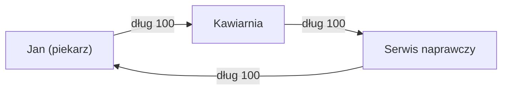

# Projekt GEO — 10. Społeczność docelowa i strategia marketingowa

> **Cel:** Określić kluczowe segmenty na start oraz strategię marketingową pozyskiwania użytkowników.  
> **Zadania:**  
> - Zdefiniować segmenty docelowe do eksperymentu.  
> - Opracować strategię marketingową pozyskiwania użytkowników.

---

## Najlepsze warunki startowe dla społeczności

### Kluczowa zasada atrakcyjności systemu

> **„Atrakcyjność systemu zależy w pierwszej kolejności od możliwości spięcia niezaspokojonego popytu z zasobami rezerwowymi”**  
>  
> Rezerwowymi nazywamy te zasoby, które obecnie nie są wykorzystywane, ale w dowolnym momencie mogą zostać włączone do obiegu gospodarczego.

Atrakcyjność jest zapewniana przez **dywersyfikację** — gdy popyt ma maksymalną szansę spotkać się z podażą. Zależy to od liczby uczestników i różnorodności ich działalności.

---

## Segmenty docelowe do eksperymentu

### Priorytet #1: Mali i średni producenci

> ⚠️ **Krytyczny błąd** (z materiałów marketingowych): podłączać tylko konsumentów i duże sklepy — to niewłaściwe podejście:  
> - Konsumenci nie mają możliwości **ZAROBIĆ** GEO  
> - Duże sklepy nie mają możliwości **WYDAĆ** GEO  
> - Pojawia się potrzeba kantorów / wymienników → rośnie koszt transakcji → efekt waluty lokalnej jest niwelowany

**Poprawne skupienie:**

1. **Mali i średni producenci** — mogą zarówno zarabiać, jak i wydawać wewnątrz systemu.
2. **Społeczności lokalne** — spółdzielnie, gromady, wspólnoty mieszkańców.
3. **Sieci profesjonalne** — freelancerzy, rzemieślnicy, specjaliści.
4. **Uczestnicy banków czasu, systemów LETS** — już rozumieją mechanikę wzajemnych rozliczeń.

---

## Optymalna skala: masa krytyczna

**Cel:** Zbudować masę krytyczną użytkowników do momentu, w którym informacja o GEO zacznie rozchodzić się „pocztą pantoflową” bez kosztów marketingowych.

> **„Kiedy nie bycie w Systemie będzie już wstydem”** — to wskaźnik osiągnięcia masy krytycznej.

**Skala MVP:** 10–500 uczestników w jednej społeczności.

---

## Warunki strukturalne (idealne)

| Parametr     | Wartość optymalna         | Dlaczego ważne                           |
|--------------|---------------------------|------------------------------------------|
| Rozmiar      | 30–100 uczestników        | Wystarczające dla cykli 3–6, a zarazem zarządzalne |
| Spójność     | Istniejące więzi ekonomiczne | Uczestnicy już ze sobą handlują        |
| Geografia    | Zwarta, lokalna           | Niższe koszty, silniejsze zaufanie       |
| Różnorodność | Różne towary/usługi       | Tworzy warunki dla cykli clearingu       |
| Infrastruktura | Istnieją „węzły kotwiczące” | Magazyn, sklep, produkcja             |
| **Terytorium** | **Ograniczone**         | Maksymalna koncentracja użytkowników     |

---

## Warunki społeczne (obowiązkowe)

- **Wysoki początkowy poziom wzajemnego zaufania** — uczestnicy znają się osobiście.
- **Doświadczenie wspólnego podejmowania decyzji** — spółdzielnie, gromady, stowarzyszenia zawodowe.
- **2–3 aktywnych liderów** — gotowych zostać „hubami” i węzłami infrastrukturalnymi.
- **Kultura wzajemnej pomocy** — zrozumienie, że „minus = obietnica przyszłej pracy”.

---

## Warunki ekonomiczne (triggery)

- **Problemy z płynnością** — jest motywacja, by szukać alternatywy dla kredytu bankowego.
- **Regularne, powtarzalne transakcje** — nie jednorazowe, lecz powtarzające się wymiany.
- **„Efekt dziurawego wiadra”** — pieniądze szybko wypływają ze społeczności.
- **Zasoby rezerwowe** — niewykorzystane moce, które można włączyć do obiegu.

---

## Forma prawna (rekomendowana)

**Spółdzielnia konsumencka** — przewidziana w prawie np. ukraińskim:

> „Spółdzielnia konsumencka to przedsiębiorstwo należące do konsumentów i demokratycznie przez nich zarządzane. Spółdzielnie tworzone są dla zaspokojenia potrzeb i oczekiwań swoich członków. Działają w ramach systemu rynkowego, niezależnie od państwa, jako forma wzajemnej pomocy, zorientowana na świadczenie usług wysokiej jakości, a nie na maksymalizację zysku.”

---

## Skuteczne strategie marketingowe startu „od zera”

### Strategie pozyskiwania nowych użytkowników (z materiałów marketingowych GEO)

1. **Unikalny produkt w unikalnej cenie**

   > Zaproponować unikalny produkt lub usługę, która będzie interesująca dla szerokiej grupy odbiorców, W UNIKALNEJ CENIE.  
   >  
   > **Cel — gra na ciekawości:** potencjalni użytkownicy powinni zacząć pytać „JAK zdobyć tę usługę w takiej cenie?” oraz „Czym jest GEO?”.

2. **Techniczne środki rozliczeń**

   - Oprócz smartfona: karta płatnicza, smart‑karta, urządzenia NFC, terminal płatniczy.
   - Interfejs i doświadczenie muszą być zrozumiałe dla szerokiego grona osób (bez „geekowej” otoczki).

3. **Sieć agentów‑konsultantów**

   > Przykład — PrivatBank, gdzie ten model zadziałał znakomicie: prawie wszyscy przeszli na obsługę przez terminale, a tradycyjne kasy (i kolejki) prawie zniknęły.

---

## Strategia 1: „Węzeł kotwiczny + ostry ból” (najbardziej realna)

**Idea:** Zgodnie z architekturą B (community‑hub) najpierw podłączamy 1–2 kluczowych uczestników, przez których przechodzi dużo transakcji.

**Idealne „kotwice”:**

- magazyn / hurtownia spółdzielni;
- dostawca hurtowy z odroczonymi płatnościami;
- większy producent z siecią drobnych odbiorców.

**Kroki:**

1. Zidentyfikować „punkt bólu” — długie terminy płatności, luki płynności.
2. Zaproponować kluczowemu uczestnikowi rolę huba: lojalność dostawców w zamian za trustlines.
3. Nowi użytkownicy wchodzą przez linie zaufania do huba — niski próg wejścia.
4. Stopniowo uczestnicy otwierają linie między sobą, sieć rośnie organicznie.

**Topologia (wg dokumentu „Architektura”):**

```text
Spółdzielnia (węzeł centralny)
         ↕
    [Uczestnicy]
```

**Przekaz:**  
*„Otrzymujesz towar dziś — rozliczasz się, kiedy możesz, bez banków i odsetek.”*

---

## Strategia 2: „Karta płatnicza gminy” (przykład realny: gmina Piszczańska)

**Idea:** Połączyć miejscowości w jeden wspólny obszar ekonomiczny poprzez kartę płatniczą gminy.

Fragment z materiałów GEO:

> *„Każdy mieszkaniec gminy może otrzymać kartę płatniczą gminy Piszczańskiej, za pomocą której będzie można kupować i sprzedawać towary lokalnej produkcji.*  
>  
> *Aby zamówić świeży chleb z lokalnej piekarni, mięso lub mleko ze sklepu, traktor do obrobienia działki — nie trzeba czekać na wypłatę czy emeryturę. W ogóle nie potrzebujesz hrywien.*  
>  
> *Żeby zarobić lokalną jednostkę rozliczeniową, trzeba sprzedać społeczności swój towar lub usługę — np. oddać plony ze swojego ogrodu do punktu skupu.”*

**Oczekiwane efekty:**

- Wzrost popytu na lokalne produkty.
- Spadek kosztów pośrednich.
- Spadek cen detalicznych.
- Wzrost liczby miejsc pracy.
- Poprawa jakości towarów i usług oraz ich asortymentu.
- Wzmocnienie relacji wewnątrz gminy i poziomu kooperacji.

**Statystyka:**  
Na świecie istnieje ponad 500 lokalnych systemów płatniczych. Efekt ekonomiczny — **wzrost lokalnej gospodarki nawet o 1500% w ciągu 2–3 lat** (w porównywalnych przypadkach).

**Przekaz:**  
*„Wsie gminy łączą się w jeden wspólny obszar ekonomiczny.”*

---

## Strategia 3: „Grupa pilotażowa + szybkie zwycięstwo” (dla sceptyków)

**Idea:** Zgodnie z dokumentem „Projekt GEO — 1” zacząć od małej grupy 5–10 osób i **pokazać pierwszy clearing** jako „efekt WOW”.

**Kroki:**

1. Wybrać 5–10 uczestników z **już istniejącymi** wzajemnymi zobowiązaniami.
2. Przeprowadzić warsztat 2–3‑godzinny:
   - wyjaśnić: „linia zaufania = twój osobisty limit ryzyka”;
   - otworzyć niewielkie limity (50–100 jednostek).
3. W pierwszym tygodniu zrealizować 5–10 rzeczywistych transakcji.
4. **Pokazać pierwszy clearing wizualnie** — jak długi się „zwinęły” bez przepływu pieniędzy.
5. Opisać i rozpropagować historię sukcesu wśród pozostałych.

**Przykład (cykl A→B→C→A):**



Po clearingu: **wszystkie długi = 0**, towary/usługi już zostały wymienione.

**Przekaz:**  
*„Zobaczcie — to działa! Piekarz dał chleb kawiarni, kawiarnia zapłaciła serwisowi za naprawę, serwis przywiózł piekarzowi drewno — i nikt nikomu nie jest winien.”*

---

## Strategia 4: „Moment kryzysu + gotowe rozwiązanie” (wysoka konwersja)

**Idea:** Wykorzystać kryzys gospodarczy lub sezonowy brak płynności jako impuls do wdrożenia GEO.

**Idealne momenty:**

- Siew / sezon upraw (rolnicy potrzebują nasion, zanim sprzedadzą plony).
- Okres między sezonami w regionach turystycznych.
- Kryzys łańcuchów dostaw / płynności.

**Kroki:**

1. Zidentyfikować moment ostrego niedoboru płynności.
2. Zaproponować GEO jako „tymczasowy mechanizm” rozliczeń wewnętrznych.
3. Ustalić minimalne reguły:

   - limity domyślne (np. nie więcej niż miesięczny wkład pracy/obrotu),
   - obowiązkowy powrót do neutralnego bilansu w określonym czasie (np. sezon/rok).

4. Po pomyślnym przejściu kryzysu — zakotwiczyć system jako stały element.

Analogicznie do systemu WIR:

> *„W 1934 roku, w środku Wielkiego Kryzysu, gdy brakowało fizycznych pieniędzy, szwajcarscy przedsiębiorcy umówili się: «Będziemy kredytować się nawzajem». Stworzyli jednostkę WIR równą frankowi... Minęło prawie sto lat, a system WIR wciąż działa.”*

**Przekaz:**  
*„Brak pieniędzy teraz? Nie problem — kredytujemy się nawzajem w GEO, rozliczymy się towarem po zbiorach.”*

---

## Strategia 5: „Reputacja jako kapitał” (podejście filozoficzne)

**Idea:** Pozycjonować GEO nie jako system płatniczy, lecz jako system, w którym głównym kapitałem jest reputacja i kapitał społeczny.

Fragment z wywiadu (w tłumaczeniu z materiałów GEO):

> *„Proponujemy system, w którym każdy człowiek, firma lub agent płatniczy ma możliwość stworzenia własnego środka płatniczego.*  
>  
> *W ten sposób każda aktywność uczestników tej przestrzeni motywuje ich do bardziej efektywnej współpracy. Innymi słowy, nie ilość pieniędzy, które posiadasz, lecz twoja reputacja i pozycja społeczna — KIM jesteś i na ile ludzie uważają cię za godnego zaufania — stają się twoim głównym kapitałem.*  
>  
> *To z kolei zmienia sposób motywacji i pracy: opłaca się być uczciwym, a ufać innym i być godnym zaufania staje się ekonomicznie korzystne.”*

**Kluczowe argumenty:**

1. Dostęp do środka rozliczeniowego nie powinien być przywilejem garstki instytucji.
2. Pieniądze nie powinny być postrzegane jako coś egzotycznego i „nieosiągalnego”.
3. Uczciwość i zaufanie stają się ekonomicznie opłacalne.

**Przekaz:**  
*„Twoja reputacja — twój główny kapitał. Bycie godnym zaufania zaczyna się opłacać.”*

---

## Kluczowe czynniki sukcesu

### Czego NIE robić (krytyczne błędy)

1. **Nie podłączać TYLKO konsumentów** — nie mają jak zarobić GEO.
2. **Nie podłączać TYLKO dużych sklepów** — nie mają jak wydać GEO.
3. **Nie budować kantorów/wymienników jako głównego kanału** — to zwiększa koszt transakcji i zabija efekt waluty lokalnej.

> **„Lokalna waluta musi pozostawać w swojej ekosystemie, bez przymusowej konwersji przez inne jednostki przy zwykłych transakcjach.”**

### Elementy obowiązkowe

1. **Prosty UI/UX** — uczestnicy muszą rozumieć:
   - swój bilans,
   - komu ufają i na ile,
   - co oznacza „minus” i „plus” w systemie.

2. **Edukacja** — minimum jeden warsztat z wyjaśnieniem:
   - linia zaufania = osobisty limit ryzyka;
   - clearing = automatyczny wzajemny kompensator długu.

3. **Wizualizacja clearingu** — pokazywać „znikanie” cykli długu (to główny efekt „wow”).

4. **Presja społeczna / widoczność** — regularne spotkania, raporty o stanie sieci, uczynienie korzystania z GEO „normą” w społeczności.

---

## Minimalny zestaw reguł dla kooperatywu (na bazie dokumentacji)

**Techniczne:**

- Kopie zapasowe kluczy u wszystkich uczestników (seed w 2 miejscach).
- Dublowanie dla kluczowych węzłów (magazyn, „kasa”).

**Organizacyjne:**

- Social recovery (2–3 zaufane osoby do odzyskiwania dostępu).
- Regulamin „zniknięcia” (np. 6 miesięcy — zamrożenie, 12 miesięcy — możliwość spisania długu według reguł społeczności).
- Wewnętrzny arbitraż (3–5 osób lub ciało zbiorowe).

**Ekonomiczne:**

- Limity startowe dla nowych: 50–100 jednostek.
- Nie więcej niż 20% ogólnego limitu zaufania skierowane do jednego uczestnika.
- Szczególny status węzłów infrastrukturalnych (większa przejrzystość, ewentualnie zabezpieczenia/poręczenia).

**Kulturowe:**

- Zrozumienie, że dług = obietnica przyszłej pracy/towaru, a nie „magiczne minusowe pieniądze”.
- Miękkie limity długu osobistego (np. nie więcej niż 1–2 miesięczne wkłady pracy).

Tak zdefiniowana społeczność docelowa oraz strategia marketingowa dają realną szansę, że GEO stanie się nie tylko eksperymentem, ale trwałym narzędziem lokalnej gospodarki.
