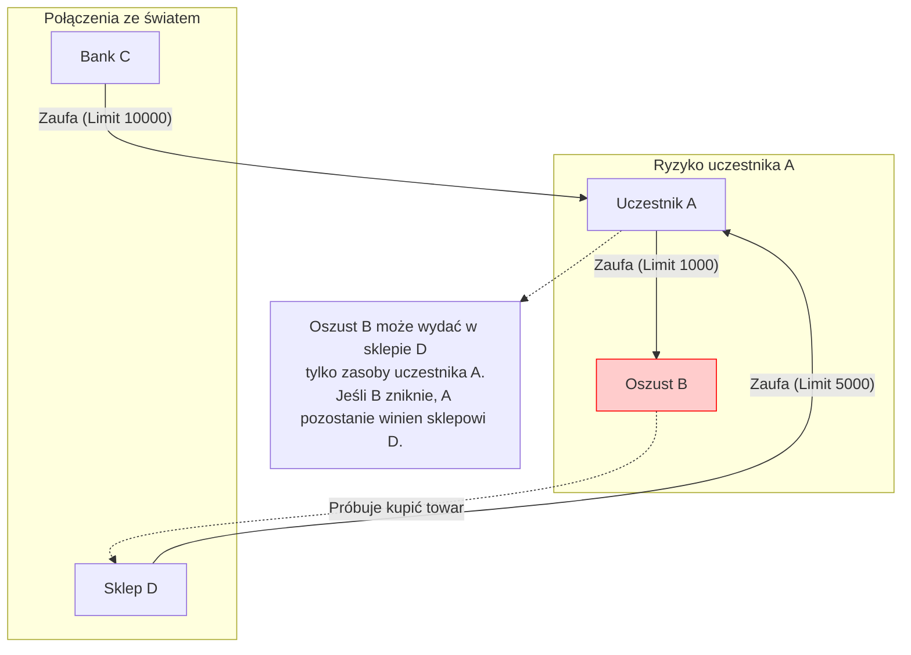
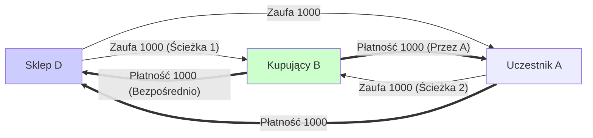
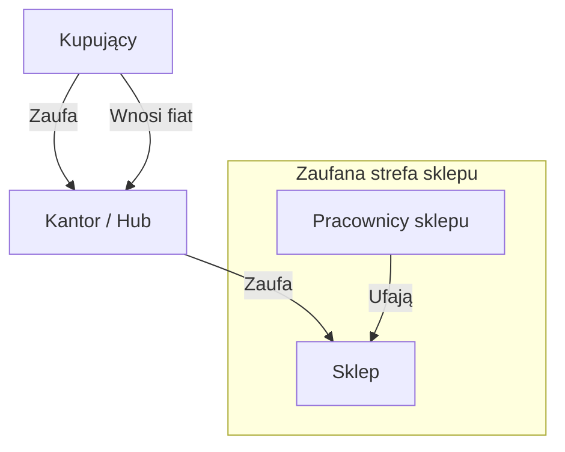
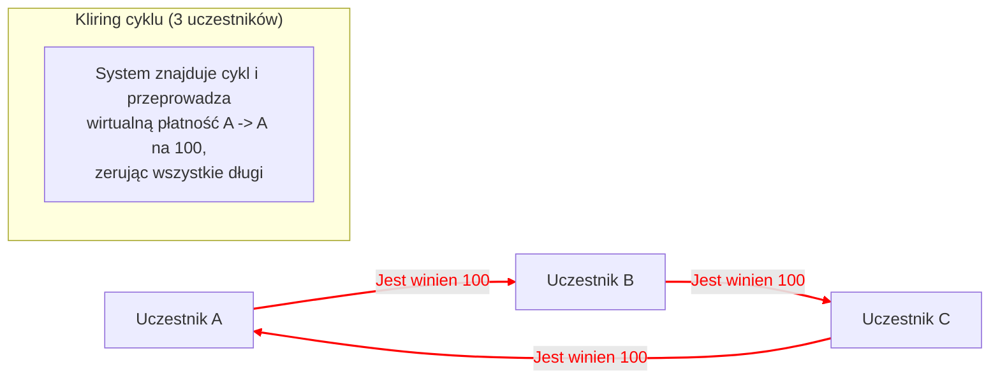

# Dyskusja z Dimą Chizhevskim o mechanice zaufania, ryzykach i klirngu

*Data: 05.05.2021*
*Uczestnicy: Slawa Gorobets, Dima Chizhevsky*

Ten dokument zawiera sformatowany log korespondencji z Dimą Chizhevskim (architekt GEO Protocol) z dodanymi schematami do zilustrowania omawianych mechanik.

---

## 1. Linie zaufania i ryzyko oszustwa

**Slawa Gorobets:**
Dmitriju, kiedyś dawno rozmawialiśmy o GEO z tobą i Maksem. Czy miałbyś 15 minut, żeby wytłumaczyć mi linie zaufania i dać odnośnik, gdzie ich działanie można zbadać w kodzie protokołu? Interesuje mnie ochrona przed oszustwem:

Przypadek, gdy jakaś osoba otwiera linie zaufania oszustom, którzy kupują na kredyt rzeczywiste towary od innych uczestników systemu i znikają z systemu...

**Dima Chizhevsky:**
Przypadek o którym piszesz — jest możliwy. Na to są właśnie linie zaufania)

**Slawa Gorobets:**
Interesuje mnie algorytmicznie jakie na to są zabezpieczenia w protokole i gdzie o nich poczytać lub obejrzeć w kodzie?

**Dima Chizhevsky:**
Zabezpieczenie przed czym? Możesz opisać sekwencję działań przed którymi chcesz się chronić?

**Slawa Gorobets:**
Linia zaufania — to limit kredytu, który otwieram komuś. To znaczy suma środków, na którą może kupować u mnie towary, mając zerowe saldo na koncie. Prawda?

**Dima Chizhevsky:**
Gdy tylko otworzyłeś komuś LZ (Linię Zaufania) — jego możliwości (nie saldo) wzrosły o sumę LZ.
Salda jako takiego w systemie nie ma. To co w klasycznej bankowości nazywa się saldem to — w istocie wartość twojej LZ do banku. Jedynej.

Ta osoba staje się zdolna do wykorzystania długu wszystkich, którzy ci zaufali LZ, lub mają wobec ciebie zobowiązania dłużne, które można zaksięgować.

**Slawa Gorobets:**
To znaczy nie ma zabezpieczenia przed tym, żeby osoba zarejestrowała się w systemie, otworzyła 1000 oszustom po 1000 hrywien, które ci wykorzystali na zakup rzeczywistych towarów od innych uczestników systemu?

**Dima Chizhevsky:**
To co nazywasz zakupem rzeczywistych towarów i usług prawdopodobnie też jest rezultatem istnienia określonego zaufania, lub raczej zobowiązań finansowych wobec tej osoby.

Określmy kontekst:
*   **A** — to uczciwa osoba
*   **B** — oszust
*   **C** — system płatności, bank lub jakikolwiek emitent
*   **D** — sklep z rzeczywistymi towarami

Żeby **B** mógł coś kupić na zaufanie od **A**, **A** sam musi mieć taką możliwość. A to znaczy, że musi albo doładować saldo przez konwersję fiata używając **C**, albo zaciągnąć dług (znowu zaufany) względem **D**.

**B** nie będzie mógł użyć więcej niż maksimum z 2 liczb (zaufanie od **A** do **B**; przepływ od **A** do sklepu).

To co nazywasz zabezpieczeniem istnieje nie w protokole, a w interfejsie użytkownika: należy im przypominać, że linia zaufania to możliwość wykorzystania przez inną osobę ich salda. Na określoną sumę. **A** sam określa ile i komu ufać i odpowiednio sam kontroluje ryzyko.

---

## 2. Obliczanie dostępnego przepływu (Max Flow)

**Slawa Gorobets:**
"Żeby B mógł coś kupić na zaufanie od A, A sam musi mieć taką możliwość." — o tym nie wiedziałem.
A co to jest "przepływ od A do sklepu"?

**Dima Chizhevsky:**
Całkowita możliwość generowania zobowiązań dłużnych.

Wyobraźmy sobie, że **B** — nie jest oszustem.
1.  **D** zaufa **A** na 1000.
2.  **D** zaufa **B** na 1000.
3.  **A** zaufa **B** na 1000.

W takim przypadku przepływ od **B** do **D** — **2000**.
Jedna tysiąc przez własną LZ z **D**, a druga tysiąc przez **A**.

**Dima Chizhevsky:**
Zadaniem protokołu — jest obliczenie tych możliwości, pokazanie ich i danie możliwości wykorzystania.

---

## 3. Analogia z kartą bankową

**Dima Chizhevsky:**
Przy twoim pierwszym zapytaniu mogę wytłumaczyć inaczej.

Wyobraź sobie, że masz konto w banku na 10000 hrywien. W istocie to LZ od ciebie do banku. Bank naliczył ci 10000, a ty mu ufasz, że na pierwsze żądanie skieruje twoje środki dalej, gdzie powiesz. Może tego nie zrobić, dlatego tu właśnie chodzi o zaufanie.

A teraz wyobraź sobie, że emitujesz kartę, która jest powiązana z tym kontem, ale na której jest ustawiony limit operacji na 1000 hrywien. I dajesz kartę żonie lub córce. Oraz karta w tym przypadku to — LZ.

**Slawa Gorobets:**
Na tym przykładzie, jeśli **D** nikt nie zaufa, to faktycznie "**B**" będzie mógł wykorzystać tylko 1000.
A jeśli "**A**" też nikt nie zaufa, to "**B**" w ogóle nie będzie miał kredytu do płacenia (lub przekazów)?

**Dima Chizhevsky:**
Tak, będzie mógł wykorzystać tylko 1000, ale tylko względem **A**. Kupić towar lub usługę od **A**, a nie od **D**.
Ponieważ nie ma przepływu od **B** do **D**, jeśli **D** nie ma połączeń ze światem. I tak. W takim przypadku u **D** nikt niczego kupić nie może.

---

## 4. Architektura dla sklepów (Huby i Kantory)

**Slawa Gorobets:**
Aha, teraz już jaśniej :) To znaczy, jeśli **A** — to sklep, a **B** — kupujący, to faktycznie sklep musi otwierać linie zaufania wszystkim kupującym, którzy chcą nabyć u niego towar.

**Dima Chizhevsky:**
Możliwe są warianty. LZ do kupujących — możliwe, ale lepiej nie, ponieważ jednak sklep nie powinien nikomu ufać.

Lepiej, gdy sklep jest dostępny przy pośrednictwie innej jednostki, która służy jako kantor. Ludzie ufają kantorowi. Przynoszą hrywny, otrzymują ekwiwalent na swoje LZ. Kantor jest połączony ze sklepem.

Lub:
1.  Sklep zaufa właścicielowi i pracownikom.
2.  Właściciel ma ludzi, którym zaufa. I tak dalej.
3.  Stałym klientom i temu podobne.
4.  Również tutaj znajdują się systemy lojalnościowe i inne rzeczy, którymi ludzie są gotowi zaryzykować.

---

## 5. Kliring (Wzajemne rozliczenia)

**Slawa Gorobets:**
Interesuje mnie wyszukiwanie wzajemnego zadłużenia wszystkich uczestników i wykrywanie możliwości klirngu przy prowadzeniu transakcji...

**Dima Chizhevsky:**
Kliring jest obecny. Jest automatyczny.
W skrócie: klirowane są cykle z **3, 4, 5 i 6 uczestników**.
*   3 i 4 są wyszukiwane po każdej operacji.
*   5 i 6 są wyszukiwane i przetwarzane raz na dobę (ze względu na złożoność obliczeniową operacji).

Kliring jest zaimplementowany jako połączenie 2 operacji: wyszukanie cyklu i uruchomienie operacji płatniczej na siebie samego jeśli cykl zostanie znaleziony.

W kodzie powinieneś spojrzeć na transakcję płatniczą, lub zestaw klas ze słowem kluczowym `Cycle`. Tam są one podzielone osobno dla cykli 3, 4, 5 i 6 wymiarowych.

---

## 6. Przydatne linki i inspiracje

**Dima Chizhevsky:**
Nawiasem mówiąc, teraz rozmawiałem z byłym członkiem zespołu Ripple o tym samym. Oto strona jego projektu, myślę, że myślisz o wspólnych rzeczach:

*   **Federated Bookkeeping**: [https://federatedbookkeeping.org/](https://federatedbookkeeping.org/)
*   **LedgerLoops**: Cryptographically triggered IOUs [https://ledgerloops.com/](https://ledgerloops.com/)

Inspirowaliśmy się ideami Ryana Fuggera (Ryan Fugger), oryginalnego autora koncepcji Ripple (przed utworzeniem firmy Ripple Labs).