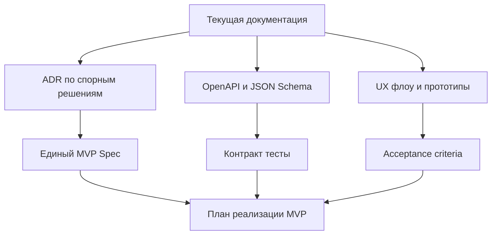

# GEOv0-PROJECT — уточнения и пробелы документации для разработки «с первого раза»

**Цель:** оценить, достаточно ли текущей документации репозитория, чтобы реализовать MVP «с первого раза», и зафиксировать список уточнений/детализаций/улучшений.

**Граница MVP для этой оценки (по договорённости):** backend GEO Hub + минимальный Web-клиент/PWA (без Flutter), чтобы пройти полный пользовательский поток.

**Примечание:** этот документ **объединяет** мой список пробелов с замечаниями и предложениями из внешнего документа с рекомендациями, который **отсутствует в текущем репозитории** (ссылка удалена).

---

## 0. Какие документы были просмотрены (ключевые)

Базовый набор (RU):

- [`docs/ru/00-overview.md`](docs/ru/00-overview.md)
- [`docs/ru/01-concepts.md`](docs/ru/01-concepts.md)
- [`docs/ru/02-protocol-spec.md`](docs/ru/02-protocol-spec.md)
- [`docs/ru/03-architecture.md`](docs/ru/03-architecture.md)
- [`docs/ru/04-api-reference.md`](docs/ru/04-api-reference.md)
- [`docs/ru/05-deployment.md`](docs/ru/05-deployment.md)
- [`docs/ru/06-contributing.md`](docs/ru/06-contributing.md)

Дополнительно (требования к стеку, отчёты и анализы):

- [`docs/ru/concept/Проект GEO — 8. Требования к стеку.md`](docs/ru/concept/%D0%9F%D1%80%D0%BE%D0%B5%D0%BA%D1%82%20GEO%20%E2%80%94%208.%20%D0%A2%D1%80%D0%B5%D0%B1%D0%BE%D0%B2%D0%B0%D0%BD%D0%B8%D1%8F%20%D0%BA%20%D1%81%D1%82%D0%B5%D0%BA%D1%83.md)
- [`docs/ru/concept/Анализ проекта GEO — комплексный отчёт.md`](docs/ru/concept/%D0%90%D0%BD%D0%B0%D0%BB%D0%B8%D0%B7%20%D0%BF%D1%80%D0%BE%D0%B5%D0%BA%D1%82%D0%B0%20GEO%20%E2%80%94%20%D0%BA%D0%BE%D0%BC%D0%BF%D0%BB%D0%B5%D0%BA%D1%81%D0%BD%D1%8B%D0%B9%20%D0%BE%D1%82%D1%87%D1%91%D1%82.md)
- [`docs/ru/archive/07-gaps-analysis.md`](docs/ru/archive/07-gaps-analysis.md)
- Внешний документ с рекомендациями (отсутствует в текущем репозитории)

---

## 1. Итоговый вывод о достаточности данных

**Вердикт:** **скорее нет** — *не из‑за отсутствия идей или базовой спецификации*, а из‑за **недостаточной «сшивки» документации в единый источник правды для MVP** (особенно на стыке: модель узлов/координации → протокол 2PC → API/контракты → UX/ключи/восстановление → критерии приёмки).

**Важно:** это **не противоречит** выводу «разработку можно начинать» (из внешнего документа с рекомендациями; документ отсутствует в текущем репозитории):
- **Начать можно** (скелет проекта, миграции, базовые CRUD, инфраструктура, контракт API, тестовый стенд).
- Но **«с первого раза»** (без переделок после 1–3 недель) — вероятность низкая, пока не зафиксированы спорные решения, конфигурация по умолчанию, edge‑cases и тест‑план.

### 1.1. Что уже хорошо проработано (чтобы это не потерялось)

По совокупности документов уже сильно проработаны:

- **Концепция и видение:** философия, мотивация, сравнение с аналогами, целевая аудитория.
- **Спецификация протокола:** ключевые сущности, инварианты, Ed25519/SHA‑256, 2PC, routing/multi‑path, клиринг.
- **Архитектура:** логика Hub‑центричной MVP, эволюция/roadmap, разбиение по слоям.
- **API Reference:** основные REST endpoints, форматы запросов/ответов, WS уведомления, ошибки.
- **Модель данных:** SQL‑схемы и индексация (как база для Alembic миграций).

То есть проблема не в «пустой» документации, а в **нормативных границах MVP и воспроизводимости реализации** (контракты, тесты, конфиги, edge‑cases, арбитраж, операционные процедуры).

### Почему «скорее нет», несмотря на большое количество материалов

Документы содержат много полезного (сущности, инварианты, схемы БД, примеры API, deployment). Но для реализации MVP «с первого раза» не хватает:

1) **Окончательно зафиксированного MVP-scope** (какие алгоритмы и режимы точно входят/точно не входят).

2) **Ясной «операционной модели» участника в MVP**: участник — это только аккаунт в hub или отдельный узел с самостоятельным хранением/подтверждением сообщений?

3) **Продуктовых артефактов** (user stories, UX‑флоу, прототипы, тексты и правила сообщества), необходимых для минимального PWA, а не только для «ядра протокола».

4) **Контрактов, пригодных для автогенерации/контракт‑тестов** (OpenAPI/JSON Schema + тестовые вектора подписей/канонизации).

5) **Критериев приёмки и тест‑плана**, завязанного на инварианты и основные пользовательские сценарии.

---

## 2. 5–10 критичных уточнений для старта MVP

Ниже — уточнения, без которых высок риск переделок уже в первые 1–3 недели.

1) **Модель узлов в MVP (account vs node)**
   - **Почему важно:** определяет реализацию 2PC/locks, требования к online‑доступности клиента, модель угроз.
   - **Риск:** заложить в код «квази‑p2p» и потом упростить (или наоборот), сломав протокол/UX.
   - **Зафиксировать:** 1‑страничная спецификация MVP‑модели участника + диаграмма последовательностей платежа/клиринга в выбранной модели.

2) **Единый MVP scope: routing + clearing + multipath**
   - **Почему важно:** в документации встречаются разные уровни сложности (BFS, k‑shortest, max‑flow; циклы 3–4 vs 3–6).
   - **Риск:** команда начнёт реализовывать «лишнее» или несовместимые подходы.
   - **Зафиксировать:** таблица scope «входит/не входит» + ADR по маршрутизации и клирингу (что делаем в v0.1 и почему).

3) **Нормативная модель долгов и инвариантов (особенно симметрия долга)**
   - **Почему важно:** схема БД предполагает `amount > 0` и отдельные записи, но одновременно заявлен инвариант запрета двусторонних долгов; нужна чёткая политика неттинга.
   - **Риск:** рассинхрон расчётов баланса/лимитов, некорректный клиринг, ошибки при миграциях.
   - **Зафиксировать:** таблица правил «как представляем долг» + примеры трансформаций (A должен B / B должен A) + тест‑кейсы на инварианты.

4) **Управление ключами в PWA (хранение, backup, перенос, восстановление)**
   - **Почему важно:** без этого невозможна безопасная регистрация/логин и подписи.
   - **Риск:** потеря доступа пользователей, компрометация ключей, отказ от подписей и деградация модели безопасности.
   - **Зафиксировать:** UX‑flow и threat model для ключей + описание формата экспорта ключа/seed + политика recovery.

5) **Единый контракт API уровня OpenAPI + контракт‑тесты**
   - **Почему важно:** API Reference полезен, но для «с первого раза» нужен машиночитаемый контракт.
   - **Риск:** несовместимость backend↔PWA, рост затрат на интеграцию.
   - **Зафиксировать:** OpenAPI 3.0 + JSON Schema для WS‑событий + Postman/Insomnia коллекция + contract tests.

6) **Политики и параметры сообщества по умолчанию**
   - **Почему важно:** многие решения «социальные» (auto_clearing, verification levels, дефолтные лимиты, анти‑спам/anti‑sybil меры).
   - **Риск:** непредсказуемая экономика пилота и конфликтные ожидания участников.
   - **Зафиксировать:** конфиг‑спека сообщества (YAML/JSON) + user‑visible правила.

7) **Процесс споров/арбитража и границы компенсирующих транзакций**
   - **Почему важно:** протокол допускает компенсации, но нужен governance.
   - **Риск:** «ручные правки баланса» без аудита или невозможность исправить очевидные ошибки.
   - **Зафиксировать:** регламент (SOP) + роли/права + аудит‑лог + user stories для dispute.

8) **Критерии приёмки и тестовая стратегия на основе инвариантов**
   - **Почему важно:** система легко ломается на edge‑cases (timeouts, multipath, clearing).
   - **Риск:** «почти работает», но нестабильна при пилоте.
   - **Зафиксировать:** набор acceptance criteria + тест‑матрица (unit/integration/e2e/property) + нагрузочные проверки.

9) **Набор тестовых сценариев (20–30) как «сквозная проверка» MVP**
   - **Почему важно:** сценарии «приземляют» протокол на реальные действия пользователя.
   - **Риск:** реализуем «по спекам», но не покрываем поведение в реальном потоке (онбординг → trustline → платёж → клиринг → история/споры).
   - **Зафиксировать:** документ `docs/ru/08-test-scenarios.md` (или аналог) с предусловиями/шагами/ожидаемым результатом + минимальные e2e автотесты на top‑5 сценариев.

10) **Список конфигурационных параметров и дефолтов (Protocol/Clearing/Security/DB/Integrity)**
   - **Почему важно:** без явных дефолтов команда будет «прошивать» параметры в код.
   - **Риск:** скрытые зависимости, хаотичные значения в окружениях, нестабильность пилота.
   - **Зафиксировать:** документ `docs/ru/config-reference.md` (или аналог) + пример `geo-hub-config.yaml`.

---

## 3. Пробелы и вопросы по категориям

Формат каждого пункта:

- **Что уточнить / зафиксировать**
- **Почему важно**
- **Риск при отсутствии**
- **Ожидаемый артефакт**

---

### 3.1. Продукт / домен

**PD-1. Пилотное сообщество и контекст запуска**
- **Что:** кто реальный пилот (тип сообщества, роли, процессы), какие сценарии обмена приоритетны.
- **Почему важно:** без реального контекста легко сделать «технически правильно», но «не взлетает».
- **Риск:** неверная UX‑модель, неподходящие дефолты, провал онбординга.
- **Артефакт:** MVP Product Brief + user story map + перечень top‑10 сценариев пилота.

**PD-2. Эквиваленты для MVP и правила их использования**
- **Что:** список эквивалентов, precision, кто может создавать, правила именования, модерация.
- **Почему важно:** влияет на данные, UX и аналитику.
- **Риск:** «зоопарк эквивалентов», несовместимые правила расчётов.
- **Артефакт:** спецификация «Equivalents policy» + таблица полей + миграционные seed‑данные.

**PD-3. Уровни верификации и их продуктовый смысл**
- **Что:** как трактуем `verification_level`, кто присваивает, какие ограничения по операциям.
- **Почему важно:** это базовый анти‑sybil/anti‑fraud рычаг в MVP.
- **Риск:** спам‑участники, токсичный граф доверия, повышенный риск дефолтов.
- **Артефакт:** политика верификации + админ‑флоу + требования к логированию действий админа.

**PD-4. «Правила сообщества» как часть продукта**
- **Что:** дефолтные рекомендации/ограничения: стартовые лимиты, концентрация доверия, поведение при исчезновении участника.
- **Почему важно:** GEO зависит от социальных правил не меньше, чем от кода.
- **Риск:** пилот разваливается из‑за неправильных правил, даже если код работает.
- **Артефакт:** документ Community Rules v0.1 + тексты подсказок в UI.

---

### 3.2. Протокол / криптография / консенсус

**PC-1. MVP‑интерпретация 2PC при hub‑центричной модели**
- **Что:** кто именно отвечает на PREPARE/COMMIT в MVP (клиент? сервер от имени участника? только DB locks?).
- **Почему важно:** влияет на корректность, на необходимость online клиента, на UX задержек.
- **Риск:** невозможные предположения (клиент должен быть онлайн, чтобы платить), либо потеря смысловых гарантий.
- **Артефакт:** sequence diagram платежа и клиринга в MVP + описание таймаутов/ретраев.

**PC-2. Нормативные тест‑вектора для подписи и канонизации**
- **Что:** примеры payload → canonical JSON → signature (ожидаемые байты/base64).
- **Почему важно:** иначе разные реализации (PWA/сервер) будут «подписывать разное».
- **Риск:** массовые ошибки `Invalid signature`, блокировка платежей.
- **Артефакт:** набор test vectors + минимальная библиотека canonicalization, используемая и в сервере, и в PWA.

**PC-3. tx_id: UUID или hash содержимого — и что именно хешируем**
- **Что:** единое правило формирования `tx_id` и `msg_id` (и где требуется идемпотентность).
- **Почему важно:** определяет дедупликацию и устойчивость при ретраях.
- **Риск:** дубли операций или невозможность безопасного повторного запроса.
- **Артефакт:** спецификация идентификаторов + контракт API (Idempotency-Key/tx_id правила).

**PC-4. Политики trustline (`policy`) как контракт и как enforcement**
- **Что:** какие поля policy реально поддерживаются в MVP и как они влияют на routing/clearing.
- **Почему важно:** иначе policy превратится в «мусорное поле» без поведения.
- **Риск:** UX показывает одно, а система делает другое.
- **Артефакт:** таблица policy‑полей (поддержка/дефолты/валидация) + unit‑тесты.

**PC-5. Клиринг: триггеры, частота, лимиты и согласие**
- **Что:** когда запускаем поиск циклов, какие циклы в MVP (3–4?), min_amount, лимиты на число/время.
- **Почему важно:** клиринг — одна из ключевых «магий» GEO, но легко перегрузить систему и UX.
- **Риск:** деградация производительности, неожиданные списания долгов без понятного объяснения.
- **Артефакт:** спека ClearingEngine MVP + диаграмма состояний + UX‑правила уведомлений.

---

### 3.3. API / контракты

**AC-1. OpenAPI как «единственный источник правды» для REST**
- **Что:** формальная OpenAPI 3.0 спецификация (в т.ч. security schemes, pagination, ошибки).
- **Почему важно:** для PWA нужны стабильные контракты и автогенерация клиентов.
- **Риск:** дрейф API и рост ручной интеграции.
- **Артефакт:** OpenAPI файл + contract tests + changelog правил версионирования.

**AC-2. WebSocket: формальная схема событий и подписок**
- **Что:** перечень event types, payload schemas, гарантии доставки, политика reconnect/replay.
- **Почему важно:** реальный UX для платежей/клиринга потребует realtime.
- **Риск:** потеря событий, несогласованность UI, «пропавшие платежи».
- **Артефакт:** JSON Schema для WS + документация reconnect + тестовый стенд.

**AC-3. Семантика ошибок и маппинг HTTP↔доменные ошибки**
- **Что:** единая таблица ошибок (коды/HTTP/повторяемость/пользовательские тексты).
- **Почему важно:** PWA должен понимать, что можно ретраить, а что — нет.
- **Риск:** некорректные ретраи (дубли) или «немые» ошибки.
- **Артефакт:** Error Catalog + UI copy + автотесты на ошибки.

**AC-4. Админские API и действия оператора**
- **Что:** какие операции доступны оператору/админу в MVP (freeze участника, управление эквивалентами, аудит).
- **Почему важно:** пилот без оператора обычно не живёт.
- **Риск:** «невозможно обслуживать» пилот без прямого доступа к БД.
- **Артефакт:** admin API spec + RBAC matrix + audit requirements.

---

### 3.4. Данные / модели

**DM-1. Единое представление долга (netting) и запрет «двусторонних долгов»**
- **Что:** правило: храним 1 запись на пару (с signed amount) или 2 записи, или строгий неттинг при каждом изменении.
- **Почему важно:** от этого зависит корректность инвариантов и расчёт available_credit.
- **Риск:** отрицательные значения там, где ожидаются положительные; некорректные лимиты.
- **Артефакт:** Data Model ADR + SQL constraints + миграции + тест‑кейсы.

**DM-2. Производные поля (`used`, `available`, агрегаты) — формулы и источники**
- **Что:** как считаем `used/available` и агрегаты для участника, где кэшируем.
- **Почему важно:** это центральная часть UX.
- **Риск:** UI показывает неверные лимиты/балансы.
- **Артефакт:** документ формул + materialized views/queries + тестовые примеры.

**DM-3. История операций и неизменяемость транзакций**
- **Что:** какие поля храним в `transactions.payload`, что можно «редактировать», retention.
- **Почему важно:** аудит и разбор споров.
- **Риск:** невозможность расследования инцидентов и юридические риски.
- **Артефакт:** audit trail spec + retention policy + миграции.

**DM-4. Seed‑данные для развертывания пилота**
- **Что:** как инициализируем эквиваленты, системные роли, дефолтные политики.
- **Почему важно:** без seed‑процедур пилот невозможно воспроизводимо разворачивать.
- **Риск:** ручные шаги, ошибки окружений.
- **Артефакт:** `init` спецификация + файлы seed (YAML/JSON) + idempotent CLI.

---

### 3.5. UX / пользовательские потоки

**UX-1. Онбординг и обучение модели доверия**
- **Что:** как объясняем «trust line = ваш риск», как предупреждаем о последствиях.
- **Почему важно:** без этого пользователи будут открывать лимиты неправильно.
- **Риск:** быстрые дефолты/конфликты и потеря доверия к продукту.
- **Артефакт:** UX‑прототипы (Figma) + тексты интерфейса + user tests план.

**UX-2. Поток создания trustline и выбора контрагента**
- **Что:** поиск участников, идентификация, предотвращение ошибок (не тому PID).
- **Почему важно:** PID как строка неудобен для людей.
- **Риск:** ошибки доверия и платежей.
- **Артефакт:** UX‑flow + требования к поиску/фильтрам + минимальные поля профиля.

**UX-3. Платёж: предварительная проверка ёмкости и объяснимость маршрута**
- **Что:** показываем ли пользователю маршрут/посредников, как объясняем отказ.
- **Почему важно:** «магия сети» должна быть объяснима.
- **Риск:** недоверие к системе и рост обращений к оператору.
- **Артефакт:** user stories + UI экраны «capacity», «ошибка», «детали платежа».

**UX-4. Клиринг: уведомления, согласие, история изменений долга**
- **Что:** как пользователь видит «что изменилось» после клиринга, как подтверждает/отклоняет.
- **Почему важно:** клиринг меняет долги без «платежа», нужен прозрачный UX.
- **Риск:** ощущение «у меня что-то списали».
- **Артефакт:** UX‑flow + модели уведомлений + требования к истории.

**UX-5. Key management в PWA**
- **Что:** где хранится ключ (IndexedDB/WebCrypto), как делаем backup/restore, что при потере устройства.
- **Почему важно:** без этого модель «ключи у пользователя» становится декоративной.
- **Риск:** потеря аккаунтов и отказ от криптопривязки.
- **Артефакт:** UX‑спека ключей + security review + сценарии восстановления.

---

### 3.6. Безопасность / угрозы

**SEC-1. Threat model для hub‑центричной MVP**
- **Что:** перечень угроз (sybil, DoS, компрометация админа, утечка PII, replay атак), и митигации.
- **Почему важно:** hub — single point of failure и «точка доверия».
- **Риск:** компрометация пилота и репутационный ущерб.
- **Артефакт:** Threat Model (STRIDE) + список security requirements + план пен‑теста (минимальный).

**SEC-2. Управление секретами и ключами сервера**
- **Что:** где храним `SECRET_KEY`, ключи шифрования полей, ротация.
- **Почему важно:** без этого шифрование at rest не работает как обещано.
- **Риск:** утечки токенов/PII.
- **Артефакт:** Secrets management guide + SOP ротации.

**SEC-3. Политика доступа админа к данным и аудит действий**
- **Что:** кто имеет доступ к транзакциям/PII, какие действия логируются.
- **Почему важно:** доверие сообщества.
- **Риск:** внутренние злоупотребления.
- **Артефакт:** RBAC + Audit log spec + review‑процедуры.

---

### 3.7. Инфраструктура / эксплуатация

**OPS-1. Среда пилота и SLO/SLA**
- **Что:** целевые SLO (uptime, latency) и ограничения инфраструктуры пилота.
- **Почему важно:** определяет архитектурные решения (кэширование, background jobs).
- **Риск:** система «вроде работает», но не выдерживает реальную нагрузку.
- **Артефакт:** SLO/SLA документ + capacity plan.

**OPS-2. Runbooks для инцидентов**
- **Что:** пошаговые инструкции: зависшие платежи, нарушение инвариантов, восстановление из backup.
- **Почему важно:** в пилоте инциденты неизбежны.
- **Риск:** долгий простой и потеря доверия пользователей.
- **Артефакт:** runbook набор (markdown) + регулярные drills.

**OPS-3. Политика обновлений и миграций**
- **Что:** как безопасно выкатывать изменения схемы/протокола, rollback.
- **Почему важно:** пилот нельзя «ломать».
- **Риск:** потеря данных, downtime.
- **Артефакт:** release process + миграционная политика + compatibility rules.

---

### 3.8. Тестирование / приёмка

**QA-1. Acceptance criteria для ключевых user stories**
- **Что:** формализованные критерии для: регистрация, trustline, платёж, клиринг, история.
- **Почему важно:** иначе «готово» будет субъективным.
- **Риск:** бесконечные правки и спор о готовности.
- **Артефакт:** user stories + acceptance criteria + чек‑лист приёмки.

**QA-2. Инвариант‑ориентированная стратегия тестов**
- **Что:** тесты на zero‑sum, trust limit, clearing neutrality, idempotency.
- **Почему важно:** протокол в первую очередь про корректность.
- **Риск:** «тихая» порча состояния.
- **Артефакт:** тест‑матрица + property‑based tests + integration tests.

**QA-3. Нагрузочные тесты для routing/clearing**
- **Что:** сценарии нагрузок в пределах MVP (10–500 участников, пик до 10 tx/s).
- **Почему важно:** routing и SQL‑поиск циклов могут стать узким местом.
- **Риск:** непредсказуемые задержки в UX.
- **Артефакт:** нагрузочный план + reproducible generator графа и сценариев.

---

### 3.9. Юридическое / комплаенс

**LEGAL-1. Позиционирование MVP: что это юридически**
- **Что:** является ли MVP «локальной системой взаимного кредита» без обещаний конвертации/фиата.
- **Почему важно:** влияет на требования к KYC/AML, хранению данных, договоры.
- **Риск:** блокировка проекта или необходимость срочно переделывать процесс регистрации.
- **Артефакт:** юридическая записка (1–2 страницы) + дисклеймеры в UI.

**LEGAL-2. GDPR: роли контролера/процессора и процедуры**
- **Что:** кто контроллер, как выполняем export/delete/anonymize, сроки хранения.
- **Почему важно:** есть упоминания GDPR‑прав, но нужна конкретика под пилот.
- **Риск:** нарушения прав субъектов данных.
- **Артефакт:** GDPR DPIA light + процедуры + шаблоны запросов.

**LEGAL-3. KYC: «не нужно» или «нужно, но позже» — зафиксировать**
- **Что:** нужны ли проверки личности для пилота (и если нет — какие ограничения компенсируют).
- **Почему важно:** определяет архитектуру верификации и UX.
- **Риск:** позднее добавление KYC ломает модель данных и онбординг.
- **Артефакт:** решение (ADR) + минимальные hooks/модель данных даже при отложенном KYC.

---

## 4. Сквозные улучшения документации (чтобы снизить риск «не с первого раза»)

**DOC-1. «Единый источник правды» для MVP**
- **Проблема:** много документов с пересечениями и разной степенью «нормативности».
- **Риск:** разработчики выбирают разные трактовки.
- **Артефакт:** 1 документ MVP Spec (или набор ADR) + карта ссылок «где истина».

**DOC-2. Матрица противоречий и их разрешение**
- **Проблема:** встречаются расходящиеся утверждения (алгоритмы, scope, роли).
- **Риск:** архитектурные развилки без явного решения.
- **Артефакт:** таблица «было/стало» + ADR на каждую развилку.

**DOC-3. Приложить «минимальный сквозной пример»**
- **Проблема:** нет одного короткого сценария, который связывает протокол → API → данные → UI.
- **Риск:** сложно стартовать «первый вертикальный срез».
- **Артефакт:** документ Walkthrough: регистрация → trustline → платёж → клиринг (с реальными JSON примерами и ожидаемыми изменениями в БД).

**DOC-4. Зафиксировать «Edge cases catalog» как отдельный артефакт**
- **Проблема:** многие граничные случаи перечислены, но не сведены в таблицу решений.
- **Риск:** каждый разработчик решает по‑своему, ломая инварианты.
- **Артефакт:** каталог edge‑cases с решением и ссылкой на тест (юнит/интеграционный).

**DOC-5. Машиночитаемая спецификация API (OpenAPI) + схемы WS**
- **Проблема:** текстовая спецификация быстро расходится с реализацией.
- **Риск:** дорогостоящая интеграция PWA.
- **Артефакт:** `api/openapi.yaml` + JSON Schema для WS событий + автогенерация клиента + contract tests.

**DOC-6. «Config reference» и дефолтная конфигурация пилота**
- **Проблема:** параметры разбросаны и не оформлены как контракт.
- **Риск:** неожиданные таймауты/лимиты, нестабильность.
- **Артефакт:** `docs/ru/config-reference.md` + пример `geo-hub-config.yaml`.

---

## 5. Мини-диаграмма предлагаемого набора артефактов (MVP readiness)



---

## 6. Приоритезированный план действий (Фаза 0: подготовка к разработке, 1–2 недели)

Цель фазы: закрыть «дыры», которые **почти гарантированно** приводят к переделкам, и сделать реализацию воспроизводимой.

1) **Сценарии и приёмка**
   - Создать `docs/ru/08-test-scenarios.md` (20–30 сценариев) + чек‑лист приёмки.
2) **Edge cases**
   - Свести граничные случаи в каталог решений (таблица), добавить в `docs/ru/02-protocol-spec.md` как раздел или отдельный документ.
3) **Контракты**
   - Сгенерировать/оформить `api/openapi.yaml` по `docs/ru/04-api-reference.md` + схемы WS.
4) **Конфиг и дефолты**
   - Описать `docs/ru/config-reference.md` и пример конфигурации (см. раздел 7.3 ниже).
5) **Seed data**
   - Подготовить `seeds/` с эквивалентами/участниками/трастлайнами для воспроизводимого локального стенда.
6) **Миграции**
   - Определить структуру Alembic миграций и начальную миграцию под SQL‑схему.
7) **Wireframes админки / операторские флоу**
   - Минимальные экраны: участники, эквиваленты, trustlines, транзакции, аудит, заморозка/разморозка.
8) **Метрики успеха MVP**
   - Список функциональных и нефункциональных метрик (latency p99, SLO, объём пилота).

---

## 7. Максимально самостоятельная работа: что могу сделать сам и что нужно от project owner

### 7.1. Что я могу доработать самостоятельно (с явными допущениями)

Даже без ответов от owner я могу подготовить артефакты «черновик → быстро уточнить и утвердить»:

1) **OpenAPI 3.0** из текущего API Reference + JSON Schema для WS.
2) **Каталог edge‑cases** (таблица) и предложенные решения + привязка к тестам.
3) **Набор тестовых сценариев** (20–30) + базовые e2e сценарии.
4) **`config-reference`** со списком параметров и стартовыми дефолтами (см. 7.3).
5) **Seed data** для локального стенда (участники/эквиваленты/trustlines/пример транзакций).
6) **ADR‑пакет** по спорным решениям (node vs account, routing/clearing scope, tx_id/idempotency, key mgmt).
7) **SLO/SLA draft + runbooks skeleton** для пилота (инциденты, backup/restore, миграции).

Все эти материалы можно сделать «с запасом» и затем быстро скорректировать после ответов owner.

### 7.2. Что требуется от project owner (минимум решений, без которых нельзя гарантировать корректность)

Ниже — решения, которые owner должен **утвердить** (они про продуктовый риск, юридику и governance). Чтобы не тратить время на «вопросы для галочки», в отдельном документе уже предложены варианты и рекомендуемая опция:

- [`docs/ru/archive/08-decisions-and-defaults-recommendations.md`](docs/ru/archive/08-decisions-and-defaults-recommendations.md)

Список решений к утверждению:

1) **MVP scope (нормативно):** routing (BFS/shortest‑path), multipath (ограниченный), клиринг (автоматический), ограничения по длине пути/циклов.
2) **Модель узлов MVP:** hub‑центричная модель (участник = аккаунт в hub) + обязательные подписи клиента; 2PC как протокол состояния на стороне hub.
3) **Правила сообщества и риск‑профиль:** лимиты, анти‑спам, регламент споров/арбитража, роли оператора.
4) **Эквиваленты для пилота:** список, precision, правила именования, модерация (в MVP — через админа).
5) **Верификация:** verification levels и связанные ограничения (KYC как внешний процесс — не в MVP, но «hooks» оставить).
6) **Юридическое позиционирование пилота:** дисклеймеры, хранение/retention, география/юрисдикции.
7) **Целевые объёмы пилота:** диапазон N участников, активность, типовые суммы/частоты (для калибровки дефолтов).

### 7.3. Какие данные мне нужны, чтобы обосновать дефолты и лимиты (и не просто «на глаз»)

Если цель — выставить дефолты так, чтобы они были не только безопасными, но и «не убивали UX», нужны:

1) **Параметры пилота:** размер (N участников), ожидаемая плотность графа (среднее число trustlines на участника), ожидаемая активность (tx/day).
2) **Эквиваленты и масштабы сумм:** медианные суммы платежей и верхние квантили (p95/p99) по каждому эквиваленту.
3) **Риск‑аппетит:** максимальная допустимая экспозиция на одного участника и на сообщество (в эквиваленте).
4) **Модель верификации:** уровни, их требования и ограничения (лимиты по суммам/частоте, создание trustlines).
5) **Инфраструктурные допущения пилота:** по умолчанию проектируем под **1 VPS / 1 hub**; если планируется кластер/очереди/HA — это сразу влияет на архитектуру и SLO.
6) **Требования к key management:** по умолчанию приватный ключ хранится у пользователя (PWA) + предусмотрен экспорт/импорт; operator‑recovery требует отдельной политики.
7) **Юридика/PII:** какие поля профиля допустимы, сроки хранения, требования на экспорт/удаление.

### 7.4. Стартовые дефолты/лимиты (гипотезы под типичный пилот)

Ниже — «разумные дефолты» для старта пилота (их нужно подтвердить/подкрутить после ответов owner). Значения выбраны так, чтобы:
- ограничить риск/спам;
- оставить рабочий UX;
- не усложнять реализацию.

```yaml
# geo-hub-config.yaml (стартовые гипотезы)

protocol:
  max_path_length: 6
  max_paths_per_payment: 3
  route_cache_ttl_seconds: 30
  prepare_timeout_ms: 3000
  commit_timeout_ms: 5000
  max_clock_skew_seconds: 300

clearing:
  enabled: true
  trigger_cycles_max_length: 4
  periodic_cycles_5_interval_seconds: 3600
  periodic_cycles_6_interval_seconds: 86400
  min_clearing_amount: 0.01
  max_cycles_per_run: 200

limits:
  # значения ниже обязательно привязать к выбранным эквивалентам и риск-профилю
  max_trustlines_per_participant: 50
  default_trustline_limit:
    fiat_like: 100
    time_like_hours: 2
  max_trustline_limit_without_admin_approval:
    fiat_like: 1000
    time_like_hours: 10
  max_payment_amount:
    fiat_like: 200
    time_like_hours: 4

security:
  jwt_access_token_expire_minutes: 60
  jwt_refresh_token_expire_days: 30
  rate_limits:
    auth_login: 5/minute
    payments: 30/minute
    default: 100/minute

database:
  pool_size: 20
  max_overflow: 10
  pool_timeout_seconds: 30

integrity:
  check_interval_seconds: 300
  checkpoint_interval_seconds: 3600
```

**Что нужно подтвердить у owner по дефолтам:**
- какие эквиваленты реально будут в пилоте и их масштабы;
- допустимые уровни риска (лимиты доверия/платежей);
- нужны ли дополнительные ограничения по verification level;
- ограничения multipath (кол-во путей, лимит затрат/времени) и требования к объяснимости маршрутов;
- параметры автоматического клиринга (лимиты/частоты/min_amount) и требования к объяснимости в истории пользователя.

Подробные рекомендуемые варианты решений (без «вопросов для галочки») вынесены в [`docs/ru/archive/08-decisions-and-defaults-recommendations.md`](docs/ru/archive/08-decisions-and-defaults-recommendations.md).

