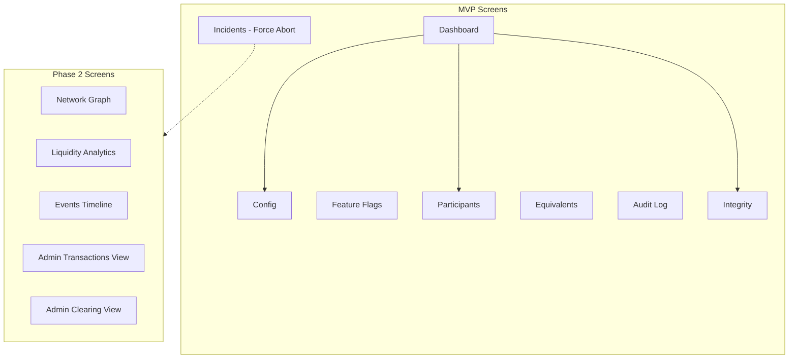
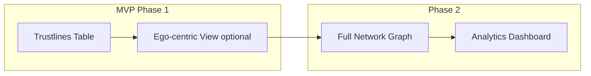

# Ревизия UI спецификаций v0.1 — Предложения по упрощению

**Версия:** 0.1  
**Дата:** 2026-01-10  
**Статус:** Proposal для обсуждения  

---

## Резюме изменений

Документ содержит обоснованные предложения по ревизии UI спецификаций проекта GEO на основе анализа соответствия текущему API (`api/openapi.yaml`).

### Ключевые выводы

| Компонент | Покрытие API | Статус | Действие |
|-----------|--------------|--------|----------|
| PWA Client | ~95% | Готов к реализации | Минорная доработка WebSocket |
| Admin Console | ~60% | Требует упрощения | Убрать overengineering |
| Admin UI Spec | ~60% | Требует синхронизации | Привести в соответствие с minimal |

### Принципы ревизии

- **MVP-first:** только функции, критичные для пилотного запуска
- **Реализуемость:** изменения соответствуют текущему API
- **Прагматизм:** polling вместо WebSocket, статические отчёты вместо realtime
- **Инкрементальность:** каждая фича отдельно deployable

---

## 1. PWA Client ([pwa-client-ui-spec.md](../../pwa/specs/pwa-client-ui-spec.md))

### 1.1. Общая оценка

**Статус: ✅ ГОТОВ К РЕАЛИЗАЦИИ**

Спецификация покрывает все необходимые endpoints:

| Функция | Endpoint | Статус |
|---------|----------|--------|
| Auth Challenge-Response | `POST /auth/challenge`, `POST /auth/login` | ✅ Есть |
| Token Refresh | `POST /auth/refresh` | ✅ Есть |
| Регистрация | `POST /participants` | ✅ Есть |
| Профиль текущего | `GET /participants/me`, `PATCH /participants/me` | ✅ Есть |
| Поиск участников | `GET /participants/search` | ✅ Есть |
| Баланс | `GET /balance` | ✅ Есть |
| Trustlines CRUD | `GET/POST/PATCH/DELETE /trustlines` | ✅ Есть |
| Payments | `GET/POST /payments`, `GET /payments/{tx_id}` | ✅ Есть |
| Capacity check | `GET /payments/capacity` | ✅ Есть |
| Max-flow diagnostic | `GET /payments/max-flow` | ✅ Есть |
| Эквиваленты | `GET /equivalents` | ✅ Есть |

### 1.2. Предлагаемые правки

#### ПРАВКА PWA-1: WebSocket — пометить как Phase 2

**Что:** Секция 7.7 `wss://{hub_base_url}/api/v1/ws` — WebSocket real-time

**Почему:**
- WebSocket endpoint **реализован в коде**, но **не описан в OpenAPI** (то есть не является каноническим контрактом API v0.1)
- Текущая реализация уведомлений — **best-effort** и не гарантирует доставку при нескольких воркерах/инстансах без общей шины (Redis pub/sub или аналог)
- Для MVP достаточно pull-to-refresh + background polling

**Предложение:**
- В UI считать WebSocket **опциональным**: приложение должно быть функционально полным на REST
- MVP: polling каждые 30–60 сек на Dashboard/Activity + pull-to-refresh
- Phase 2: зафиксировать контракт (добавить описание протокола/событий) и обеспечить production-grade доставку (shared event bus)

**Priority:** SHOULD  
**Влияние:** Минимальное — UX немного менее отзывчив, но функционально полный

#### ПРАВКА PWA-2: Balance History — удалить упоминание

**Что:** Возможная ссылка на `GET /balance/history` в документации

**Почему:**
- Endpoint отсутствует в OpenAPI
- В текущей спецификации 04-api-reference.md упоминается, но не реализован

**Предложение:**
- Убедиться, что PWA spec не ссылается на этот endpoint
- История баланса может быть получена через `GET /payments` с фильтрами

**Priority:** MAY  
**Влияние:** Нет — PWA spec уже использует `/payments` для Activity

---

## 2. Admin Console Minimal ([admin-console-minimal-spec.md](../specs/admin-console-minimal-spec.md))

### 2.1. Общая оценка

**Статус: ⚠️ ТРЕБУЕТ УПРОЩЕНИЯ**

Текущее покрытие API:

| Функция | Endpoint в spec | Статус в OpenAPI |
|---------|-----------------|------------------|
| Config read/write | `GET/PATCH /admin/config` | ✅ Есть |
| Feature flags | `GET/PATCH /admin/feature-flags` | ✅ Есть |
| Participants admin | `GET /admin/participants`, freeze/unfreeze/ban | ✅ Есть |
| Equivalents admin | `GET/POST/PATCH /admin/equivalents` | ✅ Есть |
| Audit log | `GET /admin/audit-log` | ✅ Есть |
| Migrations status | `GET /admin/migrations` | ✅ Есть |
| Health | `/health`, `/healthz`, `/health/db` | ✅ Есть |
| **Network Graph** | `GET /admin/analytics/graph` | ❌ Нет |
| **Analytics/Stats** | `GET /admin/analytics/stats` | ❌ Нет |
| **Admin Transactions** | `GET /admin/transactions` | ❌ Нет |
| **Admin Clearing** | `GET /admin/clearing` | ❌ Нет |
| **Events timeline** | `GET /admin/events` | ❌ Нет |
| **Force abort** | `POST /admin/transactions/{tx_id}/abort` | ❌ Нет |
| Integrity status | `/admin/integrity/status` | ⚠️ Есть как `/integrity/status` |
| Integrity check | `/admin/integrity/check` | ⚠️ Есть как `/integrity/verify` |

### 2.2. Предлагаемые правки

#### ПРАВКА ADMIN-1: Network Graph — перенести в Phase 2

**Что:** Секция 3.10 «Визуализация графа (Network Graph)»

**Почему:**
- Отсутствует `GET /admin/analytics/graph`
- Требует отдельного endpoint с агрегацией данных по trustlines
- D3.js/v-network-graph добавляет сложность фронтенда
- Для operations MVP достаточно списка trustlines с фильтрами

**Предложение:**
- Перенести в **Phase 2**
- MVP: использовать `GET /trustlines` (user API) или добавить `GET /admin/trustlines`
- Альтернатива для MVP: простая таблица trustlines с фильтром по эквиваленту

**Priority:** SHOULD  
**Влияние:**
- Удалить из §3.10 детали визуализации
- Добавить примечание о Phase 2

---

#### ПРАВКА ADMIN-2: Аналитика ликвидности — упростить или убрать

**Что:** Секция 3.13 «Аналитика ликвидности»

**Почему:**
- Отсутствует `GET /admin/analytics/stats`
- Требует data pipeline для агрегации (time series, топы)
- Overengineering для пилота с 50–100 участниками

**Предложение:**
- **Убрать из MVP** полностью
- Информация о ликвидности получается из:
  - `GET /balance` — баланс текущего участника
  - `GET /clearing/cycles` — наличие циклов
- Аналитика — отдельный feature в Phase 2/3

**Priority:** MUST  
**Влияние:**
- Удалить §3.13
- Убрать `GET /admin/analytics/stats` из §6

---

#### ПРАВКА ADMIN-3: Events timeline — убрать из MVP

**Что:** Упоминание `GET /admin/events` и Events экрана

**Почему:**
- Endpoint не реализован
- Event log доступен через:
  - `GET /admin/audit-log` — действия операторов
  - `GET /integrity/audit-log` — проверки целостности
- Для отладки транзакций достаточно `GET /payments/{tx_id}`

**Предложение:**
- Убрать **Events** экран из MVP
- Консолидировать с Audit Log
- При необходимости: добавить domain events в audit-log schema

**Priority:** SHOULD  
**Влияние:**
- Удалить из §3 упоминание Events
- Удалить `GET /admin/events` из §6

---

#### ПРАВКА ADMIN-4: Admin Transactions/Clearing — использовать обычные API

**Что:** Секции 3.6, 3.7 и endpoints `GET /admin/transactions`, `GET /admin/clearing`

**Почему:**
- Отсутствуют отдельные admin endpoints
- Уже есть:
  - `GET /payments` — список платежей
  - `GET /clearing/cycles` — циклы клиринга
  - `POST /clearing/auto` — автоклиринг

**Предложение:**
- Для MVP опереться на существующие user API (в первую очередь `GET /payments`, `GET /payments/{tx_id}`, `GET /clearing/cycles`, `POST /clearing/auto`).
- Учесть ограничение: `GET /payments` в текущем контракте отражает **только финальные статусы** (`COMMITTED`/`ABORTED`) и не закрывает кейс «зависшие/in-flight» транзакции.
- Если для ops критично видеть/фильтровать incident-кейсы: добавить минимальный admin endpoint (например, `GET /admin/payments`) либо отдельный «incidents» endpoint.

**Альтернатива (если нужен admin-only доступ):**
```
GET /admin/payments?initiator={pid}&state={COMMITTED|ABORTED}&from_date=&to_date=
```

**Priority:** SHOULD  
**Влияние:**
- §3.6, §3.7: уточнить API mapping на существующие endpoints

---

#### ПРАВКА ADMIN-5: Force Abort — критично, требует реализации

**Что:** `POST /admin/transactions/{tx_id}/abort` в §3.12 (Управление инцидентами)

**Почему:**
- Endpoint отсутствует в OpenAPI
- **Критично для operations**: зависшие транзакции блокируют лимиты
- Без этого оператор не может разрешить инциденты

**Предложение:**
- **ДОБАВИТЬ в OpenAPI** endpoint:
```yaml
/admin/transactions/{tx_id}/abort:
  post:
    summary: Force abort stuck transaction
    parameters:
      - X-Admin-Token (header)
      - tx_id (path)
    requestBody:
      schema:
        type: object
        required: [reason]
        properties:
          reason:
            type: string
    responses:
      200: Transaction aborted
      404: Transaction not found
      409: Transaction already finalized
```
- Добавить в audit-log событие `FORCE_ABORT`

**Priority:** MUST  
**Влияние:**
- Требуется backend работа
- Spec остаётся корректной — это backend gap, не spec overengineering

---

#### ПРАВКА ADMIN-6: Integrity — использовать существующие endpoints

**Что:** §3.11 «Панель целостности» + `/admin/integrity/*`

**Почему:**
- В OpenAPI уже есть публичные integrity endpoints:
  - `GET /integrity/status`
  - `POST /integrity/verify`
  - `GET /integrity/checksum/{equivalent}`
  - `GET /integrity/audit-log`

**Предложение:**
- Изменить API mapping с `/admin/integrity/*` на `/integrity/*`
- Эти endpoints уже защищены Bearer auth
- Для дополнительной защиты: добавить role check (admin/operator)

**Priority:** SHOULD  
**Влияние:**
- §6: обновить API mapping
- Не требует backend работы

---

#### ПРАВКА ADMIN-7: RBAC конструктор — подтвердить отсутствие

**Что:** §7 «Ограничения MVP» упоминает «нет сложного RBAC конструктора»

**Почему:**
- Правильное решение
- Фиксированные роли (admin/operator/auditor) достаточны для пилота

**Предложение:**
- Оставить как есть
- Убедиться, что UI spec не содержит UI для управления ролями

**Priority:** MAY  
**Влияние:** Нет изменений

---

### 2.3. Итоговая структура Admin Console MVP

После применения правок:



---

## 3. Admin UI Spec ([admin-ui-spec.md](../specs/admin-ui-spec.md))

### 3.1. Общая оценка

**Статус: ⚠️ ТРЕБУЕТ СИНХРОНИЗАЦИИ**

Документ содержит детальную UI спецификацию, но включает экраны/функции, отсутствующие в API.

### 3.2. Предлагаемые правки

#### ПРАВКА UI-1: Синхронизировать с Admin Console Minimal

**Что:** Привести в соответствие после применения ADMIN-1..7

**Почему:**
- UI spec должен быть derivate от minimal spec
- Избежать confusion при реализации

**Предложение:**
- После принятия правок ADMIN-1..7, обновить admin-ui-spec.md:
  - §3.2 Sidebar: убрать Network Graph, Events, Analytics из основного меню
  - §4.2 Network Graph: перенести полностью в Phase 2
  - §4.9 Events: убрать или пометить Phase 2
  - §4.11-4.13: пометить Phase 2
  - §6.5: обновить API mapping на `/integrity/*`

**Priority:** MUST  
**Влияние:** Согласованность документации

---

#### ПРАВКА UI-2: WebSocket real-time — убрать из MVP

**Что:** Любые упоминания WebSocket для real-time updates в Admin

**Почему:**
- Отсутствует в API
- Для операторского интерфейса polling каждые 30 сек достаточен
- Консоль не требует sub-second responsiveness

**Предложение:**
- Убрать WebSocket из требований админки
- Добавить auto-refresh с интервалом 30–60 сек на Dashboard

**Priority:** SHOULD  
**Влияние:** Упрощение реализации

---

## 4. Расхождения документации для исправления

### 4.1. `GET /balance/history`

**Где:** Ранее упоминалось в `docs/*/04-api-reference.md` и архитектурных заметках.

**Проблема:** Endpoint отсутствует в `api/openapi.yaml` и не реализован как часть MVP v0.1.

**Решение (для MVP):**
- Убрать упоминания `GET /balance/history` из справочной документации.
- Для истории/активности использовать `GET /payments` с фильтрами (`equivalent`, `from_date`, `to_date`, `direction`).

**Priority:** SHOULD

---

## 5. Сводная таблица правок

| ID | Документ | Правка | Priority | Тип |
|----|----------|--------|----------|-----|
| PWA-1 | [pwa-client-ui-spec.md](../../pwa/specs/pwa-client-ui-spec.md) | WebSocket → Phase 2 | SHOULD | Упростить |
| PWA-2 | [pwa-client-ui-spec.md](../../pwa/specs/pwa-client-ui-spec.md) | Balance History — не использовать (через `/payments`) | MAY | Уточнить |
| ADMIN-1 | [admin-console-minimal-spec.md](../specs/admin-console-minimal-spec.md) | Network Graph → Phase 2 | SHOULD | Упростить |
| ADMIN-2 | [admin-console-minimal-spec.md](../specs/admin-console-minimal-spec.md) | Аналитика ликвидности — убрать | MUST | Убрать |
| ADMIN-3 | [admin-console-minimal-spec.md](../specs/admin-console-minimal-spec.md) | Events timeline — убрать | SHOULD | Убрать |
| ADMIN-4 | [admin-console-minimal-spec.md](../specs/admin-console-minimal-spec.md) | Admin Transactions — использовать user API | SHOULD | Упростить |
| ADMIN-5 | [admin-console-minimal-spec.md](../specs/admin-console-minimal-spec.md) | Force Abort — добавить в API | MUST | Добавить в API |
| ADMIN-6 | [admin-console-minimal-spec.md](../specs/admin-console-minimal-spec.md) | Integrity — использовать `/integrity/*` | SHOULD | Исправить |
| ADMIN-7 | [admin-console-minimal-spec.md](../specs/admin-console-minimal-spec.md) | RBAC — подтвердить отсутствие | MAY | Нет изменений |
| UI-1 | [admin-ui-spec.md](../specs/admin-ui-spec.md) | Синхронизировать с minimal | MUST | Синхронизация |
| UI-2 | [admin-ui-spec.md](../specs/admin-ui-spec.md) | WebSocket — убрать | SHOULD | Упростить |
| DOC-1 | [04-api-reference.md](../../04-api-reference.md) | Balance History — убрать, использовать `/payments` | SHOULD | Исправить |

---

## 6. Рекомендации по приоритетам реализации

### Критические для запуска (MUST)

1. **Force Abort endpoint** (ADMIN-5) — без этого невозможно управлять инцидентами
2. **Синхронизация UI spec** (UI-1) — избежать confusion

### Важные оптимизации (SHOULD)

3. **Убрать аналитику** (ADMIN-2) — снизить scope backend
4. **Network Graph → Phase 2** (ADMIN-1) — снизить сложность фронтенда
5. **WebSocket → Phase 2** (PWA-1, UI-2) — упростить инфраструктуру

### По возможности (MAY)

6. Проверить отсутствие balance/history в PWA spec
7. Подтвердить отсутствие RBAC конструктора

---

## 8. UI-функционал без больших доработок бэкенда (состояние сети и аналитика)

Ниже — набор высокополезных UI-фич, которые можно сделать на текущих endpoints (или с минимальным добавлением одного простого endpoint для табличного обзора сети).

### 8.1. PWA (участник)

1) **Ego-view сети доверия (1-hop граф/таблица)**
- Данные: `GET /trustlines?direction=all` + по PID соседей `GET /participants/{pid}`.
- UI: граф вокруг текущего пользователя + подсветка trustlines с низкой доступностью.

2) **Диагностика маршрута “почему не проходит”**
- Данные: `GET /payments/capacity` (быстро) + `GET /payments/max-flow` (по кнопке).
- UI: подсветка bottlenecks/paths, объяснение “узкого места”.

3) **Лёгкая аналитика активности**
- Данные: `GET /payments` с фильтрами (`equivalent`, `direction`, `from_date`, `to_date`).
- UI: графики “кол-во/объём по дням”, “COMMITTED vs ABORTED”, топ-контрагенты.

### 8.2. Admin Console (оператор)

4) **Trustlines Table (состояние сети по системе) — MVP**
- Минимальный backend: добавить `GET /admin/trustlines` (пагинация + фильтры: equivalent, creditor, debtor, status).
- UI: таблица ребёр сети + подсветка “узких мест” (`available/limit < threshold`).

5) **Network Health (без отдельной аналитики на сервере)**
- Данные: `GET /health`, `GET /health/db`, `GET /admin/migrations`, `GET /admin/audit-log`.
- UI: сводка “Hub OK/DB OK/Миграции OK/последние admin actions”.

6) **Clearing opportunities (операционная подсказка)**
- Данные: `GET /clearing/cycles` (по эквиваленту) + `POST /clearing/auto`.
- UI: число циклов, распределение по длинам, CTA “Auto-clear”.

7) **Integrity dashboard (если используем в админке)**
- Данные: `GET /integrity/status`, `POST /integrity/verify`, `GET /integrity/audit-log`.
- UI: последняя проверка, ошибки, история запусков.


---

## 7. Следующие шаги

После утверждения этого proposal:

1. [ ] Создать issue для добавления `POST /admin/transactions/{tx_id}/abort` в API
2. [ ] Обновить [admin-console-minimal-spec.md](../specs/admin-console-minimal-spec.md) согласно правкам ADMIN-1..7
3. [ ] Обновить [admin-ui-spec.md](../specs/admin-ui-spec.md) согласно правке UI-1
4. [ ] Обновить [pwa-client-ui-spec.md](../../pwa/specs/pwa-client-ui-spec.md) — пометить WebSocket как Phase 2
5. [ ] Синхронизировать документацию: `GET /balance/history` не часть MVP (история через `/payments`)
6. [ ] Создать Phase 2 roadmap для отложенных функций

---

## Приложение A: API Endpoints Coverage Matrix

### PWA Client Endpoints

| Endpoint | OpenAPI | PWA Spec | Комментарий |
|----------|---------|----------|-------------|
| `POST /auth/challenge` | ✅ | ✅ | |
| `POST /auth/login` | ✅ | ✅ | |
| `POST /auth/refresh` | ✅ | ✅ | |
| `POST /participants` | ✅ | ✅ | Регистрация |
| `GET /participants/me` | ✅ | ✅ | |
| `PATCH /participants/me` | ✅ | ✅ | |
| `GET /participants/search` | ✅ | ✅ | |
| `GET /participants/{pid}` | ✅ | ✅ | |
| `GET /balance` | ✅ | ✅ | |
| `GET /balance/history` | ❌ | ❌ | Не часть MVP: история через `GET /payments` |
| `GET /trustlines` | ✅ | ✅ | |
| `POST /trustlines` | ✅ | ✅ | |
| `PATCH /trustlines/{id}` | ✅ | ✅ | |
| `DELETE /trustlines/{id}` | ✅ | ✅ | |
| `GET /payments` | ✅ | ✅ | |
| `POST /payments` | ✅ | ✅ | |
| `GET /payments/{tx_id}` | ✅ | ✅ | |
| `GET /payments/capacity` | ✅ | ✅ | |
| `GET /payments/max-flow` | ✅ | ✅ | |
| `GET /equivalents` | ✅ | ✅ | |
| `wss://*/ws` | ❌ | ✅ | Phase 2 |

### Admin Console Endpoints

| Endpoint | OpenAPI | Minimal Spec | Комментарий |
|----------|---------|--------------|-------------|
| `GET /admin/config` | ✅ | ✅ | |
| `PATCH /admin/config` | ✅ | ✅ | |
| `GET /admin/feature-flags` | ✅ | ✅ | |
| `PATCH /admin/feature-flags` | ✅ | ✅ | |
| `GET /admin/participants` | ✅ | ✅ | |
| `POST /admin/participants/{pid}/freeze` | ✅ | ✅ | |
| `POST /admin/participants/{pid}/unfreeze` | ✅ | ✅ | |
| `POST /admin/participants/{pid}/ban` | ✅ | ✅ | |
| `POST /admin/participants/{pid}/unban` | ✅ | ✅ | |
| `GET /admin/equivalents` | ✅ | ✅ | |
| `POST /admin/equivalents` | ✅ | ✅ | |
| `PATCH /admin/equivalents/{code}` | ✅ | ✅ | |
| `GET /admin/audit-log` | ✅ | ✅ | |
| `GET /admin/migrations` | ✅ | ❓ | Проверить наличие в minimal spec |
| `GET /admin/transactions` | ❌ | ✅ | Использовать user API |
| `GET /admin/transactions/{tx_id}` | ❌ | ✅ | Использовать user API |
| `GET /admin/clearing` | ❌ | ✅ | Использовать `/clearing/cycles` |
| `GET /admin/analytics/graph` | ❌ | ✅ | Phase 2 |
| `GET /admin/analytics/stats` | ❌ | ✅ | Убрать |
| `GET /admin/events` | ❌ | ✅ | Убрать |
| `POST /admin/transactions/{tx_id}/abort` | ❌ | ✅ | **ДОБАВИТЬ В API** |
| `GET /integrity/status` | ✅ | ✅* | *как /admin/integrity/status |
| `POST /integrity/verify` | ✅ | ✅* | *как /admin/integrity/check |
| `GET /health` | ✅ | ✅ | |
| `GET /healthz` | ✅ | ✅ | |
| `GET /health/db` | ✅ | ✅ | |

---

## Приложение B: Визуализация сети — уровни реализации

### B.1. Зачем нужна визуализация сети?

Визуализация trust network полезна для:
1. **Оценки здоровья сети** — выявление изолированных узлов, узких мест
2. **Операционного мониторинга** — понимание топологии перед incidents
3. **Onboarding новых участников** — визуальное объяснение как работает доверие
4. **Debug маршрутизации** — почему платёж не прошёл

### B.2. Текущие возможности API для визуализации

На данный момент в API доступно:

| Endpoint | Данные | Применение для графа |
|----------|--------|---------------------|
| `GET /participants` | Список участников с фильтрами | Nodes |
| `GET /admin/participants` | Все участники | All nodes |
| `GET /trustlines` | Trustlines текущего участника | User-centric edges |
| `GET /payments/max-flow` | Bottleneck analysis | Edge capacity insight |

**Отсутствует:**
- `GET /admin/trustlines` — все trustlines системы (нужен для full graph)
- `GET /admin/analytics/graph` — агрегированные данные для визуализации

### B.3. Уровни реализации визуализации (от простого к сложному)

#### Уровень 1: MVP — Таблица trustlines (без визуализации)

**Что реализуем:**
- Экран со списком trustlines с фильтрами
- Колонки: creditor, debtor, equivalent, limit, balance, status
- Фильтры: по эквиваленту, по участнику, по статусу

**API для реализации:**
```
# Вариант A: Использовать существующий user API от имени админа
GET /trustlines?equivalent={code}&status=active

# Вариант B: Добавить admin endpoint (лучше)
GET /admin/trustlines?equivalent={code}&creditor={pid}&debtor={pid}&status={active}
```

**Требуется для backend:**
- Добавить `GET /admin/trustlines` с расширенными фильтрами

**Преимущества:**
- Просто реализовать
- Все данные уже есть
- Достаточно для операционного мониторинга

---

#### Уровень 2: Минимальный граф — Ego-centric view

**Что реализуем:**
- Визуализация сети вокруг одного выбранного участника
- Показать: узел + его прямые соседи (1 hop)
- Опционально: 2 hops (соседи соседей)

**API для реализации:**
```
# Получить trustlines участника
GET /trustlines?direction=all

# Для каждого соседа: получить его trustlines (2nd hop)
GET /participants/{neighbor_pid}
GET /trustlines?creditor={neighbor_pid}
```

**Реализация на UI (клиент-side aggregation):**
```javascript
// Псевдокод построения ego graph
const egoGraph = {
  nodes: [currentUser],
  edges: []
};
const trustlines = await fetch('/trustlines');
for (const tl of trustlines) {
  egoGraph.nodes.push(tl.counterparty);
  egoGraph.edges.push({
    source: tl.creditor,
    target: tl.debtor,
    limit: tl.limit,
    balance: tl.balance
  });
}
```

**Требуется:**
- Client-side graph library (D3.js или v-network-graph)
- N+1 запросов для 2-hop view (приемлемо для MVP)

**Преимущества:**
- Не требует нового backend endpoint
- Достаточно для понимания локальной топологии
- Работает в PWA client тоже

---

#### Уровень 3: Full Network Graph — требует backend endpoint

**Что реализуем:**
- Полная визуализация всей сети по эквиваленту
- Показать: все участники + все trustlines
- Подсветка: bottlenecks, изолированные узлы

**API для реализации:**
```yaml
GET /admin/analytics/graph:
  parameters:
    - equivalent: string (required)
    - include_inactive: boolean (default: false)
  responses:
    200:
      schema:
        type: object
        properties:
          nodes:
            type: array
            items:
              type: object
              properties:
                pid: string
                name: string
                type: enum[person, business, hub]
                status: enum[active, frozen, banned]
          edges:
            type: array
            items:
              type: object
              properties:
                id: string
                creditor: string
                debtor: string
                limit: string
                balance: string
                available_capacity: string
                status: enum[active, frozen]
          stats:
            type: object
            properties:
              total_nodes: integer
              total_edges: integer
              isolated_nodes: integer
              avg_connections: number
```

**Требуется для backend:**
- Новый endpoint `GET /admin/analytics/graph`
- SQL query для агрегации (может быть тяжёлым для больших сетей)
- Возможно, материализованный view для производительности

**Когда нужно:**
- Сеть больше 50 участников
- Нужен обзор всей топологии
- Операционные задачи требуют видеть full picture

---

### B.4. Рекомендация для MVP



**Для MVP рекомендуется:**

1. **Таблица trustlines** (Уровень 1) — обязательно
   - Добавить `GET /admin/trustlines` endpoint
   - Фильтры: equivalent, creditor, debtor, status
   - Достаточно для пилота с 20-50 участниками

2. **Ego-centric view** (Уровень 2) — опционально
   - Если есть время, добавить простую визуализацию
   - Использовать v-network-graph (Vue) или D3.js
   - Client-side aggregation, не требует backend

**Для Phase 2:**

3. **Full Network Graph** (Уровень 3) — после MVP
   - Когда сеть вырастет до 100+ участников
   - Требует `GET /admin/analytics/graph` endpoint
   - Оптимизация запросов через материализованные views

### B.5. Минимальные требования к backend для визуализации

```yaml
# Добавить в OpenAPI для MVP
/admin/trustlines:
  get:
    summary: List all trustlines in the system
    parameters:
      - X-Admin-Token (header, required)
      - equivalent (query, optional)
      - creditor (query, optional)
      - debtor (query, optional)
      - status (query, optional, enum: active/frozen/closed)
      - page (query, default: 1)
      - per_page (query, default: 50, max: 200)
    responses:
      200:
        schema:
          type: object
          properties:
            items:
              type: array
              items:
                $ref: '#/components/schemas/TrustLine'
            pagination:
              $ref: '#/components/schemas/PaginationInfo'
```

### B.6. Итоговая таблица визуализации

| Уровень | Функция | Backend требования | UI сложность | Рекомендация |
|---------|---------|-------------------|--------------|--------------|
| 1 | Trustlines Table | `GET /admin/trustlines` | Low | **MVP** |
| 2 | Ego-centric Graph | Нет | Medium | MVP optional |
| 3 | Full Network Graph | `GET /admin/analytics/graph` | High | Phase 2 |
| 4 | Animated Flow | WebSocket | Very High | Phase 3+ |
