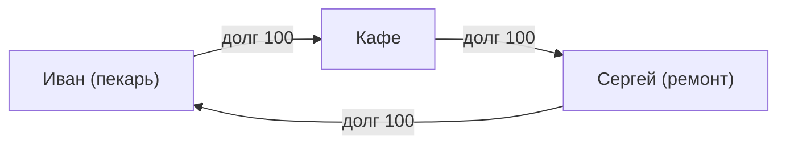

# Проект GEO — 10. Целевое сообщество и маркетинговая стратегия

> **Цель:** Определить ключевые сегменты для запуска и маркетинговую стратегию привлечения пользователей.
> **Задачи:**
> - Определить целевые сегменты для эксперимента.
> - Разработать маркетинговую стратегию для привлечения пользователей.

## Наилучшие стартовые условия для сообщества

### Ключевой принцип привлекательности системы

> **«Привабливість системи залежить в першу чергу від можливості стикувати незадоволений попит з резервними ресурсами»**
> 
> Резервними вважаються ті ресурси, які нині не використовуються, але в будь-який час можуть бути залучені в господарський обіг.

Привлекательность обеспечивается **диверсификацией** — когда спрос имеет максимальные шансы встретиться с предложением. Это зависит от количества участников и разнообразия их деятельности.

### Целевые сегменты для эксперимента

**Приоритет #1: Мелкие и средние производители**

> ⚠️ **Критическая ошибка** (из маркетинговых материалов): подключать только потребителей и крупные магазины — это ошибочный подход:
> - У потребителей нет возможности **ЗАРАБОТАТЬ** GEO
> - У крупных магазинов нет возможности **ПОТРАТИТЬ** GEO
> - Появляется потребность в обменниках → увеличивается стоимость транзакции → нивелируется эффект локальной валюты

**Правильный фокус:**
1. **Мелкие и средние производители** — они могут и заработать, и потратить внутри системы
2. **Локальные сообщества** — кооперативы, громады, объединения жителей
3. **Профессиональные сети** — фрилансеры, ремесленники, специалисты
4. **Участники тайм-банков, LETS-систем** — уже понимают механику

### Оптимальный масштаб: критическая масса

**Цель:** Нарастить критическую массу пользователей до момента, когда информация о GEO будет распространяться через "сарафанное радио" без маркетинговых затрат.

> **«Коли не бути в Системі буде вже соромно»** — это индикатор достижения критической массы

**Масштаб MVP:** 10–500 участников в одном сообществе

### Структурные условия (идеальные)

| Параметр | Оптимальное значение | Почему важно |
|----------|---------------------|--------------|
| Размер | 30-100 участников | Достаточно для циклов 3-6 узлов, управляемо |
| Связность | Уже существующие экономические связи | Участники уже торгуют между собой |
| География | Локальная компактность | Снижает издержки, укрепляет доверие |
| Разнообразие | Разные товары/услуги | Обеспечивает циклы для клиринга |
| Инфраструктура | Есть «якорные» узлы | Склад, магазин, производство |
| **Территория** | **Ограниченная** | Максимальная концентрация пользователей |

### Социальные условия (обязательные)

- **Высокий начальный уровень взаимного доверия** — участники знают друг друга лично
- **Опыт коллективных решений** — кооперативы, общины, профессиональные ассоциации
- **2-3 активных лидера** — готовых стать "хабами" и инфраструктурными узлами
- **Культура взаимопомощи** — понимание что "минус = обещание будущего труда"

### Экономические условия (триггеры)

- **Проблемы с ликвидностью** — есть мотивация искать альтернативу банковскому кредиту
- **Регулярные взаимные транзакции** — не разовые, а повторяющиеся обмены
- **"Эффект дырявого ведра"** — деньги быстро утекают из сообщества
- **Резервные ресурсы** — есть неиспользуемые мощности, которые можно задействовать

### Юридическая форма (рекомендуемая)

**Споживчий кооператив** — предусмотрен украинским законодательством:
> «Споживчий кооператив — це підприємство, що належить споживачам і демократично управляється ними. Кооперативи створюються для задоволення потреб і сподівань своїх членів. Вони діють в рамках ринкової системи, незалежно від держави, як форма взаємної допомоги, орієнтованої на надання якісних послуг, а не отримання прибутку.»

---

---

## Эффективные маркетинговые стратегии запуска с нуля

### Способы привлечения новых пользователей (из маркетинговых материалов)

1. **Уникальный продукт по уникальной цене**
   > Запропонувати унікальний продукт або послугу, в якому буде зацікавленість широкого загалу користувачів ЗА УНІКАЛЬНОЮ ціною. 
   > 
   > **Мета — гра на цікавості:** потенційні користувачі повинні почати задавати питання: "ЯК отримати таку послугу за такою ціною?" та "Що є ГЕО?"

2. **Технические средства взаиморасчётов**
   - Дополнительно к смартфону: платёжная карта, смарт-карта, NFC-девайс, платёжный терминал
   - Должно быть понятно для широкого круга людей

3. **Сеть агентов-консультантов**
   > Приклад — ПриватБанк, де такий підхід блискуче спрацював: тепер майже всі перейшли на роботу з терміналами, а каси (і черги біля них) майже зникли.

---

### Стратегия 1: «Якорный хаб + острая боль» (наиболее реалистичная)

**Суть:** Согласно архитектуре B (community-hub), сначала подключаем 1-2 ключевых участника, через которых проходит много транзакций.

**Идеальные "якоря":**
- Складское хозяйство кооператива
- Оптовый поставщик с отсрочками платежей
- Крупный производитель с сетью мелких покупателей

**Шаги:**
1. Определить "точку боли" — длинные отсрочки платежей, кассовые разрывы
2. Предложить якорному участнику стать хабом: лояльность поставщиков взамен на trustlines
3. Новички подключаются через линии доверия к хабу — минимальный порог входа
4. Постепенно участники открывают линии между собой, сеть органически растёт

**Конфигурация (из документа "Архитектура"):**
```
Кооператив (центральный узел)
         ↕
    [Участники]
```

**Посыл:** *"Получайте товар сегодня — платите когда сможете, без банков и процентов"*

---

### Стратегия 2: «Платіжна картка громади» (реальный кейс Піщанської громади)

**Суть:** Объединить населённые пункты в единое экономическое пространство через платёжную карту громады.

**Реальный пример из маркетинговых материалов:**

> *«Кожен мешканець громади може отримати платіжну картку Піщанської громади, за допомоги якої можна буде купити та продати товари місцевого виробництва.*
> 
> *Щоб замовити свіжий хліб з місцевої пекарні, м'ясо або молоко з магазину, трактор для обробки своєї ділянки, більше не треба чекати зарплати або пенсії. Вам взагалі не потрібні гривні.*
> 
> *Щоб заробити локальну умовну одиницю потрібно відповідно продати свій товар або послугу спільноті, наприклад — здати врожай зі свого городу заготівельній конторі.»*

**Ожидаемые результаты:**
- Зростає попит на продукцію місцевого виробництва
- Зменшуються накладні розходи
- Зменшується роздрібна ціна
- Збільшується кількість робочих місць
- Покращується якість товарів та послуг, а також їх асортимент
- Покращуються стосунки всередині громади та рівень кооперації

**Статистика:** В мире уже более 500 локальных платёжных систем. Экономический эффект — **рост локальной экономики до 1500% за 2-3 года**.

**Посыл:** *"Села громади об'єднуються в єдиний економічний простір"*

---

### Стратегия 3: «Пилотная группа + быстрая победа» (для скептиков)

**Суть:** Согласно документу "Проект GEO — 1", начать с малой группы 5-10 человек, визуализировать первый клиринг как "вау-эффект".

**Шаги:**
1. Отобрать 5-10 участников с **уже существующими** взаимными обязательствами
2. Провести 2-3 часовой воркшоп:
   - Объяснить: "линия доверия = ваш личный риск"
   - Открыть небольшие лимиты (50-100 у.е.)
3. В первую неделю провести 5-10 реальных транзакций
4. **Показать первый клиринг визуально** — как долги "схлопнулись" без денег (это главный момент!)
5. Документировать и рассказывать историю успеха остальным

**Пример из документации (цикл A→B→C→A):**

После клиринга: **все долги = 0**, товары уже получены.

**Посыл:** *"Посмотрите — это работает! Иван отдал хлеб кафе, кафе заплатило Сергею за ремонт, Сергей привёз Ивану дрова — и никто никому не должен"*

---

### Стратегия 4: «Кризисный момент + готовое решение» (высокая конверсия)

**Суть:** Использовать экономический кризис или сезонный кассовый разрыв как триггер.

**Идеальные моменты:**

- Посевная (нужны семена, но денег нет до урожая)
- Межсезонье в туристических регионах
- Кризис поставок/ликвидности

**Шаги:**
1. Определить момент острой нехватки ликвидности
2. Предложить GEO как "временную меру" для внутренних расчётов
3. Сформировать минимальные правила:
   - Лимиты по умолчанию (не более месячного оборота)
   - Обязательный срок возврата в нейтральный баланс
4. После успешного прохождения кризиса — закрепить систему как постоянную

**Из документа "Статья2":**
> *"В 1934 году, в разгар Великой депрессии, когда обычных денег не было физически, швейцарские предприниматели договорились: «Давайте мы будем кредитовать друг друга сами». Они создали единицу WIR, равную франку... Прошло почти сто лет, а система WIR всё ещё работает."*

**Посыл:** *"Нет денег сейчас? Не проблема — работаем в кредит друг другу, рассчитаемся товаром после урожая"*

---

### Стратегия 5: «Репутация как капитал» (философский подход)

**Суть:** Позиционирование GEO не как платёжной системы, а как системы, где главный капитал — репутация и социальный уровень.

**Из интервью Демьянюка:**
> *«Мы предлагаем систему, где каждый индивид, бизнес или платёжный агент имеет возможность создать своё персональное средство платежа.*
> 
> *Таким образом, любая активность людей-участников этой среды стимулирует их к более эффективному взаимодействию. Другими словами, не количество денег, которое вы имеете, а ваша репутация и социальный уровень — КТО вы есть и насколько люди находят вас заслуживающим доверия — становятся вашим главным капиталом.*
> 
> *Следовательно, это развивает уровень вашей мотивации и способ, которым вы делаете свою работу: вы получаете выгоду от честности, и доверять людям, вероятно, будет прибыльно, так же как и быть тем, кому доверяют.»*

**Ключевые аргументы:**
1. Доступ к средству платежа не должен быть привилегией ограниченной группы
2. Деньги не должны восприниматься как нечто эксклюзивное и недостижимое
3. Честность и доверие становятся экономически выгодными

**Посыл:** *"Ваша репутація — ваш головний капітал. Бути чесним — вигідно."*

---

## Критические факторы успеха

### Чего НЕ делать (критические ошибки)

1. **Не подключать ТОЛЬКО потребителей** — у них нет возможности заработать GEO
2. **Не подключать ТОЛЬКО крупные магазины** — у них нет возможности потратить GEO
3. **Не создавать обменники** — это увеличивает стоимость транзакции и нивелирует эффект

> **«Локальна валюта повинна залишатися у власній екосистемі, без конвертації через інші платіжні одиниці при здійсненні транзакцій»**

### Обязательные элементы:

1. **Простой UI/UX** — участники должны понимать свой баланс, кому доверяют и на сколько
2. **Обучение** — минимум 1 воркшоп с объяснением "линия доверия = ваш личный риск"
3. **Визуализация клиринга** — показывать схлопывание циклов, это главный "вау-эффект"
4. **Социальное давление** — регулярные встречи/отчёты о состоянии сети

### Минимальный набор правил для кооператива (из документации):

**Технически:**
- Бэкапы у всех участников (seed-фраза в 2 местах)
- Дублирование для ключевых узлов (склад, касса)

**Организационно:**
- Social recovery (2-3 доверенных лица)
- Регламент "исчезновения" (6 мес — заморозка, 12 мес — списание долга)
- Внутренний арбитраж (3-5 человек)

**Экономически:**
- Стартовые лимиты для новичков: 50-100 у.е.
- Не более 20% доверия одному контрагенту
- Особый статус инфраструктурных узлов (прозрачность, возможно залог)

**Культурно:**
- Понимание что долг — это обещание труда/товара, а не "виртуальные деньги"
- Мягкие пределы личного "минуса" (не более 1-2 месячных вкладов)
