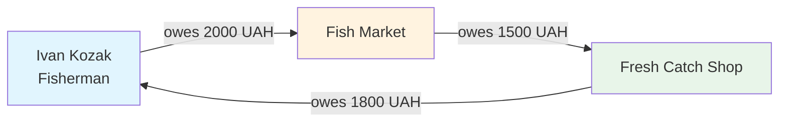
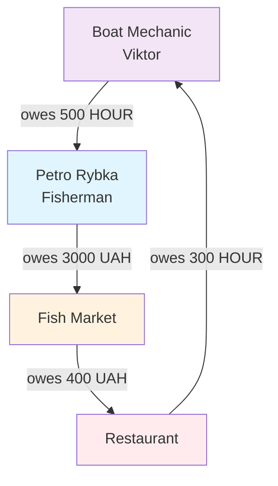
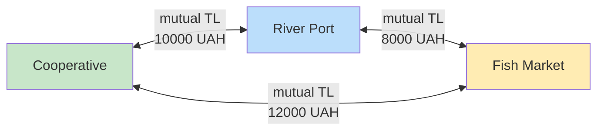

# Seed: Riverside Town Community (50 participants)

**Goal**: Компактное приречное сообщество с рыболовецким уклоном для тестирования и демонстрации работы trustlines. Меньший размер (50 участников вместо 100) упрощает отладку и визуализацию циклов клиринга.

## Meta

| Property | Value |
|----------|-------|
| Participants | 50 |
| Equivalents | UAH, HOUR, EUR |
| Primary Economy | Fishing & River Services |
| Hub Density | 5 anchors (10%) |
| Expected Cycles | 3–5 nodes typical |

## Core Idea

Приречный городок, экономика которого построена вокруг **рыболовства**: рыбаки поставляют улов на коптильню/рынок, рынок продаёт домохозяйствам, услуги по ремонту лодок и сетей предоставляются в часах (HOUR). Сильные хабы — **Кооператив**, **Рыбный рынок**, **Порт** — обеспечивают взаимную ликвидность.

---

## Economic Logic (ОБЯЗАТЕЛЬНАЯ СЕКЦИЯ)

### TrustLine Direction Rule

**Ключевое правило**: `from → to` означает, что **from (кредитор)** разрешает **to (должнику)** быть должным до указанного лимита.

```
┌─────────────┐                    ┌─────────────┐
│   FROM      │  ───TrustLine───►  │     TO      │
│  (Creditor) │     limit: 5000    │  (Debtor)   │
│             │                    │             │
│  "Я доверяю │                    │  "Мне       │
│   тебе до   │                    │   разрешено │
│   5000 UAH" │                    │   задолжать │
│             │                    │   до 5000"  │
└─────────────┘                    └─────────────┘
```

**Память**: Кредитор → Должник (Creditor → Debtor)

### Direction by Economic Role

| Сценарий | Направление TL | Пример (Riverside Town) | Логика |
|----------|----------------|-------------------------|--------|
| Поставщик → Покупатель | `supplier → buyer` | Fisherman → Fish Market | Рыбак отдаёт улов, рынок платит потом |
| Производитель → Переработчик | `producer → processor` | Fisherman → Smoking House | Оптовая поставка с отсрочкой |
| Магазин → Покупатель | `shop → customer` | Fish Shop → Household | Розница "запиши на мой счёт" |
| Услуга → Клиент | `service → client` | Boat Mechanic → Fisherman | Ремонт сейчас, оплата потом |
| Взаимная ликвидность | `hub ↔ hub` | Co-op ↔ Port ↔ Market | Двусторонние TL между хабами |
| Социальный кредит / взаимопомощь | `person → person` | Household → Fisherman (fish-share), Household → Household (neighbor) | Небольшие лимиты: предоплата/поддержка, "занял до зарплаты", взаимные услуги |

### Role-Based TrustLine Patterns

Для каждой роли определены типичные **исходящие** (где роль — кредитор) и **входящие** (где роль — должник) trustlines:

| Роль | Исходящие TL (→) | Входящие TL (←) | Equiv |
|------|------------------|-----------------|-------|
| **Fisherman** | Market, Smoking, Co-op, Households (direct sale) | Boat Mechanic, Net Repair, Marina, (some) Households (fish-share) | UAH, HOUR |
| **Fish Market** | Households (35), Restaurant, Café | Fishermen, Smoking House | UAH |
| **Smoking House** | Market, Co-op, Shop | Fishermen | UAH |
| **Co-operative** | Port, Market, Warehouse, members | Port, Market, members | UAH, EUR |
| **Boat Mechanic** | Fishermen, Marina | Co-op | HOUR |
| **Household** | Households (neighbors), Fishermen (fish-share), Community Center (volunteer HOUR) | Shop, Market, Pharmacy, Services | UAH, HOUR |
| **Launch Agent** | Households, Services | Co-op | HOUR |

#### Why “branched” person trustlines are realistic here

Чтобы граф жителей не выглядел искусственной «цепочкой», вводим **две естественные причины**, по которым у `person` появляются разветвлённые TL:

1) **Прямые связи поставок и услуг**: рыбаки/ремесленники и сервис-провайдеры работают с несколькими клиентами (и наоборот).

2) **Социальный слой доверия (малые лимиты)**:
   - **Neighbor microcredit**: домохозяйства иногда кредитуют друг друга на небольшие суммы (UAH) и/или часами (HOUR).
   - **Fish-share / предоплата**: часть домохозяйств делает предоплату рыбакам за будущие поставки (домохозяйство → рыбак), что естественно добавляет обратные связи и циклы.

Важно: это **не делает домохозяйства "богатыми кредиторами"** — лимиты малы, а основная нагрузка всё ещё на retail/hubs.

### Degree Expectations by Group

| Group | Count | UAH out (avg) | UAH in (avg) | HOUR out | HOUR in |
|-------|------:|-------------:|-------------:|---------:|--------:|
| Anchors | 5 | 8 | 6 | 1 | 1 |
| Producers/Fishing | 10 | 4.5 | 2.5 | 0.3 | 2 |
| Retail/Food | 8 | 12 | 4 | 0 | 0 |
| Services | 10 | 2 | 1 | 3 | 1 |
| Households | 15 | 1.5 | 3.5 | 0.8 | 1.2 |
| Agents | 2 | 1 | 0 | 1 | 1 |

---

## Clearing Cycles Examples

Клиринг работает за счёт **замкнутых циклов долгов**, которые можно взаимно погасить.

### Cycle 1: Basic Fish Supply Chain (3 nodes)



**Расшифровка**:
- Ivan продал рыбу на рынок, рынок должен ему 2000 UAH
- Рынок поставил рыбу в магазин, магазин должен рынку 1500 UAH  
- Магазин продал рыбу Ivan'у (он тоже покупатель!), Ivan должен магазину 1800 UAH

**Clearing**: min(2000, 1500, 1800) = **1500 UAH** взаимно погашается!

### Cycle 2: Service + Supply (4 nodes)



**Особенность**: Цикл включает два эквивалента (UAH + HOUR). Клиринг возможен только при наличии **обменного курса** между UAH и HOUR в системе.

### Cycle 3: Hub Liquidity Triangle (3 hubs)



**Двусторонние trustlines**: Хабы имеют взаимные TL друг к другу, что создаёт устойчивый треугольник ликвидности. Любой дисбаланс в одном направлении может быть скомпенсирован через третью сторону.

---

## Constraints (MVP)

### Equivalents

| Code | Name | Description | Typical Use |
|------|------|-------------|-------------|
| `UAH` | Ukrainian Hryvnia | Основной эквивалент товаров | Рыба, продукты, товары |
| `HOUR` | Community Hour | Трудочас для услуг | Ремонт, помощь, консультации |
| `EUR` | Euro | Внешние операции | IT-услуги, импорт |

### Participant Types

- `business` — юридические лица, предприятия (anchors, retail)
- `person` — физические лица (producers, services, households, agents)

### Network Constraints

- Cycles of **3–5 nodes** are most common
- Maximum clearing depth: **6 hops**
- Hub-to-hub TL limits: **5000–15000 UAH**
- Retail-to-household TL limits: **500–2000 UAH**
- Service-to-client HOUR limits: **10–50 HOUR**

---

## Role Audit Table

### Group-Level Degree Summary (min / avg / max)

| Group | Count | UAH out | UAH in | HOUR out | HOUR in | EUR out | EUR in |
|-------|------:|--------:|-------:|---------:|--------:|--------:|-------:|
| anchors | 5 | 4 / 8.2 / 15 | 3 / 6.4 / 12 | 0 / 1 / 3 | 0 / 1 / 3 | 0 / 0.4 / 2 | 0 / 0.4 / 2 |
| producers | 10 | 2 / 3.2 / 5 | 0 / 1.8 / 4 | 0 / 0 / 0 | 1 / 2 / 3 | 0 / 0 / 0 | 0 / 0 / 0 |
| retail | 8 | 5 / 11.5 / 20 | 2 / 4.2 / 8 | 0 / 0 / 0 | 0 / 0 / 0 | 0 / 0 / 0 | 0 / 0 / 0 |
| services | 10 | 1 / 1.8 / 3 | 0 / 1.2 / 2 | 2 / 2.8 / 4 | 0 / 0.5 / 2 | 0 / 0.1 / 1 | 0 / 0.1 / 1 |
| households | 15 | 0 / 0.4 / 2 | 2 / 3.2 / 5 | 0 / 0.3 / 1 | 1 / 1 / 1 | 0 / 0 / 0 | 0 / 0 / 0 |
| agents | 2 | 1 / 1 / 1 | 0 / 0 / 0 | 1 / 1 / 1 | 1 / 1 / 1 | 0 / 0 / 0 | 0 / 0 / 0 |

### Key Nodes Snapshot

| # | Participant | Group | Type | UAH out | UAH in | HOUR out | HOUR in |
|--:|-------------|-------|------|--------:|-------:|---------:|--------:|
| 1 | Riverside Fishing Co-operative | anchors | business | 15 | 12 | 3 | 3 |
| 2 | Fish Market & Cold Storage | anchors | business | 12 | 10 | 0 | 0 |
| 3 | River Port Warehouses | anchors | business | 8 | 6 | 0 | 0 |
| 16 | Fresh Catch Fish Shop | retail | business | 20 | 8 | 0 | 0 |
| 17 | River View Restaurant | retail | business | 8 | 5 | 0 | 0 |
| 6 | Ivan Kozak (Fisherman) | producers | person | 4 | 3 | 0 | 2 |
| 24 | Viktor Veslo (Boat Mechanic) | services | person | 2 | 1 | 4 | 1 |

---

## Participants (50)

### 1) Anchors & Infrastructure (5, business)

Central hubs providing liquidity and coordination.

| # | Name | Role | TL Pattern |
|--:|------|------|------------|
| 1 | Riverside Fishing Co-operative | Main hub, member coordination | ↔ Port, Market, Members |
| 2 | Fish Market & Cold Storage | Wholesale/retail fish hub | ← Fishermen; → Retail, Households |
| 3 | River Port Warehouses | Logistics, storage | ↔ Co-op, Transport |
| 4 | Town Community Center | Social services, events | → Households (HOUR) |
| 5 | Marina & Boat Services | Docking, fuel, supplies | → Fishermen; ← Co-op |

### 2) Producers & Fishing (10, person)

Supply chain starts here. **They extend credit** to buyers (market, processor).

| # | Name | Specialization | Outgoing TL (creditor to) | Incoming TL (debtor to) |
|--:|------|----------------|---------------------------|-------------------------|
| 6 | Ivan Kozak | Fisherman (Pike/Carp) | Market, Smoking, Restaurant | Mechanic, Net Repair |
| 7 | Petro Rybka | Fisherman (Catfish) | Market, Smoking | Mechanic, Marina |
| 8 | Nadia Morska | Fish Drying/Smoking | Market, Shop, Co-op | Fishermen (6,7,9) |
| 9 | Vasyl Stavok | Fish Farming (Ponds) | Market, Restaurant | Feed Supplier (external) |
| 10 | Olha Vodiana | Water Plants/Reeds | Craft Shop, Co-op | — |
| 11 | Mykola Liman | Boat Building | Fishermen, Marina | Port (materials) |
| 12 | Hanna Berehova | Fishing Nets & Repair | Co-op Store, Fishermen | Yarn Supplier |
| 13 | Serhii Richkovyi | River Guide/Tours | Tourism, Restaurant | Co-op |
| 14 | Liudmyla Ozerna | Freshwater Mussels | Restaurant, Market | — |
| 15 | Andriy Dnipro | Transport Boats | Port, Co-op, Logistics | Fuel (Marina) |

### 3) Retail & Food (8, business)

**Extend credit to households** (many outgoing TL), receive from suppliers.

| # | Name | Role | Outgoing TL (→ households) | Incoming TL (← suppliers) |
|--:|------|------|----------------------------|---------------------------|
| 16 | Fresh Catch Fish Shop | Main fish retail | 15 households | Market, Smoking |
| 17 | River View Restaurant | Fish restaurant | 5 households (tabs) | Fishermen, Farming, Market |
| 18 | Marina Café | Fishermen's café | 8 households | Co-op, Smoking |
| 19 | Town Grocery | General groceries | 12 households | Warehouse, Co-op |
| 20 | Fisherman's Supply Store | Gear, bait, tackle | Fishermen (10) | Port, Co-op |
| 21 | Riverside Pharmacy | Medicine, health | 10 households | External supplier |
| 22 | Weekend Fish Market Stall | Seasonal retail | 5 households | Fishermen direct |
| 23 | Cooperative Fish Counter | Co-op retail point | 8 households | Co-op, Market |

### 4) Services (10, person)

**HOUR-based economy**. Services extend credit to clients (work now, pay later).

| # | Name | Specialization | Outgoing TL (HOUR) | Incoming TL |
|--:|------|----------------|--------------------|-------------|
| 24 | Viktor Veslo | Boat Mechanic | Fishermen (6,7,9,11) | Co-op |
| 25 | Natalia Seti | Net Repair | Fishermen, Co-op Store | — |
| 26 | Roman Motornyi | Engine Service | Fishermen, Transport | Marina |
| 27 | Olena Kuhnia | Fish Chef/Catering | Households (events) | Restaurant |
| 28 | Dmytro Kholodny | Ice Supply | Market, Fishing boats | Port |
| 29 | Yana Rakhivna | Accountant | Co-op, Businesses | — |
| 30 | Ihor Pravo | Legal/Permits | Fishermen, Businesses | — |
| 31 | Svitlana Medyk | Nurse | Households (15) | Community Center |
| 32 | Maksym Electro | Electrician | Marina, Households | — |
| 33 | Anna Turystka | Guide/Tourism | Tourists, Restaurant | Co-op (EUR) |

### 5) Households (15, person)

**Primarily debtors** in the system. Receive TL from retail/services, limited outgoing.

| # | Name | Notes |
|--:|------|-------|
| 34 | The Rybchenko Family | Fisherman household, 3 members |
| 35 | The Moriak Family | Port worker household |
| 36 | The Berehovy Family | River-side living |
| 37 | The Stavkovi Family | Fish farm workers |
| 38 | The Vodiani Family | Reed gatherers |
| 39 | The Richkovi Family | Guide family |
| 40 | The Ozerni Family | Mussel collectors |
| 41 | The Limany Family | Boat builders |
| 42 | The Dnipro Family | Transport workers |
| 43 | The Prystan Family | Marina workers |
| 44 | The Zatoka Family | Bay dwellers |
| 45 | The Plyazh Family | Beach area |
| 46 | The Khvylia Family | Wave-side |
| 47 | The Pryliv Family | Tide workers |
| 48 | The Ruslo Family | Channel dwellers |

### 6) Launch Agents (2, person)

Community organizers who help establish trustlines.

| # | Name | Role | Pattern |
|--:|------|------|---------|
| 49 | Marina Koordinator | Community Coordinator | → Households (HOUR onboarding) |
| 50 | Bohdan Dovira | Trustline Officer | → Services (HOUR), ← Co-op |

---

## Graph Structure

### Visual Description

```
                    ┌─────────────────────────────────────┐
                    │         ANCHOR HUB CLUSTER          │
                    │                                     │
                    │   ┌──────┐    ┌──────┐    ┌──────┐ │
                    │   │Co-op │◄──►│Market│◄──►│ Port │ │
                    │   └───┬──┘    └───┬──┘    └───┬──┘ │
                    │       │          │           │     │
                    └───────┼──────────┼───────────┼─────┘
                            │          │           │
            ┌───────────────┼──────────┼───────────┼─────────────┐
            │               ▼          ▼           ▼             │
            │  ┌─────────────────────────────────────────────┐   │
            │  │           PRODUCERS / FISHING               │   │
            │  │  Fishermen → Smoking → Market               │   │
            │  │  ↑                                          │   │
            │  │  HOUR (repairs)                             │   │
            │  └─────────────────────────────────────────────┘   │
            │                        │                           │
            │                        ▼                           │
            │  ┌─────────────────────────────────────────────┐   │
            │  │              RETAIL / FOOD                  │   │
            │  │  Shop, Restaurant, Café → Households        │   │
            │  └─────────────────────────────────────────────┘   │
            │                        │                           │
            │                        ▼                           │
            │  ┌─────────────────────────────────────────────┐   │
            │  │              HOUSEHOLDS                     │   │
            │  │  ← (receive TL from retail/services)        │   │
            │  │  ─ (occasional HOUR back to services)       │   │
            │  └─────────────────────────────────────────────┘   │
            │                                                    │
            │  ┌─────────────────────────────────────────────┐   │
            │  │              SERVICES (HOUR)                │   │
            │  │  Mechanic, Nurse, Electrician → Households  │   │
            │  │  Mechanic, Net Repair → Fishermen           │   │
            │  └─────────────────────────────────────────────┘   │
            │                                                    │
            └────────────────────────────────────────────────────┘
```

### Sub-Clusters

1. **Fishing Production Cluster**
   - Nodes: Fishermen (6,7,9), Smoking (8), Market (2)
   - Edges: Dense UAH supply chain
   - Clearing potential: High (3-4 node cycles)

2. **Retail Distribution Cluster**
   - Nodes: Shop (16), Restaurant (17), Café (18), Grocery (19)
   - Edges: Market → Retail → Households
   - Clearing potential: Medium (requires household reciprocity)

3. **HOUR Services Cluster**
   - Nodes: Mechanic (24), Net Repair (25), Nurse (31)
   - Edges: Service → Fishermen/Households
   - Clearing potential: Low (one-directional HOUR flows)

4. **Hub Liquidity Triangle**
   - Nodes: Co-op (1), Market (2), Port (3)
   - Edges: Bidirectional high-limit TL
   - Clearing potential: Very High (mutual offsets)

---

## Simulation Goal

### Transaction Generation

| Source Group | Target Group | Equiv | Frequency | Avg Amount |
|--------------|--------------|-------|-----------|------------|
| Fishermen | Market | UAH | Daily | 500–2000 |
| Market | Retail | UAH | Daily | 300–1500 |
| Retail | Households | UAH | Weekly | 200–800 |
| Services | Fishermen | HOUR | Weekly | 2–8 |
| Services | Households | HOUR | Monthly | 1–4 |

### Expected Clearing Cycles

Based on structure, simulator should detect:
- **3-node cycles**: ~5 per week (Fisherman-Market-Shop-Fisherman)
- **4-node cycles**: ~3 per week (with services/HOUR)
- **Hub triangles**: ~1 per week (Co-op-Market-Port)

### Metrics to Track

- Total debt volume by equivalent
- Average path length for clearings
- Hub utilization (TL capacity usage)
- Household debt accumulation rate
- HOUR/UAH exchange events

---

## Recommended TrustLine Limits

| From (Creditor) | To (Debtor) | Equivalent | Limit | Rationale |
|-----------------|-------------|------------|------:|-----------|
| Co-op | Market | UAH | 15000 | Major hub liquidity |
| Co-op | Port | UAH | 10000 | Logistics support |
| Market | Port | UAH | 8000 | Storage coordination |
| Fisherman | Market | UAH | 5000 | Weekly catch value |
| Fisherman | Smoking | UAH | 3000 | Processing batch |
| Smoking | Market | UAH | 8000 | Bulk wholesale |
| Shop | Household | UAH | 1500 | Monthly grocery tab |
| Restaurant | Household | UAH | 500 | Dining credit |
| Pharmacy | Household | UAH | 1000 | Medicine credit |
| Mechanic | Fisherman | HOUR | 20 | Major repair job |
| Nurse | Household | HOUR | 10 | Home visits |
| Agent | Household | HOUR | 5 | Onboarding assistance |

---

## Appendix: TrustLine Cheat Sheet

### Quick Reference

```
DIRECTION RULE: from → to = creditor → debtor

WHO EXTENDS CREDIT?        WHO CAN BE IN DEBT?
─────────────────         ─────────────────────
Supplier                   Buyer
Shop/Retail                Customer  
Service Provider           Client
Hub                        Member/Partner

REMEMBER: The one who "gives first" (goods/services/liquidity)
          is the one who creates the TrustLine.
```

### Anti-Patterns (Wrong Directions)

| ❌ Wrong | ✅ Correct | Why |
|----------|-----------|-----|
| Household → Shop | Shop → Household | Shop sells, household buys on credit |
| Fisherman → Mechanic | Mechanic → Fisherman | Mechanic repairs, fisherman pays later |
| Market → Fisherman | Fisherman → Market | Fisherman supplies, market pays later |

---

*Document version: 1.0*
*Created: 2026-01-12*
*Generator: `admin-fixtures/tools/generate_seed_riverside_town_50.py`*
