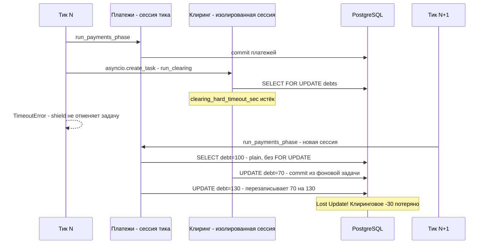
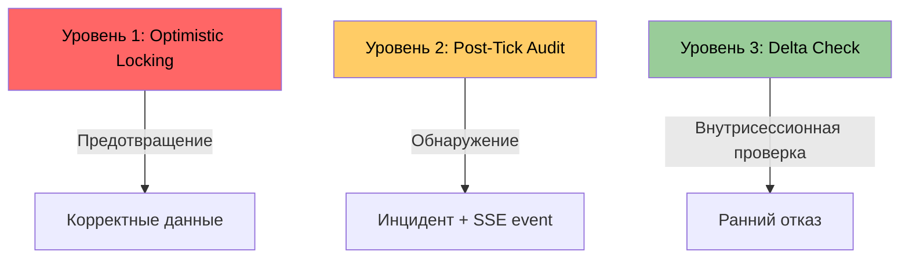
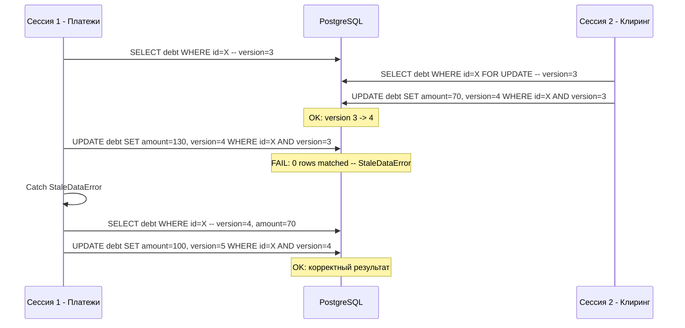
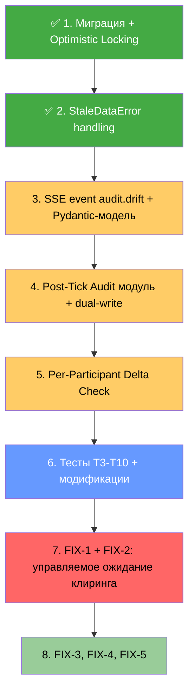
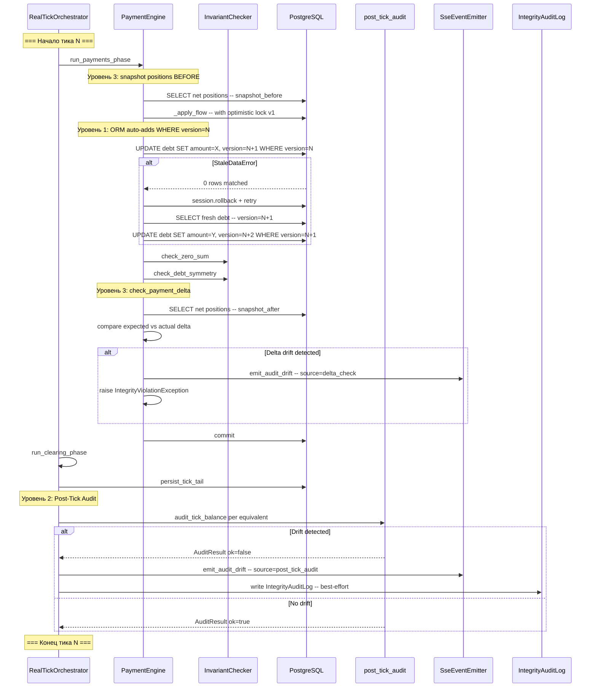

# Спецификация: Защита от Lost Update при конкурентной работе клиринга и платежей

> **Дата создания:** 2026-02-13
> **Последнее обновление:** 2026-02-13
> **Статус:** In Progress — Уровень 1 реализован, Уровни 2/3 в дизайне
> **План фиксов:** [`plans/archive/concurrent-payments-fix-plan.md`](../../../../plans/archive/concurrent-payments-fix-plan.md)
> **Связанные проблемы:** Lost Update, неуправляемые фоновые задачи, stale-кеш графа

---

## 1. Контекст проблемы

### 1.1 Корневая причина

В **static clearing mode** симулятора, когда клиринг не успевает завершиться за `clearing_hard_timeout_sec`, задача клиринга продолжает работать в фоне благодаря `asyncio.shield` в [`real_tick_clearing_coordinator.py:452-454`](../../../../app/core/simulator/real_tick_clearing_coordinator.py:452). На следующем тике платежи создают новую DB-сессию. Метод [`_apply_flow()`](../../../../app/core/payments/engine.py:847) читает долг через plain SELECT без `FOR UPDATE`, модифицирует абсолютным значением на Python-объекте, и ORM генерирует `UPDATE debts SET amount = <абсолютное_значение>`. Это затирает изменения клиринга.

### 1.2 Почему существующие инварианты не ловят проблему

Клиринг уменьшает **все** рёбра цикла равномерно. Lost update затирает уменьшение только на **одном** ребре. Результат: нетто-позиции двух участников искажаются — один «переплачивает», другой «недополучает» — но суммарно система остаётся сбалансированной. Проверка [`check_zero_sum()`](../../../../app/core/invariants.py:22) не ловит это, потому что проверяет только **системный** баланс, а не per-participant consistency.

### 1.3 Обнаруженные проблемы

| # | Серьёзность | Описание | Локация |
|---|-------------|----------|---------|
| 1 | 🔴 HIGH | Lost Update — `_apply_flow` перезаписывает результат клиринга | [`engine.py:847-910`](../../../../app/core/payments/engine.py:847) + [`real_tick_clearing_coordinator.py:440-465`](../../../../app/core/simulator/real_tick_clearing_coordinator.py:440) |
| 2 | 🔴 HIGH | `asyncio.shield` создаёт неуправляемые фоновые задачи | [`real_tick_clearing_coordinator.py:451-454`](../../../../app/core/simulator/real_tick_clearing_coordinator.py:451) |
| 3 | 🟡 MEDIUM | Нет retry при deadlock в `commit=False` | [`engine.py:843-845`](../../../../app/core/payments/engine.py:843) |
| 4 | 🟡 MEDIUM | Stale кеш графа при TTL > 0 | [`router.py:57-80`](../../../../app/core/payments/router.py:57) |
| 5 | 🟢 LOW | Нестабильный порядок UI-патчей | [`real_payments_executor.py:~425`](../../../../app/core/simulator/real_payments_executor.py:425) |

### 1.4 Диаграмма проблемы



---

## 2. Три уровня защиты

Стратегия защиты построена на принципе **defence in depth** — три независимых уровня, каждый из которых усиливает общую устойчивость:



---

### 2.1 Уровень 1: Optimistic Locking — предотвращение ✅ Реализован

**Цель:** Предотвратить lost update через версионирование строк в таблице `debts`.

> **Статус:** ✅ Реализован
> **Миграция:** [`migrations/versions/015_debts_optimistic_lock_version.py`](../../../../migrations/versions/015_debts_optimistic_lock_version.py)
> **Тесты:**
> - [`tests/unit/test_debt_optimistic_lock.py`](../../../../tests/unit/test_debt_optimistic_lock.py) — unit-тест StaleDataError при конкурентном UPDATE
> - [`tests/unit/test_apply_flow_retry_on_stale.py`](../../../../tests/unit/test_apply_flow_retry_on_stale.py) — unit-тест retry в `_apply_flow`

#### 2.1.1 Миграция БД

Добавить колонку `version` в таблицу `debts`:

- **Файл миграции:** [`migrations/versions/015_debt_optimistic_lock.py`](../../../../migrations/versions/015_debt_optimistic_lock.py)
- **SQL:**
  ```sql
  ALTER TABLE debts ADD COLUMN version INTEGER DEFAULT 0 NOT NULL;
  ```
- **Обратная совместимость:** `DEFAULT 0` означает, что все существующие записи автоматически получат `version = 0`
- **Влияние на production:** минимальное — `ALTER TABLE ... ADD COLUMN ... DEFAULT` в PostgreSQL ≥ 11 не требует rewrite таблицы

#### 2.1.2 Модель Debt

**Файл:** [`app/db/models/debt.py`](../../../../app/db/models/debt.py)

Изменения:

```python
# Добавить импорт
from sqlalchemy import Integer

# Добавить колонку после updated_at (строка ~16):
version: Mapped[int] = mapped_column(Integer, default=0, nullable=False)

# Добавить mapper_args для ORM optimistic locking:
__mapper_args__ = {"version_id_col": version}
```

**Поведение SQLAlchemy:**
- При каждом `UPDATE` ORM автоматически инкрементирует `version` и добавляет `WHERE version = <old_value>` в SQL
- Если строка была модифицирована другой сессией, `WHERE` не найдёт строку → `StaleDataError`
- Это работает и с PostgreSQL, и с SQLite

#### 2.1.3 Обработка StaleDataError в _apply_flow

**Файл:** [`app/core/payments/engine.py`](../../../../app/core/payments/engine.py:847)

Изменения в методе `_apply_flow`:

```python
from sqlalchemy.orm.exc import StaleDataError

MAX_OPTIMISTIC_RETRIES = 3

async def _apply_flow(self, from_id, to_id, amount, equivalent_id):
    for attempt in range(MAX_OPTIMISTIC_RETRIES):
        try:
            # ... существующая логика _apply_flow ...
            return  # успешно
        except StaleDataError:
            if attempt == MAX_OPTIMISTIC_RETRIES - 1:
                raise
            logger.warning(
                "event=apply_flow.stale_data retry=%s from=%s to=%s",
                attempt + 1, from_id, to_id,
            )
            # Перечитать долги из БД
            await self.session.rollback()  # откатить savepoint
            # Retry с fresh данными
```

**Ключевые аспекты:**
- `session.refresh(debt)` перечитывает объект из БД с актуальным `version`
- Максимум 3 retry — при постоянных конфликтах лучше отказать, чем зацикливаться
- Каждый retry начинается с актуальных данных из БД

#### 2.1.4 Обработка StaleDataError в execute_clearing

**Файл:** [`app/core/clearing/service.py`](../../../../app/core/clearing/service.py:530)

Изменения в методе [`execute_clearing()`](../../../../app/core/clearing/service.py:530):

```python
from sqlalchemy.orm.exc import StaleDataError

async def execute_clearing(self, cycle):
    for attempt in range(3):
        try:
            # ... существующая логика SELECT FOR UPDATE + UPDATE ...
            return True
        except StaleDataError:
            if attempt == 2:
                logger.error("event=clearing.stale_data_exhausted cycle_len=%s", len(cycle))
                return False
            logger.warning("event=clearing.stale_data retry=%s", attempt + 1)
            await self.session.rollback()
            # Перечитать debts заново с FOR UPDATE
```

**Примечание:** Клиринг уже использует `SELECT ... FOR UPDATE` ([строка 565](../../../../app/core/clearing/service.py:565)), что минимизирует вероятность `StaleDataError`. Однако обработка необходима как safety net для edge cases.

#### 2.1.5 Диаграмма работы Optimistic Locking



---

### 2.2 Уровень 2: Post-Tick Balance Audit — обнаружение

**Цель:** Обнаружить drift нетто-позиций участников после commit тика, даже если optimistic locking не предотвратил проблему.

> **Статус:** 🔄 Дизайн уточнён, готов к реализации

#### 2.2.1 SSE Event Type: `audit.drift`

**Новый тип SSE события** — `"audit.drift"`.

**Обоснование выбора event type:**
- Все domain-события (`tx.*`, `clearing.*`, `topology.*`) привязаны к equivalent → audit drift тоже per-equivalent
- Семантически отличается от `tx.failed` (drift — системная проблема, не отказ пользовательского платежа)
- Конвенция проекта: `<domain>.<action>` → `audit.drift`
- Frontend не ломается — неизвестные event types passthrough через [`normalizeSimulatorEvent.ts:367`](../../../../simulator-ui/v2/src/fixtures.ts:367)

**Пример JSON payload SSE:**

```json
{
  "event_id": "evt_audit_drift_t42_USD",
  "ts": "2026-02-13T15:30:00.000Z",
  "type": "audit.drift",
  "equivalent": "USD",
  "tick_index": 42,
  "severity": "warning",
  "total_drift": "30.00",
  "drifts": [
    {
      "participant_id": "p_alice",
      "expected_delta": "-50.00",
      "actual_delta": "-20.00",
      "drift": "30.00"
    },
    {
      "participant_id": "p_bob",
      "expected_delta": "50.00",
      "actual_delta": "20.00",
      "drift": "-30.00"
    }
  ],
  "source": "post_tick_audit"
}
```

**Severity levels:**
- `"warning"` — drift обнаружен, но в пределах tolerance (< 1% от объёма тика)
- `"critical"` — drift превышает tolerance, вероятен lost update

#### 2.2.2 Pydantic-модель `SimulatorAuditDriftEvent`

**Файл:** [`app/schemas/simulator.py`](../../../../app/schemas/simulator.py) — новый класс + добавить в `SimulatorEvent` union (~строка 310)

```python
class SimulatorAuditDriftEvent(BaseModel):
    event_id: str
    ts: datetime
    type: Literal["audit.drift"]
    equivalent: str
    tick_index: int
    severity: Literal["warning", "critical"]
    total_drift: str  # Decimal as string для JSON-совместимости
    drifts: List[Dict[str, Any]]
    # Каждый элемент: {"participant_id": "...", "expected_delta": "...", "actual_delta": "...", "drift": "..."}
    source: Literal["post_tick_audit", "delta_check"]
    model_config = ConfigDict(extra="allow")
```

#### 2.2.3 Persistence: Dual-write SSE + IntegrityAuditLog

**Решение:** При обнаружении drift выполняется **dual-write**:
1. **SSE event** `"audit.drift"` через [`SseEventEmitter`](../../../../app/core/simulator/sse_broadcast.py) — real-time уведомление frontend
2. **IntegrityAuditLog** запись в **существующую** таблицу — персистентный audit trail

**Обоснование выбора IntegrityAuditLog:**
- Единый audit trail — API `/integrity/audit-log` уже существует и показывает записи
- Паттерн записи отработан (best-effort `try/except`)
- Не нужна отдельная миграция — таблица уже есть
- Таблица уже индексирована по `verification_passed` и `timestamp`

**Маппинг полей IntegrityAuditLog:**

| Поле IntegrityAuditLog | Значение для drift |
|---|---|
| `operation_type` | `"SIMULATOR_AUDIT_DRIFT"` |
| `tx_id` | `None` |
| `equivalent_code` | equivalent, в котором обнаружен drift |
| `state_checksum_before` | `""` (drift не про checksums) |
| `state_checksum_after` | `""` |
| `affected_participants` | `{"drifts": [...], "tick_index": N, "source": "post_tick_audit"}` |
| `invariants_checked` | `{"post_tick_balance": {"passed": false, "total_drift": "30.00"}}` |
| `verification_passed` | `False` (всегда — записываем только при drift) |
| `error_details` | `{"drifts": [...], "severity": "warning"}` |

**Паттерн записи (best-effort):**

```python
try:
    audit_log = IntegrityAuditLog(
        operation_type="SIMULATOR_AUDIT_DRIFT",
        equivalent_code=equivalent_code,
        verification_passed=False,
        affected_participants={"drifts": drifts_list, "tick_index": tick_index},
        invariants_checked={"post_tick_balance": {"passed": False, "total_drift": str(total_drift)}},
        error_details={"drifts": drifts_list, "severity": severity},
    )
    session.add(audit_log)
    await session.flush()
except Exception:
    logger.warning("event=audit_drift.persist_failed", exc_info=True)
```

#### 2.2.4 Эмиттер SSE

**Файл:** [`app/core/simulator/sse_broadcast.py`](../../../../app/core/simulator/sse_broadcast.py) — новый метод `emit_audit_drift()` в `SseEventEmitter` (~строка 318)

```python
async def emit_audit_drift(
    self,
    equivalent: str,
    tick_index: int,
    severity: Literal["warning", "critical"],
    total_drift: Decimal,
    drifts: list[dict],
    source: str = "post_tick_audit",
) -> None:
    event = SimulatorAuditDriftEvent(
        event_id=f"evt_audit_drift_t{tick_index}_{equivalent}",
        ts=datetime.utcnow(),
        type="audit.drift",
        equivalent=equivalent,
        tick_index=tick_index,
        severity=severity,
        total_drift=str(total_drift),
        drifts=drifts,
        source=source,
    )
    await self._broadcast(event)
```

#### 2.2.5 Новый модуль: `app/core/simulator/post_tick_audit.py`

```python
from dataclasses import dataclass, field
from decimal import Decimal

@dataclass
class AuditResult:
    ok: bool
    tick_index: int
    drifts: list[dict] = field(default_factory=list)
    # Каждый: {"participant_id": "...", "expected_delta": "...", "actual_delta": "...", "drift": "..."}
    total_drift: Decimal = Decimal("0")


async def audit_tick_balance(
    session,
    equivalent_code: str,
    tick_index: int,
    payments_result,
    clearing_volume_by_eq: dict,
) -> AuditResult:
    """
    Сравнить ожидаемые дельты участников с фактическими net positions.

    Алгоритм:
    1. Собрать все COMMITTED транзакции тика → вычислить expected delta по участнику
    2. Учесть clearing volume (если был клиринг в этом тике)
    3. Прочитать фактические net positions из debts
    4. Сравнить expected delta с actual delta
    5. При расхождении → AuditResult.ok = False, заполнить drifts
    """
    ...
```

**Поля `AuditResult`:**

| Поле | Тип | Описание |
|------|-----|----------|
| `ok` | `bool` | `True` если дельты совпадают |
| `tick_index` | `int` | Индекс проверенного тика |
| `drifts` | `list[dict]` | Список расхождений: `participant_id`, `expected_delta`, `actual_delta`, `drift` |
| `total_drift` | `Decimal` | Суммарное расхождение (абсолютное значение) |

#### 2.2.6 Точка интеграции в runtime

**Файл:** [`app/core/simulator/real_tick_orchestrator.py`](../../../../app/core/simulator/real_tick_orchestrator.py)

**Место:** После [`persist_tick_tail()`](../../../../app/core/simulator/real_tick_orchestrator.py:327) (~строка 327-340), внутри `async with session`

```python
from app.core.simulator.post_tick_audit import audit_tick_balance

# После persist_tick_tail(), внутри async with session:
try:
    for eq_code in active_equivalents:
        audit = await audit_tick_balance(
            session=session,
            equivalent_code=eq_code,
            tick_index=tick_index,
            payments_result=payments_result,
            clearing_volume_by_eq=clearing_volume_by_eq,
        )
        if not audit.ok:
            severity = "critical" if audit.total_drift > critical_threshold else "warning"
            logger.warning(
                "event=post_tick_audit.drift tick=%s eq=%s total_drift=%s drifts=%s",
                tick_index, eq_code, audit.total_drift, audit.drifts,
            )
            # 1. SSE event
            await emitter.emit_audit_drift(
                equivalent=eq_code,
                tick_index=tick_index,
                severity=severity,
                total_drift=audit.total_drift,
                drifts=audit.drifts,
                source="post_tick_audit",
            )
            # 2. IntegrityAuditLog (best-effort)
            try:
                audit_log = IntegrityAuditLog(
                    operation_type="SIMULATOR_AUDIT_DRIFT",
                    equivalent_code=eq_code,
                    verification_passed=False,
                    affected_participants={"drifts": audit.drifts, "tick_index": tick_index},
                    invariants_checked={"post_tick_balance": {"passed": False, "total_drift": str(audit.total_drift)}},
                    error_details={"drifts": audit.drifts, "severity": severity},
                )
                session.add(audit_log)
                await session.flush()
            except Exception:
                logger.warning("event=audit_drift.persist_failed", exc_info=True)
except Exception:
    logger.warning("event=post_tick_audit.failed", exc_info=True)
    # Best-effort: не блокирует tick
```

**Ключевые аспекты:**
- Вызывается для **каждого equivalent** после всех операций тика (платежи + клиринг + persistence)
- **Best-effort:** обёрнут в `try/except`, не блокирует tick
- Работает **внутри** существующей сессии — не создаёт дополнительных подключений к БД

#### 2.2.7 Файлы для изменения (Уровень 2)

| Файл | Изменение |
|------|-----------|
| `app/core/simulator/post_tick_audit.py` | **Новый** — `AuditResult` dataclass + `audit_tick_balance()` |
| [`app/schemas/simulator.py`](../../../../app/schemas/simulator.py) | Добавить `SimulatorAuditDriftEvent` + включить в `SimulatorEvent` union |
| [`app/core/simulator/sse_broadcast.py`](../../../../app/core/simulator/sse_broadcast.py) | Добавить `emit_audit_drift()` в `SseEventEmitter` |
| [`app/core/simulator/real_tick_orchestrator.py`](../../../../app/core/simulator/real_tick_orchestrator.py) | Вызов `audit_tick_balance()` + dual-write после `persist_tick_tail()` |

---

### 2.3 Уровень 3: Per-Participant Delta Check — внутрисессионный инвариант

**Цель:** Дополнительный инвариант в пределах одной DB-сессии, проверяющий что сумма flows соответствует изменению нетто-позиций.

> **Статус:** 🔄 Дизайн уточнён, готов к реализации

#### 2.3.1 Точка интеграции: `engine.py:commit()`

**Файл:** [`app/core/payments/engine.py`](../../../../app/core/payments/engine.py)

**Место:** В методе [`commit()`](../../../../app/core/payments/engine.py:750), после [`check_debt_symmetry()`](../../../../app/core/payments/engine.py:750) (~строка 750), перед записью в IntegrityAuditLog (строка 756)

**Порядок вызовов в `commit()`:**
```
1. check_zero_sum()           — существующий
2. check_debt_symmetry()      — существующий
3. check_payment_delta()      — НОВЫЙ (Уровень 3)
4. IntegrityAuditLog write    — существующий
5. session.commit()           — существующий
```

#### 2.3.2 Snapshot positions before `_apply_flow()`

**Файл:** [`app/core/payments/engine.py`](../../../../app/core/payments/engine.py:690)

**Место:** Перед вызовом [`_apply_flow()`](../../../../app/core/payments/engine.py:690) (~строка 690) нужно сохранить snapshot net positions:

```python
# ~строка 690, ПЕРЕД циклом _apply_flow():
positions_before = await self._snapshot_net_positions(
    session=self.session,
    equivalent_id=eq_id,
    participant_ids=affected_participant_ids,
)

# Далее идёт существующий цикл _apply_flow()
for from_id, to_id, amount in flows:
    await self._apply_flow(from_id, to_id, amount, equivalent_id=eq_id)
```

**Метод `_snapshot_net_positions()`:**
```python
async def _snapshot_net_positions(
    self,
    session,
    equivalent_id: UUID,
    participant_ids: set[UUID],
) -> dict[UUID, Decimal]:
    """
    Прочитать текущие net positions для участников.
    Returns: {participant_id: net_position}
    """
    # SELECT debtor_id, creditor_id, amount FROM debts
    # WHERE equivalent_id = :eq_id
    # AND (debtor_id IN :pids OR creditor_id IN :pids)
    ...
```

#### 2.3.3 Новый метод `check_payment_delta()`

**Файл:** [`app/core/payments/engine.py`](../../../../app/core/payments/engine.py)

```python
async def check_payment_delta(
    self,
    equivalent_id: UUID,
    flows: list[tuple[UUID, UUID, Decimal]],
    net_positions_before: dict[UUID, Decimal],
) -> bool:
    """
    Проверить что дельта нетто-позиций участников
    соответствует сумме flows.

    Args:
        equivalent_id: ID эквивалента
        flows: список (from_id, to_id, amount)
        net_positions_before: позиции ДО apply_flow

    Returns:
        True если дельты корректны

    Raises:
        IntegrityViolationException если обнаружено расхождение
    """
    # 1. Вычислить expected delta из flows
    expected_delta: dict[UUID, Decimal] = {}
    for from_id, to_id, amount in flows:
        expected_delta[from_id] = expected_delta.get(from_id, Decimal("0")) - amount
        expected_delta[to_id] = expected_delta.get(to_id, Decimal("0")) + amount

    # 2. Прочитать текущие net positions
    positions_after = await self._snapshot_net_positions(
        session=self.session,
        equivalent_id=equivalent_id,
        participant_ids=set(expected_delta.keys()),
    )

    # 3. Сравнить actual delta с expected delta
    tolerance = Decimal("0.00000001")
    for pid, expected in expected_delta.items():
        actual = positions_after.get(pid, Decimal("0")) - net_positions_before.get(pid, Decimal("0"))
        if abs(actual - expected) > tolerance:
            # Drift обнаружен — emit SSE + raise
            ...
```

#### 2.3.4 Интеграция SSE при обнаружении drift

При обнаружении расхождения в `check_payment_delta()`, помимо raise exception, отправляется SSE event `"audit.drift"` с `source="delta_check"`:

```python
await emitter.emit_audit_drift(
    equivalent=equivalent_code,
    tick_index=current_tick_index,
    severity="critical",  # delta check drift всегда critical
    total_drift=total_drift,
    drifts=drifts_list,
    source="delta_check",
)
```

#### 2.3.5 Ограничения

- Работает только в пределах **одной** DB-сессии
- **Не ловит** cross-session lost updates — это задача уровня 1 (Optimistic Locking) и уровня 2 (Post-Tick Audit)
- Снимок `net_positions_before` должен быть сохранён **до** вызова `_apply_flow()`
- Дополнительный SELECT для snapshot — минимальный overhead, т.к. читает только affected participants

#### 2.3.6 Файлы для изменения (Уровень 3)

| Файл | Изменение |
|------|-----------|
| [`app/core/payments/engine.py`](../../../../app/core/payments/engine.py) | `_snapshot_net_positions()` + `check_payment_delta()` + вызов в `commit()` |
| [`app/core/invariants.py`](../../../../app/core/invariants.py) | Опционально: вынести логику delta check в InvariantChecker для единообразия |

---

## 3. Фиксы из плана — совместимость с уровнями защиты

Кратко о каждом фиксе из [`plans/archive/concurrent-payments-fix-plan.md`](../../../../plans/archive/concurrent-payments-fix-plan.md) и его взаимодействии с тремя уровнями защиты.

### FIX-1: Ожидание фоновой задачи клиринга перед платежами следующего тика

| Аспект | Значение |
|--------|----------|
| **Приоритет** | 🔴 CRITICAL |
| **Файлы** | [`real_tick_clearing_coordinator.py:440-466`](../../../../app/core/simulator/real_tick_clearing_coordinator.py:440), [`real_tick_orchestrator.py`](../../../../app/core/simulator/real_tick_orchestrator.py) |
| **Совместимость с Уровнем 1** | Взаимодополнение: FIX-1 устраняет root cause конкурентности; Optimistic Locking — safety net если FIX-1 пропустит edge case |
| **Совместимость с Уровнем 2** | Audit обнаружит drift, если FIX-1 не полностью решит проблему |
| **Совместимость с Уровнем 3** | Не конфликтует — delta check работает в пределах одной сессии |

### FIX-2: Замена asyncio.shield на управляемое ожидание

| Аспект | Значение |
|--------|----------|
| **Приоритет** | 🔴 HIGH |
| **Файлы** | [`real_tick_clearing_coordinator.py:451-454`](../../../../app/core/simulator/real_tick_clearing_coordinator.py:451) |
| **Совместимость с Уровнем 1** | Устранение `asyncio.shield` снижает вероятность конкурентного доступа, но optimistic lock всё равно нужен |
| **Совместимость с Уровнем 2** | Не конфликтует |
| **Совместимость с Уровнем 3** | Не конфликтует |

### FIX-3: Retry при deadlock в режиме commit=False

| Аспект | Значение |
|--------|----------|
| **Приоритет** | 🟡 MEDIUM |
| **Файлы** | [`engine.py:843-845`](../../../../app/core/payments/engine.py:843) |
| **Совместимость с Уровнем 1** | Optimistic locking может генерировать `StaleDataError` — retry в `_apply_flow` обрабатывает это. FIX-3 обрабатывает PostgreSQL deadlock 40P01 — другой тип ошибки |
| **Совместимость с Уровнем 2** | Не конфликтует |
| **Совместимость с Уровнем 3** | Не конфликтует |

### FIX-4: Инвалидация кеша графа маршрутизации при TTL > 0

| Аспект | Значение |
|--------|----------|
| **Приоритет** | 🟡 MEDIUM |
| **Файлы** | [`router.py:57-80`](../../../../app/core/payments/router.py:57) |
| **Совместимость с уровнями** | Ортогонален — кеш графа не влияет на optimistic locking или audit, но stale кеш может привести к маршрутизации по уже зачищенным долгам |

### FIX-5: Стабильный порядок UI-патчей

| Аспект | Значение |
|--------|----------|
| **Приоритет** | 🟢 LOW |
| **Файлы** | [`real_payments_executor.py:~425`](../../../../app/core/simulator/real_payments_executor.py:425) |
| **Совместимость с уровнями** | Полностью ортогонален — косметическое изменение |

---

## 4. Миграция БД

### 4.1 Файл миграции

**Путь:** `migrations/versions/015_debt_optimistic_lock.py`

```python
"""Add version column for optimistic locking on debts table."""

from alembic import op
import sqlalchemy as sa

# revision identifiers
revision = "015"
down_revision = "014"
branch_labels = None
depends_on = None

def upgrade():
    op.add_column(
        "debts",
        sa.Column("version", sa.Integer(), nullable=False, server_default="0"),
    )

def downgrade():
    op.drop_column("debts", "version")
```

### 4.2 Характеристики

| Параметр | Значение |
|----------|----------|
| **SQL** | `ALTER TABLE debts ADD COLUMN version INTEGER DEFAULT 0 NOT NULL` |
| **Блокировка таблицы** | `ACCESS EXCLUSIVE` на мгновение — PostgreSQL ≥ 11 оптимизирует `ADD COLUMN ... DEFAULT` без rewrite |
| **Обратная совместимость** | Все существующие строки получают `version = 0` |
| **SQLite** | Поддерживается — SQLite добавит колонку с default |
| **Rollback** | `DROP COLUMN version` — безопасно |

---

## 5. Спецификация тестов

### 5.1 Новые unit-тесты

| ID | Статус | Файл | Что тестирует | Описание |
|----|--------|------|---------------|----------|
| T1 | ✅ | [`tests/unit/test_debt_optimistic_lock.py`](../../../../tests/unit/test_debt_optimistic_lock.py) | `StaleDataError` при конкурентном UPDATE | Создать два ORM-объекта Debt с одним ID, изменить amount в обоих, flush первый → OK, flush второй → `StaleDataError` |
| T2 | ✅ | [`tests/unit/test_apply_flow_retry_on_stale.py`](../../../../tests/unit/test_apply_flow_retry_on_stale.py) | Retry в `_apply_flow` при `StaleDataError` | Mock session: первый flush → `StaleDataError`, после refresh → второй flush OK. Проверить что метод завершился успешно |
| T3 | 🔲 | `tests/unit/test_post_tick_audit.py` | Обнаружение drift в `audit_tick_balance` | Передать committed payments + clearing txns с известными дельтами. Искусственно исказить один долг → `AuditResult.ok == False`, `drifts` содержит участника |
| T4 | 🔲 | `tests/unit/test_payment_delta_check.py` | `check_payment_delta` ловит неконсистентность | Сохранить net positions ДО flows, применить flows, исказить один долг, вызвать check → `IntegrityViolationException` |
| T8 | 🔲 | `tests/unit/test_audit_drift_sse_event.py` | Формат SSE event `audit.drift` | Проверить что `SimulatorAuditDriftEvent` сериализуется в корректный JSON, содержит все обязательные поля, severity валидируется |
| T9 | 🔲 | `tests/unit/test_audit_drift_integrity_log.py` | Запись drift в IntegrityAuditLog | Проверить что dual-write создаёт запись с `operation_type="SIMULATOR_AUDIT_DRIFT"`, `verification_passed=False`, корректным маппингом полей |

### 5.2 Новые интеграционные тесты

| ID | Статус | Файл | Что тестирует | Описание |
|----|--------|------|---------------|----------|
| T5 | 🔲 | `tests/integration/test_concurrent_clearing_payment_lost_update.py` | Optimistic lock предотвращает lost update | Две реальных DB-сессии: сессия 1 выполняет clearing с `FOR UPDATE`, сессия 2 выполняет payment на те же долги → `StaleDataError` → retry → корректный итоговый amount |
| T6 | 🔲 | `tests/integration/test_post_tick_audit_integration.py` | Post-tick audit end-to-end | Полный тик → audit → `ok=True`. Искусственно внести drift через прямой SQL UPDATE → audit → `ok=False` с корректным `drifts` |
| T7 | 🔲 | `tests/integration/test_simulator_super_smoke_zero_sum_per_participant.py` | Per-participant balance consistency | Расширенный super smoke: после всех тиков проверить что нетто-позиция каждого участника соответствует сумме его платежей минус клиринг |
| T10 | 🔲 | `tests/integration/test_audit_drift_sse_broadcast.py` | SSE broadcast audit.drift end-to-end | Запустить тик с искусственным drift → проверить что SSE client получает event `type="audit.drift"` с корректным payload |

### 5.3 Детали ключевых тестов

#### T5: Concurrent Lost Update Prevention

```
Сценарий:
1. Настроить треугольник долгов: A→B=100, B→C=100, C→A=100
2. Открыть сессию 1 (clearing): SELECT FOR UPDATE все три долга
3. Открыть сессию 2 (payment): SELECT долг A→B (без FOR UPDATE)
4. Сессия 1: UPDATE все долги (amount -= 30), COMMIT
5. Сессия 2: UPDATE долг A→B (amount += 50), FLUSH

Ожидаемый результат:
- БЕЗ optimistic locking: A→B = 150 (lost update, клиринговое -30 потеряно)
- С optimistic locking: StaleDataError → retry → A→B = 120 (70 + 50)

Подход:
- Использовать PostgreSQL (NullPool) для двух реальных соединений
- asyncio.Event для синхронизации порядка операций
- По аналогии с test_simulator_clearing_no_deadlock.py
```

#### T7: Super Smoke Per-Participant

```
Расширение существующего test_simulator_super_smoke.py:
1. После part2 (все тики завершены):
   - Для каждого участника: сумма исходящих долгов - сумма входящих долгов = net position
   - Net position должна равняться: initial_net + sum(incoming_payments) - sum(outgoing_payments)
   - Допуск: Decimal('0.00000001') на float rounding
2. Запуск на 50-node сценарии с ≥20 тиками
```

#### T8: Audit Drift SSE Event Format

```
Тест:
1. Создать SimulatorAuditDriftEvent с тестовыми данными
2. Сериализовать в JSON через .model_dump_json()
3. Проверить:
   - type == "audit.drift"
   - severity ∈ {"warning", "critical"}
   - total_drift — строка (не число)
   - drifts — массив с participant_id, expected_delta, actual_delta, drift
   - source ∈ {"post_tick_audit", "delta_check"}
4. Проверить что невалидный severity → ValidationError
```

#### T9: Audit Drift IntegrityAuditLog Write

```
Тест:
1. Создать IntegrityAuditLog с operation_type="SIMULATOR_AUDIT_DRIFT"
2. Проверить маппинг полей:
   - tx_id == None
   - equivalent_code == "USD"
   - verification_passed == False
   - affected_participants содержит drifts и tick_index
   - invariants_checked содержит post_tick_balance с passed=False
   - error_details содержит drifts и severity
3. Записать в БД, прочитать, проверить round-trip
```

### 5.4 Модификация существующих тестов

| Файл | Изменение |
|------|-----------|
| [`tests/integration/test_simulator_super_smoke.py`](../../../../tests/integration/test_simulator_super_smoke.py) | Добавить per-participant balance assertion после part2 — проверить что для каждого участника `net_position_after == net_position_before + sum_flows` |
| [`tests/unit/test_invariants.py`](../../../../tests/unit/test_invariants.py) | Добавить тест для нового метода `check_payment_delta`: нормальный случай → OK, искажённый → exception |

---

## 6. Порядок реализации



### Детализация шагов

1. **~~Миграция + Optimistic Locking в модели Debt~~** ✅ Реализован
   - ✅ Создана [`migrations/versions/015_debts_optimistic_lock_version.py`](../../../../migrations/versions/015_debts_optimistic_lock_version.py)
   - ✅ Добавлена `version` колонка и `__mapper_args__` в [`app/db/models/debt.py`](../../../../app/db/models/debt.py)
   - ✅ Тесты: [`test_debt_optimistic_lock.py`](../../../../tests/unit/test_debt_optimistic_lock.py), [`test_apply_flow_retry_on_stale.py`](../../../../tests/unit/test_apply_flow_retry_on_stale.py)

2. **~~Обработка StaleDataError~~** ✅ Реализован
   - ✅ В [`_apply_flow()`](../../../../app/core/payments/engine.py:847): retry с `session.refresh()`
   - ✅ В [`execute_clearing()`](../../../../app/core/clearing/service.py:530): retry всего цикла
   - ✅ Max 3 retry в обоих случаях

3. **SSE event `audit.drift` + Pydantic-модель** ⬜ Следующий шаг
   - Добавить `SimulatorAuditDriftEvent` в [`app/schemas/simulator.py`](../../../../app/schemas/simulator.py)
   - Добавить в `SimulatorEvent` union (~строка 310)
   - Добавить `emit_audit_drift()` в [`app/core/simulator/sse_broadcast.py`](../../../../app/core/simulator/sse_broadcast.py)

4. **Post-Tick Audit модуль + dual-write** ⬜
   - Создать `app/core/simulator/post_tick_audit.py` с `AuditResult` и `audit_tick_balance()`
   - Интегрировать в [`real_tick_orchestrator.py`](../../../../app/core/simulator/real_tick_orchestrator.py) после `persist_tick_tail()`
   - Dual-write: SSE event + IntegrityAuditLog запись

5. **Per-Participant Delta Check** ⬜
   - `_snapshot_net_positions()` в [`engine.py`](../../../../app/core/payments/engine.py)
   - `check_payment_delta()` в [`engine.py`](../../../../app/core/payments/engine.py)
   - Вызов в `commit()` после [`check_debt_symmetry()`](../../../../app/core/payments/engine.py:750)
   - SSE event `audit.drift` с `source="delta_check"` при обнаружении drift

6. **Тесты** ⬜
   - Unit: T3, T4, T8, T9 (T1/T2 уже реализованы ✅)
   - Интеграционные: T5, T6, T7, T10
   - Модификация: super_smoke, test_invariants

7. **FIX-1 + FIX-2** ⬜
   - `_await_pending_clearing()` в [`real_tick_orchestrator.py`](../../../../app/core/simulator/real_tick_orchestrator.py)
   - Удалить `clearing_task.cancel()` из [`real_tick_clearing_coordinator.py`](../../../../app/core/simulator/real_tick_clearing_coordinator.py:466)
   - Подробности — в [`plans/archive/concurrent-payments-fix-plan.md`](../../../../plans/archive/concurrent-payments-fix-plan.md)

8. **FIX-3, FIX-4, FIX-5** ⬜
   - Менее критичные фиксы — после стабилизации core

---

## 7. Sequence Diagram: Tick Flow с точками интеграции Уровней 2 и 3



---

## 8. Критерии приёмки

### 8.1 Обязательные

- [x] **Миграция 015 применяется** без ошибок на PostgreSQL и SQLite ✅
- [x] **Тест T1 проходит:** `StaleDataError` при конкурентном UPDATE ✅
- [x] **Тест T2 проходит:** retry в `_apply_flow` при `StaleDataError` ✅
- [ ] **Тест T5 проходит:** воспроизводит lost update и доказывает, что optimistic locking его предотвращает
- [ ] **Тест T7 проходит:** на 50-node сценарии с ≥20 тиками, per-participant net positions корректны
- [ ] **Все существующие тесты проходят:** `pytest -x` без регрессий
- [ ] **Колонка `version`** не влияет на performance: benchmarks показывают < 5% degradation на commit_payment
- [ ] **SSE event `audit.drift`** корректно сериализуется и доставляется через SSE stream

### 8.2 Желательные

- [ ] Post-tick audit обнаруживает искусственно внесённый drift (T6)
- [ ] Delta check ловит внутрисессионную неконсистентность (T4)
- [ ] Нет утечек asyncio tasks — `asyncio.all_tasks()` в конце тика не содержит stale clearing tasks
- [ ] Super smoke test проходит с `clearing_policy=static` и малым `clearing_hard_timeout_sec`
- [ ] Drift записывается в IntegrityAuditLog и виден через API `/integrity/audit-log`

### 8.3 Метрики успеха

| Метрика | Целевое значение |
|---------|-----------------|
| Lost update rate | 0% (с optimistic locking) |
| Stale clearing tasks после тика | 0 |
| Per-participant drift | `0.00000000` |
| Performance degradation | < 5% |
| Test coverage новых модулей | ≥ 90% |
