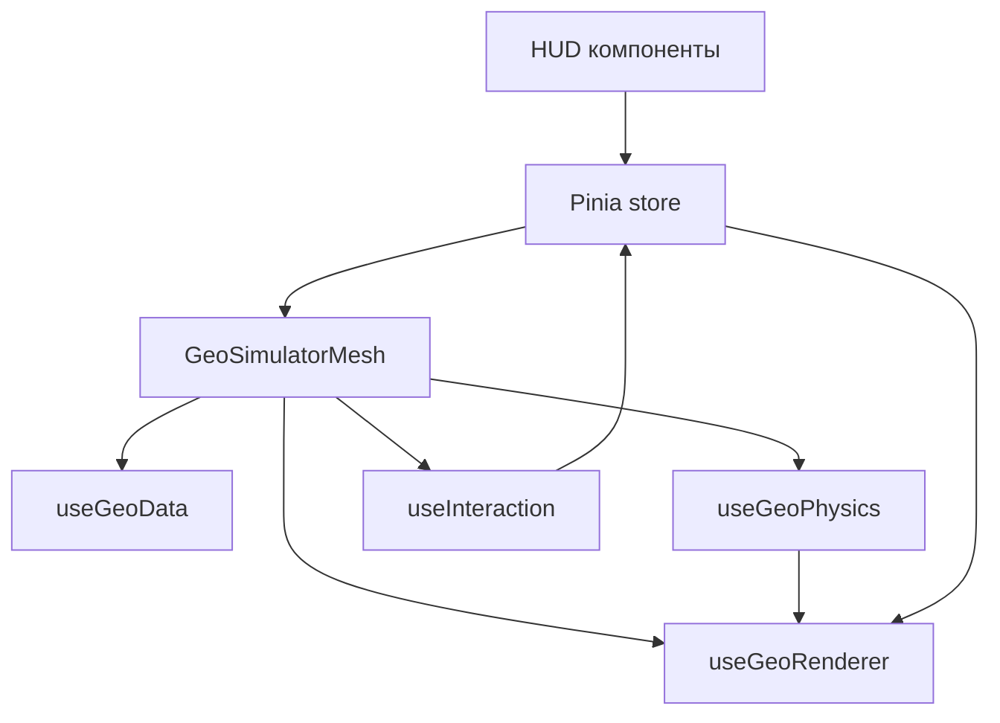

# Техническое задание (ТЗ)
# GEO Simulator — Этап 1: Интерактивная визуализация графа (игровой интерфейс)

**Версия:** 1.0 (черновик)
**Размещение:** `docs/ru/simulator/frontend/` (рядом с фазовыми спеками)

## 0. Источники и контекст

ТЗ синтезировано на основе следующих спецификаций:

- [docs/ru/simulator/frontend/archive/SPEC-GEO-Simulator-Phase1.md](docs/ru/simulator/frontend/archive/SPEC-GEO-Simulator-Phase1.md:1) (архив)
- [docs/ru/simulator/frontend/archive/MAIN Spec GEO Simulator Implementation (Vue 3 Stack).md](docs/ru/simulator/frontend/archive/MAIN%20Spec%20GEO%20Simulator%20Implementation%20(Vue%203%20Stack).md:1) (архив)
- [docs/ru/simulator/frontend/Игровой интерфейс симулятора GEO.md](docs/ru/simulator/frontend/%D0%98%D0%B3%D1%80%D0%BE%D0%B2%D0%BE%D0%B9%20%D0%B8%D0%BD%D1%82%D0%B5%D1%80%D1%84%D0%B5%D0%B9%D1%81%20%D1%81%D0%B8%D0%BC%D1%83%D0%BB%D1%8F%D1%82%D0%BE%D1%80%D0%B0%20GEO.md:1)
- [docs/ru/simulator/specs/GENERAL-simulator-application.md](docs/ru/simulator/specs/GENERAL-simulator-application.md:1)

Цель Этапа 1 — построить интерактивный, «игровой» прототип визуализации сети доверия GEO, демонстрирующий:

- участников как узлы;
- линии доверия как ребра;
- процесс транзакции как поток по связи;
- процесс клиринга как схлопывание долгов (визуальная симуляция).

Визуальный стиль должен **кардинально отличаться** от админ-интерфейса (Admin UI), но оставаться **читаемым и консервативным** (это финансовые операции, а не катастрофа): аккуратное свечение (glow/bloom), искры/частицы, плавная физика и минималистичный HUD. **Важно: для индикации знака баланса используется только цвет самого узла, дополнительное внешнее свечение (glow) для этой цели не применяется.**

Ключевая визуальная метафора баланса:

- **кредиторы** (balance > 0): сохраняют «естественный» цвет типа (зелёный бизнес / синий персона), выглядят ярче, а узел **заметно крупнее**
- **должники** (balance < 0): цвет уходит в красно-оранжевый, узел обычно ближе к базовому размеру
- при клиринге/взаимозачётах узлы **плавно** меняют размер и цвет, стремясь к выравниванию при балансе около нуля
- **исключения**: участники со статусом `suspended` (заморожен), `left` (покинул сеть) или `deleted` (удалён) на графе **не отображаются**.

---

## 0.5. Промпты для генерации скриншотов (описания для генераторов изображений)

Ниже — набор промптов для генерации скриншотов (например, Nano Banana и аналогичные инструменты). Цель — быстро получить согласуемые изображения UI/VFX, по которым затем корректируем спецификацию и/или функционал.

Контекст проекта GEO (важно для корректных скриншотов):

- **Линии доверия** образуют кредитную сеть, где движение обязательств может идти **по маршруту из нескольких ребер** (мультихоп), а не только по одной прямой связи.
- **Транзакция** на уровне протокола может проходить по маршруту A → B → C → ... → Z (в Этапе 1 допускается упрощение, но UI-метафора не должна «запирать» нас на A→B).
- **Клиринг** по смыслу работает с **циклами долгов** и может затрагивать **3 узла и более** (длина цикла не фиксирована). В Этапе 1 можно начинать с треугольников, но визуальный язык должен масштабироваться на 4–6+ узлов.

### 0.5.0. Общие требования ко всем скриншотам

- формат: 16:9, 1920×1080 (или 2560×1440)
- стиль: игровая тактическая карта, фон «глубокий космос», читаемый и консервативный финансовый интерфейс (без «катастрофы»)
- граф: 35–50 узлов, 2–4 связи на узел
- типы узлов:
  - `business`: квадрат, базовый цвет — зелёный
  - `person`: круг, базовый цвет — синий

Правила визуализации баланса участников:

- **положительный баланс** делает участника **крупнее** (размер зависит от величины баланса, но ограничен сверху; при росте баланса размер заметно увеличивается; для учета в физике используется `renderScale`)
- **отрицательный баланс** переводит цвет участника из «естественного» (синий/зелёный) в **красно-оранжевый** (должники)
- при клиринге/взаимозачётах, когда балансы уменьшаются и стремятся к нулю, узлы **постепенно выравниваются по размеру** (плавное изменение `renderScale`) и возвращаются по цвету к нейтральному/естественному диапазону
- участники со статусом `suspended`, `left`, `deleted` **скрыты**.
- линии доверия: тонкие, полупрозрачные (покой), **без чисел** на ребрах
- при выборе узла: подсветка только инцидентных связей, остальные связи затемнены
- индикация баланса (всегда, на всех узлах):
  - кредиторы (balance > 0): «естественный» цвет по типу (зелёный бизнес / синий персона), более яркий; размер больше; **без дополнительного Glow для индикации знака**
  - должники (balance < 0): оттенок уходит в красно-оранжевый; **без дополнительного Glow для индикации знака**
  - около 0: цвет ближе к спокойному/нейтральному
- HUD:
  - карточка участника рядом с выбранным узлом: Тип (иконка) + Имя + Баланс (со знаком)
  - панель управления внизу: две кнопки `Перевод`, `Запуск клиринга`

Примечание по семантике баланса:

- «кредитор» = участник с положительным балансом (сбережения/профицит)
- «должник» = участник с отрицательным балансом (долг/дефицит)

Полезные элементы интерфейса (желательно показать хотя бы на 1–2 скриншотах):

- компактная верхняя строка статуса (как «HUD» в игре): `Узлы`, `Связи`, `Активные транзакции`, `Клиринг` (покой/в процессе)
- небольшая легенда семантики баланса в углу: `Кредиторы` (синий/зелёный), `Должники` (красно-оранжевый)

Если инструмент поддерживает уточнения, добавлять:

- чистый интерфейс (без лишнего текста)
- без миникарты
- без элементов управления камерой
- не в стиле админ-панели
- без числовых подписей на ребрах

### 0.5.1. Скриншот A — общий вид сети (покой)

```text
Скриншот игрового интерфейса: тактическая карта «глубокий космос», тёмный фон (сине-чёрный) со слабым звёздным полем и лёгкой дымкой туманности.

В центре — интерактивный граф сети доверия:
- 40 узлов: 20% бизнес (зелёные квадраты), 80% персоны (синие круги).
- Узлы имеют мягкое свечение, но интерфейс читаемый и «консервативный».
- Баланс влияет на визуал:
  - у кредиторов (balance > 0) узлы заметно крупнее; их цвет остаётся «естественным» (зелёный/синий) и более яркий
  - у должников (balance < 0) цвет узла уходит в красно-оранжевый
- Линии доверия — тонкие полупрозрачные серо-сланцевые линии, без чисел на ребрах.

HUD:
- Внизу по центру минимальная панель с двумя кнопками: `Перевод` и `Запуск клиринга`.
- Никаких активных эффектов, никаких искр.

Общий вид: чистая игровая визуализация финансовой сети, высокая читаемость.
```

### 0.5.2. Скриншот B — выбранный узел + карточка участника

```text
Скриншот игрового интерфейса тактической карты сети доверия на фоне «глубокий космос».

Выбрать один узел ближе к центру-справа.
- Визуал выбранного узла:
  - цвет зависит от баланса: кредитор — естественный цвет по типу (зелёный бизнес / синий персона), должник — красно-оранжевый
  - размер у кредитора заметно больше (в зависимости от величины положительного баланса)
  - поверх этого при выборе добавляется аккуратное свечение выделения (без агрессии)

Подсветить только связи, инцидентные выбранному узлу (ярче). Все остальные связи затемнить почти до невидимости.

Показать рядом с выбранным узлом стеклянную HUD-карточку (эффект стекла), не закрывающую граф:
- Иконка типа (business или person)
- Имя: Aurora Market
- Баланс: +1250 GC

Внизу — панель управления с кнопками `Перевод` и `Запуск клиринга`.
```

### 0.5.3. Скриншот C — транзакция (Tx) по линии доверия

```text
Скриншот сети доверия во время транзакции.

Показать транзакцию от узла A к узлу B по одной линии доверия.
- Во время транзакции линия доверия становится яркой и слегка мерцающей.
- По линии медленно движется одна искра (белое ядро + бирюзовый/циановый шлейф) от A к B.
- Когда искра достигает узла B, узел B коротко вспыхивает (не взрыв).
- Рядом с B появляется лейбл суммы, который улетает вверх и растворяется: 125 GC.

Остальная сеть видна, но слегка приглушена для читаемости.
HUD:
- Внизу панель с кнопками `Перевод` и `Запуск клиринга`.
```

### 0.5.4. Скриншот D — транзакция (Tx) по маршруту из нескольких узлов (мультихоп)

Этот экран нужен, чтобы заранее согласовать визуальную метафору маршрутизации по нескольким линиям доверия.

```text
Скриншот сети доверия во время мультихоп-транзакции.

Подсветить маршрут из 4 узлов (A -> B -> C -> D).
- Маршрут состоит из 3 линий доверия.
- Одна искра транзакции проходит маршрут пошагово:
  - сначала A->B, затем B->C, затем C->D
- Текущая активная линия — яркая и мерцающая; остальные линии маршрута подсвечены умеренно.
- Когда искра достигает финального узла D, узел D коротко вспыхивает.
- Рядом с D появляется лейбл суммы, который улетает вверх и растворяется: 125 GC.

HUD:
- Внизу панель с кнопками `Перевод` и `Запуск клиринга`.
- Опционально: верхняя строка статуса, например `Узлы 40`, `Связи 90`, `Активные транзакции 1`.
Без чисел на ребрах.
```

### 0.5.5. Скриншот E — клиринг (Clearing) по линии доверия (локальный случай)

```text
Скриншот сети доверия во время клиринга (взаимозачёта) на одной линии доверия.

Показать клиринг на одной линии доверия:
- Две искры движутся навстречу друг другу по одной и той же линии:
  - циановая искра обозначает «кредит»
  - красно-оранжевая искра обозначает «долг»
- Пока искры идут, линия доверия становится яркой и слегка мерцающей.
- Встреча искр в середине: компактная вспышка и небольшой рассып искр (мелкие частицы), без «взрыва».
- Рядом с точкой встречи появляется лейбл суммы, который улетает вверх и растворяется: 300 GC.
- После события линия возвращается к обычному тусклому состоянию.

HUD:
- Внизу панель с кнопками `Перевод` и `Запуск клиринга` (на время клиринга кнопка `Запуск клиринга` отключена).
```

### 0.5.6. Скриншот F — клиринг по циклу из 4–6 узлов

Этот экран нужен, чтобы визуально зафиксировать, что клиринг в GEO может охватывать несколько узлов и связей, а не один сегмент.

```text
Скриншот сети доверия во время клиринга по циклу (взаимозачёт по нескольким узлам).

Подсветить цикл из 5 узлов (A-B-C-D-E-A).
- Все линии цикла подсвечены; остальные связи графа заметно приглушены.

Визуализация клиринга:
- На каждой линии цикла две искры движутся навстречу друг другу:
  - искра кредитора — циановая
  - искра должника — красно-оранжевая
- Каждая активная линия на время прохождения искр становится яркой и мерцающей.
- Встреча искр около середины линии: компактная вспышка + мелкие искры (без «взрывной» метафоры).

Один общий лейбл суммы появляется около центра цикла и улетает вверх, растворяясь: 300 GC.
После события линии цикла возвращаются к обычному тусклому состоянию.

HUD:
- Внизу панель с кнопками `Перевод` и `Запуск клиринга` (на время клиринга кнопка `Запуск клиринга` отключена).
- Опционально: верхняя строка статуса `Клиринг: в процессе`.
Интерфейс читаемый, консервативный, без ощущения «катастрофы».
```


## 1. Термины и маппинг на GEO

### 1.1. Участник
Сущность сети (человек/бизнес). В симуляторе отображается как узел (node).

### 1.2. Линия доверия
Кредитная связь между двумя участниками. В симуляторе отображается как ребро (link).

Минимальная интерпретация для Этапа 1:

- связь существует между A и B;
- у связи есть «сила/ёмкость» (trustLimit) и/или «важность» (strength);
- визуально связь может быть «пассивной» или «активной».

### 1.3. Транзакция
Процесс передачи обязательства/стоимости между участниками.

Контекст GEO: транзакция может проходить **по маршруту из нескольких линий доверия** (мультихоп). В Этапе 1 транзакция **не обязана** строго соответствовать реальной маршрутизации протокола; важна наглядная визуализация «потока» по сети.

### 1.4. Клиринг
Схлопывание взаимных долгов (взаимозачёт) по циклам/цепочкам.

Контекст GEO: клиринг может происходить по **циклам длиной 3 узла и более** (длина цикла не фиксирована).

В Этапе 1 допускается упрощенная эвристика (например, поиск треугольников) с обязательным визуальным эффектом схлопывания и последующим изменением отображаемых балансов (демо), но UI/визуализация должны поддерживать идею «цикл может быть длиннее».

---

## 2. Цели, рамки и критерии успеха

### 2.1. Цель Этапа 1
Сделать MVP интерактивного графа на Vue 3, демонстрирующего «живую систему» (физика + VFX) и базовые процессы (Tx + клиринг), согласно [docs/ru/simulator/frontend/archive/SPEC-GEO-Simulator-Phase1.md](docs/ru/simulator/frontend/archive/SPEC-GEO-Simulator-Phase1.md:14).


### 2.2. В рамке

1) Отрисовка графа (узлы + ребра) на Canvas 2D.

2) Базовая физика раскладки (force-directed), стабилизация, анимация «дыхания» в покое.

3) Интерактивность:

- клик по узлу открывает HUD-карточку участника;
- подсветка связей выбранного узла + затемнение остальных;
- drag узлов (перетаскивание) с последующей «дораскладкой» физикой (узел не pinned).

4) Анимации процессов:

- транзакция: искра (световой импульс) медленно идет по линии доверия от A к B, при достижении — вспышка узла получателя и «улетающий» вверх лейбл суммы;
- клиринг: две искры разных цветов (debt/credit) идут навстречу по линии доверия и встречаются в центре, после чего происходит вспышка и рассыпание искрами, а лейбл суммы долга улетает вверх.

5) Источник данных:

- загрузка из API, если доступно;
- fallback на генерацию моков.

### 2.3. Вне рамки

- полноценная экономическая симуляция;
- точное соответствие алгоритмам роутинга/клиринга ядра;
- pan/zoom камера;
- история событий, миникарта, режимы отображения (кроме минимальных переключателей качества/отладки).

### 2.4. Критерии успеха

- 60 FPS при 100+ узлах на типовом ноутбуке (целевой критерий из [docs/ru/simulator/frontend/archive/SPEC-GEO-Simulator-Phase1.md](docs/ru/simulator/frontend/archive/SPEC-GEO-Simulator-Phase1.md:17)).
- «Игровой режим»: фон «глубокий космос», glow/bloom на узлах, аддитивные эффекты и частицы.
- Стабильная интерактивность (выбор узла, подсветка связей, drag).
- Демонстрация Tx/Clearing через явные кнопки управления.

---

## 3. Технологический стек (Этап 1)

### 3.1. Обязательный стек

- Vue 3 (Composition API)
- TypeScript
- Pinia
- Canvas 2D рендеринг
- d3-force для физики (только математика) согласно [docs/ru/simulator/frontend/archive/SPEC-GEO-Simulator-Phase1.md](docs/ru/simulator/frontend/archive/SPEC-GEO-Simulator-Phase1.md:32)
- Tailwind CSS для HUD
- lucide-vue-next для иконок

Основной паттерн исполнения: единый render loop через [`javascript.requestAnimationFrame()`](docs/ru/simulator/frontend/archive/MAIN%20Spec%20GEO%20Simulator%20Implementation%20(Vue%203%20Stack).md:86) после [`vue.onMounted()`](docs/ru/simulator/frontend/archive/MAIN%20Spec%20GEO%20Simulator%20Implementation%20(Vue%203%20Stack).md:99).

### 3.2. Опционально (не блокирует Этап 1)

- `@tsparticles/vue3` + `tsparticles-slim` для фоновой звездной пыли (если проще, чем кастомный starfield), ориентир [docs/ru/simulator/frontend/Игровой интерфейс симулятора GEO.md](docs/ru/simulator/frontend/%D0%98%D0%B3%D1%80%D0%BE%D0%B2%D0%BE%D0%B9%20%D0%B8%D0%BD%D1%82%D0%B5%D1%80%D1%84%D0%B5%D0%B9%D1%81%20%D1%81%D0%B8%D0%BC%D1%83%D0%BB%D1%8F%D1%82%D0%BE%D1%80%D0%B0%20GEO.md:356)
- howler для звука (можно отложить)

---

## 4. Архитектурный обзор (Этап 1)

### 4.1. Общая схема слоёв

1) **Canvas (рендер ядра)**

- фон (глубокий космос + bokeh/stars)
- ребра (passive)
- ребра (active)
- примечание: `passive` = пассивные линии (обычное состояние), `active` = активные линии (во время прохождения искр)
- узлы (bloom + body)
- частицы (Tx/Clearing)
- линия-поводок к карточке (опционально)

Порядок слоёв фиксируется как в [docs/ru/simulator/frontend/archive/MAIN Spec GEO Simulator Implementation (Vue 3 Stack).md](docs/ru/simulator/frontend/archive/MAIN%20Spec%20GEO%20Simulator%20Implementation%20(Vue%203%20Stack).md:23) и [docs/ru/simulator/frontend/archive/SPEC-GEO-Simulator-Phase1.md](docs/ru/simulator/frontend/archive/SPEC-GEO-Simulator-Phase1.md:90).

2) **HTML HUD (оверлей)**

- карточка участника
- панель управления (Tx/Clearing)
- (опционально) debug overlay (FPS, количество частиц)

### 4.2. Потоки данных

Mermaid (высокоуровневая архитектура):



Ключевой принцип: Vue/Pinia управляют **состоянием и событиями**, а Canvas-рендер и физика работают в императивном цикле (минимум реактивных перерисовок DOM).

### 4.3. Границы ответственности

- Pinia: «что выбрано», «какие эффекты запущены», «какой режим качества».
- Physics: координаты/скорости узлов, интеграция force simulation, drag.
- Renderer: рисование кадра из текущего состояния.
- Interaction: pointer события, hit-test, drag state.
- VFX: искры/частицы, вспышки, кольцевой импульс (мягкий, без «взрывной» метафоры).

---

## 5. Контракт данных (Этап 1)

### 5.1. Минимальная модель данных

#### [src/types/simulator/geo-graph.ts](src/types/simulator/geo-graph.ts:1)

- `GeoNode`
  - `id: string`
  - `type: 'business' | 'person'`
  - `name: string`
  - `balance: number` (текущая позиция; положительный — кредитор, отрицательный — должник)
  - `status: 'active' | 'inactive' | 'suspended' | 'left' | 'deleted'` (участники со статусом Suspended/left/deleted могут не отображаться на графе)
  - `trustLimitTotal?: number` (опционально, если API не дает)
  - `x?: number, y?: number` (мировые координаты; если нет — инициализируются генератором)
  - `vx?: number, vy?: number` (для симуляции)
  - `fx?: number, fy?: number` (только на время drag)
  - `renderX: number, renderY: number` (derived для «дыхания» в покое)
  - `renderScale: number` (derived; масштаб узла для визуализации размера, зависит от `balance`)

- `GeoLink`
  - `id: string`
  - `source: string` (id)
  - `target: string` (id)
  - `trustLimit?: number`
  - `strength?: number` (для d3-force link strength)

- `GeoGraphSnapshot`
  - `nodes: GeoNode[]`
  - `links: GeoLink[]`
  - `meta?: { seed?: string; generatedAt?: string; }`

Ориентир на формат из [docs/ru/simulator/frontend/archive/MAIN Spec GEO Simulator Implementation (Vue 3 Stack).md](docs/ru/simulator/frontend/archive/MAIN%20Spec%20GEO%20Simulator%20Implementation%20(Vue%203%20Stack).md:130) и приложения с примером JSON в [docs/ru/simulator/frontend/Игровой интерфейс симулятора GEO.md](docs/ru/simulator/frontend/%D0%98%D0%B3%D1%80%D0%BE%D0%B2%D0%BE%D0%B9%20%D0%B8%D0%BD%D1%82%D0%B5%D1%80%D1%84%D0%B5%D0%B9%D1%81%20%D1%81%D0%B8%D0%BC%D1%83%D0%BB%D1%8F%D1%82%D0%BE%D1%80%D0%B0%20GEO.md:572).

### 5.2. Требования к API (если доступно)

В Этапе 1 фронтенд должен пытаться загрузить snapshot графа. Бэкендовый контракт:

- `GET /graph/snapshot` возвращает `GeoGraphSnapshot`.

Если API в текущем репозитории не предоставляет этот эндпоинт, фронтенд использует генератор моков (см. [src/composables/simulator/useGeoData.ts](src/composables/simulator/useGeoData.ts:1)).

### 5.3. Моки и генерация

Требования к генерации:

- стартовая раскладка: «golden angle / спираль» как в [docs/ru/simulator/frontend/archive/SPEC-GEO-Simulator-Phase1.md](docs/ru/simulator/frontend/archive/SPEC-GEO-Simulator-Phase1.md:104)
- количество узлов: 35–50 для базового демо, поддержка 100+ для стресс-теста
- топология: 2–4 связи на узел, с недопущением дублей (идея из [docs/ru/simulator/frontend/archive/MAIN Spec GEO Simulator Implementation (Vue 3 Stack).md](docs/ru/simulator/frontend/archive/MAIN%20Spec%20GEO%20Simulator%20Implementation%20(Vue%203%20Stack).md:217))

---

## 6. Управление состоянием (Pinia)

### 6.1. Store (хранилище)

#### [src/stores/simulator/geoSimulator.store.ts](src/stores/simulator/geoSimulator.store.ts:1)

Состояние:

- `graph: { nodes: GeoNode[]; links: GeoLink[] }`
- `status: 'idle' | 'loading' | 'ready' | 'error'`
- `selectedNodeId: string | null`
- `highlightMode: 'neighbors'` (в Этапе 1 фиксировано)
- `effects:`
  - `tx: { running: boolean; queue: TxEvent[] }`
  - `clearing: { running: boolean; queue: ClearingEvent[] }` (клиринг/взаимозачёт)
- `quality:`
  - `targetFps: 60`
  - `maxParticles: number`
  - `bloomQuality: 'low' | 'high'`
  - `useDpr: boolean`
- `debug:`
  - `showFps: boolean`
  - `showHitAreas: boolean`

Действия:

- `loadGraph()` — API → fallback на моки
- `selectNode(nodeId | null)`
- `triggerSingleTx()` — инициирует перевод событие (выбор пары узлов по эвристике)
- `triggerClearing()` — инициирует событие клиринга (поиск цикла или демо-эвристика)

Примечание: в контексте UI/визуализации используем термин **клиринг** или **взаимозачёт**.
- `setQuality(patch)`

Геттеры:

- `selectedNode` (по `selectedNodeId`)
- `adjacency` (карта соседей для подсветки)

Принцип: store хранит **детерминированное состояние**, а детали кадровой симуляции (массив частиц, dt, fps) живут в composables/движке рендера.

---

## 7. Vue-компоненты (Этап 1)

Ниже — целевая декомпозиция. Пути даны как контракты для реализации.

### 7.1. Контейнер/сцена

#### [src/components/simulator/GeoSimulatorMesh.vue](src/components/simulator/GeoSimulatorMesh.vue:1)

Роль: оркестратор.

Ответственность:

- создает `<canvas>` и подгоняет размер (включая DPR);
- запускает цикл [`javascript.requestAnimationFrame()`](docs/ru/simulator/frontend/archive/MAIN%20Spec%20GEO%20Simulator%20Implementation%20(Vue%203%20Stack).md:86);
- связывает: store → physics → renderer (store → физика → рендер; physics здесь = модуль физики/раскладки);
- подключает pointer события и делегирует в interaction.

События:

- `pointerdown/move/up` на canvas
- `click` на canvas (если не было drag)

### 7.2. HUD карточка участника

#### [src/components/simulator/GeoNodeCard.vue](src/components/simulator/GeoNodeCard.vue:1)

Роль: отображение участника.

Требования:

- glassmorphism (backdrop blur, градиенты), ориентир на стиль карточки в [docs/ru/simulator/frontend/archive/MAIN Spec GEO Simulator Implementation (Vue 3 Stack).md](docs/ru/simulator/frontend/archive/MAIN%20Spec%20GEO%20Simulator%20Implementation%20(Vue%203%20Stack).md:121)
- позиционирование рядом с узлом (по screen coords)
- не блокировать pointer события canvas (по умолчанию `pointer-events: none`, кроме кнопки закрытия)

Входные параметры (props):

- `node: GeoNode`
- `position: { x: number; y: number }`

События (emits):

- `close`

### 7.3. Панель управления

#### [src/components/simulator/SimulatorControls.vue](src/components/simulator/SimulatorControls.vue:1)

Роль: кнопки запуска транзакций/клиринга.

Требования:

- кнопки: `Перевод`, `Запуск клиринга`
- состояния: на время клиринга кнопка `Запуск клиринга` отключена
- визуальный «игровой HUD»

---

## 8. Composables и модули движка (Этап 1)

### 8.1. Данные

#### [src/composables/simulator/useGeoData.ts](src/composables/simulator/useGeoData.ts:1)

Задачи:

- `loadGraphSnapshot(): Promise<GeoGraphSnapshot>`
- `generateMockGraph(options): GeoGraphSnapshot`
- нормализация/валидация входных данных (минимально)

### 8.2. Физика

#### [src/composables/simulator/useGeoPhysics.ts](src/composables/simulator/useGeoPhysics.ts:1)

Задачи:

- инициализировать d3-force simulation
- поддержать «статичную камеру» (просто мировые координаты на канвасе)
- drag:
  - при `pointerdown` по узлу: выставить `node.fx/node.fy`
  - при `pointermove`: обновлять `fx/fy` в координатах канваса
  - при `pointerup`: очистить `fx/fy`, выставить `simulation.alphaTarget(0)`
- стабилизация:
  - силы: `forceManyBody`, `forceLink`, `forceCenter`/`forceRadial` (по необходимости), `forceCollide`
  - `forceCollide` должен учитывать визуальный размер узла (например, через `renderScale`), чтобы крупные узлы-кредиторы корректно «раздвигали» окружение
  - ограничение выхода за bounds (soft constraints)

API:

- `init(nodes, links, options)`
- `tick(dt)`
- `setDrag(nodeId, x, y)`
- `endDrag(nodeId)`

### 8.3. Рендер

#### [src/composables/simulator/useGeoRenderer.ts](src/composables/simulator/useGeoRenderer.ts:1)

Задачи:

- единая функция `render(ctx, state)`
- порядок слоёв (см. раздел 4.1)
- draw calls должны быть чистыми и быстрыми (минимум аллокаций на кадр)

Техники:

- `ctx.globalCompositeOperation = 'lighter'` для аддитивных эффектов (как в [docs/ru/simulator/frontend/archive/MAIN Spec GEO Simulator Implementation (Vue 3 Stack).md](docs/ru/simulator/frontend/archive/MAIN%20Spec%20GEO%20Simulator%20Implementation%20(Vue%203%20Stack).md:28))
- bloom через radial gradients
- отрисовка линий:
  - пассивная (`passive`): низкая альфа
  - активная (`active`): градиент + glow

### 8.4. Интеракции

#### [src/composables/simulator/useInteraction.ts](src/composables/simulator/useInteraction.ts:1)

Задачи:

- hit-test узлов (круг/квадрат) по `renderX/renderY`
- различать `click` и `drag` (порог пикселей)
- маршрутизировать события в store:
  - `selectNode`
  - начало/конец drag

### 8.5. VFX

#### [src/composables/simulator/useVfx.ts](src/composables/simulator/useVfx.ts:1)

Сущности:

- `ParticleTx` (искра транзакции)
- `ParticleDust` (мелкие искры/шлейф)
- `Shockwave` (кольцевой импульс, опционально)

Поведение и ориентиры:

- транзакция: **искра** медленно проходит по линии доверия от отправителя к получателю; при достижении получателя — короткая вспышка узла и появление лейбла суммы (например `125 GC`), который улетает вверх и растворяется.
- клиринг: **две искры** (долг/кредит) идут навстречу друг другу по активной линии; в точке встречи — вспышка + рассыпание мелкими искрами; лейбл суммы долга улетает вверх и растворяется. Кольцевой импульс допускается как мягкий визуальный акцент (без ощущения «взрыва»).

---

## 9. UI/UX и визуальные требования (Игровой режим)

### 9.0. Минимально необходимый набор элементов интерфейса (MVP)

Фокус Этапа 1 — показать **сеть доверия** и **две финансовые операции** (Tx и Clearing) максимально наглядно и без визуального шума.

Минимальный состав:

1) **Граф (Canvas)**

- узлы-участники:
  - различение типа `business/person` (форма + базовый цвет);
  - баланс влияет на визуал узла:
    - **кредиторы** (balance > 0): цвет остаётся «естественным» (зелёный бизнес / синий персона), становится ярче по мере роста баланса; размер заметно больше
    - **должники** (balance < 0): цвет уходит в красно-оранжевый (должники)
    - при клиринге/взаимозачётах, когда балансы уменьшаются и стремятся к нулю, узлы **плавно выравниваются по размеру** и возвращаются к спокойной цветовой гамме
  - подписи имени на холсте по умолчанию **не рисуем** (имя показываем в карточке при выборе), чтобы не перегружать сцену.
- линии доверия (ребра):
  - числовые значения на ребре **не показываем**;
  - `trustLimit/strength` могут влиять на визуал (толщина/альфа) для ощущения «важности» связи.

2) **Интерактивность (Canvas + HUD)**

- клик по узлу → выбор узла и открытие карточки участника;
- подсветка связей выбранного узла + затемнение остальных;
- drag узлов.

3) **HUD (HTML overlay)**

- карточка участника: **Тип + Имя + Баланс** (со знаком);
- панель управления: `Перевод` и `Запуск клиринга`.

4) **VFX (Canvas)**

- Tx как искра по линии + вспышка узла-получателя + «улетающий» лейбл суммы `N GC`;
- Clearing как встречные искры + вспышка в центре + рассыпание искрами + «улетающий» лейбл суммы долга.

### 9.1. Визуальная метафора
Стилистика: космическая тактическая карта (референсы и палитра описаны в [docs/ru/simulator/frontend/Игровой интерфейс симулятора GEO.md](docs/ru/simulator/frontend/%D0%98%D0%B3%D1%80%D0%BE%D0%B2%D0%BE%D0%B9%20%D0%B8%D0%BD%D1%82%D0%B5%D1%80%D1%84%D0%B5%D0%B9%D1%81%20%D1%81%D0%B8%D0%BC%D1%83%D0%BB%D1%8F%D1%82%D0%BE%D1%80%D0%B0%20GEO.md:83)).

### 9.2. Дизайн-токены (минимальный набор)

Берем основу из [docs/ru/simulator/frontend/archive/SPEC-GEO-Simulator-Phase1.md](docs/ru/simulator/frontend/archive/SPEC-GEO-Simulator-Phase1.md:79) и [docs/ru/simulator/frontend/archive/MAIN Spec GEO Simulator Implementation (Vue 3 Stack).md](docs/ru/simulator/frontend/archive/MAIN%20Spec%20GEO%20Simulator%20Implementation%20(Vue%203%20Stack).md:13):

- `bg`: `#020408`
- `nodeBusiness`: `#10b981` (бизнес, «естественный» зелёный)
- `nodePerson`: `#3b82f6` (персона, «естественный» синий)
- `nodeDebt`: `#f97316` (красно-оранжевый для должников)
- `nodeNeutral`: `rgba(148, 163, 184, 0.65)`
- `nodeScaleCreditMin`: `1.0`
- `nodeScaleCreditMax`: `1.9` (ограничение сверху, чтобы размер не рос бесконечно)
- `linkIdle`: `rgba(148, 163, 184, 0.1)`
- `linkActive`: градиент по направлению искры (цвет искры -> белый -> цвет искры) + мягкий glow
- `sparkTxCore`: `#ffffff`
- `sparkTxTrail`: `#22d3ee`
- `sparkCredit`: `#22d3ee` (циановый)
- `sparkDebt`: `#f97316` (красно-оранжевый)
- `amountLabel`: `rgba(248, 250, 252, 0.9)`

### 9.3. Правила подсветки

При выборе узла:

- подсвечиваются только связи, инцидентные выбранному узлу;
- все прочие связи затемняются до opacity около `0.05` (ориентир [docs/ru/simulator/frontend/archive/MAIN Spec GEO Simulator Implementation (Vue 3 Stack).md](docs/ru/simulator/frontend/archive/MAIN%20Spec%20GEO%20Simulator%20Implementation%20(Vue%203%20Stack).md:40));
- невыбранные узлы могут слегка снижать bloom/яркость (опционально).

Правила кодирования баланса (цвет + размер):

- знак баланса кодируется цветом самого узла, **без использования внешнего Glow**:
  - `balance > 0` → «естественный» цвет по типу (зелёный бизнес / синий персона), более яркий
  - `balance < 0` → цвет узла уходит в красно-оранжевый (должник)
  - `balance ≈ 0` → ближе к нейтральному/спокойному
- величина положительного баланса кодируется размером узла:
  - узлы с большим положительным балансом заметно крупнее (используется `renderScale`, который также учитывается в физике `forceCollide`)
  - масштаб ограничен сверху (см. `nodeScaleCreditMax`), чтобы размер не рос бесконечно
  - изменение размера и цвета должно происходить **плавно** (интерполяция), особенно после клиринга/серии транзакций
- участники со статусом `suspended`, `left`, `deleted` на графе **не отображаются** (скрыты).

Подсказка для реализации шкалы размера (для документации, не как жёсткое требование алгоритма):

- использовать нормализацию по перцентилю/референсу (например, `p95(abs(balance))` по текущему снапшоту) и нелинейную шкалу (`log1p`) для устойчивости
- затем интерполировать текущий `renderScale` к целевому масштабу

### 9.4. HUD

HUD должен выглядеть «как в игре», но быть функциональным:

- карточка участника: **тип (иконка business/person), имя, баланс (со знаком)**
- панель управления: две кнопки (`Перевод`, `Запуск клиринга`), на время клиринга кнопка `Запуск клиринга` отключена

Числа и подписи:

- числовые значения `trustLimit/strength` на ребрах **не выводим**;
- сумма операции визуализируется только как лейбл в эффекте: `N GC` (округление до 0 знаков), который улетает вверх и растворяется.

---

## 10. Анимации и поведение эффектов

### 10.1. Покой (дыхание)

Требование: узлы «живые», но без хаоса.

- для каждого узла вычислять небольшой синусоидальный оффсет по времени (как в [docs/ru/simulator/frontend/archive/SPEC-GEO-Simulator-Phase1.md](docs/ru/simulator/frontend/archive/SPEC-GEO-Simulator-Phase1.md:118))
- амплитуда 1–3 px
- частота 0.8–1.5

### 10.2. Транзакция (перевод)

Требование: показать финансовую транзакцию как понятный, «консервативный» сигнал по линии доверия.

- выбор узлов:
  - если выбран узел: брать соседнюю связь (link) от него;
  - иначе: случайная связь.
- визуал (Canvas):
  - по выбранной линии доверия A→B движется **искра** (ядро `sparkTxCore` + мягкий шлейф `sparkTxTrail`), скорость движения ниже «кометы», чтобы эффект читался;
  - во время движения ребро становится **ярким и мерцающим** (active link), подсвечиваясь цветом искры;
  - при достижении узла B:
    - узел B коротко **вспыхивает** (не «взрыв»);
    - появляется лейбл суммы `N GC`, который улетает вверх и растворяется.

### 10.3. Клиринг

Требование: показать «схлопывание долга» как взаимозачёт без агрессивной «взрывной» метафоры.

- эвристика Этапа 1:
  - попытаться найти треугольник (A-B-C-A) в текущем графе;
  - если не найден — использовать локальную эвристику вокруг выбранного узла.
- визуал (Canvas):
  - по выбранной линии доверия запускаются **две искры разных цветов**:
    - `sparkDebt` (красно-оранжевый) и `sparkCredit` (циановый);
  - искры движутся **навстречу** и встречаются в центре (midpoint);
  - в точке встречи:
    - короткая **вспышка**;
    - **рассыпание** мелкими искрами (`ParticleDust`);
    - (опционально) мягкий кольцевой импульс (`Shockwave` как pulse ring);
    - появляется лейбл суммы долга `N GC`, который улетает вверх и растворяется.
  - во время прохождения искр линия доверия становится яркой/мерцающей; после эффекта возвращается в обычный `linkIdle`.
  - демо-обновление баланса (например, уменьшение `abs(balance)`) с отражением в карточке.

### 10.4. Конкуренция эффектов

- во время клиринга кнопка `Запуск клиринга` отключена
- транзакции могут быть разрешены параллельно клирингу только если это не ломает визуальную читаемость (в Этапе 1 рекомендуется блокировать Tx на время клиринга)

---

## 11. Производительность и качество

Обязательные меры:

- Canvas DPR scaling (учет `devicePixelRatio`)
- минимизация создания объектов в render loop
- лимит частиц: `maxParticles`
- пауза рендера при скрытой вкладке (через `visibilitychange`)
- контроль качества bloom (low/high)

Метрики отладки:

- FPS (скользящее среднее)
- counts: nodes, links, particles

---

## 12. План разработки (без оценок)

### 12.1. Подготовка каркаса

- создать структуру компонентов и composables, как в [docs/ru/simulator/frontend/archive/SPEC-GEO-Simulator-Phase1.md](docs/ru/simulator/frontend/archive/SPEC-GEO-Simulator-Phase1.md:40)
- поднять пустую сцену с canvas + HUD

Критерии приемки:

- отображается full-screen сцена
- рендер цикл живой, без утечек

### 12.2. Данные (API + fallback)

- реализовать `loadGraph()` в store
- добавить генерацию моков

Критерии приемки:

- при недоступности API граф создается из моков
- структура данных соответствует контракту

### 12.3. Физика и интеракции

- подключить d3-force
- добавить hit-test
- реализовать выбор узла + подсветку связей
- реализовать drag узлов + release

Критерии приемки:

- клик показывает карточку
- связи подсвечиваются корректно
- узел перетаскивается и после отпускания стабилизируется

### 12.4. Визуальная полировка

- фон (bokeh/stars)
- bloom на узлах
- размер и цвет узлов по балансу (кредиторы заметно крупнее, должники красно-оранжевые, плавное выравнивание при клиринге)
- active link glow
- HUD стили (эффект стекла)

Критерии приемки:

- визуал воспринимается как «игровой», не как админка

### 12.5. Анимации Tx и Clearing

- реализовать движок частиц
- добавить `Перевод`
- добавить `Запуск клиринга`

Критерии приемки:

- эффекты читаемы, работают стабильно
- клиринг имеет встречные искры + вспышку в центре + рассыпание искрами + «улетающий» лейбл суммы

### 12.6. Производительность и debug

- оптимизации и лимиты
- debug overlay

Критерии приемки:

- 60 FPS на 100+ узлах в режиме качества по умолчанию

---

## 13. Чеклист приемки Этапа 1

- Граф отрисовывается и стабилизируется
- Клик по узлу открывает карточку
- Связи выбранного узла подсвечиваются, остальные затемняются
- Узлы перетаскиваются и после отпускания продолжают жить в физике
- `Перевод` запускает видимую транзакцию
- `Запуск клиринга` запускает видимый клиринг (схлопывание) с VFX
- Нет зависимости от pan/zoom

