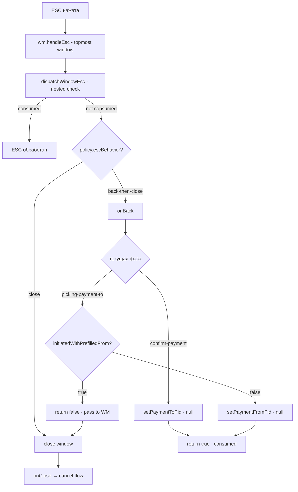

# Interact Flow — ESC Step-Back Fix (Unified Spec)

- **Дата**: 2026-03-02
- **Статус**: Implemented & Complete (all TODOs closed except optional ESC-dispatch localization and selector hardening)
- **Компонент**: Interact FSM / WindowManager ESC policy (Simulator UI v2)
- **История**: в этот документ слиты implementation-детали и AC из follow-up спеки; отдельный follow-up документ удалён после мерджа, чтобы не было расхождений.

**Реализация выполнена (2026-03-02):**

- FSM: добавлен latched-флаг `initiatedWithPrefilledFrom`.
- WM onBack: логика ESC step-back переключена с эвристики `fromPid` на `initiatedWithPrefilledFrom`; trustline edit/confirm теперь всегда делает step-back через очистку TO.
- Тесты: добавлены/обновлены unit/regression тесты на WM ESC и onBack.

**Дополнительно (по результатам код-ревью):** выявлены риски/техдолг и пробелы в тестах; зафиксированы ниже как проверяемые требования и TODO-чеклист.

---

## 1. Цель и краткое резюме

Цель — исправить ESC/back step-back для Interact-flow в режиме WindowManager (wm=1), чтобы:

1) **NodeCard/EdgeDetail (prefilled FROM)**: ESC не показывал «промежуточную пустую фазу» (FROM = —), а закрывал окно (или возвращал на выбор TO, если TO был задан) за ожидаемое число нажатий.
2) **ActionBar (без prefill)**: ESC работал пошагово (back к выбору FROM), не закрывая окно преждевременно.
3) **Trustline confirm/edit**: ESC не закрывал окно, а корректно делал step-back на выбор `TO`.
4) (Дополнительно) устранить UX-рассогласование, когда предзаполненный FROM отсутствует в списке вариантов из-за фильтрации.

Документ объединяет исходную спеку и follow-up implementation spec.

---

## 2. Описание проблем

### Дефект A — ESC step-back не различает origin flow (ОСНОВНОЙ)

В WM-режиме (wm=1) ESC должен вести себя по-разному в зависимости от того, **как был инициирован flow**:

- **NodeCard / EdgeDetail (FROM предзаполнен на старте)**: ESC на фазе выбора TO должен **закрывать окно** (возврат к выбору FROM бессмысленен, т.к. пользователь не делал этот шаг вручную).
- **ActionBar (без prefill)**: ESC на фазе выбора TO должен **шагнуть назад** к выбору FROM (пошаговый step-back по фазам).

Сейчас `onBack()` пытается решить это через эвристику "FROM уже установлен" (`state.fromPid` truthy). Это корректно для prefilled-сценариев, но **ломает ActionBar**: после выбора FROM `fromPid` тоже truthy, и ESC начинает **закрывать окно преждевременно** вместо step-back к picking-from.

**Затронутые действия:**

| Действие | Обработчик | Предзаполнение | Проблема |
|---|---|---|---|
| 💸 Send Payment — NodeCard | `onInteractSendPayment(fromPid)` ([SimulatorAppRoot.vue#L1119](../../../../../../simulator-ui/v2/src/components/SimulatorAppRoot.vue#L1119)) | FROM = nodeId | ДА |
| ＋ New Trustline — NodeCard | `onInteractNewTrustline(fromPid)` ([SimulatorAppRoot.vue#L1127](../../../../../../simulator-ui/v2/src/components/SimulatorAppRoot.vue#L1127)) | FROM = nodeId | ДА |
| ✏️ Edit Trustline — NodeCard | `onInteractEditTrustline(fromPid, toPid)` ([SimulatorAppRoot.vue#L1135](../../../../../../simulator-ui/v2/src/components/SimulatorAppRoot.vue#L1135)) | FROM + TO | ДА |
| Send Payment — EdgeDetail | `onEdgeDetailSendPayment()` ([SimulatorAppRoot.vue#L1040](../../../../../../simulator-ui/v2/src/components/SimulatorAppRoot.vue#L1040)) | FROM + TO | ДА |
| Send Payment — ActionBar | `onActionStartPaymentFlow()` ([SimulatorAppRoot.vue#L1144](../../../../../../simulator-ui/v2/src/components/SimulatorAppRoot.vue#L1144)) | нет | ДА (закрывает окно вместо step-back) |
| New Trustline — ActionBar | `onActionStartTrustlineFlow()` ([SimulatorAppRoot.vue#L1152](../../../../../../simulator-ui/v2/src/components/SimulatorAppRoot.vue#L1152)) | нет | ДА (закрывает окно вместо step-back) |
| 🔄 Run Clearing — ActionBar | `onActionStartClearingFlow()` ([SimulatorAppRoot.vue#L1161](../../../../../../simulator-ui/v2/src/components/SimulatorAppRoot.vue#L1161)) | нет | НЕТ — нет step-back |

### Дефект B — FROM фильтрация (условный)

Исторически: в `fromParticipants` computed при фильтрации по availability выбранный отправитель мог выпасть из списка, если у него нет исходящих TL с `available > 0`. Результат: FROM dropdown показывает предзаполненное значение, но участник отсутствует в списке вариантов — UX-рассогласование.

Статус на 2026-03-02: **в текущем коде уже добавлена гарантия** включения `state.fromPid` в список вариантов (см. [ManualPaymentPanel.vue#L230](../../../../../../simulator-ui/v2/src/components/ManualPaymentPanel.vue#L230)). В этом документе это остаётся как AC/регрессия.

---

## 3. Root Cause

### Дефект A — Цепочка обработки ESC

```
ESC (клавиша)
 └→ onGlobalKeydown()                      [SimulatorAppRoot.vue:712]
     └→ wm.handleEsc()                     [useWindowManager.ts:428]
         ├→ dispatchWindowEsc()            — nested content check
         └→ policy.onEsc()                 [useWindowManager.ts:458]
             └→ onBack()                   [SimulatorAppRoot.vue:396]
                 └─ фаза picking-payment-to:
                    эвристика: if (state.fromPid) return false
                    (в ActionBar flow fromPid уже выбран пользователем, поэтому truthy)
                    ⇒ WM закрывает окно → onClose → cancel()
```

**Проблема:** `onBack()` должен различать, был ли flow инициирован **с предзаполненным FROM** (NodeCard/EdgeDetail) или **без** (ActionBar). Нельзя выводить это из факта `state.fromPid != null`, потому что в ActionBar-сценарии `fromPid` становится truthy уже после выбора FROM пользователем.

Для flow из NodeCard шаг назад к `picking-payment-from` (например, через наивное `setPaymentFromPid(null)`) бесполезен — пользователь уже выбрал FROM через контекст узла.

### Дефект B — Отсутствие гарантии включения выбранного участника

До фикса: `fromParticipants` computed фильтровал участников по наличию исходящих TL с `available > 0`:

```typescript
// ManualPaymentPanel.vue (fromParticipants)
return participantsSorted.value.filter(
  (p) => pidsWithOutgoing.has((p?.pid ?? '').trim())
)
```

Проблема была в том, что если `state.fromPid` уже установлен (например, prefill), но у этого участника нет подходящих TL, он выпадал из отфильтрованного списка.

Статус на 2026-03-02: **уже исправлено** — после фильтрации текущий `state.fromPid` гарантированно добавляется в список (см. [ManualPaymentPanel.vue#L255](../../../../../../simulator-ui/v2/src/components/ManualPaymentPanel.vue#L255)).

---

## 4. Решение — Дефект A: Контекстный step-back (WM onBack)

### 4.1 Latched-флаг origin: `initiatedWithPrefilledFrom`

Добавить в Interact state (FSM) latched-флаг о том, как flow был инициирован.

**Критично:** флаг должен быть **latched** (защёлкнут) на старте flow и сохраняться до `cancel()`/`resetToIdle()`. Нельзя пересчитывать его как `state.fromPid !== null` при обновлениях window-data, потому что в ActionBar-сценарии пользователь выбирает FROM позже, и `state.fromPid` становится truthy, хотя flow был начат без prefill.

**Рекомендуемая логика установки (источник истины — FSM):**

- `startPaymentFlow()` / `startTrustlineFlow()` → `initiatedWithPrefilledFrom = false`
- `startPaymentFlowWithFrom(fromPid)` / `startTrustlineFlowWithFrom(fromPid)` → `initiatedWithPrefilledFrom = true`
- `resetToIdle()` / `cancel()` / `startNewFlow(...)` → сброс в `false`

### 4.2 Изменённая логика `onBack()`

```
onBack():
  p = текущая фаза

  // Payment
  if p === confirm-payment:
    setPaymentToPid(null) → return true            // step-back к picking-to (всегда)

  if p === picking-payment-to:
    if initiatedWithPrefilledFrom:
      return false                                  // WM закроет окно → cancel()
    else:
      setPaymentFromPid(null) → return true         // step-back к picking-from

  // Trustline
  if p === editing-trustline ИЛИ confirm-trustline-create:
    setTrustlineToPid(null) → return true           // step-back к picking-to (всегда)

  if p === picking-trustline-to:
    if initiatedWithPrefilledFrom:
      return false                                  // WM закроет окно → cancel()
    else:
      setTrustlineFromPid(null) → return true       // step-back к picking-from

  return false                                      // для остальных фаз — WM закрывает
```

### 4.3 Визуализация ESC flow



### 4.4 Обработка EdgeDetail Send Payment

`onEdgeDetailSendPayment()` запускает payment flow из EdgeDetail так, чтобы:

- FROM был предзаполнен (чтобы не было промежуточной picking-from фазы)
- TO был тоже предзаполнен (из выбранного edge)

Актуальный код (сокращённо):

```typescript
interact.mode.cancel()
interact.mode.startPaymentFlowWithFrom(toPid)
interact.mode.setPaymentToPid(fromPid)
```

В этом случае flow начинается сразу на фазе `confirm-payment`. ESC:
1. Первый ESC: `confirm-payment` → `setPaymentToPid(null)` → `picking-payment-to` (FROM виден)
2. Второй ESC: `picking-payment-to` + `initiatedWithPrefilledFrom=true` → `return false` → WM закрывает → `cancel()`

Это корректное поведение — 2 ESC для полностью предзаполненного flow.

---

## 5. Решение — Дефект B: Гарантия наличия выбранного участника в списке (уже реализовано)

### 5.1 Изменение в `fromParticipants` computed

После фильтрации по trustlines availability — проверить, что `state.fromPid` присутствует в результате. Если нет — добавить его в начало списка.

**Псевдокод:**

```
fromParticipants computed:
  filtered = participantsSorted.filter(p => pidsWithOutgoing.has(p.pid))

  if state.fromPid && !filtered.find(p => p.pid === state.fromPid):
    selectedParticipant = participantsSorted.find(p => p.pid === state.fromPid)
    if selectedParticipant:
      filtered = [selectedParticipant, ...filtered]

  return filtered
```

**Важно:** Если участник отсутствует даже в `participantsSorted`, ничего не добавляем — это значит, что данные ещё не загружены.

---

## 6. Acceptance Criteria

### AC-1: ESC на ManualPayment из NodeCard — 1 нажатие

- Открыть NodeCard → нажать Send Payment (FROM предзаполнен)
- Панель на фазе `picking-payment-to`, FROM показывает имя узла
- Нажать ESC → окно закрывается, flow отменяется
- **Не должно быть** промежуточного состояния с FROM = "—"

### AC-2: ESC на ManualPayment из ActionBar — пошаговый step-back

- Нажать Send Payment в ActionBar (FROM не предзаполнен)
- Выбрать FROM → фаза `picking-payment-to`
- Нажать ESC → step-back к `picking-payment-from`, FROM = "—" (корректно)
- Нажать ESC → окно закрывается, flow отменяется

### AC-3: ESC на ManualPayment из EdgeDetail — 2 нажатия

- Открыть EdgeDetail → нажать Send Payment (FROM + TO предзаполнены)
- Фаза `confirm-payment`
- Нажать ESC → step-back к `picking-payment-to`, FROM виден
- Нажать ESC → окно закрывается (skip промежуточной фазы picking-from)

### AC-4: ESC на New Trustline из NodeCard — 1 нажатие

- Открыть NodeCard → нажать New Trustline (FROM предзаполнен)
- Панель на фазе `picking-trustline-to`
- Нажать ESC → окно закрывается, flow отменяется
- **Не должно быть** промежуточного состояния с FROM = "—"

### AC-5: ESC на Edit Trustline из NodeCard — 2 нажатия

- Открыть NodeCard → нажать Edit Trustline (FROM + TO предзаполнены)
- Фаза `editing-trustline`
- Нажать ESC → step-back к `picking-trustline-to`, FROM виден
- Нажать ESC → окно закрывается (skip промежуточной фазы picking-from)

### AC-6: FROM виден в списке dropdown при предзаполнении

- Открыть NodeCard → нажать Send Payment
- FROM dropdown содержит выбранного участника, даже если у него нет TL с `available > 0`

### AC-7: Run Clearing — без изменений

- `onActionStartClearingFlow()` → clearing flow → ESC закрывает окно (нет step-back)
- Поведение не изменилось

### AC-8: Регрессия legacy ESC stack (legacy runtime) не затронута

- В legacy режиме (без WM) обработка ESC через `handleEscOverlayStack` не изменена
- Поведение идентично текущему

---

## 7. Изменения в коде (что именно правим)

### 7.1 `useInteractFSM.ts` (источник latched-флага)

**Файл:** `simulator-ui/v2/src/composables/interact/useInteractFSM.ts`

1) Добавить в состояние поля:

- `initiatedWithPrefilledFrom: boolean`

2) Устанавливать флаг **только** в точках старта flow:

- `startPaymentFlow()` → `false`
- `startPaymentFlowWithFrom(fromPid)` → `true`
- `startTrustlineFlow()` → `false`
- `startTrustlineFlowWithFrom(fromPid)` → `true`

3) Сбрасывать флаг при reset:

- `resetToIdle()` / `cancel()` / `startNewFlow(...)` → `false`

### 7.2 `useInteractMode.ts` (публичная фасад-логика)

**Файл:** `simulator-ui/v2/src/composables/useInteractMode.ts`

Прокинуть/сохранить `initiatedWithPrefilledFrom` как часть публичного `mode.state` (если сейчас state пробрасывается напрямую из FSM — проверить, что поле доступно в `interact.mode.state`).

### 7.3 `SimulatorAppRoot.vue` (WM onBack должен смотреть на latched-флаг)

**Файл:** `simulator-ui/v2/src/components/SimulatorAppRoot.vue`

В [`makeInteractPanelWindowData()`](../../../../../../simulator-ui/v2/src/components/SimulatorAppRoot.vue#L395) заменить текущую эвристику “prefilled == `state.fromPid` truthy” на “prefilled == `state.initiatedWithPrefilledFrom`”.

Также исправить ветку trustline `editing-trustline`/`confirm-trustline-create`, чтобы ESC делал `setTrustlineToPid(null)` и возвращал `true`, а не закрывал окно из-за `fromPid && toPid`.

### 7.4 `ManualPaymentPanel.vue` (Defect B)

**Файл:** `simulator-ui/v2/src/components/ManualPaymentPanel.vue`

Изменений не требуется: фикс уже реализован в текущем коде (см. [ManualPaymentPanel.vue#L255](../../../../../../simulator-ui/v2/src/components/ManualPaymentPanel.vue#L255)).
Рекомендуется оставить/добавить регресс-тест (см. ниже).

### 7.5 Тесты

**Файл:** `simulator-ui/v2/src/components/SimulatorAppRoot.interact.test.ts`

Добавить/обновить тесты:
- `wm=1: ESC на picking-payment-to (из NodeCard) — закрывает окно за 1 ESC`
- `wm=1: ESC на picking-payment-to (из ActionBar) — step-back к picking-from`
- `wm=1: ESC на picking-trustline-to (из NodeCard) — закрывает окно за 1 ESC`
- `wm=1: ESC на picking-trustline-to (из ActionBar) — step-back к picking-from`
- `wm=1: ESC в trustline confirm/edit — очищает TO и остаётся в окне`
- `wm=1: ESC на confirm-payment (из EdgeDetail) — step-back к picking-to, затем закрывает`

**Файл:** `simulator-ui/v2/src/components/ManualPaymentPanel.test.ts`

Добавить тест:
- `fromParticipants включает state.fromPid даже если отфильтрован по trustlines`

---

## 8. Риски и ограничения

### R-1: Нельзя выводить “prefilled” из `fromPid`

Нельзя вычислять `initiatedWithPrefilledFrom` через `state.fromPid != null`, иначе ломается ActionBar step-back (см. AC-2). Флаг должен быть latched и жить в FSM.

### R-2: Пользователь вручную меняет FROM в dropdown

Если пользователь при предзаполненном FROM вручную выбирает другой FROM через dropdown (`setPaymentFromPid(newPid)`), flow технически всё ещё `initiatedWithPrefilledFrom=true`. Это корректно — семантика флага: «шаг picking-from был пропущен при инициации, поэтому не нужен при step-back».

### R-3: Legacy mode (legacy runtime; удалён) не затронут

Всё решение живёт в `onBack()`, которая вызывается только через WM policy. В legacy режиме ESC обрабатывается через `handleEscOverlayStack`, который вызывает `interact.mode.cancel()` напрямую.

---

## Связанные документы

- [`node-card-overlay-interact-fixes-spec-2026-03-02.md`](../specs/archive/node-card-overlay-interact-fixes-spec-2026-03-02.md) — проблемы NodeCardOverlay в Interact mode
- [`wm-post-refactor-ux-issues-spec-2026-03-01.md`](../specs/wm-post-refactor-ux-issues-spec-2026-03-01.md) — WM UX issues post-refactor
- [`window-manager-acceptance-criteria.md`](../specs/window-manager-acceptance-criteria.md) — общие acceptance criteria WM

---

## 9. Реализовано в коде

- FSM state: `simulator-ui/v2/src/composables/interact/useInteractFSM.ts`
- WM onBack: `simulator-ui/v2/src/components/SimulatorAppRoot.vue`
- Тесты (WM ESC / step-back): `simulator-ui/v2/src/components/SimulatorAppRoot.interact.test.ts`
- Тесты (fromParticipants regression): `simulator-ui/v2/src/components/ManualPaymentPanel.test.ts`

---

## 10. Результаты код-ревью: риски и технический долг (дополнено)

### 10.1 Риск качества: дублирование инициализации flow state в FSM

**Наблюдение:** в FSM присутствуют несколько «точек старта», которые выставляют/дублируют части state вручную. Это создаёт риск расхождений при добавлении новых полей состояния: одна из веток старта может забыть выставить/сбросить новое поле.

**Где проявляется:** различается паттерн старта между «общим» сбросом и атомарными стартами:

- общий сброс/инициализация: [`useInteractFSM.startNewFlow()`](simulator-ui/v2/src/composables/interact/useInteractFSM.ts:115)
- атомарные старты с FROM: [`useInteractFSM.startPaymentFlowWithFrom()`](simulator-ui/v2/src/composables/interact/useInteractFSM.ts:130), [`useInteractFSM.startTrustlineFlowWithFrom()`](simulator-ui/v2/src/composables/interact/useInteractFSM.ts:145)

**Требование (фиксируем как контракт для предотвращения регрессий AC):**

- Должен существовать **единый источник истины** для инициализации/сброса всех полей flow-state.
- Любой новый старт flow (включая атомарные старты) обязан проходить через общий initializer (например, через вызов [`useInteractFSM.startNewFlow()`](simulator-ui/v2/src/composables/interact/useInteractFSM.ts:115) или выделенную внутреннюю функцию `initFlowState(...)`, которую вызывают все публичные `start*` методы).
- Добавление нового поля в state должно требовать изменения **в одном месте** и не должно ломать поведение ESC step-back и критерии AC.

### 10.2 Риск корректности: нормализация/валидация `fromPid` в атомарных стартах

**Наблюдение:** в атомарных стартах `fromPid` может приходить «сырым» (не `trim`/не валидирован). Потенциально возможен переход в `picking-...-to` с пустым FROM (например, строка из пробелов), что ломает логику отображения/step-back и может скрыто влиять на эвристики.

**Где проявляется:** [`useInteractFSM.startPaymentFlowWithFrom()`](simulator-ui/v2/src/composables/interact/useInteractFSM.ts:130), [`useInteractFSM.startTrustlineFlowWithFrom()`](simulator-ui/v2/src/composables/interact/useInteractFSM.ts:145).

**Ожидаемое поведение (guard):**

- Перед использованием `fromPid` должен быть нормализован (`trim`).
- Если после нормализации `fromPid` пустой или невалидный, атомарный старт **не должен** инициировать prefilled-сценарий.
- Фиксируемый fallback (для однозначности и тестируемости):
  - `startPaymentFlowWithFrom(fromPidRaw)` при пустом/невалидном `fromPidRaw` должен вести себя как `startPaymentFlow()` (старт без prefill, `initiatedWithPrefilledFrom = false`).
  - `startTrustlineFlowWithFrom(fromPidRaw)` при пустом/невалидном `fromPidRaw` должен вести себя как `startTrustlineFlow()` (старт без prefill, `initiatedWithPrefilledFrom = false`).

### 10.3 API/контракт: Option C hard dismiss должен быть описан явно

**Наблюдение:** текущее поведение «закрытия» стало шире, чем подразумевает имя функции: закрывается инспектор + Interact и делается best-effort cancel. Это превращается в «неявное знание», которое легко сломать при рефакторинге.

**Где проявляется:** [`SimulatorAppRoot.uiCloseTopmostInspectorWindow()`](simulator-ui/v2/src/components/SimulatorAppRoot.vue:167).

**Требование (контракт закрытия, Option C hard dismiss):**

- Действие close/hard dismiss должно быть задокументировано как **единая атомарная операция UI**: закрыть topmost inspector window, закрыть/свернуть Interact (если открыт) и выполнить best-effort отмену активного flow.
- Операция должна быть идемпотентной и безопасной к повторному вызову (best-effort).
- Если имя функции не отражает контракт, контракт должен быть явно записан в спеках, чтобы поведение не зависело от интерпретации названия.

### 10.4 Архитектурный риск: глобальный ESC-dispatch потенциально не локален

**Наблюдение:** ESC диспатчится глобально, поэтому при нескольких окнах/контейнерах обработчик может быть поглощён «не тем» слушателем. Это создаёт хрупкость в UX и тестах.

**Где проявляется:** [`useWindowManager.handleEsc()`](simulator-ui/v2/src/composables/windowManager/useWindowManager.ts:428), [`SimulatorAppRoot.dispatchInteractEsc()`](simulator-ui/v2/src/components/SimulatorAppRoot.vue:703).

**Известный риск / возможное улучшение:** локализовать ESC-dispatch по topmost окну/DOM-контейнеру (например, чтобы событие доставлялось только в активный window shell/overlay tree).

### 10.5 Тесты: пробелы и устойчивость (добавлено в DoD/TODO)

**Наблюдение:** часть регрессионных сценариев не зафиксирована тестами или покрыта недостаточно устойчиво (флейки из-за селекторов).

**Необходимые тест-кейсы (добавить/усилить):**

- Payment ActionBar: «второй ESC после step-back» (после возврата с `picking-payment-to` на `picking-payment-from` второй ESC должен закрыть окно корректно) — см. рядом с [`SimulatorAppRoot.interact.test.ts`](simulator-ui/v2/src/components/SimulatorAppRoot.interact.test.ts:1359).
- Trustline ActionBar: аналогично «второй ESC после step-back» — см. рядом с [`SimulatorAppRoot.interact.test.ts`](simulator-ui/v2/src/components/SimulatorAppRoot.interact.test.ts:1515).
- Clearing confirm: ESC закрывает окно без step-back, `cancel` вызывается ровно 1 раз — см. [`SimulatorAppRoot.interact.test.ts`](simulator-ui/v2/src/components/SimulatorAppRoot.interact.test.ts:1270).
- Latched-flag не пересчитывается после ручной смены FROM: зафиксировать сценарий, что `initiatedWithPrefilledFrom` остаётся latched и не вычисляется из `state.fromPid` при построении window-data — логика [`SimulatorAppRoot.makeInteractPanelWindowData()`](simulator-ui/v2/src/components/SimulatorAppRoot.vue:395) + сценарий теста рядом с [`SimulatorAppRoot.interact.test.ts`](simulator-ui/v2/src/components/SimulatorAppRoot.interact.test.ts:1311).

**Рекомендация по селекторам (уменьшить флейки):**

- В тестах предпочитать стабильные селекторы (`data-testid`, роли/лейблы), избегать хрупких цепочек DOM/текста.
- Конкретный пример «хрупкого места», которое стоит укрепить: [`SimulatorAppRoot.interact.test.ts`](simulator-ui/v2/src/components/SimulatorAppRoot.interact.test.ts:721).

---

## 11. Definition of Done (дополнено)

- Все AC из раздела «Acceptance Criteria» продолжают выполняться и защищены тестами.
- Инициализация/сброс flow-state в FSM имеет **единый источник истины**; атомарные старты не дублируют инициализацию вручную (см. [`useInteractFSM.startNewFlow()`](simulator-ui/v2/src/composables/interact/useInteractFSM.ts:115)).
- Атомарные старты с FROM выполняют нормализацию/валидацию `fromPid`; при пустом/невалидном значении применяется fallback на обычный старт без prefill (см. [`useInteractFSM.startPaymentFlowWithFrom()`](simulator-ui/v2/src/composables/interact/useInteractFSM.ts:130), [`useInteractFSM.startTrustlineFlowWithFrom()`](simulator-ui/v2/src/composables/interact/useInteractFSM.ts:145)).
- Контракт Option C hard dismiss (что именно закрывается и какие best-effort отмены происходят) явно задокументирован (см. [`SimulatorAppRoot.uiCloseTopmostInspectorWindow()`](simulator-ui/v2/src/components/SimulatorAppRoot.vue:167)).
- Добавлены/усилены регрессионные тесты, перечисленные в разделе «Результаты код-ревью: тесты»; в частности: «2-й ESC после step-back» для payment/trustline ActionBar, clearing confirm (cancel ровно 1 раз), и тест на latched-семантику `initiatedWithPrefilledFrom`.
- Селекторы в тестах укреплены (уменьшен риск флейков) согласно рекомендациям.

---

## 12. TODO

- [x] FSM: унифицировать инициализацию flow-state — реализовано: добавлена внутренняя `_initFlowState()` как единственный источник истины; все `start*` функции теперь роутятся через неё (см. [useInteractFSM.ts](../../../../../../simulator-ui/v2/src/composables/interact/useInteractFSM.ts)).
- [x] Атомарные старты: нормализовать и валидировать `fromPid` — реализовано: `startPaymentFlowWithFrom` и `startTrustlineFlowWithFrom` теперь делают `trim()` и при пустом/невалидном значении fallback на обычный old без prefill (см. [useInteractFSM.ts](../../../../../../simulator-ui/v2/src/composables/interact/useInteractFSM.ts)).
- [x] Документировать контракт Option C hard dismiss — реализовано: контракт задокументирован в комментарии `uiCloseTopmostInspectorWindow()` как «AC-4 / Option C: outside-click is a hard dismiss» (см. [SimulatorAppRoot.vue](../../../../../../simulator-ui/v2/src/components/SimulatorAppRoot.vue#L167)).
- [ ] (Опционально) Локализовать ESC-dispatch по topmost окну/DOM-контейнеру, чтобы избежать cross-window consumption (см. [`useWindowManager.handleEsc()`](../../../../../../simulator-ui/v2/src/composables/windowManager/useWindowManager.ts), [`SimulatorAppRoot.dispatchInteractEsc()`](../../../../../../simulator-ui/v2/src/components/SimulatorAppRoot.vue)).
- [x] Тест: payment ActionBar — «второй ESC после step-back» — добавлен (см. [SimulatorAppRoot.interact.test.ts](../../../../../../simulator-ui/v2/src/components/SimulatorAppRoot.interact.test.ts)).
- [x] Тест: trustline ActionBar — «второй ESC после step-back» — добавлен (см. [SimulatorAppRoot.interact.test.ts](../../../../../../simulator-ui/v2/src/components/SimulatorAppRoot.interact.test.ts)).
- [x] Тест: clearing confirm — ESC закрывает окно без step-back, `cancel` вызывается ровно 1 раз — добавлен (см. [SimulatorAppRoot.interact.test.ts](../../../../../../simulator-ui/v2/src/components/SimulatorAppRoot.interact.test.ts)).
- [x] Тест: latched-flag `initiatedWithPrefilledFrom` не пересчитывается после ручной смены FROM — добавлен (см. [SimulatorAppRoot.interact.test.ts](../../../../../../simulator-ui/v2/src/components/SimulatorAppRoot.interact.test.ts)).
- [ ] Тесты: усилить селекторы (перейти на `data-testid`/role-based, уменьшить флейки) и заменить хрупкие места — остаётся как ongoing tech debt.
