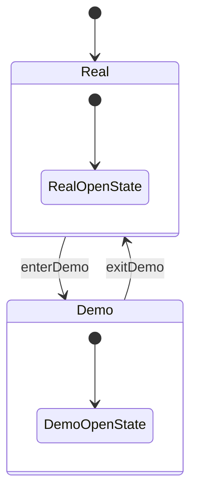
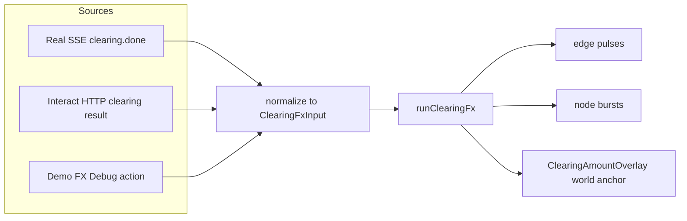

# Спецификация: фиксы Demo UI panel + унификация Clearing FX (Demo vs Real)

Документ описывает требования, архитектурное решение, алгоритмы, план реализации и тест‑план для:

1) стабилизации панели DevTools/FX Debug при входе/выходе из Demo UI;
2) исправления позиционирования clearing amount label;
3) унификации FX‑пайплайна Demo vs Real (один код, разные источники событий);
4) удаления мёртвых query‑параметров и фиксации URL‑контракта.

## Матрица статуса реализации

> **Implementation note (2026-03-01):** Следующая таблица отражает текущий статус реализации описанных в спеке решений.

| # | Компонент | Статус | Примечание |
|---|-----------|--------|------------|
| 1 | Единый `runClearingFx` pipeline | ✅ Done | `onClearingDone` + `runRealClearingDoneFx` оба вызывают `runClearingFx()` |
| 2 | Dedup mechanism (edge-sig + planId) | ✅ Done | `_clearingFxDedupByEdgeSig` + `_clearingFxDedupByPlanId` |
| 3 | DevTools → controlled `
` model | ⏳ TODO | `@toggle` handler + single source of truth |
| 4 | Persisted DevTools prefs (localStorage) | ⏳ TODO | `.real` / `.demo` / `.realSnapshot` ключи |
| 5 | Snapshot/restore DevTools при enter/exit demo | ⏳ TODO | Сейчас — full page reload, нет snapshot |
| 6 | ClearingAmountOverlay (world-coords) | ⏳ TODO | Сейчас — node-anchored через `nodeId` |
| 7 | Центроид midpoints рёбер (не узлов) | ⏳ TODO | Сейчас — координаты узлов `ln.__x, ln.__y` |
| 8 | Удаление fallback `originNodeId = opts.nodeIds[0]!` | ⏳ TODO | Fallback всё ещё в коде (строка 1455) |
| 9 | retry→skip (time-based maxWaitMs) | ⏳ TODO | Сейчас: count-based (6×80ms=480ms) |
| 10 | Удаление `devtools=1` из URL (enterDemoUi) | ⏳ TODO | sp.set('devtools','1') всё ещё в строке 804 |
| 11 | Unit тесты (DevTools, anchor, retry) | ⏳ TODO | Ни один тест из плана не реализован |
| 12 | E2E тесты (Playwright) | ⏳ TODO | Ни один тест из плана не реализован |

Связанные места в коде (источники):

- DevTools panel и текущая привязка `open`: [`simulator-ui/v2/src/components/BottomBar.vue`](simulator-ui/v2/src/components/BottomBar.vue:190)
- Переключение Demo UI через query + reload: [`simulator-ui/v2/src/components/SimulatorAppRoot.vue`](simulator-ui/v2/src/components/SimulatorAppRoot.vue:775)
- Определение demo UI: [`useSimulatorApp.isDemoUi`](simulator-ui/v2/src/composables/useSimulatorApp.ts:237)
- Clearing FX и amount label:
  - [`useSimulatorApp.runClearingFx()`](simulator-ui/v2/src/composables/useSimulatorApp.ts:1351)
  - [`useSimulatorApp.pushClearingLabelDeferred()`](simulator-ui/v2/src/composables/useSimulatorApp.ts:1435)
  - fallback `originNodeId = opts.nodeIds[0]!`: [`useSimulatorApp.pushClearingLabelDeferred()`](simulator-ui/v2/src/composables/useSimulatorApp.ts:1455)
- Мёртвый параметр `devtools`: запись в `enterDemoUi()` без чтения как источника состояния: [`enterDemoUi()`](simulator-ui/v2/src/components/SimulatorAppRoot.vue:798)

## 1) Executive summary

### Что ломается сейчас

- В Demo UI панель DevTools/FX Debug ведёт себя нестабильно: при входе в Demo может закрываться, несмотря на ожидание что она остаётся открытой. Причина — конфликт источников правды: `
` одновременно является «uncontrolled» (нативное состояние `open`) и частично контролируется через `:open=...` и прямые присваивания `details.open`.
- В Demo при клиринге amount label может появляться «в неверном месте» (например, улетает вверх к первому узлу) из‑за fallback‑логики `originNodeId = opts.nodeIds[0]!` при недостаточной готовности layout.
- Demo vs Real не гарантируют UI‑параллелизм: поведение зависит от ветки событий и готовности layout; местами разные источники данных приводят к визуальным расхождениям.
- В URL генерируется мёртвый параметр `devtools=1`, который не является источником состояния и не участвует в восстановлении UI.

### Что будет после фикса

- DevTools panel станет строго контролируемой моделью состояния `devToolsOpen` (single source of truth) с явной синхронизацией по событию `toggle`, устойчивой к re-render и смене режима.
- При входе в Demo UI DevTools panel будет открыта и останется открытой. При выходе из Demo UI состояние DevTools panel будет восстановлено (snapshot/restore real‑состояния).
- Clearing amount overlay будет привязан к **world‑координате** (x,y) геометрического якоря клиринга (центроид midpoints рёбер), а не к `nodeId`. При отсутствии layout — только retry до `maxWaitMs`, затем skip (не показывать), без fallback‑позиции.
- Demo и Real будут переиспользовать один FX‑пайплайн (одни типы входных данных и одна точка исполнения FX), отличаясь только источником событий.
- URL‑контракт будет формализован: `ui=demo` остаётся, `debug` остаётся, `devtools` удаляется (не генерируется; при наличии в URL игнорируется для обратной совместимости).

## 2) Термины / определения

- Demo UI — режим UI, активируемый query‑параметром `ui=demo` (см. [`useSimulatorApp.isDemoUi`](simulator-ui/v2/src/composables/useSimulatorApp.ts:237)), с упором на демонстрацию/отладку FX поверх «канонического» источника событий.
- Real mode — режим, где события приходят из backend (SSE/HTTP), и UI должен отражать реальное состояние прогона.
- FX pipeline — последовательность шагов, которая берёт нормализованный вход (например clearing.done / clearing result) и генерирует UI‑эффекты: вспышки, активные узлы/рёбра, пульсации рёбер, bursts, overlays.
- Layout readiness — состояние, когда layout‑координаты (`__x`, `__y`) для необходимых узлов/рёбер доступны для вычислений.
- Overlay / amount label — визуальный текстовый элемент, связанный с FX (например clearing amount), который должен появляться на стабильной якорной позиции в world‑координатах и исчезать по TTL.

## 3) Проблема A: DevTools panel (Demo)

### 3.1 Root cause

Ключевые причины нестабильности DevTools panel:

1) Конфликт источников истины `open` для `
`.
   - В шаблоне DevTools `
` используется `:open="autoOpenDevtools || undefined"`, что задаёт начальное состояние, но не создаёт устойчивой контролируемой модели (см. [`BottomBar.vue`](simulator-ui/v2/src/components/BottomBar.vue:190)).
   - Параллельно существует `devToolsOpen` и `watch(devToolsOpen, ...)` с прямым присваиванием `devToolsRef.open = val` (см. [`BottomBar.vue`](simulator-ui/v2/src/components/BottomBar.vue:53)), но это состояние не обновляется при пользовательском клике по `
` (нет `toggle`‑обработчика), поэтому компонент фактически «полу‑контролируемый».

2) Отсутствие sticky state / persisted prefs для состояния DevTools panel. После reload (который используется для переключения Demo UI) нативное состояние `
` теряется.

3) Переключение Demo UI сейчас завязано на query + reload (см. [`SimulatorAppRoot.vue`](simulator-ui/v2/src/components/SimulatorAppRoot.vue:775)), что приводит к полному перезапуску приложения и потере transient UI state.

### 3.2 Требования / инварианты

**Инварианты поведения DevTools panel**:

1) Enter demo → панель открыта и остаётся открытой.
   - Если пользователь после входа закрыл панель вручную, это решение должно быть sticky внутри Demo UI.

2) Exit demo → состояние восстанавливается по snapshot real‑состояния.
   - Выбранный контракт: при переходе Real → Demo делаем snapshot состояния DevTools panel (real), в Demo используем отдельное persisted состояние; при выходе Demo → Real восстанавливаем snapshot.

3) User-toggle sticky в Real.
   - Если пользователь открыл DevTools panel в Real, последующие re-render / смена props / смена сегмента не должны её самопроизвольно закрывать.

4) Источник истины один.
   - Состояние панели должно быть выражено как `devToolsOpen: boolean` в модели состояния, и UI `
` синхронизируется с ним.

### 3.3 Дизайн решения

#### 3.3.1 Controlled `
`

Уходим от «uncontrolled `
`».

Целевой паттерн:

- `devToolsOpen` — единственный источник истины.
- `
` (без `undefined`‑трюков).
- Обработчик `@toggle` читает `event.target.open` и пишет в `devToolsOpen`.

Т.е. состояние меняется только по:

1) инициализации (persisted prefs + правила режима);
2) пользовательскому `toggle`.

> **Implementation note (2026-03-01):** ⏳ **TODO** — controlled `
` model ещё не реализована. Текущий код по-прежнему использует полу-контролируемый подход (`:open="autoOpenDevtools || undefined"` + `watch` с прямым присваиванием `details.open`).

#### 3.3.2 Persisted prefs и разделение Demo vs Real

Решение по persistence:

- Хранить в storage (предпочтительно `localStorage`), а не в URL.
- В URL оставлять только «режимы» (`ui=demo`), не transient UI state.

Ключи хранения (предложение, можно скорректировать при реализации):

- `geo.sim.v2.devtools.open.real = 0|1`
- `geo.sim.v2.devtools.open.demo = 0|1`
- `geo.sim.v2.devtools.open.realSnapshot = 0|1` (короткоживущий snapshot, можно хранить in-memory; в storage — только если нужен для восстановления через reload)

Семантика snapshot/restore:

- При входе в Demo:
  - сохраняем текущее real‑значение `devToolsOpen` в snapshot;
  - принудительно выставляем `devToolsOpen = true` (инвариант enter demo);
  - затем разрешаем пользователю менять `devToolsOpen` в рамках Demo и писать в `...open.demo`.
- При выходе из Demo:
  - восстанавливаем `devToolsOpen` из snapshot real‑состояния;
  - продолжаем использовать persisted `...open.real` для sticky.

> **Implementation note (2026-03-01):** ⏳ **TODO** — persisted prefs и snapshot/restore механизм ещё не реализованы. Сейчас переключение Demo UI использует full page reload, при котором transient UI state теряется.

#### 3.3.3 Auto-open vs user intent

Политика приоритетов:

1) User intent (persisted) выше autoOpen.
2) При enter demo autoOpen принудительный один раз (только переход), после чего user intent sticky.

Практический вывод: `autoOpenDevtools` как prop для [`BottomBar.vue`](simulator-ui/v2/src/components/BottomBar.vue:31) остаётся только как сигнал «мы только что вошли в demo», но не как долгосрочный управляющий параметр `:open`.

### 3.4 Удаление мёртвых параметров

**Требование**: удалить мёртвый query‑параметр `devtools`.

- `enterDemoUi()` не должен писать `devtools=1` в URL, так как параметр не является источником состояния и не участвует в восстановлении состояния DevTools panel.
- Для обратной совместимости: если пользователь открыл старую ссылку с `devtools=1`, приложение должно его игнорировать (не генерировать заново).

> **Implementation note (2026-03-01):** ⏳ **TODO** — `enterDemoUi()` по-прежнему содержит `sp.set('devtools','1')` (строка ~804 в SimulatorAppRoot.vue). Параметр не удалён.

### 3.5 Acceptance criteria (Problem A)

1) В Real режиме пользователь открывает DevTools panel → панель остаётся открытой после любых re-render и смены сегментов.
2) Enter demo → DevTools panel открыта по умолчанию.
3) В Demo пользователь закрывает DevTools panel → она остаётся закрытой при любых реактивных обновлениях в Demo.
4) Exit demo → DevTools panel восстанавливает предыдущее состояние Real (snapshot).
5) URL при enter/exit demo не содержит `devtools=1`.

### 3.6 Тест‑план (Problem A)

> **Implementation note (2026-03-01):** ⏳ **TODO** — ни один тест из данного плана не реализован.

- Component/Unit (Vue Test Utils):
  - Тест controlled поведения: `@toggle` меняет `devToolsOpen`, и `:open` отражает это; re-render не сбрасывает состояние.
  - Тест persisted prefs: при монтировании из storage выставляется ожидаемое значение.

- E2E (Playwright):
  - Открыть приложение в Real, открыть DevTools panel, перезагрузить страницу → панель остаётся открытой.
  - Enter Demo UI (кнопка) → панель открыта.
  - Exit Demo UI → панель в состоянии, которое было в Real до входа.

## 4) Проблема B: Clearing amount label positioning

### 4.1 Наблюдаемая проблема и root cause

Сейчас clearing label создаётся через функцию, которая:

- берёт `nodeIds` (endpoint‑узлы из множества клиринговых рёбер);
- пытается дождаться координат layout через ретраи;
- вычисляет центроид по доступным координатам;
- затем выбирает ближайший к центроиду узел и создаёт label, привязанный к `nodeId`.

Если координат не оказалось (layout не готов) — используется fallback `originNodeId = opts.nodeIds[0]!` (см. [`useSimulatorApp.pushClearingLabelDeferred()`](simulator-ui/v2/src/composables/useSimulatorApp.ts:1455)). Это даёт неверный якорь и визуально «вылетает» (особенно заметно в Demo).

### 4.2 Требования / инварианты

1) Amount label должен стартовать из **геометрического якоря клиринга** (центр фигуры рёбер / центроид), а не зависеть от `nodeIds[0]` или порядка данных.
2) Запрещён показ лейбла в заведомо неверной позиции.
   - Если layout не готов — поведение: retry до `maxWaitMs`, затем skip (не показывать).
3) Demo/Real должны выдавать одинаковый визуальный результат при одинаковом `ClearingFxInput`.
4) API менять можно; предпочтение — привязка overlay к world‑координате (x,y).

### 4.3 Правильное архитектурное решение: overlay по world‑координатам

#### 4.3.1 Новый контракт overlay

Вводим отдельный тип overlay для clearing amount:

`ClearingAmountOverlay`:

- `id: string`
- `text: string`
- `worldX: number`
- `worldY: number`
- `ttlMs: number`
- `styleKey: string` (например `clearing-premium`)
- `planId?: string`

Ключевое: overlay создаётся в world‑координатах, а не «около nodeId».

> **Implementation note (2026-03-01):** ⏳ **TODO** — `ClearingAmountOverlay` и привязка к world-координатам ещё не реализованы. Текущий код использует node-anchored подход через `nodeId`.

#### 4.3.2 Единственная точка входа FX

Единый clearing FX должен исполняться в одном месте: [`useSimulatorApp.runClearingFx()`](simulator-ui/v2/src/composables/useSimulatorApp.ts:1351).

Требование унификации: Demo/Real поставляют одинаковый нормализованный вход (см. ниже), а дальнейшая визуализация (edge pulses, bursts, overlay) всегда одна и та же.

> **Implementation note (2026-03-01):** ✅ **Done** — единый `runClearingFx` pipeline уже реализован:
> - `onClearingDone` (HTTP/Interact path) вызывает `runClearingFx()` напрямую (useSimulatorApp.ts:716).
> - `runRealClearingDoneFx` (SSE path) вызывает `runClearingFx()` напрямую (useSimulatorApp.ts:1494).
>
> ✅ **Done** — dedup mechanism реализован через `_clearingFxDedupByEdgeSig` + `_clearingFxDedupByPlanId` (useSimulatorApp.ts:1339-1374). Реализация использует edge-signature и planId maps, а не поле `source` из предложенного `ClearingFxInput`.

### 4.4 Алгоритм геометрического якоря

#### 4.4.1 Входные данные

На вход алгоритму якоря нужны:

- список клиринговых рёбер: `edges: Array<{ from: string; to: string }>`
- доступ к layout‑координатам endpoint‑узлов (`__x`, `__y`) через `getLayoutNodeById`.

#### 4.4.2 Выбор метода центроида

Рекомендуемый метод: **центроид множества midpoint’ов рёбер**.

Почему midpoints лучше, чем «все endpoint‑узлы»:

- midpoint’ы напрямую отражают геометрию «фигуры рёбер», а не плотность/степень узлов.
- midpoint‑центроид устойчивее к неоднородности степеней (когда один узел участвует во многих рёбрах).

#### 4.4.3 Псевдо‑алгоритм

1) Для каждого ребра `(from, to)`:
   - если обе координаты endpoint‑узлов доступны → вычислить midpoint `mx = (x1+x2)/2`, `my = (y1+y2)/2` и добавить в список.
2) Если список midpoint пуст:
   - если `elapsed < maxWaitMs` → schedule retry;
   - иначе → skip overlay.
3) Посчитать центроид midpoint’ов:
   - `cx = avg(mx)`
   - `cy = avg(my)`
4) Создать `ClearingAmountOverlay` в `(cx, cy)`.

Политика retry:

- `maxWaitMs` фиксируется в спеки (предложение: 600–1000мс) и реализуется как ограничение по времени (а не по количеству ретраев).
- Частота: экспоненциальный backoff или фиксированный шаг (например 60–100мс), чтобы не создавать лишнюю нагрузку.

> **Implementation note (2026-03-01):** ⏳ **TODO** — текущая реализация использует count-based retry (`retryLeft=6`, `retryDelayMs=80`, суммарно ~480ms max), а не time-based подход (`maxWaitMs`), предложенный в спеке. При реализации необходимо выбрать один подход и зафиксировать.

Запрет fallback:

- Никаких `nodeIds[0]` или «привязать к ближайшему узлу». Если нет валидной геометрии — overlay не показываем.

### 4.5 Синхронизация Demo vs Real (clearing)

#### 4.5.1 Нормализованный вход

Существующий тип уже близок к нужному (см. [`ClearingFxParams`](simulator-ui/v2/src/composables/useSimulatorApp.ts:1325)). В целевом дизайне фиксируем контракт:

`ClearingFxInput`:

- `edges: Array<{ from: string; to: string }>`
- `totalAmount: string`
- `equivalent: string`
- `planId?: string`
- `source: 'sse' | 'http' | 'demo'` (опционально, только для диагностики/логов)

> **Implementation note (2026-03-01):** Текущий код использует тип `ClearingFxParams` (useSimulatorApp.ts:1325) с полями `totalAmount` + `equivalent`, а не `ClearingFxInput` с полем `source`. Dedup реализован через edge-signature/planId maps, а не через `source` field. При реализации `ClearingFxInput` — согласовать с существующим `ClearingFxParams` или заменить его.
>
> Также: для interact-пути существует отдельный `_interactFxState` (useSimulatorApp.ts:694-695, 1016), который управляет состоянием FX отдельно. Хотя `onClearingDone` уже маршрутизирует через общий `runClearingFx` без передачи отдельного fxState, `_interactFxState` остаётся деталью текущей архитектуры и должен быть учтён при дальнейшей унификации.

Источники событий:

- Real SSE: `clearing.done` → нормализация → `runClearingFx(input)` (уже есть путь через [`runRealClearingDoneFx()`](simulator-ui/v2/src/composables/useSimulatorApp.ts:1486)).
- Interact/HTTP: clearing response → нормализация → `runClearingFx(input)`.
- Demo FX Debug action: после запуска действия ожидаем `clearing.done` по SSE и используем тот же путь.

#### 4.5.2 Запрет UI‑расхождений

- `runClearingFx` выполняет одинаковые шаги FX для всех источников.
- Overlay якорится в world‑координате центроида midpoints.
- Если layout не готов — единая политика retry→skip.

### 4.6 Acceptance criteria (Problem B)

1) При clearing FX label появляется в центре фигуры клиринговых рёбер (визуально ближе к центру рёбер, а не «у вершины»).
2) При delayed layout label появляется в правильном месте после готовности layout (в пределах `maxWaitMs`).
3) При отсутствии layout (никогда не готов) label не показывается.
4) В Demo и Real при одинаковом наборе `edges` и `amount` label появляется в одной и той же позиции (с поправкой на стабильность layout).
5) В коде отсутствует fallback `nodeIds[0]` для создания clearing overlay.

### 4.7 Тест‑план (Problem B)

> **Implementation note (2026-03-01):** ⏳ **TODO** — ни один тест из данного плана не реализован.

- Unit:
  - Anchor computation: по фиксированным координатам узлов и `edges` вычисляется ожидаемый `(cx, cy)`.
  - Delayed layout: сначала координат нет, затем появляются — overlay создаётся один раз и в правильном месте.
  - No layout: координаты не появляются до `maxWaitMs` — overlay не создаётся.

- Visual heuristic / snapshot:
  - В тестовом окружении с фиктивным layout проверять, что overlay стартует в пределах ожидаемого bounding box клиринговых рёбер.

## 5) Удаление мёртвых параметров / URL contract

### 5.1 Итоговый контракт query‑параметров

Фиксируем:

- `ui=demo` — включает Demo UI (источник истины: [`useSimulatorApp.isDemoUi`](simulator-ui/v2/src/composables/useSimulatorApp.ts:237)).
- `debug=1|true` — включает FX Debug в не‑demo режиме (источник истины: [`useSimulatorApp.isFxDebugEnabled`](simulator-ui/v2/src/composables/useSimulatorApp.ts:222)).

Удаляем:

- `devtools` — мёртвый параметр. Не генерируем, не читаем как источник состояния.

Аудит:

- Выполнить обзор всех `URLSearchParams` чтений/записей в UI и составить полный список параметров.
- Для каждого параметра зафиксировать: назначение, владелец (компонент/композабл), источник истины (URL vs storage), статус (остается/удаляется).

### 5.2 Стратегия миграции

- Backward compatibility: старые параметры (например `devtools=1`) игнорируются, но не воспроизводятся в новых переходах.
- Принцип: URL используется для режимов и воспроизводимости, storage — для пользовательских предпочтений и transient UI.

## 6) План реализации (этапы)

### Этап 1: DevTools panel refactor + persisted prefs + удаление `devtools`

- Перевести DevTools panel на controlled state.
- Ввести persisted prefs для `devToolsOpen` отдельно для Demo/Real + snapshot/restore.
- Убрать генерацию `devtools=1` в [`enterDemoUi()`](simulator-ui/v2/src/components/SimulatorAppRoot.vue:798).
- Зафиксировать и проверить, что `debug` работает как раньше.

### Этап 2: Overlay API по world‑координатам + интеграция в clearing FX

- Ввести тип `ClearingAmountOverlay` и инфраструктуру отображения в world‑координатах.
- Заменить `pushClearingLabelDeferred` на создание overlay из world‑координат.
- Реализовать вычисление anchor через midpoints + retry→skip.
- Удалить fallback на `nodeIds[0]`.

### Этап 3: Тесты (unit/e2e)

- Unit/component тесты для DevTools panel.
- Unit тесты для anchor computation и retry→skip.
- E2E сценарии enter/exit demo + стабильность open.

### Этап 4: Cleanup

- Удалить старые ветки/типы/параметры и неиспользуемые функции.
- Убедиться, что URL‑контракт и storage‑ключи задокументированы.

## 7) Риски и меры

### Риск 1: несовместимость нового overlay API

Меры:

- Ввести адаптерный слой на время миграции: старый API `nodeId` и новый `worldX/worldY` могут сосуществовать до полного переноса.
- Покрыть тестами создание overlay и корректность координат.

### Риск 2: overlay не показывается при долгом отсутствии layout

Меры:

- Явный `maxWaitMs` + best-effort логирование (в debug режиме) причины skip.
- В FX Debug UI добавить диагностическую метку/лог (только для dev/debug), что overlay был пропущен по `layout-not-ready`.

## Приложение: диаграммы

### A) Состояния DevTools panel при переходах Real ↔ Demo

### B) Унифицированный clearing FX pipeline

## Связанные документы

> **Implementation note (2026-03-01):**
> - [`plans/demo-real-clearing-fx-refactoring.md`](plans/demo-real-clearing-fx-refactoring.md) — **частично устарел**: Фаза 1 (унификация FX — единый `runClearingFx` pipeline + dedup) уже реализована. Фаза 3.1 (добавить `devtools=1`) **противоречит** данной спеке, которая требует УДАЛИТЬ `devtools=1` из URL.
