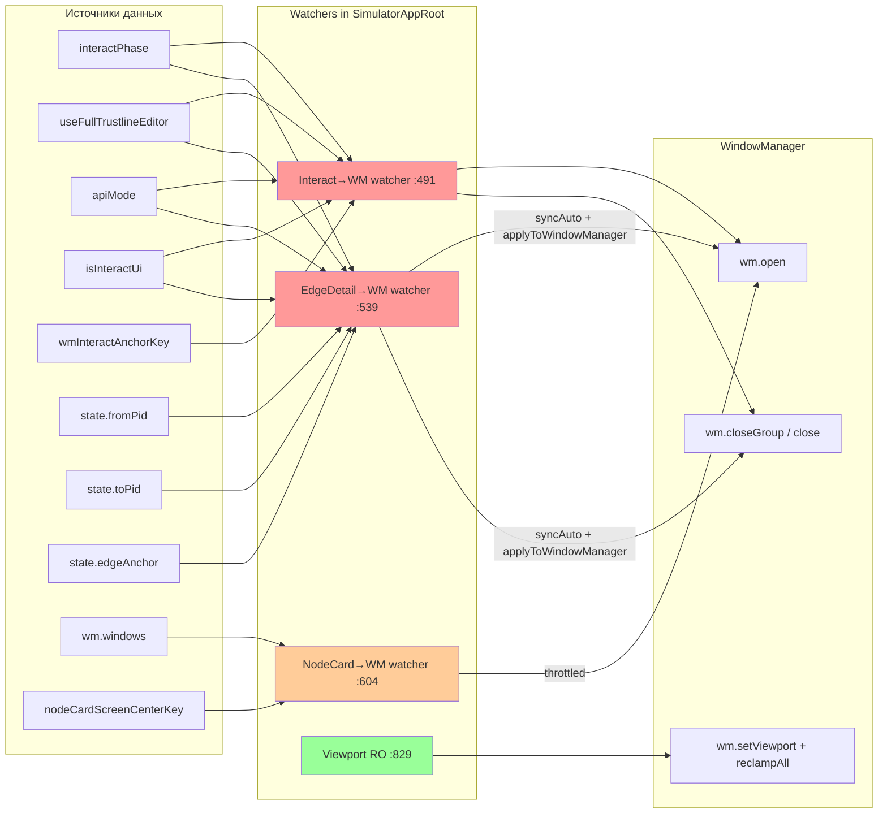
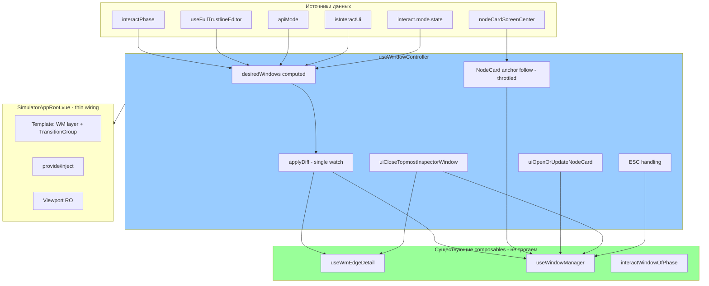

# Архитектурная спецификация: useWindowController — декомпозиция оконного слоя

> **Дата**: 2026-03-04
> **Тип документа**: Architecture Specification
> **Scope**: ARCH-2 (REQ-23) + ARCH-3 (REQ-24) из [interact-windows-audit-2026-03-02.md](interact-windows-audit-2026-03-02.md)
> **Статус**: DRAFT v1

---

## Содержание

- [1. Цель и мотивация](#1-цель-и-мотивация)
- [2. Текущее состояние — AS-IS](#2-текущее-состояние--as-is)
  - [2.1 Interact→WM watcher](#21-interactwm-watcher)
  - [2.2 EdgeDetail→WM watcher](#22-edgedetailwm-watcher)
  - [2.3 NodeCard→WM watcher](#23-nodecardwm-watcher)
  - [2.4 Viewport RO watcher](#24-viewport-ro-watcher)
  - [2.5 Диаграмма текущих зависимостей](#25-диаграмма-текущих-зависимостей)
- [3. Целевое состояние — TO-BE](#3-целевое-состояние--to-be)
  - [3.1 Composable useWindowController](#31-composable-usewindowcontroller)
  - [3.2 Тип DesiredWindowState](#32-тип-desiredwindowstate)
  - [3.3 Функция applyDiff](#33-функция-applydiff)
  - [3.4 Миграция watchers в desiredWindows computed](#34-миграция-watchers-в-desiredwindows-computed)
  - [3.5 Диаграмма целевой архитектуры](#35-диаграмма-целевой-архитектуры)
- [4. Декомпозиция SimulatorAppRoot.vue](#4-декомпозиция-simulatorapprootvue)
  - [4.1 Что выносится в useWindowController](#41-что-выносится-в-usewindowcontroller)
  - [4.2 Что остаётся в SimulatorAppRoot.vue](#42-что-остаётся-в-simulatorapprootvue)
  - [4.3 Что остаётся в отдельных composables](#43-что-остаётся-в-отдельных-composables)
- [5. План миграции](#5-план-миграции)
  - [Этап 1: Создать useWindowController с interact watcher](#этап-1-создать-usewindowcontroller-с-interact-watcher)
  - [Этап 2: Перенести NodeCard watcher](#этап-2-перенести-nodecard-watcher)
  - [Этап 3: Интегрировать EdgeDetail](#этап-3-интегрировать-edgedetail)
  - [Этап 4: Cleanup SimulatorAppRoot](#этап-4-cleanup-simulatorapproot)
- [6. Критерии приёмки](#6-критерии-приёмки)
- [7. Риски и митигация](#7-риски-и-митигация)

---

## 1. Цель и мотивация

### Зачем нужен `useWindowController()`

[`useWindowController()`](simulator-ui/v2/src/composables/useWindowController.ts) — единый composable-слой между **бизнес-логикой** (Interact FSM, selection state, EdgeDetail lifecycle) и **оконным менеджером** ([`useWindowManager()`](simulator-ui/v2/src/composables/windowManager/useWindowManager.ts)).

Текущая архитектура: бизнес-логика «какое окно должно быть открыто» размазана по 3+ watchers внутри монолитного [`SimulatorAppRoot.vue`](simulator-ui/v2/src/components/SimulatorAppRoot.vue) (~1350+ строк `<script setup>`). Controller консолидирует все решения «должно ли окно быть открыто?» в **одном декларативном computed**, а применение diff-а к WM — в **одном watch**.

### Какие проблемы решает

| ID | Проблема | Как решает controller |
|----|----------|-----------------------|
| **ARCH-2** | Монолитный SimulatorAppRoot.vue — 4+ watchers с overlapping deps, ~200 строк bridging кода | Watchers выносятся в composable; root остаётся тонким wiring-слоем |
| **ARCH-3** | Нет единого state machine для окон — состояние размазано между windowsMap, ad-hoc flags, id tracking refs, interactPhase | Controller = единый derived state: `desiredWindows: computed` описывает intent; WM — execution |
| **PERF-3** | Множественные watchers могут fire в одном flush, вызывая избыточные `wm.open()` | Один watch с shallow diff = одна серия WM-операций за reactive flush |
| **RACE-3** | Concurrent `wm.open()` из разных watchers с overlapping triggers | Единый watch исключает конкурентность по определению |

### Что НЕ входит в scope

- **Не трогаем** [`useWindowManager()`](simulator-ui/v2/src/composables/windowManager/useWindowManager.ts) — pure WM (position, z-order, resize, ESC handling, focus-return)
- **Не трогаем** [`useWmEdgeDetail()`](simulator-ui/v2/src/composables/useWmEdgeDetail.ts) — EdgeDetail state machine (ARCH-6 Done)
- **Не трогаем** [`WindowShell.vue`](simulator-ui/v2/src/components/WindowShell.vue) — geometry wrapper
- **Не трогаем** [`interactWindowOfPhase()`](simulator-ui/v2/src/composables/windowManager/interactWindowOfPhase.ts) — phase → window type mapping
- **Не трогаем** [`useInteractMode()`](simulator-ui/v2/src/composables/useInteractMode.ts) — Interact FSM

---

## 2. Текущее состояние — AS-IS

В [`SimulatorAppRoot.vue`](simulator-ui/v2/src/components/SimulatorAppRoot.vue) находятся 4 bridging watcher-а, связывающих бизнес-логику с WM:

### 2.1 Interact→WM watcher

**Расположение**: [`SimulatorAppRoot.vue:491-528`](simulator-ui/v2/src/components/SimulatorAppRoot.vue:491)

**Входные зависимости** (что watch-ит):
- `apiMode` — текущий режим API (real/demo)
- `isInteractUi` — активен ли Interact UI
- `interactPhase` — текущая фаза Interact FSM (строка)
- `useFullTrustlineEditor` — полный vs quick editor для trustline
- `wmInteractAnchorKey` — стабилизированный ключ anchor-а (избежание object identity retrigger)

**Выходные side effects** (что мутирует):
- `wm.open({ type: 'interact-panel', ... })` — открывает/обновляет interact-panel окно
- `wm.closeGroup('interact', 'programmatic')` — закрывает группу interact
- `wmPanelOpenAnchor.value = null` — сбрасывает anchor ref
- `wmEdgePopupAnchor.value = null` — сбрасывает edge popup anchor

**Потенциальные проблемы**:
- При смене фазы одновременно с изменением anchor (overlapping deps с `wmInteractAnchorKey`) — возможен лишний re-trigger
- `wm.open()` при `singleton='reuse'` внутренне мутирует `windowsMap` → если бы использовался `watchEffect`, возник бы circular loop (защищено ARCH-4 guard)
- Совпадение triggers с EdgeDetail watcher (оба зависят от `interactPhase` и `isFullEditor`)

**Алгоритм**:
```
if apiMode !== real OR !isInteractUi:
  wm.closeGroup(interact)
  return

m = interactWindowOfPhase(phase, isFullEditor)
if m.type === interact-panel:
  wm.open({ type: interact-panel, data, focus: never })
  return

wm.closeGroup(interact)
clear anchors
```

### 2.2 EdgeDetail→WM watcher

**Расположение**: [`SimulatorAppRoot.vue:539-569`](simulator-ui/v2/src/components/SimulatorAppRoot.vue:539)

**Входные зависимости** (что watch-ит):
- `apiMode` — текущий режим API
- `isInteractUi` — активен ли Interact UI
- `interactPhase` — текущая фаза FSM
- `useFullTrustlineEditor` — режим editor
- `interact.mode.state.fromPid` — выбранный FROM участник
- `interact.mode.state.toPid` — выбранный TO участник
- `interact.mode.state.edgeAnchor.x` — anchor X
- `interact.mode.state.edgeAnchor.y` — anchor Y

**Выходные side effects** (что мутирует):
- `wmEdgeDetail.syncAuto(req)` — обновляет state machine EdgeDetail
- `wmEdgeDetail.applyToWindowManager(wm)` — применяет state к WM (`wm.open()`/`wm.close()`)

**Потенциальные проблемы**:
- 8 зависимостей в одном watcher → высокий cognitive load
- Общие зависимости с Interact watcher (`interactPhase`, `isFullEditor`) → оба fire в одном flush при переходе в `editing-trustline`
-  `state.edgeAnchor` сериализуется через `String(x)` и `String(y)` для стабильности — неэлегантно

**Алгоритм**:
```
eligible = apiMode === real && isInteractUi
           && phase === editing-trustline && !isFullEditor

if eligible && anchor && fromPid && toPid:
  req = { fromPid, toPid, anchor, focus: never, source: auto }
else:
  req = null

wmEdgeDetail.syncAuto(req)
wmEdgeDetail.applyToWindowManager(wm)
```

### 2.3 NodeCard→WM watcher

**Расположение**: [`SimulatorAppRoot.vue:604-633`](simulator-ui/v2/src/components/SimulatorAppRoot.vue:604)

**Входные зависимости** (что watch-ит):
- `wm.windows` — наличие `node-card` окна (через `.some()`)
- `nodeCardScreenCenterKey` — computed ключ из `nodeId|x|y` экранного центра ноды

**Выходные side effects** (что мутирует):
- `nodeCardAnchorUpdater.request({ nodeId, anchor })` → throttled `wm.open({ type: 'node-card', focus: 'never' })`
- `wmNodeCardId.value` — обновляет id tracking ref

**Потенциальные проблемы**:
- Зависит от `getNodeScreenCenter(nodeId)` → перcчитывается при каждом camera change (pan/zoom)
- Throttle (100ms) уменьшает churn, но всё равно создаёт reactive overhead
- Early return guard сравнивает anchor по значению → три сравнения на каждый tick

**Особенности**:
- Этот watcher **не открывает** NodeCard — только обновляет anchor существующего окна
- Первичное открытие NodeCard выполняется outside watcher — через [`uiOpenOrUpdateNodeCard()`](simulator-ui/v2/src/components/SimulatorAppRoot.vue:187) из canvas dblclick handler
- UX-5 guard (повторный dblclick на ту же ноду) находится в `uiOpenOrUpdateNodeCard()`, а не в watcher

### 2.4 Viewport RO watcher

**Расположение**: [`SimulatorAppRoot.vue:829-838`](simulator-ui/v2/src/components/SimulatorAppRoot.vue:829)

**Входные зависимости**:
- `ResizeObserver` на host element (`hostEl`)

**Выходные side effects**:
- `wm.setViewport(vp)` — обновляет viewport для clamp
- `wm.reclampAll()` — пересчитывает позиции всех окон

**Потенциальные проблемы**:
- Minimal: это чистый infrastructure watcher, не связанный с бизнес-логикой

**Решение по миграции**: Viewport RO **не переносится** в controller — он не связан с бизнес-решениями «какое окно открыто», а только с геометрией WM.

### 2.5 Диаграмма текущих зависимостей



**Красные** (W1, W2) — перекрёстные зависимости, потенциальные multi-fire в одном flush.
**Оранжевый** (W3) — camera-driven anchor follow.
**Зелёный** (W4) — чистый инфраструктурный watcher.

---

## 3. Целевое состояние — TO-BE

### 3.1 Composable `useWindowController()`

Файл: `simulator-ui/v2/src/composables/useWindowController.ts`

**Inputs** (аргументы composable):

| Input | Тип | Источник |
|-------|-----|----------|
| `apiMode` | `Ref<string>` | `useSimulatorApp()` |
| `isInteractUi` | `Ref<boolean>` | `useSimulatorApp()` |
| `interactPhase` | `ComputedRef<InteractPhase>` | `interact.mode.phase` |
| `isFullEditor` | `Ref<boolean>` | `useFullTrustlineEditor` |
| `interactState` | `InteractState` | `interact.mode.state` |
| `interactMode` | `InteractModeApi` | `interact.mode` — для `cancel()`, `setPaymentToPid()` и т.д. |
| `wmEdgeDetail` | `WmEdgeDetailApi` | `useWmEdgeDetail()` |
| `wm` | `WindowManagerApi` | `useWindowManager()` |
| `getNodeScreenCenter` | `(nodeId: string) => Point or null` | `useSimulatorApp()` |
| `wmInteractAnchor` | `ComputedRef<WindowAnchor or null>` | computed anchor |

**Outputs**:

| Output | Тип | Описание |
|--------|-----|----------|
| `desiredWindows` | `ComputedRef<DesiredWindowState[]>` | Декларативное описание intent |
| `uiOpenOrUpdateNodeCard` | `(o: {...}) => void` | Callback для canvas dblclick |
| `uiCloseTopmostInspectorWindow` | `() => string or null` | Callback для outside-click |
| `uiCloseEdgeDetailWindow` | `(reason) => void` | Callback для EdgeDetail close |
| `onGlobalKeydown` | `(ev: KeyboardEvent) => void` | ESC handling |

**Главный принцип**: `desiredWindows` вычисляется **чисто** (без side effects) из входных данных. Один `watch(desiredWindows, ...)` применяет diff к WM.

### 3.2 Тип `DesiredWindowState`

```ts
type DesiredWindowState = {
  /** Уникальный ключ для diff-сравнения */
  key: string
  /** Тип окна в терминах WM */
  type: WindowType
  /** Должно ли окно быть открыто */
  shouldBeOpen: boolean
  /** Данные окна — передаются в wm.open({ data }) */
  data: WindowData
  /** Anchor для позиционирования */
  anchor: WindowAnchor | null
  /** Политика фокуса при обновлении через watcher */
  focus: FocusMode
}
```

**Ключ `key`** уникально идентифицирует «слот» окна:
- `'interact-panel'` — единственный interact slot
- `'node-card'` — единственный inspector/node-card slot
- `'edge-detail'` — единственный inspector/edge-detail slot

### 3.3 Функция `applyDiff()`

```ts
function applyDiff(
  prev: DesiredWindowState[],
  next: DesiredWindowState[],
  wm: WindowManagerApi,
  wmEdgeDetail: WmEdgeDetailApi,
): void
```

**Алгоритм**:

```
for each key in union(prev.keys, next.keys):
  prevSlot = prev.find(key)
  nextSlot = next.find(key)

  if !prevSlot.shouldBeOpen && nextSlot.shouldBeOpen:
    // OPEN: окно должно появиться
    if nextSlot.type === edge-detail:
      wmEdgeDetail.open(nextSlot) + applyToWindowManager(wm)
    else:
      wm.open({ type, data, anchor, focus })

  else if prevSlot.shouldBeOpen && !nextSlot.shouldBeOpen:
    // CLOSE: окно должно исчезнуть
    if nextSlot.type === edge-detail:
      wmEdgeDetail.close(...) + applyToWindowManager(wm)
    else:
      wm.closeByType(type, programmatic)

  else if prevSlot.shouldBeOpen && nextSlot.shouldBeOpen:
    // UPDATE: окно открыто, но данные/anchor могли измениться
    if dataChanged(prevSlot.data, nextSlot.data)
       || anchorChanged(prevSlot.anchor, nextSlot.anchor):
      if nextSlot.type === edge-detail:
        wmEdgeDetail.syncAuto(nextSlot) + applyToWindowManager(wm)
      else:
        wm.open({ type, data, anchor, focus: never })
```

**Свойства `applyDiff()`**:
- **Идемпотентность**: повторный вызов с теми же prev/next не генерирует WM-операций
- **Shallow comparison**: `data` и `anchor` сравниваются по значению (не identity)
- **Порядок**: close выполняется до open (для корректного closeGroupExcept)

### 3.4 Миграция watchers в `desiredWindows` computed

#### Interact watcher → `computeDesiredInteractWindow()`

Текущий watcher [`SimulatorAppRoot.vue:491-528`](simulator-ui/v2/src/components/SimulatorAppRoot.vue:491) трансформируется в чистую функцию:

```ts
function computeDesiredInteractWindow(
  apiMode: string,
  isInteractUi: boolean,
  phase: InteractPhase,
  isFullEditor: boolean,
  anchor: WindowAnchor | null,
  interactMode: InteractModeApi,
): DesiredWindowState | null {
  if (apiMode !== 'real' || !isInteractUi) return null

  const m = interactWindowOfPhase(phase, isFullEditor)
  if (m?.type !== 'interact-panel') return null

  return {
    key: 'interact-panel',
    type: 'interact-panel',
    shouldBeOpen: true,
    data: makeInteractPanelWindowData(m.panel, phase, interactMode),
    anchor,
    focus: 'never',
  }
}
```

**Что переносится из root**: `makeInteractPanelWindowData()`, `wmInteractAnchor` computed, `wmInteractAnchorKey` computed, `wmEdgePopupAnchor` ref, `wmPanelOpenAnchor` ref.

#### EdgeDetail watcher → делегирование `useWmEdgeDetail`

Текущий watcher [`SimulatorAppRoot.vue:539-569`](simulator-ui/v2/src/components/SimulatorAppRoot.vue:539) **не трансформируется в обычный `desiredWindows` slot**, потому что EdgeDetail уже имеет собственный state machine ([`useWmEdgeDetail()`](simulator-ui/v2/src/composables/useWmEdgeDetail.ts)).

Вместо этого controller:
1. Вычисляет `eligible` + `req` (чистый computed) — такая же логика, как текущий watcher
2. В своём единственном `watch` вызывает `wmEdgeDetail.syncAuto(req)` + `wmEdgeDetail.applyToWindowManager(wm)`

Это исключает отдельный watcher, но сохраняет `useWmEdgeDetail` как source of truth для EdgeDetail lifecycle.

#### NodeCard watcher → `computeDesiredNodeCardWindow()`

Текущий watcher [`SimulatorAppRoot.vue:604-633`](simulator-ui/v2/src/components/SimulatorAppRoot.vue:604) **частично** переносится:

- **Anchor follow** (throttled camera updates) остаётся отдельным механизмом внутри controller — `createPeriodicTrailingThrottle` переносится
- **NodeCard presence** трекается через WM windows (не через computed desired state), т.к. NodeCard открывается not reactively — из imperative canvas dblclick handler

**Важное отличие**: NodeCard не управляется виз desiredWindows computed. Он открывается императивно через `uiOpenOrUpdateNodeCard()` (dblclick handler). Controller инкапсулирует:
- `uiOpenOrUpdateNodeCard()` — imperative open
- Anchor follow watcher (throttled) — reactive update
- `wmNodeCardId` tracking ref

#### Viewport watcher → остаётся отдельным

Viewport RO (ResizeObserver) **не переносится** в controller. Это чистый инфраструктурный механизм (`setViewport` + `reclampAll`), не связанный с бизнес-решениями.

### 3.5 Диаграмма целевой архитектуры



---

## 4. Декомпозиция SimulatorAppRoot.vue

### 4.1 Что выносится в `useWindowController()`

| Элемент | Текущая строка | Описание |
|---------|----------------|----------|
| Interact→WM watcher | `:491-528` | Watch + `interactWindowOfPhase` → WM ops |
| EdgeDetail→WM watcher | `:539-569` | Watch + `wmEdgeDetail.syncAuto` → WM ops |
| NodeCard anchor follow watcher | `:604-633` | Watch + throttled `wm.open()` |
| `makeInteractPanelWindowData()` | `:375-412` | Factory для interact-panel data + onBack/onClose |
| `wmInteractAnchor` computed | `:465-473` | Anchor priority: edge-popup > panel-open |
| `wmInteractAnchorKey` computed | `:479-483` | Stable string key для anchor |
| `wmEdgePopupAnchor` ref | `:363` | Anchor от EdgeDetail popup action |
| `wmPanelOpenAnchor` ref | `:373` | Anchor от NodeCard/ActionBar |
| `wmNodeCardId` ref | `:136` | ID tracking singleton node-card |
| `uiOpenOrUpdateNodeCard()` | `:187-207` | Imperative open from dblclick |
| `uiCloseEdgeDetailWindow()` | `:140-143` | Close EdgeDetail + suppress |
| `uiCloseTopmostInspectorWindow()` | `:145-175` | Outside-click close logic |
| `createPeriodicTrailingThrottle()` | `:426-463` | Throttle util для NodeCard anchor |
| `nodeCardScreenCenterKey` computed | `:575-583` | Camera-driven key |
| `nodeCardAnchorUpdater` | `:585-598` | Throttle instance |
| `isFormLikeTarget()` | `:737-741` | Helper для ESC guard |
| `dispatchTopmostWindowEsc()` | `:743-763` | ESC dispatch to per-window container |
| `confirmCancelInteractBusy()` | `:765-776` | Busy confirm dialog |
| `hardDismissInteractBusyIfNeeded()` | `:778-798` | P0-2 busy guard |
| `onGlobalKeydown()` | `:800-818` | Global ESC handler |
| `toWmAnchor()` | `:414-417` | Point → WindowAnchor converter |

### 4.2 Что остаётся в SimulatorAppRoot.vue

| Элемент | Описание |
|---------|----------|
| **Template** | WM layer (`TransitionGroup`), `WindowShell` v-for, panel slot content, TopBar, BottomBar, ActionBar, canvas |
| **provide/inject wiring** | `provideTopBarContext()`, `provideActivePanelState()` |
| **Viewport RO** | `ResizeObserver` → `wm.setViewport()` + `wm.reclampAll()` (infrastructure, не бизнес-логика) |
| **Physics/layout wiring** | Всё что связано с canvas rendering, labels, fxDebug |
| **TopBar event handlers** | mode switching, scenario selection |
| **Canvas event handlers** | `onCanvasClick`, `onCanvasDblClick` (делегируют в controller через callbacks) |
| **Theme management** | `uiTheme`, `setUiTheme`, URL sync |
| **Computed helpers для template** | `interactSelectedLink`, `wmEdgeDetailEffectiveLink`, `wmEdgeDetailEffectivePhase` и т.д. |
| **@measured handler** | `wm.updateMeasuredSize()` + `wm.reclamp()` из WindowShell emit |
| **@close handler** | Делегирует в controller |

### 4.3 Что остаётся в отдельных composables

| Composable | Статус | Описание |
|------------|--------|----------|
| [`useWmEdgeDetail()`](simulator-ui/v2/src/composables/useWmEdgeDetail.ts) | ✅ Уже вынесен (ARCH-6 Done) | EdgeDetail state machine |
| [`useWindowManager()`](simulator-ui/v2/src/composables/windowManager/useWindowManager.ts) | ✅ Уже вынесен | Pure WM: position, z-order, resize, ESC |
| [`useInteractMode()`](simulator-ui/v2/src/composables/useInteractMode.ts) | ✅ Уже вынесен | Interact FSM, epoch-based runner |
| [`interactWindowOfPhase()`](simulator-ui/v2/src/composables/windowManager/interactWindowOfPhase.ts) | ✅ Уже вынесен | Phase → window type mapping |

---

## 5. План миграции

### Этап 1: Создать `useWindowController()` с interact watcher

**Scope**: перенести Interact→WM bridging в новый composable.

**Действия**:
1. Создать файл `simulator-ui/v2/src/composables/useWindowController.ts`
2. Перенести `makeInteractPanelWindowData()` (`:375-412`)
3. Перенести `wmInteractAnchor` computed + `wmInteractAnchorKey` computed (`:465-483`)
4. Перенести `wmEdgePopupAnchor` ref + `wmPanelOpenAnchor` ref (`:363, :373`)
5. Перенести `toWmAnchor()` helper (`:414-417`)
6. Перенести interact→WM watch (`:491-528`) в controller
7. Экспортировать API: `{ wmEdgePopupAnchor, wmPanelOpenAnchor }`
8. В [`SimulatorAppRoot.vue`](simulator-ui/v2/src/components/SimulatorAppRoot.vue) — вызвать `useWindowController(...)` и заменить inline watcher на controller
9. **ARCH-4 guard**: перенести `const watchEffect: never = null as never` защиту в controller

**Критерии прохождения этапа**:
- Все тесты в [`SimulatorAppRoot.interact.test.ts`](simulator-ui/v2/src/components/SimulatorAppRoot.interact.test.ts) проходят без изменений
- Все ESC AC (AC-1..AC-8) проходят
- Нет новых Vue reactivity warnings

### Этап 2: Перенести NodeCard watcher

**Scope**: перенести NodeCard→WM bridging в controller.

**Действия**:
1. Перенести `wmNodeCardId` ref (`:136`)
2. Перенести `uiOpenOrUpdateNodeCard()` (`:187-207`) включая UX-5 guard
3. Перенести `createPeriodicTrailingThrottle()` utility (`:426-463`)
4. Перенести `nodeCardScreenCenterKey` computed (`:575-583`)
5. Перенести `nodeCardAnchorUpdater` instance + watch (`:585-633`)
6. Перенести `onUnmounted` cleanup для throttle (`:600-602`)
7. Экспортировать API: `{ uiOpenOrUpdateNodeCard, wmNodeCardId }`

**Критерии прохождения этапа**:
- NodeCard open / close / switch по dblclick работают
- UX-5 guard: повторный dblclick на ту же ноду — no-op
- UX-9 throttle: anchor follow при pan/zoom ≤ 1 update/100ms
- Все существующие тесты проходят

### Этап 3: Интегрировать EdgeDetail

**Scope**: перенести EdgeDetail→WM bridging и outside-click logic в controller.

**Действия**:
1. Перенести EdgeDetail→WM watch (`:539-569`) в controller
2. Controller вызывает `wmEdgeDetail.syncAuto()` + `wmEdgeDetail.applyToWindowManager()` в своём watch
3. Перенести `uiCloseEdgeDetailWindow()` (`:140-143`)
4. Перенести `uiCloseTopmostInspectorWindow()` (`:145-175`)
5. Экспортировать API: `{ uiCloseEdgeDetailWindow, uiCloseTopmostInspectorWindow }`

**Критерии прохождения этапа**:
- EdgeDetail показывается в `editing-trustline` + `!isFullEditor`
- EdgeDetail keepAlive/suppressed сценарии работают
- Outside-click закрывает inspector + cancel interact
- Все существующие тесты проходят

### Этап 4: Cleanup SimulatorAppRoot

**Scope**: перенести ESC handling и финализировать cleanup.

**Действия**:
1. Перенести ESC handling (`isFormLikeTarget`, `dispatchTopmostWindowEsc`, `confirmCancelInteractBusy`, `hardDismissInteractBusyIfNeeded`, `onGlobalKeydown`) в controller
2. Удалить все перенесённые watchers, refs и functions из [`SimulatorAppRoot.vue`](simulator-ui/v2/src/components/SimulatorAppRoot.vue)
3. Оставить тонкий wiring layer: template + provide/inject + viewport RO
4. Проверить что все computed helpers для template (effective-ссылки и т.д.) корректно работают с controller API
5. Написать unit-тесты для `useWindowController()` в isolation (desiredWindows computed)

**Критерии прохождения этапа**:
- [`SimulatorAppRoot.vue`](simulator-ui/v2/src/components/SimulatorAppRoot.vue) < 800 строк (цель)
- Все существующие тесты проходят без изменений
- Нет дублирования логики между controller и root
- `useWindowController()` покрыт unit-тестами

---

## 6. Критерии приёмки

### Функциональные

| # | Критерий | Метод проверки |
|---|----------|----------------|
| F-1 | Все тесты в [`SimulatorAppRoot.interact.test.ts`](simulator-ui/v2/src/components/SimulatorAppRoot.interact.test.ts) проходят **без изменений тестов** | `vitest run` |
| F-2 | Все ESC AC (AC-1..AC-8) проходят | Integration тесты |
| F-3 | Canvas empty click = hard dismiss (inspector + interact cancel) | Integration тесты |
| F-4 | NodeCard open/close/switch корректны | Integration тесты |
| F-5 | EdgeDetail keepAlive/suppressed корректны | Unit тесты `useWmEdgeDetail` |
| F-6 | Busy-guard для ESC (P0-2) работает | Integration тесты |

### Архитектурные

| # | Критерий | Метод проверки |
|---|----------|----------------|
| A-1 | `SimulatorAppRoot.vue` < 800 строк `<script setup>` | `wc -l` |
| A-2 | `useWindowController()` содержит ≤ 2 watch-а (один для desiredWindows/EdgeDetail diff, один для NodeCard anchor follow) | Code review |
| A-3 | Нет WM bridging watchers в `SimulatorAppRoot.vue` | Code search: `watch(` в root |
| A-4 | ARCH-4 guard (`watchEffect: never`) присутствует в controller | Code review |
| A-5 | Нет дублирования логики между controller и root | Code review |

### Качество

| # | Критерий | Метод проверки |
|---|----------|----------------|
| Q-1 | `useWindowController()` покрыт unit-тестами | `vitest --coverage` |
| Q-2 | Нет новых Vue reactivity warnings | Console output при test run |
| Q-3 | Нет `console.error` в test run | Console output |
| Q-4 | `desiredWindows` computed тестируется в isolation (без DOM) | Unit тесты |

---

## 7. Риски и митигация

| # | Риск | Вероятность | Импакт | Митигация |
|---|------|-------------|--------|-----------|
| R-1 | **Circular reactive updates** при переносе watchers | Средняя | Высокий | Один watch вместо множества; ARCH-4 `watchEffect: never` guard; запуск полного тест-сьюта после каждого этапа |
| R-2 | **Регрессия ESC / outside-click** — нарушение step-back или busy-guard | Средняя | Высокий | Все 8 ESC AC + canvas-click AC как safety net; этапная миграция (по одному watcher за раз) |
| R-3 | **Performance** — один большой computed вместо четырёх маленьких | Низкая | Низкий | Shallow comparison в `applyDiff()`; computed кэширует результат до изменения deps; профилирование Vue devtools |
| R-4 | **NodeCard imperative open** не вписывается в declarative model | Средняя | Средний | NodeCard открывается imperative (dblclick handler), а не через desiredWindows. Controller инкапсулирует оба пути, но не пытается «декларативизировать» user-initiated actions |
| R-5 | **EdgeDetail state machine** уже имеет свой lifecycle — конфликт с controller watch | Низкая | Средний | Controller **делегирует** в `wmEdgeDetail.syncAuto()` / `applyToWindowManager()`, не дублирует state machine. EdgeDetail SM остаётся source of truth для своего lifecycle |
| R-6 | **Тесты привязаны к internal watcher timing** | Низкая | Средний | Существующие тесты тестируют observable behavior (что окно открылось/закрылось), а не watcher internals. При сохранении API контракта тесты не ломаются |
