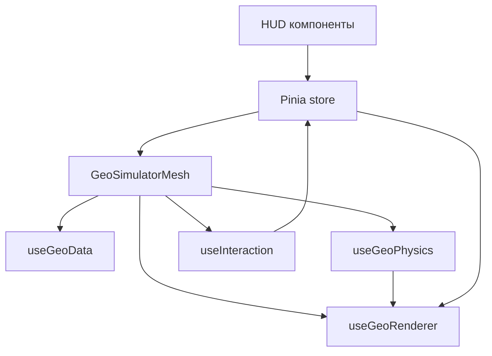

# Техническое задание (ТЗ)
# GEO Simulator — Этап 1: Интерактивная визуализация графа (Game UI)

**Версия:** 1.0 (Draft)
**Размещение:** `docs/ru/simulator/frontend/` (рядом с фазовыми спеками)

## 0. Источники и контекст

ТЗ синтезировано на основе следующих спецификаций:

- [docs/ru/simulator/frontend/archive/SPEC-GEO-Simulator-Phase1.md](docs/ru/simulator/frontend/archive/SPEC-GEO-Simulator-Phase1.md:1) (архив)
- [docs/ru/simulator/frontend/archive/MAIN Spec GEO Simulator Implementation (Vue 3 Stack).md](docs/ru/simulator/frontend/archive/MAIN%20Spec%20GEO%20Simulator%20Implementation%20(Vue%203%20Stack).md:1) (архив)
- [docs/ru/simulator/frontend/Игровой интерфейс симулятора GEO.md](docs/ru/simulator/frontend/%D0%98%D0%B3%D1%80%D0%BE%D0%B2%D0%BE%D0%B9%20%D0%B8%D0%BD%D1%82%D0%B5%D1%80%D1%84%D0%B5%D0%B9%D1%81%20%D1%81%D0%B8%D0%BC%D1%83%D0%BB%D1%8F%D1%82%D0%BE%D1%80%D0%B0%20GEO.md:1)
- [docs/ru/simulator/specs/GENERAL-simulator-application.md](docs/ru/simulator/specs/GENERAL-simulator-application.md:1)

Цель Этапа 1 — построить интерактивный, «игровой» прототип визуализации сети доверия GEO, демонстрирующий:

- участников как узлы;
- линии доверия как ребра;
- процесс транзакции как поток по связи;
- процесс клиринга как схлопывание долгов (визуальная симуляция).

Визуальный стиль должен **кардинально отличаться** от Admin UI: упор на иммерсивность, визуальные эффекты (glow/bloom, частицы), плавную физику и HUD.

---

## 1. Термины и маппинг на GEO

### 1.1. Участник (Participant)
Сущность сети (человек/бизнес). В симуляторе отображается как узел (node).

### 1.2. Линия доверия (Trustline)
Кредитная связь между двумя участниками. В симуляторе отображается как ребро (link).

Минимальная интерпретация для Этапа 1:

- связь существует между A и B;
- у связи есть «сила/ёмкость» (trustLimit) и/или «важность» (strength);
- визуально связь может быть «пассивной» или «активной».

### 1.3. Транзакция (Transaction)
Процесс передачи обязательства/стоимости между участниками. В Этапе 1 транзакция **не обязана** строго соответствовать реальной маршрутизации протокола; важна наглядная визуализация «потока» по сети.

### 1.4. Клиринг (Clearing)
Схлопывание взаимных долгов (netting) по циклам/цепочкам. В Этапе 1 допускается упрощенная эвристика (например, поиск треугольников) с обязательным визуальным эффектом схлопывания и последующим изменением отображаемых балансов (демо).

---

## 2. Цели, рамки и критерии успеха

### 2.1. Цель Этапа 1
Сделать MVP интерактивного графа на Vue 3, демонстрирующего «живую систему» (physics + VFX) и базовые процессы (Tx + Clearing), согласно [docs/ru/simulator/frontend/archive/SPEC-GEO-Simulator-Phase1.md](docs/ru/simulator/frontend/archive/SPEC-GEO-Simulator-Phase1.md:14).

### 2.2. В рамке (In scope)

1) Отрисовка графа (узлы + ребра) на Canvas 2D.

2) Базовая физика раскладки (force-directed), стабилизация, анимация idle «дыхания».

3) Интерактивность:

- клик по узлу открывает HUD-карточку участника;
- подсветка связей выбранного узла + затемнение остальных;
- drag узлов (перетаскивание) с последующей «дораскладкой» физикой (узел не pinned).

4) Анимации процессов:

- транзакция: частица/комета летит от A к B;
- клиринг: визуализация схлопывания (встречные частицы + вспышка/взрыв).

5) Источник данных:

- загрузка из API, если доступно;
- fallback на генерацию моков.

### 2.3. Вне рамки (Out of scope)

- полноценная экономическая симуляция;
- точное соответствие алгоритмам роутинга/клиринга ядра;
- pan/zoom камера;
- история событий, миникарта, режимы отображения (кроме минимальных переключателей качества/отладки).

### 2.4. Критерии успеха

- 60 FPS при 100+ узлах на типовом ноутбуке (целевой критерий из [docs/ru/simulator/frontend/archive/SPEC-GEO-Simulator-Phase1.md](docs/ru/simulator/frontend/archive/SPEC-GEO-Simulator-Phase1.md:17)).
- «Игровой режим»: deep space фон, glow/bloom на узлах, аддитивные эффекты и частицы.
- Стабильная интерактивность (выбор узла, подсветка связей, drag).
- Демонстрация Tx/Clearing через явные кнопки управления.

---

## 3. Технологический стек (Stage 1)

### 3.1. Обязательный стек

- Vue 3 (Composition API)
- TypeScript
- Pinia
- Canvas 2D рендеринг
- d3-force для физики (только математика) согласно [docs/ru/simulator/frontend/archive/SPEC-GEO-Simulator-Phase1.md](docs/ru/simulator/frontend/archive/SPEC-GEO-Simulator-Phase1.md:32)
- Tailwind CSS для HUD
- lucide-vue-next для иконок

Основной паттерн исполнения: единый render loop через [`javascript.requestAnimationFrame()`](docs/ru/simulator/frontend/archive/MAIN%20Spec%20GEO%20Simulator%20Implementation%20(Vue%203%20Stack).md:86) после [`vue.onMounted()`](docs/ru/simulator/frontend/archive/MAIN%20Spec%20GEO%20Simulator%20Implementation%20(Vue%203%20Stack).md:99).

### 3.2. Опционально (не блокирует Этап 1)

- `@tsparticles/vue3` + `tsparticles-slim` для фоновой звездной пыли (если проще, чем кастомный starfield), ориентир [docs/ru/simulator/frontend/Игровой интерфейс симулятора GEO.md](docs/ru/simulator/frontend/%D0%98%D0%B3%D1%80%D0%BE%D0%B2%D0%BE%D0%B9%20%D0%B8%D0%BD%D1%82%D0%B5%D1%80%D1%84%D0%B5%D0%B9%D1%81%20%D1%81%D0%B8%D0%BC%D1%83%D0%BB%D1%8F%D1%82%D0%BE%D1%80%D0%B0%20GEO.md:356)
- howler для звука (можно отложить)

---

## 4. Архитектурный обзор (Stage 1)

### 4.1. Общая схема слоёв

1) **Canvas (рендер ядра)**

- фон (deep space + bokeh/stars)
- ребра (passive)
- ребра (active)
- узлы (bloom + body)
- частицы (Tx/Clearing)
- линия-поводок к карточке (опционально)

Порядок слоёв фиксируется как в [docs/ru/simulator/frontend/archive/MAIN Spec GEO Simulator Implementation (Vue 3 Stack).md](docs/ru/simulator/frontend/archive/MAIN%20Spec%20GEO%20Simulator%20Implementation%20(Vue%203%20Stack).md:23) и [docs/ru/simulator/frontend/archive/SPEC-GEO-Simulator-Phase1.md](docs/ru/simulator/frontend/archive/SPEC-GEO-Simulator-Phase1.md:90).

2) **HTML HUD (оверлей)**

- карточка участника
- панель управления (Tx/Clearing)
- (опционально) debug overlay (FPS, количество частиц)

### 4.2. Потоки данных

Mermaid (высокоуровневая архитектура):

Ключевой принцип: Vue/Pinia управляют **состоянием и событиями**, а Canvas-рендер и физика работают в императивном цикле (минимум реактивных перерисовок DOM).

### 4.3. Границы ответственности

- Pinia: «что выбрано», «какие эффекты запущены», «какой режим качества».
- Physics: координаты/скорости узлов, интеграция force simulation, drag.
- Renderer: рисование кадра из текущего состояния.
- Interaction: pointer события, hit-test, drag state.
- VFX: частицы, вспышки, «шоквейв».

---

## 5. Контракт данных (Stage 1)

### 5.1. Минимальная модель данных

#### [src/types/simulator/geo-graph.ts](src/types/simulator/geo-graph.ts:1)

- `GeoNode`
  - `id: string`
  - `type: 'business' | 'person'`
  - `name: string`
  - `balance: number` (для HUD; в Этапе 1 допускается демо-обновление)
  - `trustLimitTotal?: number` (опционально, если API не дает)
  - `x?: number, y?: number` (мировые координаты; если нет — инициализируются генератором)
  - `vx?: number, vy?: number` (для симуляции)
  - `fx?: number, fy?: number` (только на время drag)
  - `renderX: number, renderY: number` (derived для idle «дыхания»)

- `GeoLink`
  - `id: string`
  - `source: string` (id)
  - `target: string` (id)
  - `trustLimit?: number`
  - `strength?: number` (для d3-force link strength)

- `GeoGraphSnapshot`
  - `nodes: GeoNode[]`
  - `links: GeoLink[]`
  - `meta?: { seed?: string; generatedAt?: string; }`

Ориентир на формат из [docs/ru/simulator/frontend/archive/MAIN Spec GEO Simulator Implementation (Vue 3 Stack).md](docs/ru/simulator/frontend/archive/MAIN%20Spec%20GEO%20Simulator%20Implementation%20(Vue%203%20Stack).md:130) и приложения с примером JSON в [docs/ru/simulator/frontend/Игровой интерфейс симулятора GEO.md](docs/ru/simulator/frontend/%D0%98%D0%B3%D1%80%D0%BE%D0%B2%D0%BE%D0%B9%20%D0%B8%D0%BD%D1%82%D0%B5%D1%80%D1%84%D0%B5%D0%B9%D1%81%20%D1%81%D0%B8%D0%BC%D1%83%D0%BB%D1%8F%D1%82%D0%BE%D1%80%D0%B0%20GEO.md:572).

### 5.2. Требования к API (если доступно)

В Этапе 1 фронтенд должен пытаться загрузить snapshot графа. Бэкендовый контракт:

- `GET /graph/snapshot` возвращает `GeoGraphSnapshot`.

Если API в текущем репозитории не предоставляет этот эндпоинт, фронтенд использует генератор моков (см. [src/composables/simulator/useGeoData.ts](src/composables/simulator/useGeoData.ts:1)).

### 5.3. Моки и генерация

Требования к генерации:

- стартовая раскладка: «golden angle / спираль» как в [docs/ru/simulator/frontend/archive/SPEC-GEO-Simulator-Phase1.md](docs/ru/simulator/frontend/archive/SPEC-GEO-Simulator-Phase1.md:104)
- количество узлов: 35–50 для базового демо, поддержка 100+ для стресс-теста
- топология: 2–4 связи на узел, с недопущением дублей (идея из [docs/ru/simulator/frontend/archive/MAIN Spec GEO Simulator Implementation (Vue 3 Stack).md](docs/ru/simulator/frontend/archive/MAIN%20Spec%20GEO%20Simulator%20Implementation%20(Vue%203%20Stack).md:217))

---

## 6. State management (Pinia)

### 6.1. Store

#### [src/stores/simulator/geoSimulator.store.ts](src/stores/simulator/geoSimulator.store.ts:1)

Состояние:

- `graph: { nodes: GeoNode[]; links: GeoLink[] }`
- `status: 'idle' | 'loading' | 'ready' | 'error'`
- `selectedNodeId: string | null`
- `highlightMode: 'neighbors'` (в Этапе 1 фиксировано)
- `effects:`
  - `tx: { running: boolean; queue: TxEvent[] }`
  - `clearing: { running: boolean; queue: ClearingEvent[] }`
- `quality:`
  - `targetFps: 60`
  - `maxParticles: number`
  - `bloomQuality: 'low' | 'high'`
  - `useDpr: boolean`
- `debug:`
  - `showFps: boolean`
  - `showHitAreas: boolean`

Действия:

- `loadGraph()` — API → fallback на моки
- `selectNode(nodeId | null)`
- `triggerSingleTx()` — инициирует Tx событие (выбор пары узлов по эвристике)
- `triggerClearing()` — инициирует clearing событие (поиск цикла или демо-эвристика)
- `setQuality(patch)`

Геттеры:

- `selectedNode` (по `selectedNodeId`)
- `adjacency` (карта соседей для подсветки)

Принцип: store хранит **детерминированное состояние**, а детали кадровой симуляции (массив частиц, dt, fps) живут в composables/движке рендера.

---

## 7. Vue компоненты (Stage 1)

Ниже — целевая декомпозиция. Пути даны как контракты для реализации.

### 7.1. Контейнер/сцена

#### [src/components/simulator/GeoSimulatorMesh.vue](src/components/simulator/GeoSimulatorMesh.vue:1)

Роль: оркестратор.

Ответственность:

- создает `<canvas>` и подгоняет размер (включая DPR);
- запускает цикл [`javascript.requestAnimationFrame()`](docs/ru/simulator/frontend/archive/MAIN%20Spec%20GEO%20Simulator%20Implementation%20(Vue%203%20Stack).md:86);
- связывает: store → physics → renderer;
- подключает pointer события и делегирует в interaction.

События:

- `pointerdown/move/up` на canvas
- `click` на canvas (если не было drag)

### 7.2. HUD карточка участника

#### [src/components/simulator/GeoNodeCard.vue](src/components/simulator/GeoNodeCard.vue:1)

Роль: отображение участника.

Требования:

- glassmorphism (backdrop blur, градиенты), ориентир на стиль карточки в [docs/ru/simulator/frontend/archive/MAIN Spec GEO Simulator Implementation (Vue 3 Stack).md](docs/ru/simulator/frontend/archive/MAIN%20Spec%20GEO%20Simulator%20Implementation%20(Vue%203%20Stack).md:121)
- позиционирование рядом с узлом (по screen coords)
- не блокировать pointer события canvas (по умолчанию `pointer-events: none`, кроме кнопки закрытия)

Props:

- `node: GeoNode`
- `position: { x: number; y: number }`

Emits:

- `close`

### 7.3. Панель управления

#### [src/components/simulator/SimulatorControls.vue](src/components/simulator/SimulatorControls.vue:1)

Роль: кнопки запуска Tx/Clearing.

Требования:

- кнопки: `Single Tx`, `Run Clearing`
- состояния: disabled на время clearing
- визуальный «game HUD»

---

## 8. Composables/модули движка (Stage 1)

### 8.1. Данные

#### [src/composables/simulator/useGeoData.ts](src/composables/simulator/useGeoData.ts:1)

Задачи:

- `loadGraphSnapshot(): Promise<GeoGraphSnapshot>`
- `generateMockGraph(options): GeoGraphSnapshot`
- нормализация/валидация входных данных (минимально)

### 8.2. Физика

#### [src/composables/simulator/useGeoPhysics.ts](src/composables/simulator/useGeoPhysics.ts:1)

Задачи:

- инициализировать d3-force simulation
- поддержать «статичную камеру» (просто мировые координаты на канвасе)
- drag:
  - при `pointerdown` по узлу: выставить `node.fx/node.fy`
  - при `pointermove`: обновлять `fx/fy` в координатах канваса
  - при `pointerup`: очистить `fx/fy`, выставить `simulation.alphaTarget(0)`
- стабилизация:
  - силы: `forceManyBody`, `forceLink`, `forceCenter`/`forceRadial` (по необходимости), `forceCollide`
  - ограничение выхода за bounds (soft constraints)

API:

- `init(nodes, links, options)`
- `tick(dt)`
- `setDrag(nodeId, x, y)`
- `endDrag(nodeId)`

### 8.3. Рендер

#### [src/composables/simulator/useGeoRenderer.ts](src/composables/simulator/useGeoRenderer.ts:1)

Задачи:

- единая функция `render(ctx, state)`
- порядок слоёв (см. раздел 4.1)
- draw calls должны быть чистыми и быстрыми (минимум аллокаций на кадр)

Техники:

- `ctx.globalCompositeOperation = 'lighter'` для аддитивных эффектов (как в [docs/ru/simulator/frontend/archive/MAIN Spec GEO Simulator Implementation (Vue 3 Stack).md](docs/ru/simulator/frontend/archive/MAIN%20Spec%20GEO%20Simulator%20Implementation%20(Vue%203%20Stack).md:28))
- bloom через radial gradients
- отрисовка линий:
  - passive: низкая альфа
  - active: градиент + glow

### 8.4. Интеракции

#### [src/composables/simulator/useInteraction.ts](src/composables/simulator/useInteraction.ts:1)

Задачи:

- hit-test узлов (круг/квадрат) по `renderX/renderY`
- различать `click` и `drag` (порог пикселей)
- маршрутизировать события в store:
  - `selectNode`
  - начало/конец drag

### 8.5. VFX

#### [src/composables/simulator/useVfx.ts](src/composables/simulator/useVfx.ts:1)

Сущности:

- `ParticleTx` (комета)
- `ParticleDust` (искра/обломки)
- `Shockwave` (кольцо)

Поведение и ориентиры:

- транзакция: «комета» (голова + trail), см. идеи из [docs/ru/simulator/frontend/archive/SPEC-GEO-Simulator-Phase1.md](docs/ru/simulator/frontend/archive/SPEC-GEO-Simulator-Phase1.md:118)
- взрывы и шоквейв — как концепт в [docs/ru/simulator/frontend/archive/MAIN Spec GEO Simulator Implementation (Vue 3 Stack).md](docs/ru/simulator/frontend/archive/MAIN%20Spec%20GEO%20Simulator%20Implementation%20(Vue%203%20Stack).md:52)

---

## 9. UI/UX и визуальные требования (Game Mode)

### 9.1. Визуальная метафора
Стилистика: космическая тактическая карта (референсы и палитра описаны в [docs/ru/simulator/frontend/Игровой интерфейс симулятора GEO.md](docs/ru/simulator/frontend/%D0%98%D0%B3%D1%80%D0%BE%D0%B2%D0%BE%D0%B9%20%D0%B8%D0%BD%D1%82%D0%B5%D1%80%D1%84%D0%B5%D0%B9%D1%81%20%D1%81%D0%B8%D0%BC%D1%83%D0%BB%D1%8F%D1%82%D0%BE%D1%80%D0%B0%20GEO.md:83)).

### 9.2. Design tokens (минимальный набор)

Берем основу из [docs/ru/simulator/frontend/archive/SPEC-GEO-Simulator-Phase1.md](docs/ru/simulator/frontend/archive/SPEC-GEO-Simulator-Phase1.md:79) и [docs/ru/simulator/frontend/archive/MAIN Spec GEO Simulator Implementation (Vue 3 Stack).md](docs/ru/simulator/frontend/archive/MAIN%20Spec%20GEO%20Simulator%20Implementation%20(Vue%203%20Stack).md:13):

- `bg`: `#020408`
- `nodeBusiness`: `#10b981`
- `nodePerson`: `#3b82f6`
- `linkIdle`: `rgba(148, 163, 184, 0.1)`
- `linkActive`: gradient `Blue -> White -> Emerald` + glow
- `txCore`: `#ffffff`
- `txTrail`: `#22d3ee`
- `clearingSpark`: `#fbbf24`

### 9.3. Правила подсветки

При выборе узла:

- подсвечиваются только связи, инцидентные выбранному узлу;
- все прочие связи затемняются до opacity около `0.05` (ориентир [docs/ru/simulator/frontend/archive/MAIN Spec GEO Simulator Implementation (Vue 3 Stack).md](docs/ru/simulator/frontend/archive/MAIN%20Spec%20GEO%20Simulator%20Implementation%20(Vue%203%20Stack).md:40));
- невыбранные узлы могут слегка снижать bloom/яркость (опционально).

### 9.4. HUD

HUD должен выглядеть «как в игре», но быть функциональным:

- карточка участника: тип, имя, баланс, trust limit/score (если есть)
- панель управления: две кнопки, состояние прогресса clearing

---

## 10. Анимации и поведение эффектов

### 10.1. Idle (дыхание)

Требование: узлы «живые», но без хаоса.

- для каждого узла вычислять небольшой синусоидальный оффсет по времени (как в [docs/ru/simulator/frontend/archive/SPEC-GEO-Simulator-Phase1.md](docs/ru/simulator/frontend/archive/SPEC-GEO-Simulator-Phase1.md:118))
- амплитуда 1–3 px
- частота 0.8–1.5

### 10.2. Транзакция (Tx)

Требование: частица летит A→B, оставляет след, при достижении цели — вспышка.

- выбор узлов:
  - если выбран узел: брать соседнюю связь (link) от него;
  - иначе: случайная связь.
- визуал:
  - «голова» белая
  - trail cyan
  - аддитивное смешивание для свечения

### 10.3. Клиринг

Требование: показать «схлопывание долга» как энергетический процесс.

- эвристика Этапа 1:
  - попытаться найти треугольник (A-B-C-A) в текущем графе;
  - если не найден — использовать локальную эвристику вокруг выбранного узла.
- визуал:
  - встречные частицы к midpoint
  - вспышка/взрыв + шоквейв
  - демо-обновление баланса (например, уменьшение абсолютного значения) с отражением в карточке

### 10.4. Конкуренция эффектов

- во время clearing кнопка `Run Clearing` disabled
- транзакции могут быть разрешены параллельно clearing только если это не ломает визуальную читаемость (в Этапе 1 рекомендуется блокировать Tx на время clearing)

---

## 11. Производительность и качество

Обязательные меры:

- Canvas DPR scaling (учет `devicePixelRatio`)
- минимизация создания объектов в render loop
- лимит частиц: `maxParticles`
- пауза рендера при hidden tab (через `visibilitychange`)
- контроль качества bloom (low/high)

Метрики отладки:

- FPS (скользящее среднее)
- counts: nodes, links, particles

---

## 12. План разработки (без оценок)

### 12.1. Подготовка каркаса

- создать структуру компонентов и composables, как в [docs/ru/simulator/frontend/archive/SPEC-GEO-Simulator-Phase1.md](docs/ru/simulator/frontend/archive/SPEC-GEO-Simulator-Phase1.md:40)
- поднять пустую сцену с canvas + HUD

Критерии приемки:

- отображается full-screen сцена
- рендер цикл живой, без утечек

### 12.2. Данные (API + fallback)

- реализовать `loadGraph()` в store
- добавить генерацию моков

Критерии приемки:

- при недоступности API граф создается из моков
- структура данных соответствует контракту

### 12.3. Физика и интеракции

- подключить d3-force
- добавить hit-test
- реализовать выбор узла + подсветку связей
- реализовать drag узлов + release

Критерии приемки:

- клик показывает карточку
- связи подсвечиваются корректно
- узел перетаскивается и после отпускания стабилизируется

### 12.4. Визуальная полировка

- фон (bokeh/stars)
- bloom на узлах
- active link glow
- HUD стили (glass)

Критерии приемки:

- визуал воспринимается как «игровой», не как админка

### 12.5. Анимации Tx и Clearing

- реализовать движок частиц
- добавить `Single Tx`
- добавить `Run Clearing`

Критерии приемки:

- эффекты читаемы, работают стабильно
- clearing имеет «взрыв/шоквейв»

### 12.6. Производительность и debug

- оптимизации и лимиты
- debug overlay

Критерии приемки:

- 60 FPS на 100+ узлах в режиме качества по умолчанию

---

## 13. Чеклист приемки Этапа 1

- Граф отрисовывается и стабилизируется
- Клик по узлу открывает карточку
- Связи выбранного узла подсвечиваются, остальные затемняются
- Узлы перетаскиваются и после отпускания продолжают жить в физике
- `Single Tx` запускает видимую транзакцию
- `Run Clearing` запускает видимый клиринг (схлопывание) с VFX
- Нет зависимости от pan/zoom

