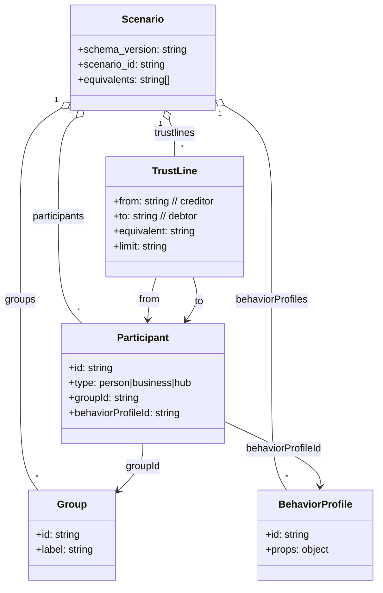
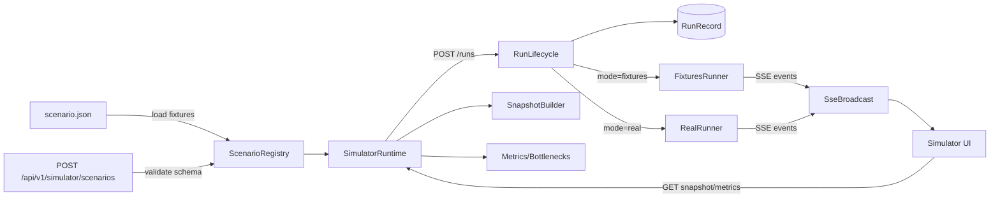
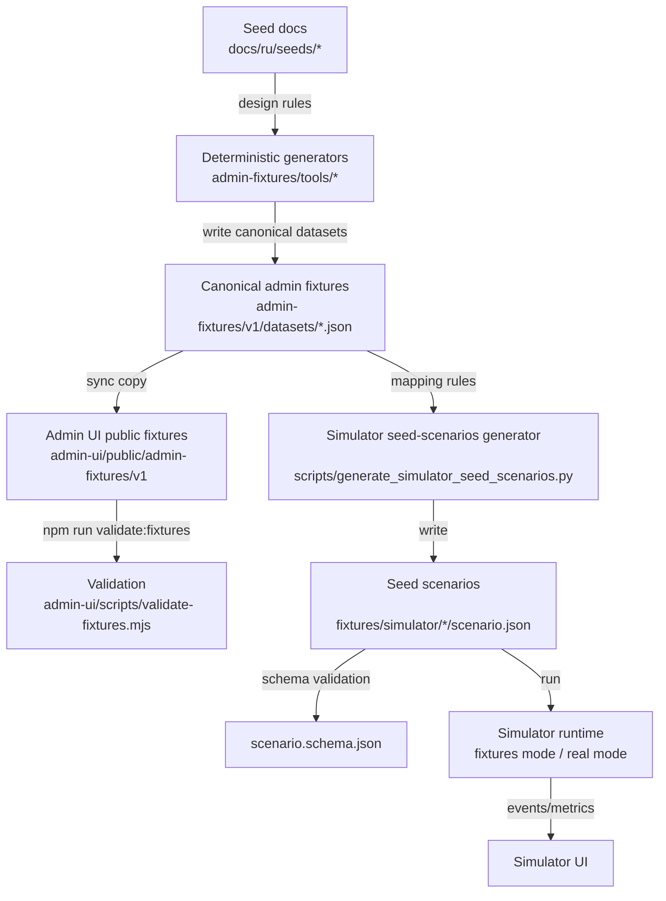
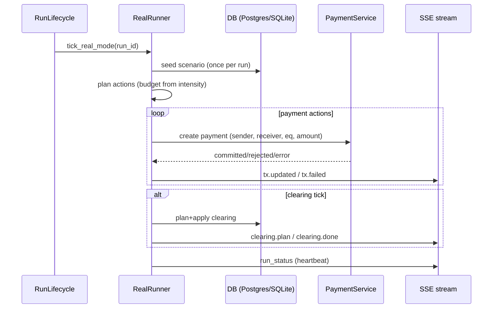

# Сценарии симулятора и движок запуска (RU)

Цель документа:
- **Часть 1 (для всех):** простыми словами — что такое сценарий и как его запустить.
- **Часть 2 (для технарей):** техническое устройство — сущности, верхнеуровневые алгоритмы, структура JSON, файлы движка, точки конфигурации.

См. также:
- Индекс симулятора: [README.md](README.md)
- Online-анализ проблем экономики сети (insights/уведомления): [network-economy-analyzer-spec.md](network-economy-analyzer-spec.md)
- Входной формат (schema): [../../../fixtures/simulator/scenario.schema.json](../../../fixtures/simulator/scenario.schema.json)
- Примеры сценариев: [../../../fixtures/simulator/](../../../fixtures/simulator/)

---

## Часть 1 — для пользователей (простыми словами)

### Что такое «сценарий»
Сценарий — это **описание мира**, а не скрипт с заранее прописанными транзакциями.

В сценарии описано:
- **кто участвует** (участники: люди/бизнесы/хабы);
- **какие лимиты доверия** между ними (trustlines = кредитные лимиты);
- **в каких эквивалентах** (UAH/HOUR/…);
- (опционально) группы/профили поведения — как «роли» в экономике.

Дальше сценарий запускает **один и тот же движок симулятора**, который в «тиках» (шаги времени) пытается генерировать платежи/клиринг на основе правил и ограничений.

### Есть два режима запуска
В API/UI есть `mode`:

1) **Fixtures mode**
- Это «демо-режим», который генерирует **визуальные события** (подсветки `tx.updated`, `clearing.plan/done`) без реального прохождения по платежному стеку.
- Нужен, чтобы быстро проверить UI/визуализацию и топологию графа.

2) **Real mode**
- Это режим, где runner делает реальные вызовы в backend (payments/clearing), и события отражают реальные результаты.
- Для реалистичной проверки (конкурентность, локи, таймауты) предпочтительнее Postgres + Redis, а не SQLite.

Подробный runbook: [backend/real-mode-runbook.md](backend/real-mode-runbook.md).

### Greenfield и Riverside — это разные сценарии, а не разные «скрипты»
Для каждого набора вроде **Greenfield Village** или **Riverside Town** обычно создаётся:
- отдельная папка с `scenario.json` в [../../../fixtures/simulator/](../../../fixtures/simulator/)
- но **движок один и тот же**

То есть «ещё один скрипт» писать не нужно, если вы не меняете сам алгоритм движка.

### Как добавить/запустить новый сценарий (практика)
Самый простой путь:
1) Скопировать один из примеров, например [../../../fixtures/simulator/greenfield-village-100/scenario.json](../../../fixtures/simulator/greenfield-village-100/scenario.json)
2) Поменять `scenario_id` на новый уникальный
3) Отредактировать участников и trustlines
4) Запустить backend + UI, затем выбрать сценарий в UI

Важно про список сценариев в UI:
- По умолчанию UI показывает демо-набор (включая realistic v2).
- Если вы добавили новый сценарий и не видите его в списке, выставьте env:
  - `SIMULATOR_SCENARIO_ALLOWLIST=all`
  - или `SIMULATOR_SCENARIO_ALLOWLIST=greenfield-village-100,my-new-scenario`

Технически это фильтр в runtime (см. [../../../app/core/simulator/runtime_impl.py](../../../app/core/simulator/runtime_impl.py)).

### Чек‑лист: создать, проверить, запустить (1 страница)

**A) Создать сценарий**
1) Выберите основу:
  - минимальный: [../../../fixtures/simulator/minimal/scenario.json](../../../fixtures/simulator/minimal/scenario.json)
  - “похож на реальный”: [../../../fixtures/simulator/greenfield-village-100/scenario.json](../../../fixtures/simulator/greenfield-village-100/scenario.json)
  - realistic v2 (UAH-only): [../../../fixtures/simulator/greenfield-village-100-realistic-v2/scenario.json](../../../fixtures/simulator/greenfield-village-100-realistic-v2/scenario.json)

Примечание для realistic v2:
- чтобы увидеть реалистичные суммы (сотни UAH), запускайте real mode с `SIMULATOR_REAL_AMOUNT_CAP=500` (дефолт `3.00` сохраняет старое поведение).
2) Скопируйте в новую папку:
  - `fixtures/simulator/<your-scenario-id>/scenario.json`
3) Обязательные инварианты (частые ошибки):
  - `trustlines[].from → trustlines[].to` = creditor → debtor (направление нельзя «переворачивать»)
  - у каждого trustline должен быть `equivalent`
  - `trustlines[].equivalent` должен входить в `equivalents[]` (если используете `equivalents[]`)
  - для real mode: `participants[].id` должны существовать в БД (они будут сидироваться)

**B) Проверить формат (schema)**

Формальная схема: [../../../fixtures/simulator/scenario.schema.json](../../../fixtures/simulator/scenario.schema.json)

Практика в репо:
- генератор seed‑сценариев всегда прогоняет проверку формы сценариев по schema

Команда (Windows):

```powershell
./.venv/Scripts/python.exe scripts/generate_simulator_seed_scenarios.py
```

**C) Запустить и посмотреть в UI**

Рекомендуемый быстрый запуск полного стека (Backend + Admin UI + Simulator UI):

```powershell
./scripts/run_full_stack.ps1 -Action start
```

Если нужно пересоздать локальную SQLite DB и заполнить её данными демо‑сообщества:

```powershell
./scripts/run_full_stack.ps1 -Action start -ResetDb -FixturesCommunity greenfield-village-100
```

Если сценарий не виден в списке UI:
- выставьте `SIMULATOR_SCENARIO_ALLOWLIST=all` (или перечислите нужные id через запятую)

**D) Альтернатива: загрузить сценарий через API (без git‑изменений)**

Control plane поддерживает upload:
- `POST /api/v1/simulator/scenarios` (body: `{ "scenario": { ...scenario.json... } }`)

Загруженные сценарии сохраняются локально в `.local-run/simulator/scenarios/<scenario_id>/scenario.json` и подхватываются runtime.

---

## Часть 2 — для технарей (сущности, алгоритмы, структура)

### 2.1 Сущности верхнего уровня

- **Scenario** — входной JSON, который описывает топологию и параметры (см. schema).
- **Participant** — узел графа: `person|business|hub`.
- **TrustLine** — направленный лимит `from → to`.
  - Семантика важная и фиксированная: `from` = creditor, `to` = debtor.
- **Equivalent** — “валюта/единица”, по которой строятся отдельные графы.
- **Run** — экземпляр прогона сценария (имеет `run_id`, `seed`, `tick_index`, `mode`, `intensity_percent`, состояние).
- **Events** — поток событий для UI (SSE): `run_status`, `tx.updated`, `tx.failed`, `clearing.*`, …
- **Snapshot / Metrics / Bottlenecks** — агрегаты, которые UI запрашивает отдельными endpoint’ами.

Модель событий/снапшотов: [backend/simulator-domain-model.md](backend/simulator-domain-model.md).
Online-анализ («что не так с экономикой сети» поверх метрик/бутылочных горлышек): [network-economy-analyzer-spec.md](network-economy-analyzer-spec.md).

Связи сущностей (упрощённо):



### 2.2 Где живёт движок (основные файлы)

Ключевые точки:
- Runtime “фасад”: [../../../app/core/simulator/runtime_impl.py](../../../app/core/simulator/runtime_impl.py)
- Жизненный цикл run: [../../../app/core/simulator/run_lifecycle.py](../../../app/core/simulator/run_lifecycle.py)
- Реестр сценариев + schema validation: [../../../app/core/simulator/scenario_registry.py](../../../app/core/simulator/scenario_registry.py)
- Fixtures mode генератор событий: [../../../app/core/simulator/fixtures_runner.py](../../../app/core/simulator/fixtures_runner.py)
- Real mode runner: [../../../app/core/simulator/real_runner.py](../../../app/core/simulator/real_runner.py)
- SSE broadcast + replay buffer: [../../../app/core/simulator/sse_broadcast.py](../../../app/core/simulator/sse_broadcast.py)
- Snapshot builder: [../../../app/core/simulator/snapshot_builder.py](../../../app/core/simulator/snapshot_builder.py)
- Artifacts (events.ndjson и др.): [../../../app/core/simulator/artifacts.py](../../../app/core/simulator/artifacts.py)

API слой (control plane): [../../../app/api/v1/simulator.py](../../../app/api/v1/simulator.py)

### 2.3 Поток данных: от scenario до UI



### 2.4 Fixtures mode vs Real mode (что реально отличается)

**Fixtures mode** (см. [../../../app/core/simulator/fixtures_runner.py](../../../app/core/simulator/fixtures_runner.py)):
- Не делает реальные платежи.
- Эмитит «визуальные» события на основе графа trustlines.
- Каденс клиринга/tx.updated в основном тайм‑based (`_next_*_at_ms`), а не “каждые N тиков”.

**Real mode** (см. [../../../app/core/simulator/real_runner.py](../../../app/core/simulator/real_runner.py)):
- (Один раз на run) сидит сценарий в БД и потом выполняет тик‑цикл.
- На тике планирует платежи (budget от intensity) и вызывает PaymentService.
- Может запускать клиринг:
  - **static cadence:** каждые `N` тиков (`SIMULATOR_CLEARING_EVERY_N_TICKS`)
  - **adaptive policy (direction):** динамически чаще/реже по сигналам сети (`SIMULATOR_CLEARING_POLICY=adaptive`)

### 2.5 Tick‑модель и детерминизм

Верхнеуровневое описание алгоритма runner: [backend/runner-algorithm.md](backend/runner-algorithm.md).

Практика в коде (Real mode):
- `tick_seed = (seed * 1_000_003 + tick_index) & 0xFFFFFFFF`
- для действий внутри тика делается производный `action_seed`

Это снижает “дрейф” случайности при изменениях нагрузки.

### 2.6 Структура `scenario.json` (поля и смысл)

Формальная схема: [../../../fixtures/simulator/scenario.schema.json](../../../fixtures/simulator/scenario.schema.json)

Ключевые поля:
- `schema_version` — версия формата входного JSON.
- `scenario_id` — строковый идентификатор.
- `name`, `description` — метаданные.
- `seed` — опционально, для детерминизма (если движок/контроль‑plane начнёт его использовать как вход).
- `equivalents: string[]` — список эквивалентов.
  - Практика runtime: граф и события строятся по `trustlines[].equivalent`, а `equivalents[]` используется как список режимов/фильтров.
- `participants[]`:
  - `id` — PID, должен существовать в БД (в real mode) для сидирования.
  - `type` — `person|business|hub`.
  - `status` — влияет на сидирование/фильтрацию (зависит от seed‑логики).
  - `groupId` — логическая роль (anchors/producers/…).
  - `behaviorProfileId` — привязка к профилю поведения.
- `trustlines[]`:
  - `from`/`to` — строго creditor→debtor.
  - `equivalent` — эквивалент ребра.
  - `limit` — лимит (строкой, чтобы не терять точность).
  - `policy` — произвольный объект (в т.ч. статус/auto_clearing).
- `groups[]`, `behaviorProfiles[]`, `events[]`:
  - Допускаются схемой как расширение.
  - На текущем этапе часть из них может не интерпретироваться планировщиком (см. раздел 2.7).

Подробное пояснение schema + MVP допущений: [backend/scenario-schema.md](backend/scenario-schema.md).

### 2.7 Что сейчас НЕ используется движком (важно для ожиданий)

На текущем этапе (см. [../../../app/core/simulator/real_runner.py](../../../app/core/simulator/real_runner.py)):
- `events[]` присутствуют в schema, но на текущем этапе **ещё не интерпретируются** planner’ом (см. спецификацию).
- `behaviorProfiles[]` в **real mode** интерпретируются частично: используется подмножество `behaviorProfiles.props` (`tx_rate`, `equivalent_weights`, `recipient_group_weights`, `amount_model[eq]`).
- Подбор суммы в real mode ограничен сверху: `amount <= min(SIMULATOR_REAL_AMOUNT_CAP, trustline.limit, props.amount_model[eq].max)`.
  - `SIMULATOR_REAL_AMOUNT_CAP` по умолчанию `3.00` (backward-compatible). Для realistic-v2 рекомендуется запускать с `SIMULATOR_REAL_AMOUNT_CAP>=500`.

Это сознательные MVP‑ограничения: сценарий описывает сеть, но «экономическая модель поведения» пока минимальна.

Планируемая эволюция (спецификация, чтобы не ломать детерминизм/guardrails):
- Поведенческая модель real mode (интерпретация `behaviorProfiles`/`events`, реалистичные суммы, выбор получателей): [backend/behavior-model-spec.md](backend/behavior-model-spec.md).

### 2.8 Где лежат сценарии и как они попадают в runtime

Загрузка сценариев:
- fixtures: [../../../fixtures/simulator/*/scenario.json](../../../fixtures/simulator/)
- uploaded: `.local-run/simulator/scenarios/<scenario_id>/scenario.json`

Валидация:
- При upload через API выполняется JSON Schema validation (см. `validate_scenario_or_400`).

### 2.9 Как генерируются “seed” сценарии (Greenfield/Riverside)

Эта секция отвечает на вопросы:
- что такое **seed‑сценарий** и чем он отличается от «обычного» сценария;
- что такое **фикстуры** (fixtures) в этом репозитории;
- какой **полный процесс** подготовки данных: от человекочитаемой задумки сообщества → до `scenario.json` симулятора.

#### 2.9.1 Терминология (быстро и без двусмысленности)

**Seed‑документ (seed doc)**
- Человекочитаемая спецификация демо‑сообщества: роли/экономическая логика/ожидаемые trustline‑паттерны/клиринговые циклы.
- Живёт в `docs/ru/seeds/*`.
- Регламент: [../../../docs/ru/seeds/README.md](../../../docs/ru/seeds/README.md).

**Fixtures (фикстуры)**
- В этом проекте это «готовые наборы JSON‑данных», которые используются как *детерминированный источник* для UI/генераторов/демо.
- Важно: fixtures ≠ данные продакшена, это **контролируемые** (reproducible) датасеты.

**Canonical admin fixtures (каноничные фикстуры админки)**
- Source of truth для демо‑сообщества в админке: `admin-fixtures/v1/datasets/*.json`.
- Генерируются детерминированно из seed‑логики.
- Регламент пакета: [../../../admin-fixtures/README.md](../../../admin-fixtures/README.md), генераторы: [../../../admin-fixtures/tools/README.md](../../../admin-fixtures/tools/README.md).

**Seed‑сценарий симулятора (seed scenario)**
- Это `fixtures/simulator/<scenario_id>/scenario.json`, который:
  - валиден по schema `fixtures/simulator/scenario.schema.json`;
  - детерминированно построен из canonical admin fixtures;
  - отражает ту же «модель сообщества», что и админ‑фикстуры (те же участники/лимиты/эквиваленты).

Простое правило: 
- seed docs → «почему и как устроено сообщество»;
- admin fixtures → «каноничные JSON‑датасеты для Admin UI»;
- seed scenarios → «каноничный `scenario.json` симулятора для тех же данных».

#### 2.9.2 Из чего конкретно строятся seed‑сценарии

Seed‑сценарии собираются **детерминированно** из canonical admin fixtures:
- **Вход (source of truth):** [../../../admin-fixtures/v1/datasets/](../../../admin-fixtures/v1/datasets/)
  - `participants.json`
  - `trustlines.json`
  - `equivalents.json`
- **Правила mapping:** [backend/fixtures-mapping.md](backend/fixtures-mapping.md)
- **Генератор seed‑сценариев:** [../../../scripts/generate_simulator_seed_scenarios.py](../../../scripts/generate_simulator_seed_scenarios.py)
- **Контракт выхода (schema):** [../../../fixtures/simulator/scenario.schema.json](../../../fixtures/simulator/scenario.schema.json)

#### 2.9.3 Полный процесс подготовки сценариев (end‑to‑end)

Ниже — «канонический» pipeline для Greenfield/Riverside (и любых последующих seed‑наборов).

**Шаг 0. Спроектировать сообщество (seed doc)**
- Внести/обновить seed‑документ в `docs/ru/seeds/`.
- Проверить семантику направлений trustlines (creditor → debtor).
- Регламент и чек‑листы: [../../../docs/ru/seeds/README.md](../../../docs/ru/seeds/README.md).

**Шаг 1. Сгенерировать canonical admin fixtures (v1)**

Команда (Windows):
```powershell
./.venv/Scripts/python.exe admin-fixtures/tools/generate_fixtures.py --seed greenfield-village-100
# или
./.venv/Scripts/python.exe admin-fixtures/tools/generate_fixtures.py --seed riverside-town-50
```

Результат:
- обновляются файлы в `admin-fixtures/v1/datasets/*.json`.

Регламент:
- пакет фикстур: [../../../admin-fixtures/README.md](../../../admin-fixtures/README.md)
- детерминизм/семантика: [../../../admin-fixtures/tools/README.md](../../../admin-fixtures/tools/README.md)

**Шаг 2. Синхронизировать fixtures в Admin UI (для демо админки)**

```powershell
cd admin-ui
npm run sync:fixtures
npm run validate:fixtures
```

Как работает sync: [../../../admin-ui/scripts/sync-fixtures.mjs](../../../admin-ui/scripts/sync-fixtures.mjs).
Валидация фикстур: [../../../admin-ui/scripts/validate-fixtures.mjs](../../../admin-ui/scripts/validate-fixtures.mjs).

**Шаг 3. Сгенерировать seed‑сценарии симулятора из canonical fixtures**

```powershell
./.venv/Scripts/python.exe scripts/generate_simulator_seed_scenarios.py
```

Результат:
- перезаписываются (детерминированно) сценарии:
  - `fixtures/simulator/greenfield-village-100/scenario.json`
  - `fixtures/simulator/riverside-town-50/scenario.json`

В генераторе дополнительно есть встроенная проверка формы сценария по JSON schema.

**Шаг 4. Запуск симулятора и проверка поведения**

Дальше вы выбираете сценарий в Simulator UI и запускаете его в `fixtures` или `real` mode.
Быстрый старт полного стека:
```powershell
./scripts/run_full_stack.ps1 -Action start
```

Если вы не видите сценарий в UI — проверьте allowlist:
- `SIMULATOR_SCENARIO_ALLOWLIST=all` или список id.

#### 2.9.4 Диаграмма процесса (seed → fixtures → scenario)



#### 2.9.5 Почему это называется именно “seed” сценарии

Слово **seed** здесь про «посевной/эталонный набор», который:
- задаёт **каноничную** стартовую топологию сообщества;
- должен быть **воспроизводимым** (одинаковые входы → одинаковые выходы);
- служит опорой для сравнения изменений движка/визуализации/аналитики (чтобы UX и метрики сравнивались на одном и том же графе).

То есть это не “seed” в смысле RNG‑seed, а “seed” в смысле **эталонной базы** данных/графа.

#### 2.9.6 Где закреплены правила (что «регламентирует» процесс)

- Терминология и дизайн сообщества: [../../../docs/ru/seeds/README.md](../../../docs/ru/seeds/README.md)
- Каноничные fixtures админки: [../../../admin-fixtures/README.md](../../../admin-fixtures/README.md)
- Детерминированные генераторы: [../../../admin-fixtures/tools/README.md](../../../admin-fixtures/tools/README.md)
- Mapping fixtures → scenario (контракт): [backend/fixtures-mapping.md](backend/fixtures-mapping.md)
- Генератор seed‑сценариев: [../../../scripts/generate_simulator_seed_scenarios.py](../../../scripts/generate_simulator_seed_scenarios.py)
- Schema сценария: [../../../fixtures/simulator/scenario.schema.json](../../../fixtures/simulator/scenario.schema.json)

### 2.10 Конфигурация runtime (env vars)

Основные knobs (см. [../../../app/core/simulator/runtime_impl.py](../../../app/core/simulator/runtime_impl.py)):
- `SIMULATOR_TICK_MS_BASE` — виртуальная длительность тика.
- `SIMULATOR_ACTIONS_PER_TICK_MAX` — верхний лимит budget действий.
- `SIMULATOR_CLEARING_POLICY` — политика клиринга: `static|adaptive` (default: static).
- `SIMULATOR_CLEARING_EVERY_N_TICKS` — cadence клиринга в real mode (используется в `static`).
- `SIMULATOR_SCENARIO_ALLOWLIST` — фильтр списка сценариев для UI.

SSE replay buffer:
- `SIMULATOR_EVENT_BUFFER_SIZE`
- `SIMULATOR_EVENT_BUFFER_TTL_SEC`
- `SIMULATOR_SSE_STRICT_REPLAY`

Real mode guardrails:
- `SIMULATOR_REAL_MAX_IN_FLIGHT`
- `SIMULATOR_REAL_MAX_TIMEOUTS_PER_TICK`
- `SIMULATOR_REAL_MAX_ERRORS_TOTAL`
- `SIMULATOR_CLEARING_MAX_DEPTH`

### 2.11 Последовательность одного тика (Real mode)



### 2.12 Ошибки: где логгируются и как их расшифровывать

В симуляторе есть **две принципиально разные категории “плохих” исходов**:
- **Ожидаемые отказы (rejections)**: платеж “не прошёл” по бизнес‑причинам (нет маршрута, не хватает лимитов и т.п.). Это нормальная часть динамики сети.
- **Ошибки выполнения (errors)**: таймауты, неожиданные исключения, падения тика, ошибки инфраструктуры. Эти события сигналят о проблемах движка/стека, а не сценария.

Ниже — где всё это видно и как читать.

#### 2.12.1 Где смотреть (UI, SSE, artifacts, backend logs, DB)

**1) В UI (Simulator UI)**
- Панель run показывает `state` и (если run упал) `last_error` из события `run_status`.
- События `tx.failed` всплывают как “красные/жёлтые” сигналы на графе: это может быть как rejection, так и error.

**2) В SSE (поток событий)**
- Истина по событиям — это то, что пришло в stream: `tx.failed`, `run_status`, `clearing.*`.
- Для `tx.failed` самое важное поле — `error`:
  - `error.code` — нормализованный код причины (для UI/аналитики)
  - `error.details` — “сырые” детали (класс исключения, GEO‑код, HTTP‑статус и т.п.)

См. протокол: [backend/ws-protocol.md](backend/ws-protocol.md).

**3) В artifacts (`events.ndjson` + status/summary)**
- Все SSE‑события пишутся в `events.ndjson` (best‑effort).
- Локальный путь (dev): `.local-run/simulator/runs/<run_id>/artifacts/events.ndjson`.
- Там же лежат `status.json`, `last_tick.json`, а при finalize — `summary.json` и `bundle.zip`.

См. где хранится и как устроено: [backend/run-storage.md](backend/run-storage.md).

**4) В backend logs**
- Движок логгирует исключения и предупреждения через стандартный `logging`.
- Полезные “якоря” по строкам логов:
  - `simulator.real.tick_failed` — тик real mode упал (с `exc_info=True`).
  - `simulator.storage.*` — проблемы записи run/метрик/артефактов в БД.
  - `simulator.artifacts.*` — проблемы создания/записи `events.ndjson` и финализации bundle.
  - `simulator.fixture_scenario_load_failed` / `simulator.uploaded_scenario_load_failed` — сценарий не загрузился.

**5) В DB (если включено хранение run state)**
- У run есть счётчики и последнее состояние:
  - `errors_total` — количество *ошибок выполнения* (см. ниже про отличие от rejections)
  - `last_error` (JSON) — “последняя фатальная/важная ошибка” (для `run_status`)

См. схему хранения: [backend/run-storage.md](backend/run-storage.md).

#### 2.12.2 Как отличить rejection от error

Практическое правило для real mode:
- **Rejection** обычно приходит как `tx.failed`, но при этом это *не* “ошибка движка”:
  - в `error.details` часто есть `status_code` в диапазоне `4xx` (клиентская бизнес‑ошибка)
  - `errors_total` при этом не увеличивается
- **Error** (таймаут/исключение) обычно:
  - увеличивает `errors_total`
  - обновляет `run_status.last_error`
  - может приводить к `run_status.state="error"` при превышении guardrails

#### 2.12.3 Примеры типовых ошибок и что они означают

Ниже примеры “что это нам говорит” — чаще всего это либо сигнал о топологии сценария, либо сигнал о проблеме стека.

**A) `tx.failed.error.code=ROUTING_NO_ROUTE`**
- Что это: нет маршрута в графе trustlines от отправителя к получателю.
- Что говорит о сценарии:
  - граф разорван (нет пути),
  - перепутано направление trustline (должно быть creditor → debtor),
  - неверный `equivalent` (в этом эквиваленте ребёр меньше/нет).

**B) `tx.failed.error.code=ROUTING_NO_CAPACITY`**
- Что это: путь есть, но по доступной ёмкости он не проходит (лимиты/доступное < сумма).
- Что говорит:
  - лимиты слишком маленькие для текущих долгов,
  - clearing слишком редкий/неэффективный,
  - сценарий создаёт слишком “горячие” узлы (узкие места) — это может быть ожидаемо.

**C) `tx.failed.error.code=TRUSTLINE_LIMIT_EXCEEDED`**
- Что это: конкретный trustline не выдерживает попытку (перелив через лимит).
- Что говорит:
  - либо лимит/политика trustline слишком строгие,
  - либо планировщик подбирает суммы слишком большие для текущей топологии.

**D) `tx.failed.error.code=TRUSTLINE_NOT_ACTIVE`**
- Что это: trustline/политика помечены как неактивные.
- Что говорит:
  - сидирование/fixtures создали часть ребёр неактивными,
  - или вы ожидаете ребро активным, но в данных оно выключено.

**E) `tx.failed.error.code=PAYMENT_TIMEOUT`**
- Что это: таймаут на уровне платежного стека.
- Что говорит:
  - перегрузка/локи/транзакции (особенно заметно на SQLite),
  - проблемы инфраструктуры (Postgres/Redis),
  - слишком высокий `intensity_percent` относительно ресурсов.

**F) `tx.failed.error.code=INTERNAL_ERROR`**
- Что это: непредвиденная ошибка сервера (5xx/исключение вне ожидаемых бизнес‑отказов).
- Что говорит:
  - потенциальный баг, транзакционное состояние “aborted”, проблемы с сессией/локами,
  - нужно смотреть backend logs по времени события и `error.details`.

**G) `tx.failed.error.code=PAYMENT_REJECTED`**
- Что это: “обобщённый” отказ, когда детали не удалось стабильно промаппить в более конкретный код.
- Что говорит:
  - это почти всегда про данные в `error.details` (там обычно есть `exc`, `geo_code`, `status_code`).

**H) `run_status.state="error"` + `last_error.code=REAL_MODE_TOO_MANY_TIMEOUTS|REAL_MODE_TOO_MANY_ERRORS|REAL_MODE_TICK_FAILED_REPEATED`**
- Что это: сработали guardrails и run принудительно остановлен как аварийный.
- Что говорит:
  - `REAL_MODE_TOO_MANY_TIMEOUTS`: деградация стека/локи/ресурсная нехватка.
  - `REAL_MODE_TOO_MANY_ERRORS`: систематическая ошибка исполнения (например, постоянные `INTERNAL_ERROR`).
  - `REAL_MODE_TICK_FAILED_REPEATED`: тик падает исключением несколько раз подряд (часто баг или транзакционное “poisoning”).

**I) `last_error.code=REAL_MODE_TICK_FAILED`, но run ещё `running`**
- Что это: один тик упал исключением, но runner пытается продолжить (до порога “подряд”).
- Что говорит:
  - часто это “всплеск” из‑за конкуренции/локов или единичная ошибка сессии,
  - если повторяется — будет `REAL_MODE_TICK_FAILED_REPEATED` и run станет `error`.

Практический флоу расследования:
1) Найти последний `tx.failed` в `events.ndjson` и посмотреть `error.code` + `error.details`.
2) Если run перешёл в `error`, смотреть `run_status.last_error` (это итоговый “стоп‑код”).
3) Сопоставить `ts` события с backend logs (якоря `simulator.real.*`, `simulator.storage.*`).
4) Если причина — routing/лимиты: проверять направление trustlines, связность, лимиты и cadence clearing.

#### 2.12.4 Мини‑пример: как выглядит `tx.failed` в данных

Пример (сокращённо; реальные события содержат `event_id`, `ts` и др.):

```json
{
  "type": "tx.failed",
  "equivalent": "HOUR",
  "from": "p_alice",
  "to": "p_bob",
  "error": {
    "code": "ROUTING_NO_ROUTE",
    "message": "ROUTING_NO_ROUTE",
    "details": {
      "exc": "RoutingException",
      "geo_code": "E001",
      "status_code": 404,
      "message": "No route"
    }
  }
}
```

Как читать:
- `error.code` — быстро классифицирует причину (нормализованный слой UI/аналитики).
- `error.details.*` — помогает точно понять первопричину (исключение/код/статус), и именно туда надо смотреть при расследовании.

---

## Ссылки на существующую документацию

- Формат `scenario.json` (описание): [backend/scenario-schema.md](backend/scenario-schema.md)
- Формат `scenario.json` (JSON Schema): [../../../fixtures/simulator/scenario.schema.json](../../../fixtures/simulator/scenario.schema.json)
- Алгоритм runner (верхний уровень): [backend/runner-algorithm.md](backend/runner-algorithm.md)
- Протокол SSE/REST: [backend/ws-protocol.md](backend/ws-protocol.md)
- Интеграция с payment/clearing: [backend/payment-integration.md](backend/payment-integration.md)
- Модель событий/снапшотов/метрик: [backend/simulator-domain-model.md](backend/simulator-domain-model.md)
- Хранение run state + artifacts export: [backend/run-storage.md](backend/run-storage.md)
- Как поднять окружение: [backend/real-mode-runbook.md](backend/real-mode-runbook.md)
