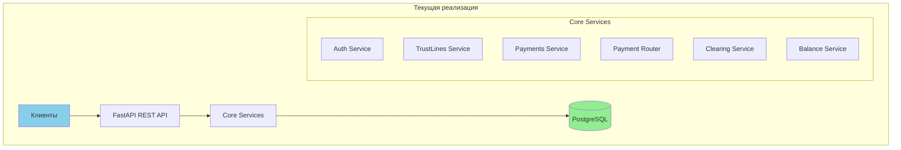
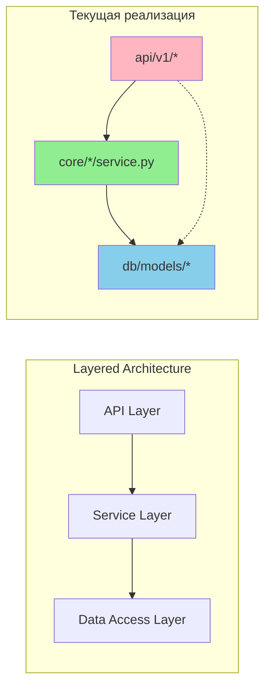
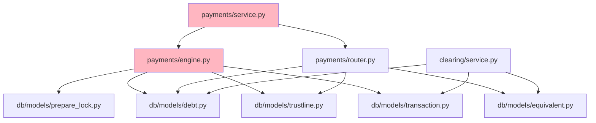
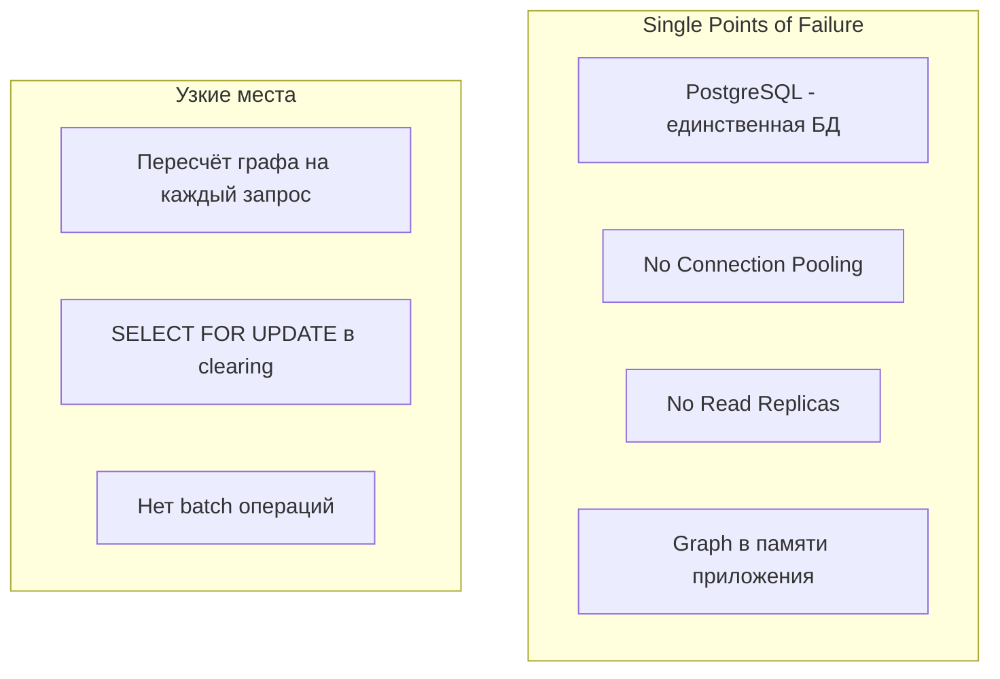
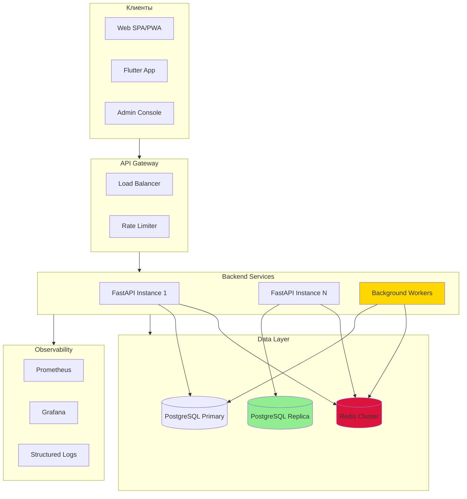
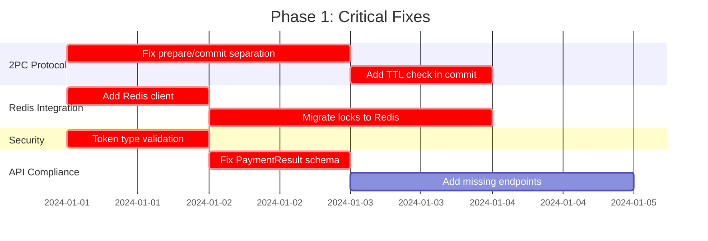

# Архитектурный анализ проекта GEO v0.1

## Executive Summary

Проект GEO v0.1 реализует Community-Hub архитектуру для кредитной сети локальных сообществ. В ходе анализа выявлены **90 проблем** (9 CRITICAL, 30 HIGH), включая критические нарушения 2PC протокола, неиспользуемый Redis и существенные расхождения с документацией.

---

## 1. Соответствие архитектуры документации

### 1.1. Community-Hub: Реализация



**Статус реализации компонентов:**

| Компонент | Документация | Реализация | Статус |
|-----------|--------------|------------|--------|
| Auth & Identity | Ed25519 + JWT | Ed25519 + JWT | ✅ Реализован |
| Trust Lines Service | CRUD + Policy | CRUD + Policy | ✅ Реализован |
| Payments Engine | 2PC Protocol | Нарушенный 2PC | ⚠️ Частично |
| Routing/Pathfinding | BFS → k-shortest | Только BFS | ⚠️ Частично |
| Clearing Engine | Поиск циклов 3-4 | DFS циклы | ✅ Реализован |
| Reporting & Metrics | Агрегаты | Базовый balance | ⚠️ Минимально |
| PostgreSQL | Primary store | Primary store | ✅ Реализован |
| Redis | Cache + Locks | **НЕ ИСПОЛЬЗУЕТСЯ** | ❌ Отсутствует |
| WebSocket/SSE | Real-time updates | **НЕ РЕАЛИЗОВАН** | ❌ Отсутствует |
| API Gateway/BFF | Опционально в MVP | Встроен в FastAPI | ✅ Приемлемо |

### 1.2. Redis: Критическое отсутствие

**Факт:** Redis присутствует только в конфигурации ([`app/config.py:13`](app/config.py:13)), но **не используется ни в одном модуле**.

```python
# app/config.py - Redis только в конфиге
REDIS_URL: str = "redis://localhost:6379/0"
```

**Последствия отсутствия Redis:**

| Функция | Ожидаемое использование | Текущее состояние | Severity |
|---------|-------------------------|-------------------|----------|
| Prepare Locks TTL | Redis EXPIRE | SQL таблица + приложение | **CRITICAL** |
| Session Cache | Redis | Нет кэширования | HIGH |
| Rate Limiting | Redis counters | Отсутствует | HIGH |
| Real-time events | Redis Pub/Sub | Отсутствует | MEDIUM |
| Graph Cache | Redis | Пересчёт на каждый запрос | HIGH |

**Техническое влияние:**
- Локи хранятся в PostgreSQL таблице [`PrepareLock`](app/db/models/prepare_lock.py), что создаёт дополнительную нагрузку и задержки
- Отсутствует автоматическое истечение локов (TTL реализован на уровне приложения)
- Нет распределённого кэширования для масштабирования

### 1.3. Отсутствующие компоненты

| Компонент | Описание | Приоритет |
|-----------|----------|-----------|
| WebSocket/SSE | Уведомления в реальном времени | HIGH |
| Admin Interface | Jinja2 + HTMX админка | MEDIUM |
| Background Workers | Celery/Arq для задач | HIGH |
| Health Monitoring | Prometheus metrics | MEDIUM |
| Addons System | Entry points механизм | LOW (v0.2) |

---

## 2. Анализ структуры проекта

### 2.1. Текущая структура

```
app/
├── api/v1/           # HTTP endpoints (6 модулей)
│   ├── auth.py       # Challenge-response auth
│   ├── balance.py    # Balance queries
│   ├── clearing.py   # Clearing operations
│   ├── participants.py # Participant CRUD
│   ├── payments.py   # Payment operations
│   └── trustlines.py # TrustLine CRUD
├── core/             # Бизнес-логика (6 доменов)
│   ├── auth/         # Crypto + Service
│   ├── balance/      # Balance calculations
│   ├── clearing/     # Cycle detection + execution
│   ├── participants/ # Participant management
│   ├── payments/     # Engine + Router + Service
│   └── trustlines/   # TrustLine operations
├── db/models/        # SQLAlchemy модели (9 моделей)
├── schemas/          # Pydantic схемы (7 модулей)
└── utils/            # Exceptions + Security
```

### 2.2. Оценка архитектурных паттернов



**Анализ Clean Architecture:**

| Принцип | Статус | Описание |
|---------|--------|----------|
| Разделение слоёв | ⚠️ Частично | API иногда обращается напрямую к моделям |
| Dependency Injection | ✅ Хорошо | Через FastAPI Depends |
| Single Responsibility | ⚠️ Нарушено | PaymentEngine содержит и prepare, и commit |
| Interface Segregation | ❌ Нарушено | Нет абстрактных интерфейсов |

### 2.3. Циклические зависимости



**Выявленные проблемы:**
- Нет циклических импортов на уровне модулей
- Сервисы payments создают экземпляры Engine и Router внутри методов
- Отсутствует DI контейнер для управления зависимостями

---

## 3. Несоответствия код vs документация

### 3.1. Таблица критических расхождений

| Область | OpenAPI/Документация | Реализация | Severity |
|---------|---------------------|------------|----------|
| **PaymentResult схема** | `tx_id, status, from, to, equivalent, amount, routes, created_at, committed_at` | `tx_id, status, path` | **CRITICAL** |
| **PaymentCreateRequest** | `signature` required | `signature` отсутствует | **HIGH** |
| **GET /trustlines/{id}** | Определён | Не реализован | **HIGH** |
| **list_payments фильтры** | `direction, equivalent, status, from_date, to_date` | Только `limit, offset` | **HIGH** |
| **Equivalent поля** | `type`, `symbol` | Отсутствуют | **MEDIUM** |
| **Token type check** | Отличать access/refresh | Не проверяется | **HIGH** |
| **2PC атомарность** | Отдельные фазы | commit внутри prepare | **CRITICAL** |

### 3.2. PaymentResult: Детальное сравнение

**OpenAPI спецификация** ([`api/openapi.yaml:854-882`](api/openapi.yaml:854)):
```yaml
PaymentResult:
  required: [tx_id, status, from, to, equivalent, amount, created_at]
  properties:
    tx_id: string
    status: enum [COMMITTED, ABORTED]
    from: string
    to: string
    equivalent: string
    amount: string
    routes: array[PaymentRoute]
    error: PaymentError
    created_at: datetime
    committed_at: datetime
```

**Pydantic схема** ([`app/schemas/payment.py:37-40`](app/schemas/payment.py:37)):
```python
class PaymentResult(BaseModel):
    tx_id: str
    status: str
    path: List[str]  # Вместо routes
    # Отсутствуют: from, to, equivalent, amount, created_at, committed_at, error
```

### 3.3. Отсутствующие API endpoints

| Endpoint | OpenAPI | Реализация |
|----------|---------|------------|
| `GET /trustlines/{id}` | ✅ | ❌ |
| `DELETE /trustlines/{id}` | ✅ | ⚠️ Только status change |
| `POST /auth/refresh` | Ожидается | ❌ |
| `GET /participants/me` | Ожидается | ❌ |

---

## 4. Архитектурные риски

### 4.1. Scalability



**Текущие ограничения:**

| Параметр | Требование | Текущее состояние |
|----------|------------|-------------------|
| Поиск маршрута | < 200-300ms | ⚠️ Зависит от размера графа |
| Платёж end-to-end | < 2 сек | ⚠️ Не измерено |
| Concurrent payments | High | ❌ Race conditions |
| Участников на hub | 500+ | ⚠️ Не тестировано |

### 4.2. Reliability

| Риск | Описание | Severity |
|------|----------|----------|
| **Нарушение 2PC** | commit() вызывается внутри prepare() | **CRITICAL** |
| **TTL не проверяется при commit** | Локи могут истечь | **CRITICAL** |
| **Race condition Router vs Prepare** | Граф изменился между routing и prepare | **HIGH** |
| **Clearing vs Active Payments** | Нет блокировки debts во время clearing | **HIGH** |
| **Отсутствует retry механизм** | Транзакции не переповторяются | **MEDIUM** |

**Критическая проблема 2PC:**

```python
# app/core/payments/engine.py:301
async def prepare(self, tx_id, path, amount, equivalent_id):
    # ... validation and lock creation ...
    await self.session.commit()  # ❌ НАРУШЕНИЕ: commit внутри prepare
    return True
```

### 4.3. Security

| Уязвимость | Описание | Severity |
|------------|----------|----------|
| **Нет проверки типа токена** | access и refresh не различаются | **HIGH** |
| **JWT_SECRET по умолчанию** | Hardcoded в config | **CRITICAL** |
| **Нет rate limiting** | Возможен DoS | **HIGH** |
| **Нет CORS configuration** | Открыт для всех origins | **MEDIUM** |
| **Signature не обязательна** | PaymentCreateRequest без signature | **HIGH** |

### 4.4. Maintainability / Tech Debt

| Проблема | Описание | Impact |
|----------|----------|--------|
| Нет абстрактных интерфейсов | Сложно тестировать и заменять компоненты | HIGH |
| Отсутствует DI container | Manual dependency wiring | MEDIUM |
| Нет миграции для аддонов | Entry points не реализованы | LOW |
| Смешанные sync/async patterns | Возможны deadlocks | MEDIUM |
| Нет structured logging | Сложно отлаживать | MEDIUM |

---

## 5. Диаграмма целевой архитектуры



---

## 6. Рекомендации по улучшению

### 6.1. Критические изменения (блокеры для production)

| # | Задача | Severity | Компонент |
|---|--------|----------|-----------|
| 1 | **Исправить 2PC: убрать commit из prepare** | CRITICAL | engine.py |
| 2 | **Добавить проверку TTL при commit** | CRITICAL | engine.py |
| 3 | **Интегрировать Redis для локов** | CRITICAL | engine.py, session.py |
| 4 | **Добавить проверку типа токена** | CRITICAL | deps.py, security.py |
| 5 | **Исправить PaymentResult схему** | CRITICAL | schemas/payment.py |
| 6 | **Добавить signature в PaymentCreateRequest** | HIGH | schemas/payment.py |
| 7 | **Реализовать GET /trustlines/{id}** | HIGH | api/v1/trustlines.py |
| 8 | **Добавить connection pooling** | HIGH | session.py |
| 9 | **Исправить race condition Router vs Engine** | HIGH | router.py, engine.py |
| 10 | **Добавить фильтры в list_payments** | HIGH | api/v1/payments.py |

### 6.2. Улучшения для масштабирования

| # | Задача | Priority | Описание |
|---|--------|----------|----------|
| 1 | Кэширование графа в Redis | HIGH | Снижение нагрузки на БД |
| 2 | Read replica для запросов | HIGH | Горизонтальное масштабирование |
| 3 | Background workers для clearing | HIGH | Celery/Arq интеграция |
| 4 | WebSocket для уведомлений | MEDIUM | Real-time updates |
| 5 | k-shortest paths алгоритм | MEDIUM | Лучшие маршруты |
| 6 | Batch API endpoints | MEDIUM | Массовые операции |

### 6.3. Оптимизации производительности

| # | Задача | Impact | Текущая проблема |
|---|--------|--------|------------------|
| 1 | Индексы на debt/trustline FK | HIGH | Медленные JOIN |
| 2 | Materialized views для balance | MEDIUM | Пересчёт на лету |
| 3 | Partial graph loading | HIGH | Полный граф в памяти |
| 4 | Query optimization (EXPLAIN) | MEDIUM | Не оптимизировано |
| 5 | Async batch commits | MEDIUM | Много мелких транзакций |

---

## 7. Приоритизированный план действий

### Phase 1: Critical Fixes (Блокеры)



### Phase 2: Reliability (Надёжность)

1. Connection pooling + health checks
2. Race condition fixes (Router/Engine)
3. Clearing conflict resolution
4. Retry mechanism
5. Structured logging

### Phase 3: Scalability (Масштабирование)

1. Redis caching layer
2. Read replicas
3. Background workers
4. WebSocket notifications
5. Performance optimizations

---

## Заключение

Проект GEO v0.1 находится на стадии MVP и требует существенных доработок перед production-использованием. Основные риски связаны с:

1. **Нарушением 2PC протокола** - потенциальная потеря данных
2. **Неиспользованием Redis** - снижение производительности и отсутствие TTL
3. **Расхождениями с OpenAPI** - несовместимость с документацией
4. **Security gaps** - отсутствие проверки токенов и rate limiting

Рекомендуется приоритизировать Phase 1 (Critical Fixes) перед любыми новыми фичами.