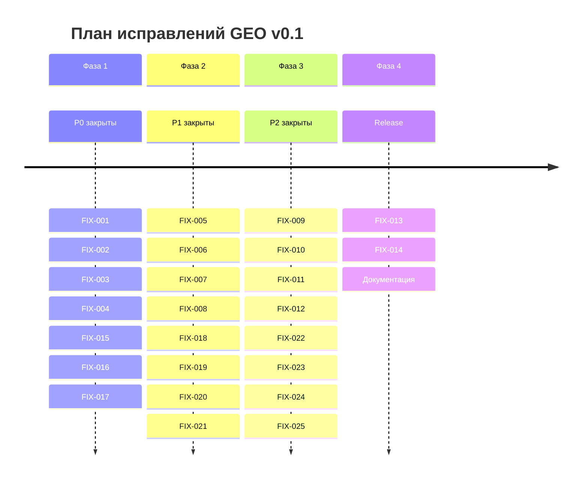

# Итоговый отчёт аудита GEO v0.1

**Версия:** 1.0  
**Дата:** 2026-01-06  
**Статус:** Финальный  
**Основание:** Аудит соответствия кода спецификации протокола

---

## Содержание

1. [Исполнительное резюме](#1-исполнительное-резюме)
2. [Список доработок кода](#2-список-доработок-кода)
3. [Улучшения, не отражённые в спецификации](#3-улучшения-не-отражённые-в-спецификации)
4. [Предложения по улучшению документации](#4-предложения-по-улучшению-документации)
5. [Рекомендуемый план действий](#5-рекомендуемый-план-действий)

---

## 1. Исполнительное резюме

### 1.1 Обзор результатов аудита

Проведён комплексный аудит соответствия кодовой базы GEO v0.1 спецификации протокола ([`docs/ru/02-protocol-spec.md`](../docs/ru/02-protocol-spec.md)). Аудит охватил:

- API endpoints ([`app/api/v1/`](../app/api/v1/))
- Core бизнес-логику ([`app/core/`](../app/core/))
- Модели данных ([`app/db/models/`](../app/db/models/))
- Криптографические примитивы ([`app/core/auth/crypto.py`](../app/core/auth/crypto.py))
- Механизмы целостности ([`app/core/integrity.py`](../app/core/integrity.py)) и инварианты (см. FIX-002/003/005)

**Общий вывод:** Каркас MVP в целом соответствует идее GEO-протокола, однако выявлены критические несоответствия, требующие исправления перед production-релизом.

### 1.2 Статистика соответствия

| Категория | Всего | Соответствует | Частично | Не соответствует |
|-----------|-------|---------------|----------|------------------|
| Криптография | 3 | 1 | 1 | 1 |
| Инварианты | 5 | 1 | 2 | 2 |
| API endpoints | 15 | 13 | 1 | 1 |
| Бизнес-логика | 8 | 5 | 2 | 1 |
| **Итого** | **31** | **20 (65%)** | **6 (19%)** | **5 (16%)** |

### 1.3 Сводка по приоритетам

| Приоритет | Количество | Описание |
|-----------|------------|----------|
| **P0 — Критические** | 7 | Блокируют production, нарушают безопасность или целостность |
| **P1 — Высокие** | 8 | Важны для надёжности системы |
| **P2 — Средние** | 8 | Улучшают качество и соответствие спецификации |
| **P3 — Низкие** | 2 | Для полноты реализации |

### 1.4 Критические риски

```mermaid
flowchart LR
    subgraph КРИТИЧЕСКИЕ_РИСКИ
        R1[PID несовместим с протоколом]
        R2[Не соблюдаются инварианты (trust limits / symmetry)]
        R3[Нет /auth/refresh endpoint]
        R4[Подписи не в canonical JSON]
        R5[Race в prepare: oversubscription сегментов]
        R6[Clearing без согласия auto_clearing]
    end
    
    R1 --> I1[Интероперабельность невозможна]
    R2 --> I2[Нарушение доверия/целостности]
    R3 --> I3[UX проблемы и безопасность]
    R4 --> I4[Невоспроизводимость подписи/споры]
    R5 --> I5[Превышение лимитов при конкуренции]
    R6 --> I6[Клиринг против политики]
```

### 1.5 Сильные стороны текущей реализации

**Подтверждено и работает корректно:**

- ✅ 2PC-подобная модель с PrepareLocks учитывает reserved capacity
- ✅ Recovery/cleanup фоновые задачи функционируют
- ✅ Rate limiting реализован (in-memory/Redis)
- ✅ Валидация типов JWT токенов (access/refresh)
- ✅ Connection pooling настроен
- ✅ Clearing исключает рёбра с активными locks

---

## 2. Список доработок кода

### 2.1 P0: Критические доработки

#### FIX-001: Исправление генерации PID

| Поле | Значение |
|------|----------|
| **ID** | FIX-001 |
| **Приоритет** | P0 — Критический |
| **Описание** | Генерация PID использует `base64url(public_key)` вместо протокольного `base58(sha256(public_key))` |
| **Риск** | Полная несовместимость с другими реализациями протокола |
| **Затронутые файлы** | [`app/core/auth/crypto.py`](../app/core/auth/crypto.py) |
| **Связанные файлы** | Все таблицы с PID (participants, auth_challenges, transactions) |
| **Решение** | Изменить алгоритм: `hashlib.sha256()` + `base58.b58encode()` |
| **Зависимости** | Добавить `base58` в requirements.txt |
| **Миграция** | Требуется пересчёт всех существующих PID |
| **Сложность** | L — требует миграции данных |

---

#### FIX-002: Реализация Zero-Sum инварианта

| Поле | Значение |
|------|----------|
| **ID** | FIX-002 |
| **Приоритет** | P0 — Критический |
| **Описание** | Инвариант `∑ net_balance(P, E) = 0` для каждого эквивалента не проверяется |
| **Риск** | Скрытые дисбалансы в системе, невозможность обнаружить ошибки |
| **Затронутые файлы** | Новый модуль `app/core/invariants.py` |
| **Связанные файлы** | [`app/core/payments/engine.py`](../app/core/payments/engine.py) |
| **Решение** | Создать `InvariantChecker.check_zero_sum()` с SQL-агрегацией по debts |
| **Интеграция** | Вызывать в `PaymentEngine.commit()` после применения flows |
| **Сложность** | M |

---

#### FIX-003: Реализация Trust Limit инварианта

| Поле | Значение |
|------|----------|
| **ID** | FIX-003 |
| **Приоритет** | P0 — Критический |
| **Описание** | Инвариант `debt[B→A, E] ≤ limit(A→B, E)` не проверяется после транзакций |
| **Риск** | Долги могут превысить лимиты доверия |
| **Затронутые файлы** | Новый модуль `app/core/invariants.py` |
| **Связанные файлы** | [`app/core/payments/engine.py`](../app/core/payments/engine.py) |
| **Решение** | Создать `InvariantChecker.check_trust_limits()` с JOIN debts ↔ trustlines |
| **Интеграция** | Вызывать в `PaymentEngine.commit()` для затронутых пар |
| **Сложность** | M |

---

#### FIX-004: Реализация /auth/refresh endpoint

| Поле | Значение |
|------|----------|
| **ID** | FIX-004 |
| **Приоритет** | P0 — Критический |
| **Описание** | API endpoint для обновления JWT токенов отсутствует, хотя refresh_token генерируется |
| **Риск** | UX-проблемы (частая повторная авторизация), нарушение OpenAPI контракта |
| **Затронутые файлы** | [`app/api/v1/auth.py`](../app/api/v1/auth.py) |
| **Связанные файлы** | [`app/core/auth/service.py`](../app/core/auth/service.py), [`app/schemas/auth.py`](../app/schemas/auth.py), [`api/openapi.yaml`](../api/openapi.yaml) |
| **Решение** | Добавить `POST /auth/refresh` с валидацией refresh_token, revocation, выдачей новой пары |
| **Сложность** | S |

---

#### FIX-015: Приведение подписей к canonical JSON (Appendix A)

| Поле | Значение |
|------|----------|
| **ID** | FIX-015 |
| **Приоритет** | P0 — Критический |
| **Описание** | Подписываемые payload (минимум registration/payment) должны формироваться как canonical JSON согласно протоколу (Appendix A) |
| **Риск** | Невоспроизводимость подписи, несовместимость реализаций, спорность сообщений |
| **Затронутые файлы** | Новый модуль `app/core/auth/canonical.py` |
| **Связанные файлы** | Schemas/handlers, `api/openapi.yaml` |
| **Решение** | Реализовать `canonical_json(payload)->bytes`, синхронизировать signed payload и описание в OpenAPI |
| **Сложность** | M |

---

#### FIX-016: Устранение oversubscription на сегментах (Postgres advisory locks)

| Поле | Значение |
|------|----------|
| **ID** | FIX-016 |
| **Приоритет** | P0 — Критический |
| **Описание** | При параллельных `prepare()` на одном сегменте возможен race и превышение лимитов из-за отсутствия сериализации |
| **Риск** | Превышение trust limit/capacity при конкурирующих платежах |
| **Затронутые файлы** | `app/core/payments/engine.py` |
| **Решение** | Добавить Postgres advisory locks на ключ сегмента (equivalent, from, to) в `prepare_routes()` |
| **Сложность** | M |

---

#### FIX-017: Проверка `policy.auto_clearing` перед исполнением clearing

| Поле | Значение |
|------|----------|
| **ID** | FIX-017 |
| **Приоритет** | P0 — Критический |
| **Описание** | Clearing не должен исполнять циклы через рёбра, где `TrustLine.policy.auto_clearing=false` |
| **Риск** | Клиринг нарушает согласованную политику участников |
| **Затронутые файлы** | `app/core/clearing/service.py` |
| **Решение** | Перед исполнением цикла проверять `auto_clearing=true` по всем рёбрам; иначе пропускать/ошибаться по протоколу |
| **Сложность** | S |

---

### 2.2 P1: Высокоприоритетные доработки

#### FIX-005: Реализация Debt Symmetry инварианта

| Поле | Значение |
|------|----------|
| **ID** | FIX-005 |
| **Приоритет** | P1 — Высокий |
| **Описание** | Нет проверки на взаимные долги: не может быть одновременно `debt[A→B] > 0` и `debt[B→A] > 0` |
| **Риск** | Неоптимальное хранение, потенциальные ошибки клиринга |
| **Затронутые файлы** | `app/core/invariants.py`, [`app/core/payments/engine.py`](../app/core/payments/engine.py) |
| **Решение** | 1) Создать `InvariantChecker.check_debt_symmetry()` 2) Исправить `_apply_flow()` для автоматического взаимозачёта |
| **Сложность** | M |

---

#### FIX-006: Hardening recovery-loop для просроченных PrepareLocks

| Поле | Значение |
|------|----------|
| **ID** | FIX-006 |
| **Приоритет** | P1 — Высокий |
| **Описание** | Recovery уже существует (cleanup expired locks + abort stale payment tx) и требует усиления (тесты/метрики/алерты/конфиг), без переписывания логики |
| **Риск** | Зависшие транзакции в состоянии PREPARE_IN_PROGRESS |
| **Затронутые файлы** | [`app/core/recovery.py`](../app/core/recovery.py) |
| **Текущее состояние** | В [`app/core/recovery.py`](../app/core/recovery.py) уже есть `cleanup_expired_prepare_locks()`, `abort_stale_payment_transactions()` и `recovery_loop()` |
| **Решение** | Расширить существующий recovery-loop (TTL/cleanup/метрики/алерты/конфиг) без добавления параллельного scheduler |
| **Сложность** | M |

---

#### FIX-007: Исправление таймаута роутинга

| Поле | Значение |
|------|----------|
| **ID** | FIX-007 |
| **Приоритет** | P1 — Высокий |
| **Описание** | Таймаут роутинга 50ms вместо протокольных 500ms |
| **Риск** | Преждевременные отказы на сложных графах |
| **Затронутые файлы** | [`app/config.py`](../app/config.py) |
| **Связанные файлы** | [`app/core/payments/service.py`](../app/core/payments/service.py) |
| **Решение** | Изменить `ROUTING_PATH_FINDING_TIMEOUT_MS = 500` |
| **Сложность** | S |

---

#### FIX-008: Валидация кода эквивалента с CHECK constraint

| Поле | Значение |
|------|----------|
| **ID** | FIX-008 |
| **Приоритет** | P1 — Высокий |
| **Описание** | Валидация формата кода эквивалента (A-Z0-9_, 1-16 символов) только в приложении, без DB constraint |
| **Риск** | Некорректные данные при прямом SQL или миграциях |
| **Затронутые файлы** | [`app/utils/validation.py`](../app/utils/validation.py) |
| **Миграция** | `migrations/versions/XXX_equivalent_code_constraint.py` |
| **Решение** | 1) Добавить `validate_equivalent_code()` 2) Создать миграцию с CHECK constraint |
| **Сложность** | S |

---

#### FIX-018: Ed25519-подписи на TrustLine create/update/close

| Поле | Значение |
|------|----------|
| **ID** | FIX-018 |
| **Приоритет** | P1 — Высокий |
| **Описание** | Mutating операции TrustLines должны требовать клиентскую Ed25519-подпись на payload (proof-of-possession), а не только JWT |
| **Риск** | Несоответствие протоколу, возможность спорных изменений политики |
| **Затронутые файлы** | `app/core/trustlines/service.py`, `api/openapi.yaml` |
| **Связанные файлы** | `app/api/v1/trustlines.py`, schemas |
| **Решение** | Добавить `signature` в запросы TrustLineCreate/Update/Close и верифицировать подпись по canonical payload |
| **Сложность** | M |

---

#### FIX-019: Enforcement `blocked_participants` в роутинге

| Поле | Значение |
|------|----------|
| **ID** | FIX-019 |
| **Приоритет** | P1 — Высокий |
| **Описание** | Policy `blocked_participants` должна применяться в роутинге (запрет промежуточных узлов) |
| **Риск** | Платежи проходят через запрещённых участников |
| **Затронутые файлы** | `app/core/payments/router.py` |
| **Решение** | Исключать запрещённые PID из intermediate nodes при поиске путей |
| **Сложность** | S |

---

#### FIX-020: Синхронизация OpenAPI vs код для `ParticipantCreateRequest.type`

| Поле | Значение |
|------|----------|
| **ID** | FIX-020 |
| **Приоритет** | P1 — Высокий |
| **Описание** | Поле `type` в ParticipantCreate расходится между кодом и OpenAPI (required vs default) |
| **Риск** | Клиенты получают неверный контракт; несовместимость интеграций |
| **Затронутые файлы** | `api/openapi.yaml`, `app/schemas/participant.py` |
| **Решение** | Выбрать один вариант (required или default) и синхронизировать OpenAPI+код+docs |
| **Сложность** | S |

---

#### FIX-021: Стейт-машина `Transaction` — документировать/привести к протоколу

| Поле | Значение |
|------|----------|
| **ID** | FIX-021 |
| **Приоритет** | P1 — Высокий |
| **Описание** | Состояния/переходы `Transaction.state` должны быть явно задокументированы и согласованы по типам транзакций |
| **Риск** | Неоднозначность recovery, спорные переходы состояний, ошибки поддержки |
| **Затронутые файлы** | docs (architecture/protocol), модели/сервисы транзакций |
| **Решение** | Зафиксировать стейт-машины для PAYMENT/CLEARING (и расширений), добавить валидацию переходов (минимально) |
| **Сложность** | M |

---

### 2.3 P2: Среднеприоритетные доработки

#### FIX-009: API /integrity/status

| Поле | Значение |
|------|----------|
| **ID** | FIX-009 |
| **Приоритет** | P2 — Средний |
| **Описание** | Протокольный endpoint для проверки статуса целостности отсутствует |
| **Риск** | Нет возможности мониторинга инвариантов через API |
| **Затронутые файлы** | Новый файл [`app/api/v1/integrity.py`](../app/api/v1/integrity.py) |
| **Связанные файлы** | [`app/schemas/integrity.py`](../app/schemas/integrity.py), [`app/api/router.py`](../app/api/router.py) |
| **Решение** | Реализовать минимальный набор integrity endpoints (status/checksum/verify/audit-log) с результатами инвариантов |
| **Сложность** | M |

---

#### FIX-010: Периодические проверки целостности

| Поле | Значение |
|------|----------|
| **ID** | FIX-010 |
| **Приоритет** | P2 — Средний |
| **Описание** | Периодические background-проверки инвариантов согласно протоколу не запускаются полностью |
| **Риск** | Накопление скрытых нарушений целостности |
| **Затронутые файлы** | [`app/main.py`](../app/main.py) |
| **Решение** | Расширить существующий background integrity-loop: выполнять протокольные invariant checks и сохранять результат |
| **Сложность** | S |

---

#### FIX-011: Clearing Neutrality инвариант

| Поле | Значение |
|------|----------|
| **ID** | FIX-011 |
| **Приоритет** | P2 — Средний |
| **Описание** | Инвариант нейтральности клиринга (чистые позиции не меняются) не проверяется |
| **Риск** | Клиринг может непреднамеренно изменить балансы |
| **Затронутые файлы** | [`app/core/invariants.py`](../app/core/invariants.py), [`app/core/clearing/service.py`](../app/core/clearing/service.py) |
| **Решение** | Создать `verify_clearing_neutrality()`, вызывать до и после клиринга |
| **Сложность** | M |

---

#### FIX-012: Оптимизированный SQL для поиска циклов

| Поле | Значение |
|------|----------|
| **ID** | FIX-012 |
| **Приоритет** | P2 — Средний |
| **Описание** | Текущий поиск циклов — эвристический DFS с hardcoded лимитами |
| **Риск** | Неоптимальный клиринг, пропуск выгодных циклов |
| **Затронутые файлы** | [`app/core/clearing/service.py`](../app/core/clearing/service.py) |
| **Решение** | Добавить `find_triangles_sql()` и `find_quadrangles_sql()` с оптимизированными JOIN |
| **Сложность** | M |

---

#### FIX-022: Политика по нулевым долгам (Debt.amount == 0)

| Поле | Значение |
|------|----------|
| **ID** | FIX-022 |
| **Приоритет** | P2 — Средний |
| **Описание** | Нужна единая политика: удалять ли `Debt` строки при `amount==0` или хранить нули как implementation detail |
| **Риск** | Шум в данных, усложнение инвариантов и клиринга |
| **Затронутые файлы** | `app/core/payments/engine.py` (и clearing apply при необходимости) |
| **Решение** | Выбрать вариант (A: delete zeros; B: keep zeros + ignore in checks) и применить везде |
| **Сложность** | S |

---

#### FIX-023: Enforcement `daily_limit` в TrustLine policy (или явное исключение MVP)

| Поле | Значение |
|------|----------|
| **ID** | FIX-023 |
| **Приоритет** | P2 — Средний |
| **Описание** | `TrustLine.policy.daily_limit` должен либо enforced (нужны агрегаты по дню), либо явно задокументирован как informational-only для MVP |
| **Риск** | Непредсказуемость поведения для клиентов |
| **Затронутые файлы** | TrustLine policy / payments pipeline / docs |
| **Решение** | Принять решение MVP: реализовать или объявить out-of-scope и синхронизировать API/docs |
| **Сложность** | M |

---

#### FIX-024: Валидация структуры `Equivalent.metadata`

| Поле | Значение |
|------|----------|
| **ID** | FIX-024 |
| **Приоритет** | P2 — Средний |
| **Описание** | `Equivalent.metadata` должен валидироваться по структуре и типам (например `type`, опционально `iso_code`) |
| **Риск** | Неконсистентные данные эквивалентов |
| **Затронутые файлы** | schemas/endpoints equivalents, docs |
| **Решение** | Добавить валидацию в Pydantic (разрешённые type, формат iso_code при fiat) |
| **Сложность** | S |

---

#### FIX-025: Обогащение payload/аудита для CLEARING транзакций

| Поле | Значение |
|------|----------|
| **ID** | FIX-025 |
| **Приоритет** | P2 — Средний |
| **Описание** | Payload clearing-транзакций должен содержать данные для трассировки (equivalent, рёбра цикла, применённые суммы) |
| **Риск** | Сложность аудита и проверки нейтралити/соответствия |
| **Затронутые файлы** | модели/сервисы clearing, audit-log/integrity |
| **Решение** | Расширить payload clearing транзакций минимально достаточными полями |
| **Сложность** | M |

---

### 2.4 P3: Низкоприоритетные доработки

#### FIX-013: Стандартизация кодов ошибок

| Поле | Значение |
|------|----------|
| **ID** | FIX-013 |
| **Приоритет** | P3 — Низкий |
| **Описание** | Коды ошибок не соответствуют протокольной таблице (E001-E010) |
| **Затронутые файлы** | [`app/utils/exceptions.py`](../app/utils/exceptions.py) |
| **Новый файл** | [`app/utils/error_codes.py`](../app/utils/error_codes.py) |
| **Решение** | Создать enum `ErrorCode` и интегрировать в exceptions |
| **Сложность** | S |

---

#### FIX-014: Расширенный Audit Trail

| Поле | Значение |
|------|----------|
| **ID** | FIX-014 |
| **Приоритет** | P3 — Низкий |
| **Описание** | Audit log для операций целостности недостаточно детализирован |
| **Затронутые файлы** | [`app/db/models/audit_log.py`](../app/db/models/audit_log.py) |
| **Миграция** | `migrations/versions/XXX_integrity_audit_log.py` |
| **Решение** | Создать `IntegrityAuditLog` с checksum before/after, invariants_checked |
| **Сложность** | M |

---

### 2.5 Сводная таблица доработок

| ID | Описание | Приоритет | Файлы | Сложность |
|----|----------|-----------|-------|-----------|
| FIX-001 | PID: base58(sha256(pk)) | P0 | crypto.py + миграция | L |
| FIX-002 | Zero-Sum инвариант | P0 | invariants.py, engine.py | M |
| FIX-003 | Trust Limit инвариант | P0 | invariants.py, engine.py | M |
| FIX-004 | /auth/refresh endpoint | P0 | auth.py, service.py, schemas | S |
| FIX-015 | Canonical JSON signatures | P0 | canonical.py + schemas/openapi | M |
| FIX-016 | Segment oversubscription locks | P0 | engine.py | M |
| FIX-017 | Enforce auto_clearing | P0 | clearing/service.py | S |
| FIX-005 | Debt Symmetry | P1 | invariants.py, engine.py | M |
| FIX-006 | Cleanup stale PrepareLocks | P1 | recovery.py (+tests/metrics) | M |
| FIX-007 | Timeouts configuration | P1 | config.py, payments/service.py | S |
| FIX-008 | Equivalent code CHECK | P1 | validation.py + миграция | S |
| FIX-018 | TrustLine signatures | P1 | trustlines/service.py + openapi | M |
| FIX-019 | blocked_participants routing | P1 | payments/router.py | S |
| FIX-020 | OpenAPI vs code (Participant.type) | P1 | openapi.yaml + schemas | S |
| FIX-021 | Transaction state machine doc/align | P1 | docs + tx validation | M |
| FIX-009 | Integrity API endpoints | P2 | api/v1/integrity.py + schemas | M |
| FIX-010 | Periodic integrity checks | P2 | main.py (+persistence) | S |
| FIX-011 | Clearing Neutrality | P2 | invariants.py, clearing | M |
| FIX-012 | SQL cycle detection | P2 | clearing/service.py | M |
| FIX-022 | Debt.amount == 0 policy | P2 | engine.py (+invariants) | S |
| FIX-023 | daily_limit enforcement (or MVP out-of-scope) | P2 | policy/docs | M |
| FIX-024 | Equivalent.metadata validation | P2 | schemas/handlers | S |
| FIX-025 | Clearing payload/audit enrichment | P2 | clearing + tx payload | M |
| FIX-013 | Error codes enum | P3 | error_codes.py, exceptions.py | S |
| FIX-014 | Integrity audit log | P3 | audit_log.py + миграция | M |

---

## 3. Улучшения, не отражённые в спецификации

Данный раздел содержит предложения, выходящие за рамки текущей спецификации протокола, но повышающие качество, безопасность и эксплуатируемость системы.

### 3.1 Оптимизации производительности

| # | Улучшение | Обоснование | Затронутые компоненты |
|---|-----------|-------------|----------------------|
| OPT-001 | **Кеширование графа доверия** | Сейчас TTL=0 (выключено). При росте сети роутинг будет узким местом | [`app/core/payments/router.py`](../app/core/payments/router.py), config |
| OPT-002 | **Batch commit для клиринга** | Множественные циклы можно применять в одной DB-транзакции | [`app/core/clearing/service.py`](../app/core/clearing/service.py) |
| OPT-003 | **Индексы для cycle detection** | Составные индексы `(equivalent_id, debtor_id)` и `(equivalent_id, creditor_id)` | Миграция БД |
| OPT-004 | **Connection pooling tuning** | Настройка pool_size/max_overflow под нагрузку | [`app/config.py`](../app/config.py) |

### 3.2 Улучшения безопасности

| # | Улучшение | Обоснование | Затронутые компоненты |
|---|-----------|-------------|----------------------|
| SEC-001 | **Ed25519 подписи на TrustLine операциях** | Переведено в обязательные доработки (см. FIX-018) | [`app/api/v1/trustlines.py`](../app/api/v1/trustlines.py), schemas |
| SEC-002 | **Rate limiting per-participant** | Сейчас глобальный, нужен per-PID для защиты от abuse | [`app/api/deps.py`](../app/api/deps.py) |
| SEC-003 | **JWT JTI revocation list** | Проверка отозванных токенов (in Redis) | [`app/utils/security.py`](../app/utils/security.py) |
| SEC-004 | **Audit logging для всех mutating операций** | Полный audit trail для compliance | [`app/db/models/audit_log.py`](../app/db/models/audit_log.py) |

### 3.3 Расширения функционала

| # | Улучшение | Обоснование | Затронутые компоненты |
|---|-----------|-------------|----------------------|
| FEAT-001 | **Webhooks для событий** | Уведомления о платежах, клиринге для интеграций | Новый модуль webhooks |
| FEAT-002 | **Bulk operations API** | Массовое создание trustlines для onboarding | [`app/api/v1/trustlines.py`](../app/api/v1/trustlines.py) |
| FEAT-003 | **Export/Import состояния** | Миграция между инстансами, backup | Новый модуль export |
| FEAT-004 | **TrustLine policies enforcement** | Переведено в обязательные доработки (см. FIX-017/FIX-019/FIX-023) | [`app/core/payments/router.py`](../app/core/payments/router.py) |

### 3.4 Архитектурные улучшения

| # | Улучшение | Обоснование | Затронутые компоненты |
|---|-----------|-------------|----------------------|
| ARCH-001 | **Единый canonical_json модуль** | Переведено в обязательные доработки (см. FIX-015) | Новый модуль canonical JSON |
| ARCH-002 | **State machine как отдельный класс** | Явные переходы состояний Transaction вместо inline изменений | [`app/core/payments/`](../app/core/payments/) |
| ARCH-003 | **Конфигурация clearing limits через config** | Hardcoded `len(cycles) > 10`, `count > 100` | [`app/config.py`](../app/config.py), clearing |
| ARCH-004 | **Structured logging с correlation ID** | Сквозная трассировка операций | [`app/utils/observability.py`](../app/utils/observability.py) |

### 3.5 Observability улучшения

| # | Улучшение | Обоснование |
|---|-----------|-------------|
| OBS-001 | **Prometheus метрики для инвариантов** | `geo_invariant_check_duration`, `geo_invariant_violations_total` |
| OBS-002 | **Health check с деталями** | `/health` должен проверять DB, Redis, background tasks |
| OBS-003 | **Tracing для платежей** | OpenTelemetry spans для каждой фазы 2PC |

---

## 4. Предложения по улучшению документации

### 4.1 Требуется срочная синхронизация

| Документ | Проблема | Действие |
|----------|----------|----------|
| [`docs/en/04-api-reference.md`](../docs/en/04-api-reference.md) | Устарел: описывает несуществующие endpoints (`GET /auth/challenge`, `POST /auth/register`) | Полная ревизия по [`api/openapi.yaml`](../api/openapi.yaml) |
| [`README.md`](../README.md) | PID описан как в коде (base64url), конфликт с протоколом | Уточнить после FIX-001 |
| [`api/openapi.yaml`](../api/openapi.yaml) | `ParticipantCreateRequest.type` — default vs required конфликт с кодом | Синхронизировать с [`app/schemas/participant.py`](../app/schemas/participant.py) |

### 4.2 Требуется детализация

| Тема | Что добавить | Целевой документ |
|------|--------------|------------------|
| **Подписи запросов** | Полное описание canonicalization, payload для каждого типа операции, примеры | Новый раздел в protocol-spec или отдельный doc |
| **PID versioning** | Текущая формула, целевая формула, план миграции | [`docs/ru/02-protocol-spec.md`](../docs/ru/02-protocol-spec.md) раздел 2.3 |
| **Integrity invariants** | Какие проверяются, формулы, интерпретация нарушений | [`docs/ru/02-protocol-spec.md`](../docs/ru/02-protocol-spec.md) раздел 11 |
| **2PC state machine** | Диаграмма состояний, гарантии, таймауты | [`docs/ru/03-architecture.md`](../docs/ru/03-architecture.md) |
| **Clearing algorithm** | Ограничения, порядок поиска циклов, условия пропуска | [`docs/ru/02-protocol-spec.md`](../docs/ru/02-protocol-spec.md) раздел 7 |

### 4.3 Несоответствия между языковыми версиями

| Раздел | RU | EN | PL | Проблема |
|--------|----|----|----|---------| 
| API Reference | Актуален | Устарел | Устарел | EN/PL не синхронизированы с openapi.yaml |
| Config Reference | Есть | Есть | Есть | Разные наборы переменных |
| Test Scenarios | Полный | Полный | Полный | Ок |

### 4.4 Недостающие диаграммы

| Диаграмма | Описание | Целевой документ |
|-----------|----------|------------------|
| Payment State Machine | `NEW → ROUTED → PREPARE_IN_PROGRESS → PREPARED → COMMITTED/ABORTED` | architecture.md |
| TrustLine Lifecycle | `pending → active → frozen → closed` | protocol-spec.md |
| Clearing Flow | Детальный flow с проверкой auto_clearing | protocol-spec.md |
| Integrity Check Schedule | Timing diagram периодических проверок | protocol-spec.md |

### 4.5 Устаревшие или противоречивые сведения

| Место | Противоречие |
|-------|--------------|
| Protocol spec 2.3 vs code | PID = base58(sha256) vs base64url |
| Protocol spec 6.9 vs config | Таймауты: spec 500ms vs код 50ms |
| EN API ref vs openapi | Разные endpoints, разные request/response schemas |
| decisions-and-defaults vs code | Некоторые defaults отличаются |

---

## 5. Рекомендуемый план действий

План ниже согласован со спецификацией доработок ([`plans/remediation-spec-v0.1-2026-01-06.md`](remediation-spec-v0.1-2026-01-06.md)).

Изменения относительно ранних версий планов в этом репозитории:
- добавлены протокольно-обязательные пункты FIX-015..FIX-025;
- FIX-007 перенесён из «критических» в P1 (это надёжность/UX, но не целостность/безопасность);
- пункты про подписи/policies перенесены из «улучшений» в обязательные FIX (FIX-015/017/018/019/023).

### 5.1 Диаграмма зависимостей

```mermaid
flowchart TD
    subgraph PHASE_1 [Фаза 1: P0 (критические)]
        F004[FIX-004: Auth Refresh]
        F015[FIX-015: Canonical JSON Signatures]
        F016[FIX-016: Advisory Locks (Oversubscription)]
        F017[FIX-017: Enforce auto_clearing]
        F002[FIX-002: Zero-Sum]
        F003[FIX-003: Trust Limit]
        F001[FIX-001: PID Generation]
    end

    subgraph PHASE_2 [Фаза 2: P1 (надёжность/контракт)]
        F005[FIX-005: Debt Symmetry]
        F006[FIX-006: Cleanup stale locks]
        F007[FIX-007: Timeouts]
        F008[FIX-008: Equivalent code CHECK]
        F018[FIX-018: TrustLine signatures]
        F019[FIX-019: blocked_participants routing]
        F020[FIX-020: OpenAPI vs code (Participant.type)]
        F021[FIX-021: Transaction state machine]
    end

    subgraph PHASE_3 [Фаза 3: P2 (полнота/эксплуатируемость)]
        F009[FIX-009: Integrity API endpoints]
        F010[FIX-010: Periodic integrity checks]
        F011[FIX-011: Clearing neutrality]
        F012[FIX-012: SQL cycle detection]
        F022[FIX-022: Debt.amount==0 policy]
        F023[FIX-023: daily_limit enforcement]
        F024[FIX-024: Equivalent.metadata validation]
        F025[FIX-025: Clearing payload enrichment]
    end

    subgraph PHASE_4 [Фаза 4: P3 + релиз]
        F013[FIX-013: Error codes]
        F014[FIX-014: Integrity audit log]
        DOC[Синхронизация документации]
    end

    F015 --> F018
    F016 --> F003
    F002 --> F005
    F003 --> F005
    F017 --> F011
    F009 --> F010
    F025 --> F014

    PHASE_1 --> PHASE_2
    PHASE_2 --> PHASE_3
    PHASE_3 --> PHASE_4
```

### 5.2 Рекомендуемая последовательность

#### Фаза 1: Критические исправления (P0)

| Порядок | Задача | Зависимости | Блокирует |
|---------|--------|-------------|-----------|
| 1.1 | FIX-004: /auth/refresh | — | — |
| 1.2 | FIX-015: Canonical JSON signatures | — | FIX-018 |
| 1.3 | FIX-016: Advisory locks (prepare oversubscription) | — | FIX-003 |
| 1.4 | FIX-017: Enforce auto_clearing | — | FIX-011 |
| 1.5 | FIX-003: Trust Limit инвариант | — | FIX-005 |
| 1.6 | FIX-002: Zero-Sum инвариант | — | FIX-005, FIX-009 |
| 1.7 | FIX-001: PID Generation | — | Миграция данных |

**Milestone 1:** Закрыты протокольно-критические несоответствия (P0)

#### Фаза 2: Стабилизация (P1)

| Порядок | Задача | Зависимости |
|---------|--------|-------------|
| 2.1 | FIX-005: Debt Symmetry | FIX-002, FIX-003 |
| 2.2 | FIX-006: Cleanup stale locks | — |
| 2.3 | FIX-007: Timeouts configuration | — |
| 2.4 | FIX-008: Equivalent code CHECK | — |
| 2.5 | FIX-018: TrustLine signatures | FIX-015 |
| 2.6 | FIX-019: blocked_participants routing | — |
| 2.7 | FIX-020: OpenAPI vs code (Participant.type) | — |
| 2.8 | FIX-021: Transaction state machine doc/align | — |

**Milestone 2:** Контракт API/политики/надёжность согласованы

#### Фаза 3: Полнота реализации (P2)

| Порядок | Задача | Зависимости |
|---------|--------|-------------|
| 3.1 | FIX-009: /integrity/status | FIX-002 |
| 3.2 | FIX-010: Periodic checks | FIX-009 |
| 3.3 | FIX-011: Clearing Neutrality | FIX-005 |
| 3.4 | FIX-012: SQL cycle detection | — |
| 3.5 | FIX-022: Debt.amount==0 policy | FIX-005 |
| 3.6 | FIX-023: daily_limit enforcement (or MVP out-of-scope) | — |
| 3.7 | FIX-024: Equivalent.metadata validation | — |
| 3.8 | FIX-025: Clearing payload enrichment | FIX-011 |

**Milestone 3:** Полнота реализации и эксплуатируемость (P2)

#### Фаза 4: Завершение (P3 + Документация)

| Порядок | Задача |
|---------|--------|
| 4.1 | FIX-013: Error codes |
| 4.2 | FIX-014: Audit trail |
| 4.3 | Синхронизация EN/PL документации |
| 4.4 | Добавление недостающих диаграмм |

**Milestone 4:** Production-ready release

### 5.3 Контрольные точки



### 5.4 Риски и митигации

| Риск | Вероятность | Влияние | Митигация |
|------|-------------|---------|-----------|
| Миграция PID сломает связи | Средняя | Высокое | Backup + переходный период с dual-PID |
| Invariant checks замедлят commit | Низкая | Среднее | Оптимизировать SQL, проверять только затронутые пары |
| Breaking changes в API | Средняя | Среднее | Версионирование API, deprecation период |
| Документация рассинхронизируется снова | Высокая | Низкое | CI-проверка openapi.yaml vs docs |

---

## Приложения

### Приложение A: Источники аудита

1. [`plans/remediation-spec-v0.1-2026-01-06.md`](remediation-spec-v0.1-2026-01-06.md) — спецификация на доработки (источник истины по FIX)
2. [`docs/ru/02-protocol-spec.md`](../docs/ru/02-protocol-spec.md) — нормативная спецификация протокола
3. [`api/openapi.yaml`](../api/openapi.yaml) — контракт REST API

### Приложение B: Глоссарий

| Термин | Определение |
|--------|-------------|
| **PID** | Participant Identifier — идентификатор участника, производный от публичного ключа |
| **2PC** | Two-Phase Commit — протокол двухфазной фиксации транзакций |
| **Инвариант** | Условие, которое должно выполняться всегда (zero-sum, trust limit, debt symmetry) |
| **Клиринг** | Взаимозачёт долгов в замкнутом цикле |
| **PrepareLock** | Резервирование capacity на время подготовки транзакции |

---

**Конец отчёта**