# GEO v0.1 Code Review Report

_Дата: 2026-01-04_  
_Версия: 0.1_  
_Статус: Финальный отчет_

---

## Executive Summary

### Общая оценка

**Готовность к production: НЕ ГОТОВ**

Проект GEO v0.1 находится на ранней стадии разработки и содержит критические проблемы, препятствующие production-использованию. Основные блокеры связаны с:

1. **Нарушением атомарности 2PC** в платежном движке
2. **Race conditions** между компонентами системы
3. **Возможным нарушением базовых инвариантов** (Zero-Sum, Trust Limit)
4. **Отсутствием ключевых инфраструктурных компонентов** (distributed locks, Redis)

### Статистика проблем

| Severity | Количество | % от общего |
|----------|------------|-------------|
| 🔴 CRITICAL | 9 | 10% |
| 🟠 HIGH | 30 | 33% |
| 🟡 MEDIUM | 33 | 37% |
| 🟢 LOW | 18 | 20% |
| **ВСЕГО** | **90** | 100% |

### Ключевые выводы

- ✅ **Хорошо**: Базовая структура проекта, разделение на слои, использование SQLAlchemy/FastAPI
- ⚠️ **Требует доработки**: Соответствие OpenAPI спецификации, обработка ошибок, тестовое покрытие
- ❌ **Критично**: Атомарность транзакций, race conditions, защита инвариантов

---

## Критические проблемы (блокеры)

Топ-10 проблем, требующих **немедленного исправления** перед любым production-деплоем:

| # | Компонент | Файл | Описание | Риск |
|---|-----------|------|----------|------|
| 1 | Payments | [`engine.py:301`](app/core/payments/engine.py:301) | `commit()` вызывается внутри `prepare()` - нарушает атомарность 2PC | Потеря денег |
| 2 | Payments | [`engine.py:319-325`](app/core/payments/engine.py:319) | В `commit()` нет проверки `expires_at` у locks | Race condition |
| 3 | Payments | [`router.py:91-116`](app/core/payments/router.py:91) | Граф не учитывает pending locks при построении | Превышение лимитов |
| 4 | Payments | [`service.py:85`](app/core/payments/service.py:85) | `commit()` после Transaction, затем `prepare()` делает свой commit | Дубли транзакций |
| 5 | Clearing | [`clearing/service.py:183-199`](app/core/clearing/service.py:183) | Клиринг не проверяет конфликт с активными prepare locks | Конфликт операций |
| 6 | API | [`payment.py`](app/schemas/payment.py) | PaymentResult схема не соответствует OpenAPI | API несовместимость |
| 7 | DB | [`debt.py`](app/db/models/debt.py) | Нет constraint на однонаправленность Debt | Нарушение симметрии |
| 8 | DB | [`session.py`](app/db/session.py) | Не настроен connection pooling | Исчерпание соединений |
| 9 | DB | [`debt.py`](app/db/models/debt.py) | Bidirectional Debt возможен | Нарушение инварианта |

---

## Сводка по компонентам

| Компонент | CRITICAL | HIGH | MEDIUM | LOW | Всего | Оценка |
|-----------|----------|------|--------|-----|-------|--------|
| API Layer | 1 | 9 | 8 | 5 | 23 | ⚠️ Требует доработки |
| Core Business Logic | 5 | 8 | 7 | 6 | 26 | ❌ Критично |
| Data Layer | 3 | 13 | 18 | 7 | 41 | ❌ Критично |
| **ИТОГО** | **9** | **30** | **33** | **18** | **90** | |

### Визуализация распределения проблем

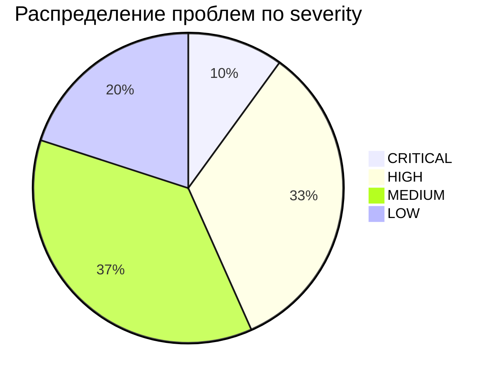

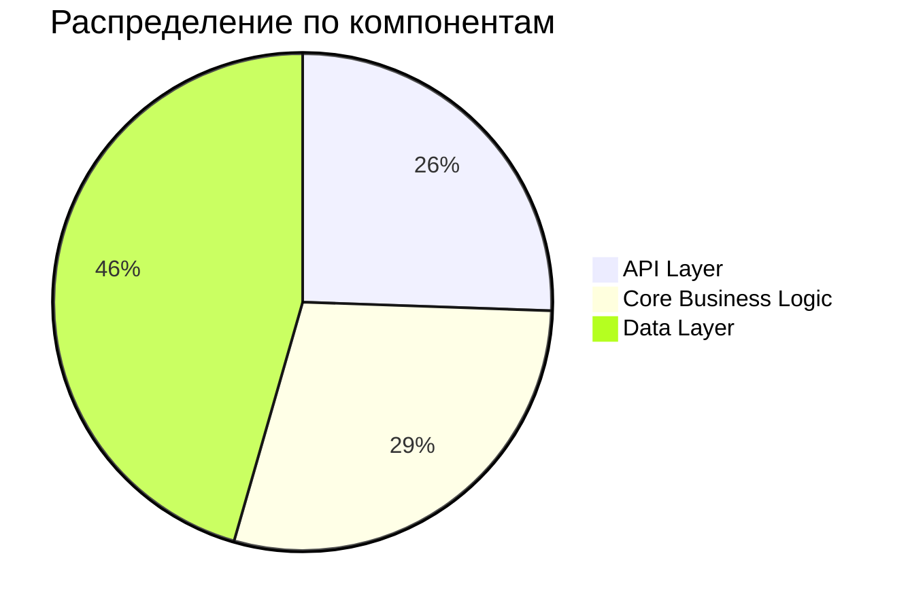

---

## Детальные находки по слоям

### API Layer

**Файлы**: `app/api/`, `app/schemas/`

#### 🔴 CRITICAL (1)

| ID | Файл | Проблема |
|----|------|----------|
| API-C1 | [`payment.py`](app/schemas/payment.py) | PaymentResult схема не соответствует OpenAPI - отсутствуют поля: `from`, `to`, `equivalent`, `amount`, `routes`, `error`, `created_at`, `committed_at` |

#### 🟠 HIGH (9)

| ID | Файл | Проблема |
|----|------|----------|
| API-H1 | [`trustlines.py`](app/api/v1/trustlines.py) | GET /trustlines/{id} - endpoint не реализован |
| API-H2 | [`deps.py`](app/api/deps.py) | Нет проверки типа токена (access/refresh) |
| API-H3 | [`payments.py`](app/api/v1/payments.py) | Отсутствуют фильтры в list_payments: direction, equivalent, status, from_date, to_date |
| API-H4 | [`payment.py`](app/schemas/payment.py) | Signature закомментирована в PaymentCreateRequest |
| API-H5 | [`payments.py`](app/api/v1/payments.py) | Bare except в обработке ошибок |
| API-H6 | [`payments.py`](app/api/v1/payments.py) | Нет проверки прав доступа в get_payment |
| API-H7 | [`clearing.py`](app/schemas/clearing.py) | ClearingCycleEdge использует UUID вместо PID (string) |
| API-H8 | [`common.py`](app/schemas/common.py) | Пагинация limit/offset вместо page/per_page по спецификации |
| API-H9 | [`deps.py`](app/api/deps.py) | Отсутствует rate limiting |

#### 🟡 MEDIUM (8)

| ID | Файл | Проблема |
|----|------|----------|
| API-M1 | [`balance.py`](app/api/v1/balance.py) | Balance роутер без prefix |
| API-M2 | [`clearing.py`](app/api/v1/clearing.py) | Clearing роутер без prefix |
| API-M3 | [`trustlines.py`](app/api/v1/trustlines.py) | direction default "outgoing" вместо "all" |
| API-M4 | [`auth.py`](app/api/v1/auth.py) | OAuth2PasswordBearer с неверным tokenUrl |
| API-M5 | [`payments.py`](app/api/v1/payments.py) | Отсутствует валидация amount > 0 |
| API-M6 | [`trustlines.py`](app/api/v1/trustlines.py) | Нет валидации limit >= 0 |
| API-M7 | [`participants.py`](app/api/v1/participants.py) | Нет проверки уникальности public_key |
| API-M8 | [`router.py`](app/api/router.py) | Отсутствует версионирование в URL |

#### 🟢 LOW (5)

| ID | Файл | Проблема |
|----|------|----------|
| API-L1 | [`payments.py`](app/api/v1/payments.py) | Неинформативные сообщения об ошибках |
| API-L2 | [`trustlines.py`](app/api/v1/trustlines.py) | Отсутствует документация OpenAPI для параметров |
| API-L3 | [`auth.py`](app/api/v1/auth.py) | Нет логирования попыток авторизации |
| API-L4 | [`balance.py`](app/api/v1/balance.py) | Отсутствует кэширование балансов |
| API-L5 | [`clearing.py`](app/api/v1/clearing.py) | Нет пагинации для списка cycles |

---

### Core Business Logic

**Файлы**: `app/core/`

#### 🔴 CRITICAL (5)

| ID | Файл | Линия | Проблема | Последствие |
|----|------|-------|----------|-------------|
| CORE-C1 | [`engine.py`](app/core/payments/engine.py) | 301 | `commit()` вызывается внутри `prepare()` | Нарушает атомарность 2PC протокола |
| CORE-C2 | [`engine.py`](app/core/payments/engine.py) | 319-325 | В `commit()` нет проверки `expires_at` у locks | Lock может истечь до commit |
| CORE-C3 | [`router.py`](app/core/payments/router.py) | 91-116 | Граф не учитывает pending locks при построении | Capacity считается неверно |
| CORE-C4 | [`service.py`](app/core/payments/service.py) | 85 | Двойной commit - после Transaction и в prepare | Inconsistent state |
| CORE-C5 | [`clearing/service.py`](app/core/clearing/service.py) | 183-199 | Клиринг не проверяет конфликт с prepare locks | Конфликт платежа и клиринга |

#### 🟠 HIGH (8)

| ID | Файл | Линия | Проблема |
|----|------|-------|----------|
| CORE-H1 | [`router.py`](app/core/payments/router.py) | 146-161 | BFS возвращает только ОДИН путь, нужен k-shortest paths |
| CORE-H2 | [`router.py`](app/core/payments/router.py) | 95-116 | Не проверяется политика `can_be_intermediate` |
| CORE-H3 | [`engine.py`](app/core/payments/engine.py) | 259 | Двойной подсчёт `reserved_usage` |
| CORE-H4 | [`service.py`](app/core/payments/service.py) | 57-63 | Отсутствует multi-path разбиение платежа |
| CORE-H5 | [`service.py`](app/core/payments/service.py) | 101-106 | Двойная обработка исключений |
| CORE-H6 | [`clearing/service.py`](app/core/clearing/service.py) | 221-242 | `auto_clear()` может зациклиться |
| CORE-H7 | [`trustlines/service.py`](app/core/trustlines/service.py) | 139-141 | `close()` не проверяет долг в обратном направлении |
| CORE-H8 | [`balance/service.py`](app/core/balance/service.py) | 111-122 | Формула capacity неверна для направления TrustLine |

#### 🟡 MEDIUM (7)

| ID | Файл | Проблема |
|----|------|----------|
| CORE-M1 | [`engine.py`](app/core/payments/engine.py) | Отсутствует retry logic при deadlock |
| CORE-M2 | [`router.py`](app/core/payments/router.py) | Нет ограничения на глубину поиска путей |
| CORE-M3 | [`service.py`](app/core/payments/service.py) | Отсутствует идемпотентность операций |
| CORE-M4 | [`clearing/service.py`](app/core/clearing/service.py) | Нет лимита на размер цикла |
| CORE-M5 | [`trustlines/service.py`](app/core/trustlines/service.py) | Нет soft delete для trustlines |
| CORE-M6 | [`balance/service.py`](app/core/balance/service.py) | Отсутствует кэширование графа |
| CORE-M7 | [`auth/service.py`](app/core/auth/service.py) | Нет blacklist для отозванных токенов |

#### 🟢 LOW (6)

| ID | Файл | Проблема |
|----|------|----------|
| CORE-L1 | [`engine.py`](app/core/payments/engine.py) | Отсутствует structured logging |
| CORE-L2 | [`router.py`](app/core/payments/router.py) | Нет метрик производительности |
| CORE-L3 | [`service.py`](app/core/payments/service.py) | Magic numbers в коде |
| CORE-L4 | [`clearing/service.py`](app/core/clearing/service.py) | Отсутствует документация алгоритма |
| CORE-L5 | [`trustlines/service.py`](app/core/trustlines/service.py) | Нет событий/hooks для изменений |
| CORE-L6 | [`balance/service.py`](app/core/balance/service.py) | Отсутствуют unit тесты |

#### Race Conditions (выявленные)

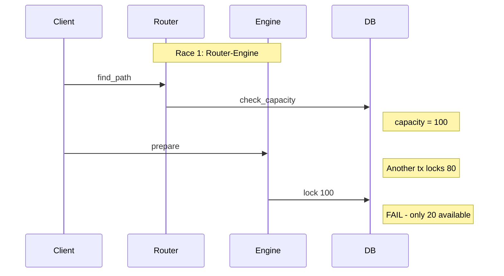

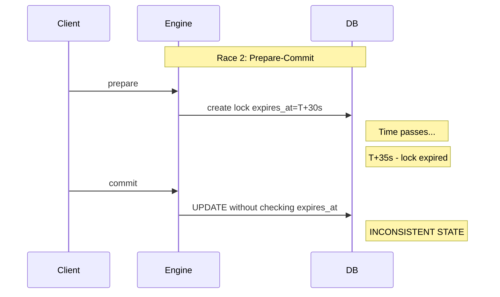

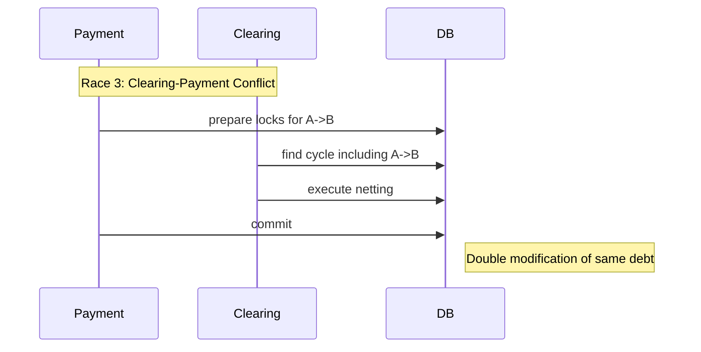

---

### Data Layer

**Файлы**: `app/db/`, `migrations/`

#### 🔴 CRITICAL (3)

| ID | Файл | Проблема | Последствие |
|----|------|----------|-------------|
| DB-C1 | [`debt.py`](app/db/models/debt.py) | Нет constraint на однонаправленность Debt (`debtor_id < creditor_id`) | Duplicate debts возможны |
| DB-C2 | [`session.py`](app/db/session.py) | Не настроен connection pooling | Connection exhaustion под нагрузкой |
| DB-C3 | [`debt.py`](app/db/models/debt.py) | Bidirectional Debt возможен | Нарушение Debt Symmetry инварианта |

#### 🟠 HIGH (13)

| ID | Файл | Проблема |
|----|------|----------|
| DB-H1 | [`equivalent.py`](app/db/models/equivalent.py) | Отсутствует поле `type` (fiat/time/commodity/local) |
| DB-H2 | [`trustline.py`](app/db/models/trustline.py) | Отсутствует `max_hop_usage` в policy |
| DB-H3 | Все модели | Нет ON DELETE CASCADE/RESTRICT для FK |
| DB-H4 | [`session.py`](app/db/session.py) | Isolation level не задан явно |
| DB-H5 | [`session.py`](app/db/session.py) | `pool_pre_ping` отключен |
| DB-H6 | [`participant.py`](app/db/models/participant.py) | `public_key` не уникален |
| DB-H7 | [`equivalent.py`](app/db/models/equivalent.py) | Отсутствует `symbol` поле |
| DB-H8 | [`001_initial_schema.py`](migrations/versions/001_initial_schema.py) | PostgreSQL-specific в миграции (pgcrypto) |
| DB-H9 | [`trustline.py`](app/db/models/trustline.py) | Нет индекса `(from_participant_id, status)` |
| DB-H10 | [`debt.py`](app/db/models/debt.py) | Нет индекса `(debtor_id, creditor_id)` |
| DB-H11 | Все модели | Отсутствуют GIN индексы для JSON полей |
| DB-H12 | [`prepare_lock.py`](app/db/models/prepare_lock.py) | Нет индекса по `expires_at` для cleanup |
| DB-H13 | [`transaction.py`](app/db/models/transaction.py) | Нет partial index для active transactions |

#### 🟡 MEDIUM (18)

| ID | Файл | Проблема |
|----|------|----------|
| DB-M1 | [`participant.py`](app/db/models/participant.py) | `display_name` без ограничения длины |
| DB-M2 | [`trustline.py`](app/db/models/trustline.py) | `limit_amount` без CHECK > 0 |
| DB-M3 | [`debt.py`](app/db/models/debt.py) | `amount` без CHECK >= 0 |
| DB-M4 | [`equivalent.py`](app/db/models/equivalent.py) | `code` без constraint на формат |
| DB-M5 | [`transaction.py`](app/db/models/transaction.py) | Отсутствует `idempotency_key` |
| DB-M6 | [`audit_log.py`](app/db/models/audit_log.py) | Нет партиционирования по дате |
| DB-M7 | [`config.py`](app/db/models/config.py) | Конфигурация в БД без версионирования |
| DB-M8 | [`auth_challenge.py`](app/db/models/auth_challenge.py) | Нет cleanup job для expired challenges |
| DB-M9 | [`prepare_lock.py`](app/db/models/prepare_lock.py) | Отсутствует `lock_type` enum |
| DB-M10 | [`integrity_checkpoint.py`](app/db/models/integrity_checkpoint.py) | Нет автоматического создания checkpoints |
| DB-M11 | Все модели | `updated_at` не обновляется автоматически |
| DB-M12 | [`session.py`](app/db/session.py) | Нет health check endpoint |
| DB-M13 | Миграции | Отсутствует rollback тестирование |
| DB-M14 | Все модели | Нет soft delete pattern |
| DB-M15 | [`trustline.py`](app/db/models/trustline.py) | `policy` JSON без schema validation |
| DB-M16 | [`transaction.py`](app/db/models/transaction.py) | `metadata` JSON без типизации |
| DB-M17 | [`debt.py`](app/db/models/debt.py) | Нет history/версионирования |
| DB-M18 | [`equivalent.py`](app/db/models/equivalent.py) | Нет `is_active` флага |

#### 🟢 LOW (7)

| ID | Файл | Проблема |
|----|------|----------|
| DB-L1 | Все модели | Inconsistent naming (snake_case vs camelCase) |
| DB-L2 | [`base.py`](app/db/base.py) | Отсутствует базовый класс с common полями |
| DB-L3 | Миграции | Нет seed данных в миграциях |
| DB-L4 | [`session.py`](app/db/session.py) | Нет connection lifecycle logging |
| DB-L5 | Все модели | Отсутствуют docstrings |
| DB-L6 | [`trustline.py`](app/db/models/trustline.py) | Enum Status как string вместо native enum |
| DB-L7 | [`transaction.py`](app/db/models/transaction.py) | Нет архивирования старых транзакций |

---

### Architecture

#### Отсутствующие компоненты

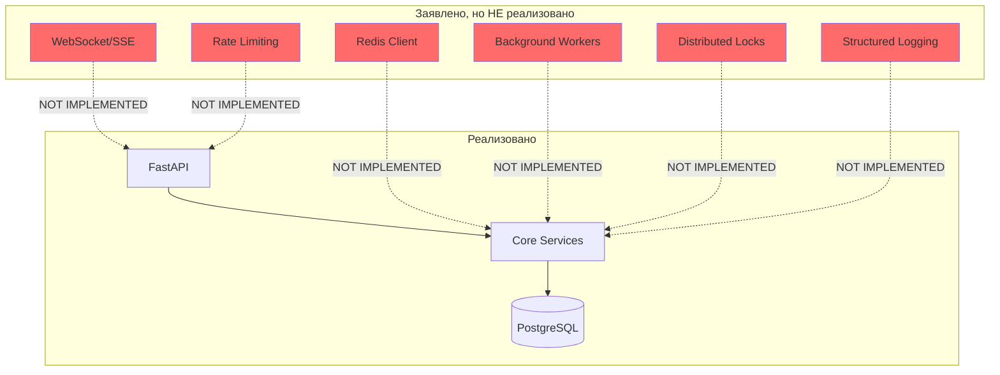

| Компонент | Статус | Критичность | Комментарий |
|-----------|--------|-------------|-------------|
| Redis Client | ❌ Не реализован | HIGH | Заявлен в документации, нужен для кэша и distributed locks |
| WebSocket/SSE | ❌ Не реализован | MEDIUM | Нужен для real-time уведомлений |
| Background Workers | ❌ Не реализован | HIGH | Нужен для async операций, cleanup |
| Distributed Locks | ❌ Не реализован | CRITICAL | Необходим для 2PC в multi-instance |
| Rate Limiting | ❌ Не реализован | HIGH | DoS protection |
| Structured Logging | ❌ Не реализован | MEDIUM | Observability |

---

## Нарушения инвариантов

### Определения инвариантов

Система GEO должна поддерживать следующие инварианты:

1. **Zero-Sum**: Сумма всех долгов в системе = 0 (для каждой единицы эквивалента)
2. **Trust Limit**: Долг никогда не превышает установленный лимит доверия
3. **Debt Symmetry**: Между двумя участниками существует только ОДИН долг с определённым направлением

### Анализ рисков

```mermaid
graph TD
    subgraph "Zero-Sum Invariant"
        ZS1[UPDATE debt A->B +100]
        ZS2[UPDATE debt B->A -100]
        ZS_FAIL[System Crash]
        ZS_RESULT[Sum != 0]

        ZS1 -->|success| ZS2
        ZS1 -->|fail before ZS2| ZS_FAIL
        ZS_FAIL --> ZS_RESULT
    end

    subgraph "Trust Limit Invariant"
        TL1[Check capacity: 100 available]
        TL2[Concurrent tx locks 80]
        TL3[Prepare locks 100]
        TL_RESULT[Limit exceeded by 80]

        TL1 --> TL2
        TL2 --> TL3
        TL3 --> TL_RESULT
    end

    subgraph "Debt Symmetry Invariant"
        DS1[Debt A->B = 50]
        DS2[Create Debt B->A = 30]
        DS_RESULT[Two debts exist]

        DS1 --> DS2
        DS2 --> DS_RESULT
    end

    style ZS_RESULT fill:#ff6b6b
    style TL_RESULT fill:#ff6b6b
    style DS_RESULT fill:#ff6b6b
```

| Инвариант | Риск нарушения | Условие | Текущая защита |
|-----------|----------------|---------|----------------|
| **Zero-Sum** | 🔴 ВЫСОКИЙ | Падение между UPDATE операциями для двух сторон долга | ❌ Нет - операции не атомарны |
| **Trust Limit** | 🔴 ВЫСОКИЙ | Race condition между check_capacity и prepare | ❌ Нет distributed locks |
| **Debt Symmetry** | 🟠 СРЕДНИЙ | Отсутствие constraint `debtor_id < creditor_id` | ❌ Нет DB constraint |

### Сценарии нарушения

#### Zero-Sum нарушение

```
T1: BEGIN
T1: UPDATE debts SET amount = amount + 100 WHERE debtor=A, creditor=B
-- SYSTEM CRASH --
-- amount(A->B) увеличен, но amount(B->A) не уменьшен
-- Sum != 0
```

#### Trust Limit нарушение

```
T1: SELECT available_capacity(A->B) => 100
T2: SELECT available_capacity(A->B) => 100
T1: PREPARE lock 80 for A->B => OK
T2: PREPARE lock 80 for A->B => OK (no pending lock check!)
-- Total locked: 160, but limit was 100
```

---

## Roadmap исправлений

### Phase 1: Critical (блокеры production)

**Цель**: Устранить все CRITICAL проблемы

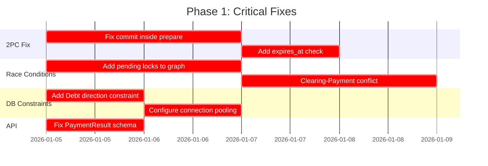

| ID | Задача | Файлы | Приоритет |
|----|--------|-------|-----------|
| P1-1 | Убрать `commit()` из `prepare()`, реализовать proper 2PC | [`engine.py`](app/core/payments/engine.py) | CRITICAL |
| P1-2 | Добавить проверку `expires_at` в `commit()` | [`engine.py`](app/core/payments/engine.py) | CRITICAL |
| P1-3 | Учитывать pending locks при построении графа | [`router.py`](app/core/payments/router.py) | CRITICAL |
| P1-4 | Добавить проверку конфликтов в clearing | [`clearing/service.py`](app/core/clearing/service.py) | CRITICAL |
| P1-5 | Добавить CHECK constraint `debtor_id < creditor_id` | [`debt.py`](app/db/models/debt.py), migrations | CRITICAL |
| P1-6 | Настроить connection pooling | [`session.py`](app/db/session.py) | CRITICAL |
| P1-7 | Привести PaymentResult к OpenAPI spec | [`payment.py`](app/schemas/payment.py) | CRITICAL |

### Phase 2: High Priority (надёжность)

**Цель**: Повысить надёжность системы

| ID | Задача | Категория |
|----|--------|-----------|
| P2-1 | Реализовать GET /trustlines/{id} | API |
| P2-2 | Добавить проверку типа токена (access/refresh) | API |
| P2-3 | Реализовать фильтры в list_payments | API |
| P2-4 | Раскомментировать и реализовать signature validation | API |
| P2-5 | Заменить bare except на specific exceptions | API |
| P2-6 | Добавить проверку прав доступа в get_payment | API |
| P2-7 | Реализовать k-shortest paths алгоритм | Core |
| P2-8 | Добавить проверку `can_be_intermediate` policy | Core |
| P2-9 | Исправить формулу capacity | Core |
| P2-10 | Реализовать multi-path splitting | Core |
| P2-11 | Добавить ON DELETE CASCADE/RESTRICT | DB |
| P2-12 | Установить isolation level SERIALIZABLE | DB |
| P2-13 | Включить pool_pre_ping | DB |
| P2-14 | Добавить уникальность public_key | DB |
| P2-15 | Добавить недостающие индексы | DB |
| P2-16 | Интегрировать Redis | Architecture |
| P2-17 | Реализовать distributed locks | Architecture |
| P2-18 | Добавить rate limiting | Architecture |

### Phase 3: Medium Priority (оптимизация)

**Цель**: Оптимизация и улучшение качества кода

| Категория | Задачи |
|-----------|--------|
| API | Исправить prefixes роутеров, пагинацию, валидации |
| Core | Добавить retry logic, идемпотентность, кэширование графа |
| DB | Добавить CHECK constraints, партиционирование, soft delete |
| Architecture | WebSocket/SSE, structured logging, background workers |

---

## Рекомендации по процессу

### Code Review Practices

1. **Mandatory reviews** для всех изменений в `app/core/payments/`
2. **Security review** для изменений в `app/core/auth/` и `app/api/deps.py`
3. **Checklist** для каждого PR:
   - [ ] Не нарушает Zero-Sum инвариант
   - [ ] Проверяет Trust Limit
   - [ ] Обрабатывает race conditions
   - [ ] Имеет тесты

### Testing Strategy

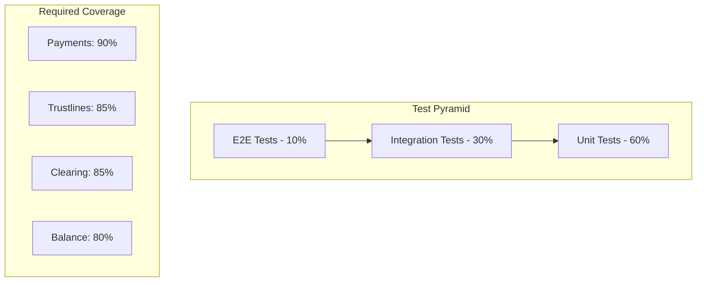

1. **Unit Tests** (60%):
   - Каждый сервис должен иметь unit тесты
   - Mock внешние зависимости (DB, Redis)
   - Target: 80% coverage

2. **Integration Tests** (30%):
   - Тестировать полные flow
   - Использовать test database
   - Проверять race conditions

3. **E2E Tests** (10%):
   - Критические сценарии
   - Multi-hop payments
   - Clearing cycles

### Documentation

1. **API Documentation**:
   - Синхронизировать OpenAPI spec с реализацией
   - Добавить примеры для каждого endpoint
   - Документировать error codes

2. **Architecture Documentation**:
   - Обновить ADR (Architecture Decision Records)
   - Документировать инварианты
   - Создать runbook для операций

3. **Code Documentation**:
   - Docstrings для всех public методов
   - Комментарии для сложной логики
   - README в каждой директории

---

## Приложения

### A. Полный список проблем API

| ID | Severity | Файл | Описание |
|----|----------|------|----------|
| API-C1 | CRITICAL | [`payment.py`](app/schemas/payment.py) | PaymentResult не соответствует OpenAPI |
| API-H1 | HIGH | [`trustlines.py`](app/api/v1/trustlines.py) | GET /trustlines/{id} не реализован |
| API-H2 | HIGH | [`deps.py`](app/api/deps.py) | Нет проверки типа токена |
| API-H3 | HIGH | [`payments.py`](app/api/v1/payments.py) | Отсутствуют фильтры list_payments |
| API-H4 | HIGH | [`payment.py`](app/schemas/payment.py) | Signature закомментирована |
| API-H5 | HIGH | [`payments.py`](app/api/v1/payments.py) | Bare except |
| API-H6 | HIGH | [`payments.py`](app/api/v1/payments.py) | Нет проверки прав доступа |
| API-H7 | HIGH | [`clearing.py`](app/schemas/clearing.py) | UUID вместо PID |
| API-H8 | HIGH | [`common.py`](app/schemas/common.py) | Неверная пагинация |
| API-H9 | HIGH | [`deps.py`](app/api/deps.py) | Нет rate limiting |
| API-M1 | MEDIUM | [`balance.py`](app/api/v1/balance.py) | Роутер без prefix |
| API-M2 | MEDIUM | [`clearing.py`](app/api/v1/clearing.py) | Роутер без prefix |
| API-M3 | MEDIUM | [`trustlines.py`](app/api/v1/trustlines.py) | direction default неверный |
| API-M4 | MEDIUM | [`auth.py`](app/api/v1/auth.py) | OAuth2PasswordBearer tokenUrl |
| API-M5 | MEDIUM | [`payments.py`](app/api/v1/payments.py) | Нет валидации amount |
| API-M6 | MEDIUM | [`trustlines.py`](app/api/v1/trustlines.py) | Нет валидации limit |
| API-M7 | MEDIUM | [`participants.py`](app/api/v1/participants.py) | Не проверяется уникальность |
| API-M8 | MEDIUM | [`router.py`](app/api/router.py) | Нет версионирования |
| API-L1 | LOW | [`payments.py`](app/api/v1/payments.py) | Неинформативные ошибки |
| API-L2 | LOW | [`trustlines.py`](app/api/v1/trustlines.py) | Нет OpenAPI docs |
| API-L3 | LOW | [`auth.py`](app/api/v1/auth.py) | Нет логирования auth |
| API-L4 | LOW | [`balance.py`](app/api/v1/balance.py) | Нет кэширования |
| API-L5 | LOW | [`clearing.py`](app/api/v1/clearing.py) | Нет пагинации |

### B. Полный список проблем Core

| ID | Severity | Файл | Линия | Описание |
|----|----------|------|-------|----------|
| CORE-C1 | CRITICAL | [`engine.py`](app/core/payments/engine.py) | 301 | commit() внутри prepare() |
| CORE-C2 | CRITICAL | [`engine.py`](app/core/payments/engine.py) | 319-325 | Нет проверки expires_at |
| CORE-C3 | CRITICAL | [`router.py`](app/core/payments/router.py) | 91-116 | Граф без pending locks |
| CORE-C4 | CRITICAL | [`service.py`](app/core/payments/service.py) | 85 | Двойной commit |
| CORE-C5 | CRITICAL | [`clearing/service.py`](app/core/clearing/service.py) | 183-199 | Конфликт с prepare locks |
| CORE-H1 | HIGH | [`router.py`](app/core/payments/router.py) | 146-161 | Только один путь в BFS |
| CORE-H2 | HIGH | [`router.py`](app/core/payments/router.py) | 95-116 | Нет проверки can_be_intermediate |
| CORE-H3 | HIGH | [`engine.py`](app/core/payments/engine.py) | 259 | Двойной reserved_usage |
| CORE-H4 | HIGH | [`service.py`](app/core/payments/service.py) | 57-63 | Нет multi-path |
| CORE-H5 | HIGH | [`service.py`](app/core/payments/service.py) | 101-106 | Двойная обработка исключений |
| CORE-H6 | HIGH | [`clearing/service.py`](app/core/clearing/service.py) | 221-242 | auto_clear() зацикливание |
| CORE-H7 | HIGH | [`trustlines/service.py`](app/core/trustlines/service.py) | 139-141 | close() без проверки долга |
| CORE-H8 | HIGH | [`balance/service.py`](app/core/balance/service.py) | 111-122 | Неверная формула capacity |
| CORE-M1 | MEDIUM | [`engine.py`](app/core/payments/engine.py) | - | Нет retry logic |
| CORE-M2 | MEDIUM | [`router.py`](app/core/payments/router.py) | - | Нет ограничения глубины |
| CORE-M3 | MEDIUM | [`service.py`](app/core/payments/service.py) | - | Нет идемпотентности |
| CORE-M4 | MEDIUM | [`clearing/service.py`](app/core/clearing/service.py) | - | Нет лимита размера цикла |
| CORE-M5 | MEDIUM | [`trustlines/service.py`](app/core/trustlines/service.py) | - | Нет soft delete |
| CORE-M6 | MEDIUM | [`balance/service.py`](app/core/balance/service.py) | - | Нет кэширования графа |
| CORE-M7 | MEDIUM | [`auth/service.py`](app/core/auth/service.py) | - | Нет blacklist токенов |
| CORE-L1 | LOW | [`engine.py`](app/core/payments/engine.py) | - | Нет structured logging |
| CORE-L2 | LOW | [`router.py`](app/core/payments/router.py) | - | Нет метрик |
| CORE-L3 | LOW | [`service.py`](app/core/payments/service.py) | - | Magic numbers |
| CORE-L4 | LOW | [`clearing/service.py`](app/core/clearing/service.py) | - | Нет документации |
| CORE-L5 | LOW | [`trustlines/service.py`](app/core/trustlines/service.py) | - | Нет events/hooks |
| CORE-L6 | LOW | [`balance/service.py`](app/core/balance/service.py) | - | Нет unit тестов |

### C. Полный список проблем DB

| ID | Severity | Файл | Описание |
|----|----------|------|----------|
| DB-C1 | CRITICAL | [`debt.py`](app/db/models/debt.py) | Нет constraint направленности |
| DB-C2 | CRITICAL | [`session.py`](app/db/session.py) | Нет connection pooling |
| DB-C3 | CRITICAL | [`debt.py`](app/db/models/debt.py) | Bidirectional debt возможен |
| DB-H1 | HIGH | [`equivalent.py`](app/db/models/equivalent.py) | Нет поля type |
| DB-H2 | HIGH | [`trustline.py`](app/db/models/trustline.py) | Нет max_hop_usage |
| DB-H3 | HIGH | Все модели | Нет ON DELETE CASCADE |
| DB-H4 | HIGH | [`session.py`](app/db/session.py) | Isolation level не задан |
| DB-H5 | HIGH | [`session.py`](app/db/session.py) | pool_pre_ping отключен |
| DB-H6 | HIGH | [`participant.py`](app/db/models/participant.py) | public_key не уникален |
| DB-H7 | HIGH | [`equivalent.py`](app/db/models/equivalent.py) | Нет symbol |
| DB-H8 | HIGH | [`001_initial_schema.py`](migrations/versions/001_initial_schema.py) | PostgreSQL-specific |
| DB-H9 | HIGH | [`trustline.py`](app/db/models/trustline.py) | Нет индекса from_participant_id+status |
| DB-H10 | HIGH | [`debt.py`](app/db/models/debt.py) | Нет индекса debtor_id+creditor_id |
| DB-H11 | HIGH | Все модели | Нет GIN индексов для JSON |
| DB-H12 | HIGH | [`prepare_lock.py`](app/db/models/prepare_lock.py) | Нет индекса expires_at |
| DB-H13 | HIGH | [`transaction.py`](app/db/models/transaction.py) | Нет partial index |
| DB-M1 | MEDIUM | [`participant.py`](app/db/models/participant.py) | display_name без ограничения |
| DB-M2 | MEDIUM | [`trustline.py`](app/db/models/trustline.py) | limit_amount без CHECK |
| DB-M3 | MEDIUM | [`debt.py`](app/db/models/debt.py) | amount без CHECK |
| DB-M4 | MEDIUM | [`equivalent.py`](app/db/models/equivalent.py) | code без constraint |
| DB-M5 | MEDIUM | [`transaction.py`](app/db/models/transaction.py) | Нет idempotency_key |
| DB-M6 | MEDIUM | [`audit_log.py`](app/db/models/audit_log.py) | Нет партиционирования |
| DB-M7 | MEDIUM | [`config.py`](app/db/models/config.py) | Конфиг без версионирования |
| DB-M8 | MEDIUM | [`auth_challenge.py`](app/db/models/auth_challenge.py) | Нет cleanup job |
| DB-M9 | MEDIUM | [`prepare_lock.py`](app/db/models/prepare_lock.py) | Нет lock_type enum |
| DB-M10 | MEDIUM | [`integrity_checkpoint.py`](app/db/models/integrity_checkpoint.py) | Нет auto checkpoints |
| DB-M11 | MEDIUM | Все модели | updated_at не auto |
| DB-M12 | MEDIUM | [`session.py`](app/db/session.py) | Нет health check |
| DB-M13 | MEDIUM | Миграции | Нет rollback тестов |
| DB-M14 | MEDIUM | Все модели | Нет soft delete |
| DB-M15 | MEDIUM | [`trustline.py`](app/db/models/trustline.py) | policy без schema |
| DB-M16 | MEDIUM | [`transaction.py`](app/db/models/transaction.py) | metadata без типизации |
| DB-M17 | MEDIUM | [`debt.py`](app/db/models/debt.py) | Нет history |
| DB-M18 | MEDIUM | [`equivalent.py`](app/db/models/equivalent.py) | Нет is_active |
| DB-L1 | LOW | Все модели | Inconsistent naming |
| DB-L2 | LOW | [`base.py`](app/db/base.py) | Нет базового класса |
| DB-L3 | LOW | Миграции | Нет seed данных |
| DB-L4 | LOW | [`session.py`](app/db/session.py) | Нет connection logging |
| DB-L5 | LOW | Все модели | Нет docstrings |
| DB-L6 | LOW | [`trustline.py`](app/db/models/trustline.py) | Enum как string |
| DB-L7 | LOW | [`transaction.py`](app/db/models/transaction.py) | Нет архивирования |

### D. Архитектурные диаграммы

#### D.1 Текущая архитектура

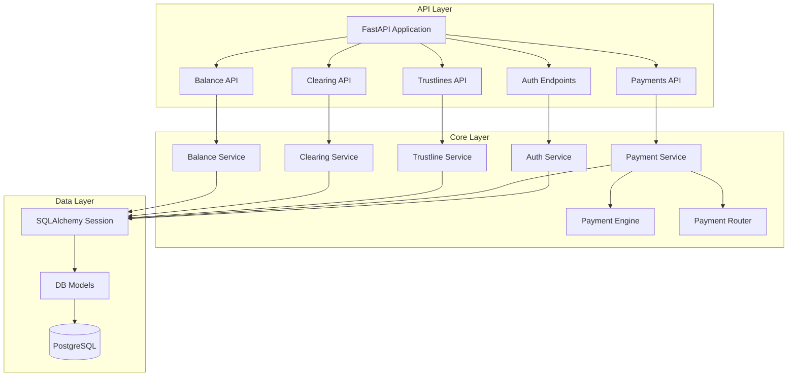

#### D.2 Целевая архитектура

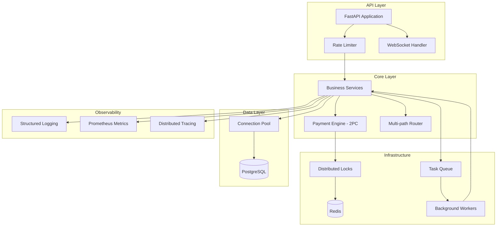

#### D.3 Payment Flow - Целевой

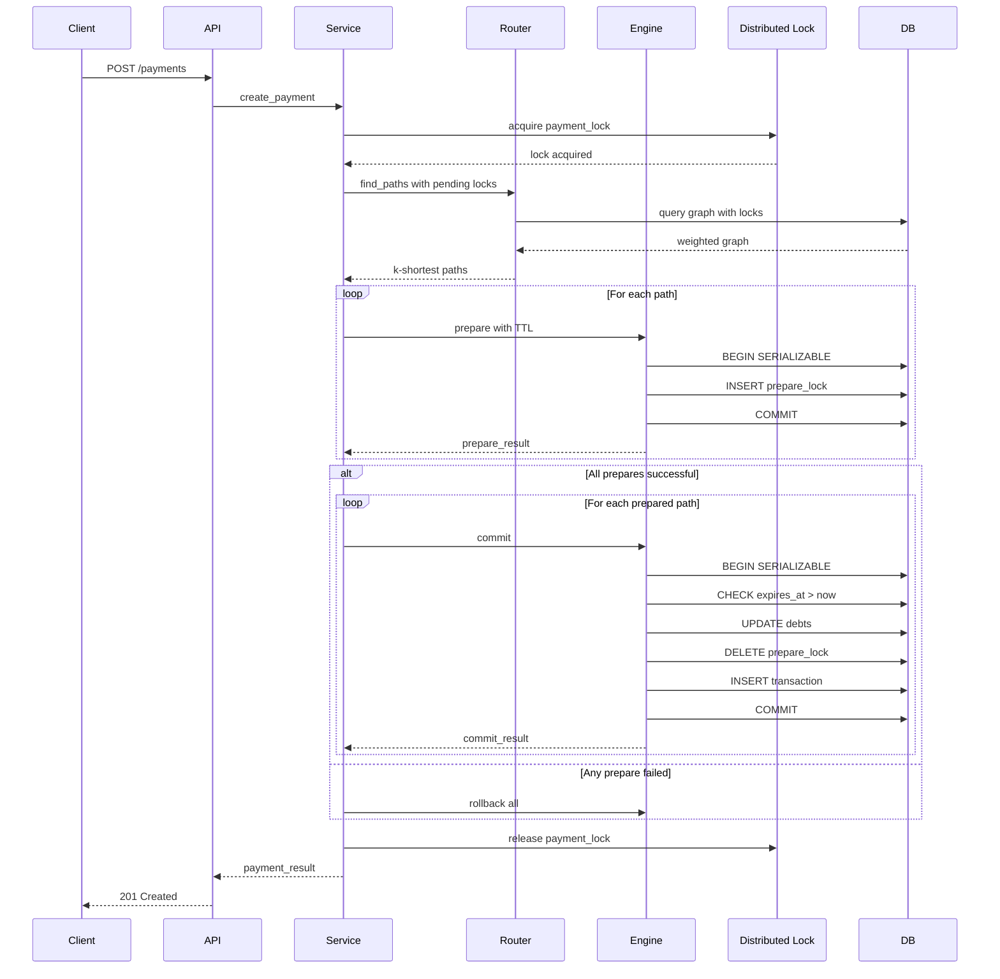

---

## Заключение

Проект GEO v0.1 демонстрирует хорошую базовую структуру и правильное направление разработки. Однако текущая реализация содержит **9 критических проблем**, которые делают систему **непригодной для production-использования**.

### Приоритеты исправления:

1. **Немедленно**: Исправить 2PC атомарность в платежном движке
2. **Краткосрочно**: Добавить distributed locks и проверку race conditions
3. **Среднесрочно**: Привести API в соответствие с OpenAPI спецификацией
4. **Долгосрочно**: Внедрить полноценную observability и инфраструктурные компоненты

### Метаданные отчета

- **Автор**: Code Review Team
- **Дата**: 2026-01-04
- **Версия**: 1.0
- **Проверено файлов**: 45+
- **Общее количество проблем**: 90

---

_Конец отчета_

---

## Addendum: Верификация отчёта по коду и спецификациям (GitHub Copilot, GPT-5.2)

_Дата проверки: 2026-01-04_  
_Объекты проверки:_

- Реализация: `app/` (API, Core, DB)
- OpenAPI: `api/openapi.yaml`
- Спецификация протокола: `docs/ru/02-protocol-spec.md`
- API Reference (docs): `docs/ru/04-api-reference.md`

### Легенда статусов

- **CONFIRMED** — утверждение подтверждается кодом/спекой.
- **PARTIAL** — проблема реальна, но формулировка/Severity требует уточнения; либо есть частичная защита.
- **NOT CONFIRMED** — утверждение неверно для текущего состояния репозитория.
- **SPEC MISMATCH** — спор не про «баг», а про расхождение документов между собой (например, docs vs OpenAPI vs код).

---

## A. Проверка API Layer (таблица Appendix A)

### API-C1 (CRITICAL): `PaymentResult` не соответствует OpenAPI

- **Статус:** CONFIRMED
- **Доказательства:**
    - OpenAPI `PaymentResult` требует поля `from`, `to`, `equivalent`, `amount`, `created_at`, опционально `routes`, `error`, `committed_at` (`api/openapi.yaml`, schema `PaymentResult`).
    - В коде `app/schemas/payment.py` `PaymentResult` содержит только `tx_id`, `status`, `path`.
- **Рекомендации:**
    1. Либо привести `app/schemas/payment.py:PaymentResult` к OpenAPI (и обновить возвращаемое значение из `PaymentService.create_payment`).
    2. Либо обновить `api/openapi.yaml` под текущую реализацию (хуже, т.к. протокол/доки уже требуют richer ответ).

### API-H1 (HIGH): GET `/trustlines/{id}` не реализован

- **Статус:** SPEC MISMATCH
- **Пояснение:** В текущем `api/openapi.yaml` **нет** `GET /trustlines/{id}` — только `PATCH` и `DELETE`. В коде также нет GET-роута; при этом в `TrustLineService` есть метод `get_one()`, но он не экспонирован через API.
- **Рекомендация:** согласовать документы и API: либо добавить GET endpoint, либо убрать утверждение из отчёта/из docs.

### API-H2 (HIGH): нет проверки типа токена (access/refresh)

- **Статус:** NOT CONFIRMED
- **Доказательства:** `app/utils/security.py:decode_token()` проверяет `payload["type"]` и по умолчанию ожидает `access`. `get_current_participant` использует `decode_token(token)` (то есть access-only).
- **Рекомендации:**
    - Если планируется endpoint refresh — добавить отдельную dependency, которая вызывает `decode_token(..., expected_type="refresh")`.
    - В OpenAPI описать refresh-flow (если он часть v0.1).

### API-H3 (HIGH): отсутствуют фильтры list_payments

- **Статус:** CONFIRMED
- **Доказательства:** OpenAPI для `GET /payments` содержит `direction`, `equivalent`, `status`, `from_date`, `to_date`, `page`, `per_page`; реализация принимает `limit/offset` и игнорирует фильтры.
- **Рекомендации:** привести реализацию `app/api/v1/payments.py:list_payments` + `PaymentService.list_payments` к OpenAPI (или обновить OpenAPI).

### API-H4 (HIGH): signature закомментирована в `PaymentCreateRequest`

- **Статус:** CONFIRMED
- **Доказательства:** OpenAPI требует `signature` (required). В `app/schemas/payment.py` поле закомментировано.
- **Рекомендации:**
    - Добавить `signature` в request schema и валидацию подписи по протоколу (см. `docs/ru/02-protocol-spec.md`, раздел «Криптографические примитивы/подпись»).
    - Минимум для MVP: принимать signature и сохранять в `transactions.signatures`.

### API-H5 (HIGH): bare except

- **Статус:** CONFIRMED
- **Доказательства:** `app/api/v1/payments.py` содержит `except:` при парсинге amount.
- **Рекомендации:** заменить на `except (InvalidOperation, ValueError)` и вернуть структурированную ошибку.

### API-H6 (HIGH): нет проверки прав доступа в get_payment

- **Статус:** CONFIRMED
- **Доказательства:** `GET /payments/{tx_id}` отдаёт транзакцию по `tx_id` без проверки, что текущий участник — инициатор/участник маршрута.
- **Рекомендации:**
    - Минимум: разрешать доступ, если `tx.initiator_id == current_participant.id`.
    - Лучше: хранить участников/маршрут в нормализованной таблице или индексируемом поле и проверять «вовлечённость».

### API-H7 (HIGH): ClearingCycleEdge использует UUID вместо PID

- **Статус:** CONFIRMED (как несовместимость со спецификацией)
- **Доказательства:** OpenAPI ожидает `debtor/creditor` как строки (PID), код отдаёт UUID (`app/schemas/clearing.py`).
- **Рекомендации:**
    - Привести `ClearingCycleEdge` к PID-строкам (и в `ClearingService.find_cycles` возвращать PID).
    - Если это осознанно «внутренний» API — обновить OpenAPI.

### API-H8 (HIGH): пагинация limit/offset вместо page/per_page

- **Статус:** CONFIRMED
- **Доказательства:** OpenAPI `page/per_page`; реализация `limit/offset`.
- **Рекомендации:** либо изменить реализацию, либо OpenAPI. Учесть, что `docs/ru/04-api-reference.md` тоже описывает `page/per_page`.

### API-H9 (HIGH): отсутствует rate limiting

- **Статус:** CONFIRMED
- **Доказательства:** в проекте нет middleware/зависимостей для rate limiting; в deps/API не реализовано.
- **Рекомендации:** добавить rate limiting на уровне ASGI middleware (Redis-backed или in-memory для dev).

### API-M1/M2 (MEDIUM): balance/clearing роутеры без prefix

- **Статус:** NOT CONFIRMED
- **Пояснение:** В `app/api/router.py` balance и clearing подключены без prefix, но сами роуты объявлены как `/balance` и `/clearing/...`, что совпадает с OpenAPI. Функционально это корректно.
- **Рекомендация:** если нужен единый стиль, можно перенести prefix в include_router и убрать дублирующий префикс в путях, но это косметика.

### API-M3 (MEDIUM): trustlines direction default "outgoing" вместо "all"

- **Статус:** CONFIRMED
- **Доказательства:** OpenAPI default `all`; код default `outgoing`.
- **Рекомендация:** поменять default на `all` (и обработку unknown значений).

### API-M4 (MEDIUM): OAuth2PasswordBearer tokenUrl неверный

- **Статус:** NOT CONFIRMED
- **Доказательства:** `app/main.py` подключает роутер с prefix `/api/v1`; `deps.py` использует `tokenUrl="/api/v1/auth/login"`, что соответствует фактическому URL.

### API-M5 (MEDIUM): отсутствует валидация amount > 0

- **Статус:** PARTIAL
- **Пояснение:** в `PaymentService.create_payment` есть проверка `amount <= 0`; в `/payments/capacity` тоже. Но в схеме `PaymentCreateRequest.amount` — строка без дополнительных ограничений на уровне Pydantic.
- **Рекомендация:** добавить валидацию в Pydantic (condecimal / кастомный валидатор) и унифицировать ошибки.

### API-M6 (MEDIUM): trustlines limit >= 0

- **Статус:** PARTIAL
- **Пояснение:** На уровне DB есть `CHECK("limit" >= 0)` в модели/миграции. На уровне API/схемы валидация может быть неявной.
- **Рекомендация:** валидировать request и возвращать 400 до попытки COMMIT.

### API-M7 (MEDIUM): нет проверки уникальности public_key

- **Статус:** CONFIRMED
- **Доказательства:** `Participant.public_key` не unique.

### API-M8 (MEDIUM): отсутствует версионирование в URL

- **Статус:** NOT CONFIRMED
- **Доказательства:** `app/main.py` включает router с prefix `/api/v1`.

### Доп. наблюдение (docs vs код): стандартный envelope

- **Статус:** SPEC MISMATCH
- **Пояснение:** `docs/ru/04-api-reference.md` описывает `{success,data}` для успеха, но OpenAPI и реализация возвращают модели напрямую (без envelope). Ошибки возвращаются в формате `{error:{code,message,details}}`, что совпадает с OpenAPI.

---

## B. Проверка Core Business Logic (таблица Appendix B)

### CORE-C1 (CRITICAL): `commit()` внутри `prepare()`

- **Статус:** PARTIAL
- **Доказательства:** `PaymentEngine.prepare()` действительно делает `await self.session.commit()`.
- **Комментарий:** В классическом 2PC prepare **должен** фиксировать durable запись о готовности. Проблема здесь не сам commit, а то, что:
    - в сервисе `prepare` и `commit` выполняются сразу, без внешнего ACK/координатора;
    - отсутствует защита от «истекших» locks на commit;
    - нет recovery/cleanup логики для stuck PREPARED.
- **Рекомендации:** формализовать state machine и обязанности координатора (hub) согласно `docs/ru/02-protocol-spec.md` (раздел «Платежи»).

### CORE-C2 (CRITICAL): в `commit()` нет проверки `expires_at`

- **Статус:** CONFIRMED
- **Рекомендации:** в `commit()` загружать locks только с `expires_at > now` и иначе переводить tx в `ABORTED`/`REJECTED`.

### CORE-C3 (CRITICAL): роутер не учитывает pending locks

- **Статус:** PARTIAL
- **Пояснение:** Router строит граф по TrustLines/Debts и игнорирует locks. Однако Engine.prepare частично учитывает активные locks через выборку по участникам + суммирование `flows`.
- **Рекомендации:**
    - Либо переносить «оценку capacity с учётом locks» в роутер (для UX),
    - Либо явно документировать: routing — best effort, единственный источник истины — prepare.

### CORE-C4 (CRITICAL): двойной commit / разорванные транзакционные границы

- **Статус:** CONFIRMED
- **Пояснение:** `Transaction(NEW)` коммитится в сервисе, затем prepare коммитит locks+state, затем commit коммитит debt updates.
- **Рекомендация:** согласовать семантику состояний и обеспечить идемпотентность по `tx_id`.

### CORE-C5 (CRITICAL): clearing конфликтует с prepare locks

- **Статус:** CONFIRMED
- **Пояснение:** clearing лочит debts `FOR UPDATE`, но не проверяет существующие prepare locks, которые собираются модифицировать эти же отношения.
- **Рекомендации:** перед clearing определять затронутые пары (debtor/creditor/equivalent) и отклонять/откладывать клиринг при наличии активных locks.

### CORE-H1 (HIGH): BFS возвращает один путь

- **Статус:** CONFIRMED
- **Комментарий:** Это расходится с протоколом v0.1, где заявлен multi-path (до 3 маршрутов).

### CORE-H2 (HIGH): не проверяется `can_be_intermediate`

- **Статус:** CONFIRMED
- **Рекомендации:** при построении графа/поиске путей исключать промежуточные узлы, где policy запрещает интермедиат.

### CORE-H3 (HIGH): двойной подсчёт `reserved_usage`

- **Статус:** CONFIRMED
- **Пояснение:** В `prepare` есть два прохода по locks, при этом `reserved_usage` суммируется повторно (а первый проход по `diffs` не завершён корректной логикой).
- **Рекомендации:**
    - Упростить структуру lock (хранить “flow” как нормализованные поля),
    - Либо считать reserved строго один раз по `flows`.

### CORE-H4 (HIGH): нет multi-path splitting

- **Статус:** CONFIRMED

### CORE-H5 (HIGH): двойная обработка исключений

- **Статус:** PARTIAL
- **Пояснение:** В текущем виде ошибки prepare/commit оборачиваются в разные исключения и меняют state, но нет единой стратегии “какой state при каком классе ошибки”, что может приводить к неоднозначности.

### CORE-H6 (HIGH): `auto_clear()` может зациклиться

- **Статус:** PARTIAL
- **Пояснение:** Есть safety-break `count > 100`, то есть бесконечного цикла нет, но возможна деградация при постоянных конфликтах.

### CORE-H7 (HIGH): `TrustLineService.close()` не проверяет долг в обратном направлении

- **Статус:** CONFIRMED
- **Пояснение:** Проверяется только usage по направлению линии доверия; при наличии bidirectional debt можно закрыть TL, оставив “обратную” задолженность.

### CORE-H8 (HIGH): формула capacity неверна по направлению

- **Статус:** CONFIRMED
- **Пояснение:** Router использует модель: capacity S→R определяется TL (R→S). В `BalanceService` spend_capacity считается по outgoing TL (Me→N), что не совпадает с логикой маршрутизации.

### CORE-M2/M4 (MEDIUM): ограничения глубины поиска / размера цикла

- **Статус:** NOT CONFIRMED
- **Пояснение:** `find_paths` имеет `max_hops` (по умолчанию 6); `find_cycles` имеет `max_depth` (по умолчанию 6).

---

## C. Проверка Data Layer (таблица Appendix C)

### DB-C1/DB-C3 (CRITICAL): однонаправленность/симметрия debt

- **Статус:** CONFIRMED
- **Пояснение:** Уникальность задана только на `(debtor_id, creditor_id, equivalent_id)`; запись (A→B) и (B→A) одновременно возможна.
- **Комментарий по спецификации:** `docs/ru/02-protocol-spec.md` требует «одна запись на (debtor, creditor, equivalent)», но отдельно не запрещает существование обратной записи. Если вам нужен глобальный инвариант “symmetry” (ровно один из двух направлений), он должен быть закреплён либо constraint’ом (например `debtor_id < creditor_id` + хранить sign), либо доменной логикой.

### DB-C2 (CRITICAL): connection pooling

- **Статус:** PARTIAL
- **Пояснение:** Пул у SQLAlchemy обычно есть по умолчанию, но в `create_async_engine` не задано `pool_pre_ping`, лимиты пула, isolation level.

### DB-H4/H5 (HIGH): isolation level / pool_pre_ping

- **Статус:** CONFIRMED

### DB-H6 (HIGH): public_key не уникален

- **Статус:** CONFIRMED

### DB-H12 (HIGH): нет индекса `expires_at` для cleanup

- **Статус:** NOT CONFIRMED
- **Доказательства:** В миграции создаётся `idx_prepare_locks_expires_at`, а в модели `PrepareLock.expires_at` помечен `index=True`.

### DB-M11 (MEDIUM): updated_at не обновляется автоматически

- **Статус:** NOT CONFIRMED
- **Пояснение:** Во многих моделях `updated_at` имеет `onupdate=func.now()`.

### DB-M12 (MEDIUM): нет health check endpoint

- **Статус:** NOT CONFIRMED
- **Пояснение:** Есть `GET /health` в `app/main.py`.

### DB-M18 (MEDIUM): нет `is_active` у Equivalent

- **Статус:** NOT CONFIRMED
- **Пояснение:** `Equivalent.is_active` присутствует.

---

## D. Итог по достоверности

- **Критические риски, которые подтверждены:** несовместимость схемы платежей с OpenAPI, отсутствие TTL-проверки locks на commit, отсутствие access control на чтение платежей, конфликт клиринга с prepare locks, возможность bidirectional debt.
- **Пункты, которые стоит переформулировать:** CORE-C1 (это не «commit в prepare нарушает 2PC», а отсутствие полноценного 2PC-протокола/координатора и recovery), DB-C2 (скорее “не настроен пул/изоляция”).
- **Пункты, которые в текущем репо неверны/устарели:** проверка типа токена (есть), tokenUrl (скорее корректен), «нет индекса expires_at» (индекс есть), некоторые замечания про prefixes/versioning.

---

## E. Матрица верификации 90/90 (по ID из отчёта)

Ниже приведён полный список ID (23 API + 26 Core + 41 DB = **90**) со статусом и кратким комментарием.

### E.1 API Layer (23/23)

| ID | Статус | Комментарий / рекомендация |
|---|---|---|
| API-C1 | CONFIRMED | `PaymentResult` в коде не совпадает с `api/openapi.yaml`; привести схему/ответ. |
| API-H1 | SPEC MISMATCH | `GET /trustlines/{id}` отсутствует в OpenAPI; либо добавить endpoint, либо удалить claim. |
| API-H2 | NOT CONFIRMED | Проверка типа токена реализована (`decode_token` проверяет `type`). |
| API-H3 | CONFIRMED | `GET /payments` не поддерживает фильтры из OpenAPI; реализовать или обновить OpenAPI. |
| API-H4 | CONFIRMED | `signature` обязателен в OpenAPI, но отсутствует в `PaymentCreateRequest`; добавить и валидировать. |
| API-H5 | CONFIRMED | Есть `except:` в payments capacity; заменить на конкретные исключения. |
| API-H6 | CONFIRMED | Нет авторизации на `GET /payments/{tx_id}`; добавить проверку ownership/вовлечённости. |
| API-H7 | CONFIRMED | Clearing schemas используют UUID вместо PID (OpenAPI ожидает string PID); согласовать формат. |
| API-H8 | CONFIRMED | Пагинация `limit/offset` vs `page/per_page` (OpenAPI+docs); унифицировать. |
| API-H9 | CONFIRMED | Rate limiting отсутствует; добавить middleware/Redis-backed limiter. |
| API-M1 | NOT CONFIRMED | Prefix у balance функционально соответствует OpenAPI (путь `/balance`). |
| API-M2 | NOT CONFIRMED | Prefix у clearing функционально соответствует OpenAPI (путь `/clearing/...`). |
| API-M3 | CONFIRMED | default `direction` в trustlines = `outgoing`, по OpenAPI = `all`; изменить default. |
| API-M4 | NOT CONFIRMED | `tokenUrl` соответствует реальному маршруту `/api/v1/auth/login`. |
| API-M5 | PARTIAL | `amount > 0` проверяется в service/endpoints, но схема допускает любые строки; усилить валидацию Pydantic. |
| API-M6 | PARTIAL | DB constraint есть (`limit >= 0`), но желательно валидировать на входе и нормализовать ошибки. |
| API-M7 | CONFIRMED | `public_key` не уникален (DB), API не проверяет; добавить уникальность/проверку. |
| API-M8 | NOT CONFIRMED | Версионирование в URL есть: `/api/v1`.
| API-L1 | CONFIRMED | Ошибки payments часто слишком общие; стандартизировать `error.code` + детали. |
| API-L2 | CONFIRMED | В trustlines не документированы query-параметры/enum на уровне FastAPI (не критично, но влияет на docs). |
| API-L3 | CONFIRMED | Нет логирования попыток авторизации (challenge/login); добавить audit/security logging. |
| API-L4 | CONFIRMED | Кэширование баланса отсутствует; добавить (как минимум memoization/TTL) при росте нагрузки. |
| API-L5 | PARTIAL | Пагинация cycles отсутствует, но OpenAPI её не требует; можно оставить, либо добавить при больших графах. |

### E.2 Core Business Logic (26/26)

| ID | Статус | Комментарий / рекомендация |
|---|---|---|
| CORE-C1 | PARTIAL | Commit в prepare сам по себе не «ломает 2PC»; проблема в отсутствии полного протокола/ACK/recovery. |
| CORE-C2 | CONFIRMED | В commit нет проверки `expires_at`; добавьте проверку и перевод tx в ABORTED/REJECTED. |
| CORE-C3 | PARTIAL | Router игнорирует pending locks; Engine частично учитывает. Для UX/точности лучше учесть locks в routing. |
| CORE-C4 | CONFIRMED | Несколько разрозненных commit’ов (tx NEW, prepare, commit) без общей идемпотентности/state machine. |
| CORE-C5 | CONFIRMED | Clearing не учитывает prepare locks и может конфликтовать с платежами; добавить проверку конфликтов. |
| CORE-H1 | CONFIRMED | `find_paths` возвращает один путь; протокол v0.1 требует k-shortest/multipath (до 3). |
| CORE-H2 | CONFIRMED | `can_be_intermediate` не применяется при построении маршрута; фильтровать узлы/рёбра. |
| CORE-H3 | CONFIRMED | `reserved_usage` суммируется неконсистентно/дважды; нормализовать модель резервов. |
| CORE-H4 | CONFIRMED | Multi-path splitting отсутствует; требуется согласно `docs/ru/02-protocol-spec.md` (раздел 6.3.4). |
| CORE-H5 | PARTIAL | Обработка ошибок/состояний не унифицирована; нужно единое правило state transitions + коды ошибок. |
| CORE-H6 | PARTIAL | `auto_clear` не бесконечен (есть safety break), но возможна деградация при повторных конфликтах. |
| CORE-H7 | CONFIRMED | `TrustLineService.close()` проверяет только один direction usage; при bidirectional debt возможна неконсистентность. |
| CORE-H8 | CONFIRMED | Формулы/направления capacity в router vs balance расходятся; согласовать модель «какая TL задаёт capacity». |
| CORE-M1 | CONFIRMED | Нет retry logic при deadlock/serialization failures; добавить retry с backoff. |
| CORE-M2 | NOT CONFIRMED | В routing есть `max_hops` (по умолчанию 6). |
| CORE-M3 | CONFIRMED | Идемпотентность платежей отсутствует (нет idempotency_key, commit не idempotent); добавить. |
| CORE-M4 | NOT CONFIRMED | У циклов есть `max_depth` (ограничение размера цикла); дополнительный лимит опционален. |
| CORE-M5 | NOT CONFIRMED | Soft delete trustlines реализован через `status='closed'`; если нужен иной паттерн — уточнить требования. |
| CORE-M6 | CONFIRMED | Кэширование графа отсутствует; при росте данных будет дорогая `build_graph` на запрос. |
| CORE-M7 | CONFIRMED | Нет blacklist/ревокации токенов; по протоколу/безопасности желательно добавить. |
| CORE-L1 | CONFIRMED | Нет structured logging (корреляция tx_id/request_id); добавить формат JSON и поля контекста. |
| CORE-L2 | CONFIRMED | Нет метрик производительности; добавить хотя бы latency/histograms по роутам. |
| CORE-L3 | CONFIRMED | Есть magic numbers (TTL, hop limits, safety break); вынести в конфиг. |
| CORE-L4 | CONFIRMED | Нет документации алгоритмов routing/clearing в коде; добавить краткие docstrings. |
| CORE-L5 | CONFIRMED | Нет событий/hooks; опционально для интеграций/аудита. |
| CORE-L6 | CONFIRMED | Unit-тестов для BalanceService не найдено; добавить базовые тесты инвариантов формулы. |

### E.3 Data Layer (41/41)

| ID | Статус | Комментарий / рекомендация |
|---|---|---|
| DB-C1 | CONFIRMED | Нет constraint на «однонаправленность»/симметрию между парой; возможны A→B и B→A. |
| DB-C2 | PARTIAL | Пул вероятно есть по умолчанию, но не настроен: `pool_pre_ping`, лимиты, isolation level. |
| DB-C3 | CONFIRMED | Bidirectional debt возможен на уровне схемы; решать через constraint/модель sign/доменные правила. |
| DB-H1 | PARTIAL | Поле `type` отсутствует как колонка; частично можно хранить в `Equivalent.metadata`. |
| DB-H2 | CONFIRMED | `max_hop_usage` в policy отсутствует; добавить в policy + enforcement. |
| DB-H3 | CONFIRMED | FK без `ON DELETE CASCADE/RESTRICT`; определить стратегию удаления/целостности. |
| DB-H4 | CONFIRMED | Isolation level не задан явно; для 2PC/денег нужно явно выбрать стратегию. |
| DB-H5 | CONFIRMED | `pool_pre_ping` не включён; добавить для стабильности соединений. |
| DB-H6 | CONFIRMED | `Participant.public_key` не уникален; добавить unique index/constraint. |
| DB-H7 | CONFIRMED | `Equivalent.symbol` отсутствует (если требуется по бизнесу/спеке). |
| DB-H8 | CONFIRMED | Миграция завязана на PostgreSQL (`pgcrypto`, JSONB); документировать/учесть portability. |
| DB-H9 | CONFIRMED | Нет композитного индекса `(from_participant_id, status)`; добавить при нужных запросах. |
| DB-H10 | CONFIRMED | Нет композитного индекса `(debtor_id, creditor_id)`; добавить для частых lookups. |
| DB-H11 | CONFIRMED | Нет GIN индексов для JSON(B) полей (policy/payload/effects); добавить по необходимости. |
| DB-H12 | NOT CONFIRMED | Индекс по `expires_at` для `prepare_locks` есть (миграция + модель). |
| DB-H13 | CONFIRMED | Нет partial index для «активных» transactions; может понадобиться для больших объёмов. |
| DB-M1 | NOT CONFIRMED | `display_name` ограничен `String(255)`.
| DB-M2 | NOT CONFIRMED | Для trustline limit есть DB `CHECK("limit" >= 0)`; формулировку (>0) уточнить. |
| DB-M3 | NOT CONFIRMED | Для debt amount есть `CHECK(amount >= 0)`.
| DB-M4 | CONFIRMED | Нет constraint на формат `equivalents.code` (A-Z0-9_ и т.п.); добавить CHECK/валидацию. |
| DB-M5 | CONFIRMED | Нет `idempotency_key` у transactions; добавить для безопасных повторов. |
| DB-M6 | CONFIRMED | Нет партиционирования audit_log; опционально при росте данных. |
| DB-M7 | CONFIRMED | Config в БД без версионирования/аудита изменений; добавить версии или audit trail. |
| DB-M8 | CONFIRMED | Нет job для cleanup expired challenges; добавить периодическую очистку. |
| DB-M9 | CONFIRMED | Нет `lock_type` enum у prepare_locks; полезно для расширения и типизации резервов. |
| DB-M10 | CONFIRMED | Integrity checkpoints не создаются автоматически; добавить scheduled job/trigger. |
| DB-M11 | PARTIAL | `updated_at` auto есть во многих моделях, но не везде/не единообразно; унифицировать базовый mixin. |
| DB-M12 | PARTIAL | Health endpoint есть, но нет DB health (ping) и мониторинга пула; добавить /health/db или probe. |
| DB-M13 | CONFIRMED | Нет rollback/миграционных тестов; добавить хотя бы smoke миграции в CI. |
| DB-M14 | CONFIRMED | Soft delete pattern не унифицирован (кроме trustline status); определить единый подход. |
| DB-M15 | CONFIRMED | `policy` JSON без schema validation; валидировать на входе или типизировать. |
| DB-M16 | CONFIRMED | `payload/signatures/effects` как JSON без типизации; добавить схемы/версионирование payload. |
| DB-M17 | CONFIRMED | Нет history/versioning debts; для аудита/споров может понадобиться ledger/audit trail. |
| DB-M18 | NOT CONFIRMED | `Equivalent.is_active` присутствует.
| DB-L1 | PARTIAL | Naming в целом snake_case, но встречаются исключения (`metadata_`); косметика. |
| DB-L2 | CONFIRMED | Нет базового класса с common полями/миксина; сейчас `Base` пустой. |
| DB-L3 | CONFIRMED | Seed данных нет в миграциях (есть отдельная директория seeds); решить стратегию. |
| DB-L4 | CONFIRMED | Нет connection lifecycle logging; добавить при диагностике. |
| DB-L5 | CONFIRMED | Docstrings для моделей почти отсутствуют; опционально.
| DB-L6 | CONFIRMED | Enum статусов как string; можно оставить, но native enum полезнее для целостности. |
| DB-L7 | CONFIRMED | Нет архивации старых transactions/audit_log; опционально при росте объёма. |

