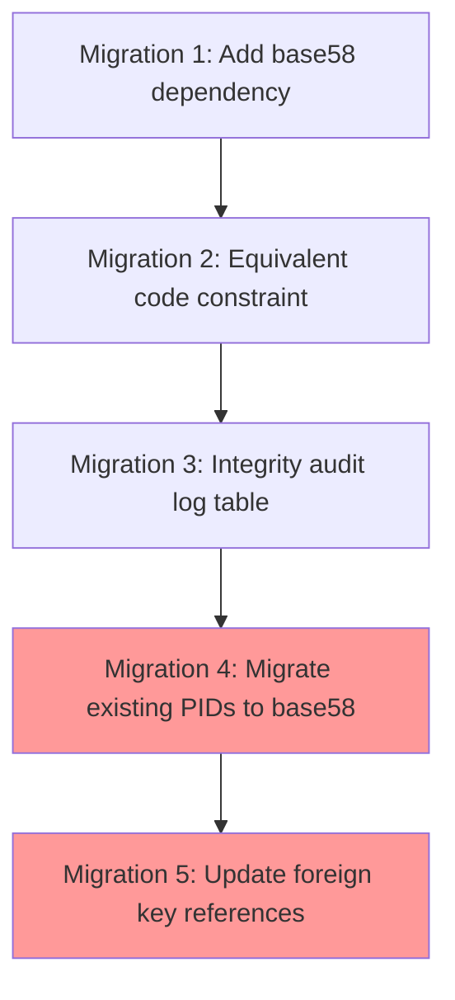

# Спецификация на доработки GEO v0.1

**Версия:** 1.0  
**Дата:** 2026-01-06  
**Статус:** Черновик  
**Основание:** Требования протокола GEO + текущее состояние реализации GEO v0.1

---

## Содержание

1. [Обзор](#1-обзор)
2. [P0: Критические доработки](#2-p0-критические-доработки)
3. [P1: Высокоприоритетные доработки](#3-p1-высокоприоритетные-доработки)
4. [P2: Среднеприоритетные доработки](#4-p2-среднеприоритетные-доработки)
5. [P3: Низкоприоритетные доработки](#5-p3-низкоприоритетные-доработки)
6. [Тестовые сценарии](#6-тестовые-сценарии)
7. [План миграции](#7-план-миграции)
8. [Чеклисты](#8-чеклисты)

---

## 1. Обзор

### 1.1 Цель документа

Данная спецификация описывает необходимые доработки кодовой базы GEO v0.1 для приведения в соответствие с протокольной спецификацией ([`docs/ru/02-protocol-spec.md`](../docs/ru/02-protocol-spec.md)) и контрактом API ([`api/openapi.yaml`](../api/openapi.yaml)).

Документ является самодостаточным: он содержит перечень работ (FIX-*), ожидаемое поведение/интерфейсы и критерии приёмки. Для начала разработки **не требуется** обращаться к отдельным аудит-отчётам.

### 1.2 Структура приоритетов

| Приоритет | Описание | Критерий |
|-----------|----------|----------|
| **P0** | Критические | Блокируют production, нарушают безопасность или целостность данных |
| **P1** | Высокие | Важны для надёжности системы |
| **P2** | Средние | Улучшают качество и соответствие спецификации |
| **P3** | Низкие | Для полноты реализации |

### 1.3 Диаграмма зависимостей

```mermaid
flowchart TD
    subgraph P0 [P0: Критические]
        P0_1[FIX-001: PID Generation]
        P0_2[FIX-002: Zero-Sum Invariant]
        P0_3[FIX-003: Trust Limit Invariant]
        P0_4[FIX-004: Auth Refresh Endpoint]
        P0_5[FIX-015: Canonical JSON Signatures]
        P0_6[FIX-016: Segment Oversubscription (Advisory Locks)]
        P0_7[FIX-017: Enforce auto_clearing in Clearing]
    end
    
    subgraph P1 [P1: Высокие]
        P1_1[FIX-005: Debt Symmetry]
        P1_2[FIX-006: Cleanup Stale Locks]
        P1_3[FIX-007: Timeouts Configuration]
        P1_4[FIX-008: Equivalent Code Validation]
        P1_5[FIX-018: TrustLine Signatures]
        P1_6[FIX-019: blocked_participants Routing]
        P1_7[FIX-020: OpenAPI vs Code (Participant.type)]
        P1_8[FIX-021: Transaction State Machine Doc/Align]
    end
    
    subgraph P2 [P2: Средние]
        P2_1[FIX-009: Integrity Status API]
        P2_2[FIX-010: Periodic Integrity Checks]
        P2_3[FIX-011: Clearing Neutrality]
        P2_4[FIX-012: SQL Cycle Detection]
    end
    
    P0_2 --> P1_1
    P0_2 --> P2_1
    P0_3 --> P1_1
    P1_1 --> P2_3
    P2_1 --> P2_2
    P0_5 --> P1_5
    P0_6 --> P0_3
    P0_7 --> P2_3
```

---

## 2. P0: Критические доработки

### FIX-001: Исправление генерации PID

#### Проблема

**Текущая реализация** ([`app/core/auth/crypto.py:34-46`](../app/core/auth/crypto.py)):
```python
def get_pid_from_public_key(public_key_b64: str) -> str:
    raw = base64.b64decode(public_key_b64)
    return base64.urlsafe_b64encode(raw).decode("utf-8").rstrip("=")
```

**Требование спецификации** (раздел 2.3):
```
PID = base58(sha256(public_key))
```

#### Спецификация изменений

**Файл:** `app/core/auth/crypto.py`

```python
import hashlib
import base58

def get_pid_from_public_key(public_key_b64: str) -> str:
    """
    Derive PID from public key according to protocol spec.
    
    PID = base58(sha256(public_key))
    
    Args:
        public_key_b64: Base64-encoded Ed25519 public key (32 bytes)
    
    Returns:
        PID string (~44 characters in Base58)
    
    Raises:
        CryptoException: If public key is invalid
    """
    try:
        # Validate it's a valid Ed25519 key
        VerifyKey(public_key_b64, encoder=Base64Encoder)
        
        # Decode raw public key bytes
        raw_key = base64.b64decode(public_key_b64)
        
        # SHA-256 hash
        key_hash = hashlib.sha256(raw_key).digest()
        
        # Base58 encode
        return base58.b58encode(key_hash).decode('utf-8')
    except Exception as e:
        raise CryptoException(f"Invalid public key: {str(e)}")
```

**Зависимости:**
- Добавить `base58` в `requirements.txt`

#### План миграции

1. Создать миграцию для пересчёта всех существующих PID
2. Обновить индексы
3. Обновить связанные записи (auth_challenges, transactions)

```python
# migrations/versions/00X_migrate_pids_to_base58.py
async def upgrade():
    # 1. Добавить временную колонку
    op.add_column('participants', sa.Column('pid_new', sa.String(64)))
    
    # 2. Пересчитать PID для каждого участника
    participants = await session.execute(select(Participant))
    for p in participants.scalars():
        p.pid_new = get_pid_from_public_key(p.public_key)
    
    # 3. Обновить связанные таблицы
    # ... auth_challenges, transactions.initiator_pid, etc.
    
    # 4. Переименовать колонки
    op.drop_column('participants', 'pid')
    op.alter_column('participants', 'pid_new', new_column_name='pid')
```

#### Тесты

```python
# tests/unit/test_crypto.py
def test_pid_generation_matches_spec():
    """PID must be base58(sha256(public_key))"""
    public_key_b64 = "O2onvM62pC1io6jQKm8NczZTIVdx3iQ6Y6wEihi1nakp"
    
    pid = get_pid_from_public_key(public_key_b64)
    
    # Verify format
    assert len(pid) >= 40 and len(pid) <= 50  # Base58 of 32 bytes
    assert all(c in "123456789ABCDEFGHJKLMNPQRSTUVWXYZabcdefghijkmnopqrstuvwxyz" for c in pid)
    
    # Verify determinism
    assert get_pid_from_public_key(public_key_b64) == pid

def test_pid_uses_sha256():
    """Verify SHA-256 is used in PID derivation"""
    public_key_b64 = "O2onvM62pC1io6jQKm8NczZTIVdx3iQ6Y6wEihi1nakp"
    raw_key = base64.b64decode(public_key_b64)
    expected_hash = hashlib.sha256(raw_key).digest()
    
    pid = get_pid_from_public_key(public_key_b64)
    decoded = base58.b58decode(pid)
    
    assert decoded == expected_hash
```

---

### FIX-002: Реализация Zero-Sum инварианта

#### Проблема

Zero-Sum инвариант не проверяется. Согласно спецификации (раздел 11.2.1):
```
∀ equivalent E: ∑ net_balance(participant, E) = 0
```

Примечание по текущей модели хранения (важно для корректной реализации и тестов):
- В представлении состояния только через рёбра `Debt(debtor, creditor, amount)` сумма $\sum net\_balance$ по всем участникам **алгебраически равна 0 по построению** (каждая запись добавляет `+amount` кредитору и `-amount` должнику).
- Поэтому zero-sum check в текущей модели — это в основном **протокольная формальность** и smoke-test на явную порчу/неконсистентность данных, но он **не заменяет** проверки `trust limit` и `debt symmetry`.

#### Спецификация изменений

**Новый файл:** `app/core/invariants.py`

```python
from decimal import Decimal
from typing import Dict, List, Optional, Tuple
from uuid import UUID

from sqlalchemy import select, func
from sqlalchemy.ext.asyncio import AsyncSession

from app.db.models.debt import Debt
from app.db.models.equivalent import Equivalent
from app.utils.exceptions import IntegrityViolationException

class InvariantChecker:
    """
    Проверяет фундаментальные инварианты протокола.
    """
    
    def __init__(self, session: AsyncSession):
        self.session = session
    
    async def check_zero_sum(
        self, 
        equivalent_id: Optional[UUID] = None
    ) -> Dict[UUID, Decimal]:
        """
        Проверить Zero-Sum инвариант: сумма всех балансов = 0.
        
        Args:
            equivalent_id: Проверить только для этого эквивалента (или все)
        
        Returns:
            Dict[equivalent_id, imbalance] - пустой если всё ОК
        
        Raises:
            IntegrityViolationException: Если инвариант нарушен
        """
        # SQL:
        # SELECT equivalent_id, 
        #        SUM(amount) as total_debts,
        #        SUM(-amount) as total_credits
        # FROM debts
        # GROUP BY equivalent_id
        #
        # Для каждого эквивалента сумма должна быть 0:
        # Каждый долг (debtor -> creditor) создаёт:
        #   - отрицательный баланс у debtor
        #   - положительный баланс у creditor
        # Следовательно, сумма = 0
        
        query = select(
            Debt.equivalent_id,
            func.sum(Debt.amount).label('total_debt')
        ).group_by(Debt.equivalent_id)
        
        if equivalent_id:
            query = query.where(Debt.equivalent_id == equivalent_id)
        
        result = await self.session.execute(query)
        
        # Для каждого эквивалента, нам нужно проверить что:
        # sum(debt_amount) для каждого участника в сумме даёт 0
        # Это автоматически верно если debt записи корректны
        
        # Более точная проверка: для каждого участника
        # net_balance = sum(credits) - sum(debts)
        # sum(net_balance) over all participants = 0
        
        violations = {}
        
        equivalents = await self.session.execute(select(Equivalent.id))
        for (eq_id,) in equivalents:
            if equivalent_id and eq_id != equivalent_id:
                continue
            
            imbalance = await self._compute_imbalance(eq_id)
            if imbalance != Decimal('0'):
                violations[eq_id] = imbalance
        
        if violations:
            raise IntegrityViolationException(
                code="ZERO_SUM_VIOLATION",
                message=f"Zero-sum invariant violated for {len(violations)} equivalents",
                details={"violations": {str(k): str(v) for k, v in violations.items()}}
            )
        
        return violations
    
    async def _compute_imbalance(self, equivalent_id: UUID) -> Decimal:
        """
        Вычислить дисбаланс для эквивалента.
        
        Для каждого участника:
            net_balance = (сумма кредитов) - (сумма долгов)
        
        Сумма всех net_balance должна быть 0.
        """
        # Debts as creditor (positive)
        credits_query = select(
            Debt.creditor_id,
            func.sum(Debt.amount).label('total')
        ).where(Debt.equivalent_id == equivalent_id).group_by(Debt.creditor_id)
        
        # Debts as debtor (negative)
        debts_query = select(
            Debt.debtor_id,
            func.sum(Debt.amount).label('total')
        ).where(Debt.equivalent_id == equivalent_id).group_by(Debt.debtor_id)
        
        credits = dict(await self.session.execute(credits_query))
        debts = dict(await self.session.execute(debts_query))
        
        all_participants = set(credits.keys()) | set(debts.keys())
        
        total = Decimal('0')
        for pid in all_participants:
            credit = credits.get(pid, Decimal('0'))
            debt = debts.get(pid, Decimal('0'))
            total += (credit - debt)
        
        return total
```

**Интеграция в PaymentEngine:**

```python
# app/core/payments/engine.py

async def commit(self, tx_id: str):
    # ... existing code ...
    
    # После применения изменений, проверить инвариант
    from app.core.invariants import InvariantChecker
    
    checker = InvariantChecker(self.session)
    try:
        await checker.check_zero_sum(equivalent_id)
    except IntegrityViolationException as e:
        # Откатить транзакцию
        await self.session.rollback()
        await self.abort(tx_id, reason=f"Zero-sum violation: {e.message}")
        raise
    
    # ... continue with commit ...
```

#### Тесты

```python
# tests/unit/test_invariants.py

async def test_zero_sum_passes_for_balanced_debts(db_session):
    """Zero-sum check passes when debts are balanced"""
    checker = InvariantChecker(db_session)
    
    # Create balanced debts: A owes B 100
    # net_balance(A) = -100
    # net_balance(B) = +100
    # sum = 0
    
    await create_debt(debtor=A, creditor=B, amount=100, equivalent=UAH)
    
    violations = await checker.check_zero_sum()
    assert violations == {}

async def test_zero_sum_fails_for_imbalanced_debts(db_session):
    """Zero-sum check fails when debts are imbalanced"""
    checker = InvariantChecker(db_session)
    
    # NOTE: В текущей модели (только таблица debts) zero-sum по всем участникам равен 0 по построению.
    # Изменение amount само по себе не создаёт «дисбаланс» (оно симметрично влияет на debtor и creditor).
    # Этот тест имеет смысл только если:
    # - добавлен дополнительный источник балансов (issuance/fees/etc.), или
    # - моделируется неконсистентность данных (например, ручная порча FK/строк).
    debt = Debt(debtor_id=A, creditor_id=B, amount=150, equivalent_id=UAH)
    db_session.add(debt)
    await db_session.commit()
    
    with pytest.raises(IntegrityViolationException) as exc_info:
        await checker.check_zero_sum()
    
    assert exc_info.value.code == "ZERO_SUM_VIOLATION"
```

---

### FIX-003: Реализация Trust Limit инварианта

#### Проблема

Инвариант `debt[B→A, E] ≤ limit(A→B, E)` не проверяется после транзакций.

#### Спецификация изменений

**Добавить в `app/core/invariants.py`:**

```python
async def check_trust_limits(
    self, 
    equivalent_id: Optional[UUID] = None,
    participant_pairs: Optional[List[Tuple[UUID, UUID]]] = None
) -> List[Dict]:
    """
    Проверить Trust Limit инвариант: долг не превышает лимит.
    
    Инвариант: debt[debtor→creditor, E] ≤ trustline[creditor→debtor, E].limit
    
    Args:
        equivalent_id: Проверить только для этого эквивалента
        participant_pairs: Проверить только для этих пар (debtor_id, creditor_id)
    
    Returns:
        List of violations with details
    
    Raises:
        IntegrityViolationException: Если есть нарушения
    """
    # SQL-запрос для поиска нарушений:
    # SELECT d.debtor_id, d.creditor_id, d.equivalent_id,
    #        d.amount as debt_amount,
    #        COALESCE(tl.limit, 0) as trust_limit
    # FROM debts d
    # LEFT JOIN trust_lines tl ON 
    #     tl.from_participant_id = d.creditor_id 
    #     AND tl.to_participant_id = d.debtor_id
    #     AND tl.equivalent_id = d.equivalent_id
    #     AND tl.status = 'active'
    # WHERE d.amount > COALESCE(tl.limit, 0)
    
    from sqlalchemy import and_, or_, outerjoin
    from sqlalchemy.orm import aliased
    
    tl = aliased(TrustLine)
    
    query = (
        select(
            Debt.debtor_id,
            Debt.creditor_id,
            Debt.equivalent_id,
            Debt.amount.label('debt_amount'),
            func.coalesce(tl.limit, Decimal('0')).label('trust_limit')
        )
        .select_from(Debt)
        .outerjoin(
            tl,
            and_(
                tl.from_participant_id == Debt.creditor_id,
                tl.to_participant_id == Debt.debtor_id,
                tl.equivalent_id == Debt.equivalent_id,
                tl.status == 'active'
            )
        )
        .where(Debt.amount > func.coalesce(tl.limit, Decimal('0')))
    )
    
    if equivalent_id:
        query = query.where(Debt.equivalent_id == equivalent_id)
    
    if participant_pairs:
        pair_conditions = [
            and_(Debt.debtor_id == d, Debt.creditor_id == c)
            for d, c in participant_pairs
        ]
        query = query.where(or_(*pair_conditions))
    
    result = await self.session.execute(query)
    violations = []
    
    for row in result:
        violations.append({
            'debtor_id': str(row.debtor_id),
            'creditor_id': str(row.creditor_id),
            'equivalent_id': str(row.equivalent_id),
            'debt_amount': str(row.debt_amount),
            'trust_limit': str(row.trust_limit),
            'violation_amount': str(row.debt_amount - row.trust_limit)
        })
    
    if violations:
        raise IntegrityViolationException(
            code="TRUST_LIMIT_VIOLATION",
            message=f"Trust limit exceeded for {len(violations)} debt(s)",
            details={"violations": violations}
        )
    
    return violations
```

**Интеграция в PaymentEngine:**

```python
# app/core/payments/engine.py

async def commit(self, tx_id: str):
    # ... apply flows ...
    
    # Собрать затронутые пары участников
    affected_pairs = []
    for lock in locks:
        for flow in lock.effects.get('flows', []):
            affected_pairs.append((
                UUID(flow['from']),
                UUID(flow['to'])
            ))
    
    # Проверить Trust Limit инвариант
    checker = InvariantChecker(self.session)
    try:
        await checker.check_trust_limits(
            equivalent_id=equivalent_id,
            participant_pairs=affected_pairs
        )
    except IntegrityViolationException as e:
        await self.session.rollback()
        await self.abort(tx_id, reason=f"Trust limit violation: {e.message}")
        raise
```

#### Тесты

```python
async def test_trust_limit_violation_detected(db_session):
    """Detect when debt exceeds trust limit"""
    # Setup: TrustLine A->B with limit 100
    await create_trustline(from_pid=A, to_pid=B, limit=100)
    
    # Create debt B->A = 150 (exceeds limit)
    await create_debt(debtor=B, creditor=A, amount=150)
    
    checker = InvariantChecker(db_session)
    with pytest.raises(IntegrityViolationException) as exc_info:
        await checker.check_trust_limits()
    
    assert exc_info.value.code == "TRUST_LIMIT_VIOLATION"
    assert len(exc_info.value.details['violations']) == 1
```

---

### FIX-004: Реализация /auth/refresh endpoint

#### Проблема

Endpoint для обновления JWT токенов не реализован.

#### Спецификация изменений

**Файл:** `app/api/v1/auth.py`

```python
from app.schemas.auth import RefreshRequest

@router.post("/refresh", response_model=TokenPair)
async def refresh_tokens(
    request: RefreshRequest,
    db: AsyncSession = Depends(deps.get_db),
):
    """
    Обновить access token используя refresh token.
    
    - Validate refresh token signature and expiry
    - Check if token is revoked
    - Issue new token pair
    - Revoke old refresh token
    """
    service = AuthService(db)
    try:
        tokens = await service.refresh_tokens(request.refresh_token)
    except UnauthorizedException:
        logger.warning("auth.refresh failed - invalid token")
        raise
    
    logger.info("auth.refresh success")
    return tokens
```

**Файл:** `app/schemas/auth.py`

```python
class RefreshRequest(BaseModel):
    refresh_token: str
```

**Файл:** `app/core/auth/service.py`

```python
async def refresh_tokens(self, refresh_token: str) -> dict:
    """
    Обновить токены используя refresh token.
    
    1. Decode and validate refresh token
    2. Check if not revoked
    3. Issue new token pair
    4. Revoke old refresh token
    """
    from app.utils.security import decode_token, create_access_token, create_refresh_token, revoke_jti
    
    # 1. Decode token
    payload = await decode_token(refresh_token, expected_type="refresh")
    if not payload:
        raise UnauthorizedException("Invalid refresh token")
    
    pid = payload.get("sub")
    jti = payload.get("jti")
    exp = payload.get("exp")
    
    if not pid or not jti:
        raise UnauthorizedException("Malformed refresh token")
    
    # 2. Verify participant exists and active
    stmt = select(Participant).where(
        Participant.pid == pid,
        Participant.status == 'active'
    )
    result = await self.db.execute(stmt)
    participant = result.scalar_one_or_none()
    
    if not participant:
        raise UnauthorizedException("Participant not found or inactive")
    
    # 3. Revoke old refresh token
    await revoke_jti(jti, exp=exp)
    
    # 4. Issue new tokens
    new_access = create_access_token(subject=pid)
    new_refresh = create_refresh_token(subject=pid)
    
    return {
        "access_token": new_access,
        "refresh_token": new_refresh,
        "token_type": "Bearer"
    }
```

**Файл:** `api/openapi.yaml` - добавить:

```yaml
/auth/refresh:
  post:
    tags: [Auth]
    summary: Refresh access token
    security: []
    requestBody:
      required: true
      content:
        application/json:
          schema:
            $ref: '#/components/schemas/RefreshRequest'
    responses:
      '200':
        description: New tokens issued
        content:
          application/json:
            schema:
              $ref: '#/components/schemas/TokenPair'
      '401':
        $ref: '#/components/responses/Unauthorized'

# In components/schemas:
RefreshRequest:
  type: object
  required: [refresh_token]
  properties:
    refresh_token:
      type: string
```

#### Тесты

```python
async def test_refresh_token_success(client, auth_tokens):
    """Successfully refresh tokens"""
    response = await client.post("/auth/refresh", json={
        "refresh_token": auth_tokens["refresh_token"]
    })
    
    assert response.status_code == 200
    data = response.json()
    assert "access_token" in data
    assert "refresh_token" in data
    assert data["token_type"] == "Bearer"
    
    # Old refresh token should be revoked
    response2 = await client.post("/auth/refresh", json={
        "refresh_token": auth_tokens["refresh_token"]
    })
    assert response2.status_code == 401

async def test_refresh_with_invalid_token(client):
    """Reject invalid refresh token"""
    response = await client.post("/auth/refresh", json={
        "refresh_token": "invalid.token.here"
    })
    assert response.status_code == 401

async def test_refresh_with_access_token_fails(client, auth_tokens):
    """Reject access token in refresh endpoint"""
    response = await client.post("/auth/refresh", json={
        "refresh_token": auth_tokens["access_token"]  # Wrong token type!
    })
    assert response.status_code == 401
```

---

### FIX-015: Приведение подписей к canonical JSON (Appendix A)

#### Проблема

Текущая реализация подписей использует строковые сообщения (registration/payment request), что расходится с протоколом, требующим canonical JSON (Appendix A) и воспроизводимого payload.

#### Спецификация изменений

**Новый модуль:** `app/core/auth/canonical.py`

- `canonical_json(payload: dict) -> bytes` — детерминированная сериализация JSON (например: `sort_keys=True`, `separators=(",", ":")`, строгая обработка Decimal/UUID).

**Обновить форматы подписываемых payload для:**
- `ParticipantCreate` (payload по протоколу)
- `PaymentCreate` (payload по протоколу)

**Синхронизировать контракт:**
- `api/openapi.yaml` должен явно описывать подписываемые поля и формат `signature`.

#### Тесты

- unit: детерминированность `canonical_json`
- unit/integration: подпись/верификация для registration/payment на одном и том же payload

---

### FIX-016: Устранение oversubscription на сегментах (Postgres advisory locks)

#### Проблема

`PrepareLock` учитывается при расчётах capacity/reserved, но при параллельных `prepare()` на одном сегменте возможен race (оба запроса проходят проверку до видимости locks друг друга), что может привести к превышению лимитов.

#### Спецификация изменений

**Файл:** `app/core/payments/engine.py`

- В `prepare_routes()` (в месте, где создаются locks по flows) добавить пессимистическую сериализацию на сегмент через Postgres advisory locks.
- Ключ блокировки: `(equivalent_id, from_participant_id, to_participant_id)` (хэш в bigint).

Примечание:
- Advisory locks доступны только на Postgres; для SQLite/dev окружения можно оставить best-effort и включать поведение условно.

#### Тесты

- integration (Postgres): два параллельных платежа через общий сегмент не должны оба пройти prepare при суммарной сумме > capacity.

---

### FIX-017: Проверка `policy.auto_clearing` перед исполнением clearing

#### Проблема

Clearing сейчас не валидирует согласие `auto_clearing` по policy trustlines и может исполнить цикл через рёбра, где auto-clearing выключен.

#### Спецификация изменений

**Файл:** `app/core/clearing/service.py`

- При выборе/перед исполнением цикла проверить по всем рёбрам цикла, что `TrustLine.policy.auto_clearing == true`.
- Если хотя бы на одном ребре `false` — не исполнять цикл (пропуск или ошибка, согласно протоколу).

#### Тесты

- unit: цикл с одним ребром `auto_clearing=false` не исполняется.

---

## 3. P1: Высокоприоритетные доработки

### FIX-018: Ed25519-подписи на TrustLine create/update/close

#### Проблема

Mutating операции TrustLines выполняются под JWT без клиентской Ed25519-подписи, что является несоответствием протоколу.

#### Спецификация изменений

- `api/openapi.yaml`: добавить `signature` и описать подписываемый payload для TrustLineCreate/Update/Close.
- `app/core/trustlines/service.py`: верифицировать подпись аналогично payment (proof-of-possession + binding полей).

#### Тесты

- unit: неверная подпись → 400
- integration: валидная подпись → операция проходит

---

### FIX-019: Enforcement `blocked_participants` в роутинге

#### Проблема

Policy `blocked_participants` сейчас не применяется в роутинге, поэтому платежи могут проходить через запрещённых промежуточных участников.

#### Спецификация изменений

- `app/core/payments/router.py`: при поиске путей исключать запрещённые PID как intermediate nodes (минимально).

---

### FIX-020: Синхронизация OpenAPI vs код для `ParticipantCreateRequest.type`

#### Проблема

В коде `type` обязательный, в OpenAPI он не required и имеет default `person`.

#### Спецификация изменений

Выбрать один вариант и привести все источники истины к нему:
- либо сделать `type` опциональным в коде (default=`person`),
- либо обновить OpenAPI/docs, что `type` обязателен.

---

### FIX-021: Стейт-машина `Transaction` — документировать/привести к протоколу

#### Проблема

`Transaction.state` содержит дополнительные состояния сверх основной протокольной PAYMENT-стейт-машины. Это допустимо как расширение, но должно быть явно задокументировано (и/или ограничено по типам транзакций).

#### Спецификация изменений

- Документировать состояния и переходы по типам транзакций.
- (Опционально) ограничить состояния per-`Transaction.type` на уровне кода/валидации.

### FIX-005: Реализация Debt Symmetry инварианта

#### Проблема

Нет проверки на взаимные долги: не может быть одновременно `debt[A→B] > 0` и `debt[B→A] > 0`.

#### Спецификация изменений

**Добавить в `app/core/invariants.py`:**

```python
async def check_debt_symmetry(
    self, 
    equivalent_id: Optional[UUID] = None
) -> List[Dict]:
    """
    Проверить Debt Symmetry инвариант: нет взаимных долгов.
    
    Инвариант: NOT (debt[A→B, E] > 0 AND debt[B→A, E] > 0)
    
    Если A должен B и B должен A в одном эквиваленте,
    эти долги должны быть взаимозачтены.
    """
    # SQL для поиска нарушений:
    # SELECT d1.debtor_id as a, d1.creditor_id as b,
    #        d1.equivalent_id,
    #        d1.amount as debt_a_to_b,
    #        d2.amount as debt_b_to_a
    # FROM debts d1
    # JOIN debts d2 ON 
    #     d1.debtor_id = d2.creditor_id 
    #     AND d1.creditor_id = d2.debtor_id
    #     AND d1.equivalent_id = d2.equivalent_id
    # WHERE d1.amount > 0 AND d2.amount > 0
    #   AND d1.debtor_id < d1.creditor_id  -- Avoid duplicate pairs
    
    from sqlalchemy.orm import aliased
    
    d1 = aliased(Debt, name='d1')
    d2 = aliased(Debt, name='d2')
    
    query = (
        select(
            d1.debtor_id.label('participant_a'),
            d1.creditor_id.label('participant_b'),
            d1.equivalent_id,
            d1.amount.label('debt_a_to_b'),
            d2.amount.label('debt_b_to_a')
        )
        .select_from(d1)
        .join(
            d2,
            and_(
                d1.debtor_id == d2.creditor_id,
                d1.creditor_id == d2.debtor_id,
                d1.equivalent_id == d2.equivalent_id
            )
        )
        .where(
            and_(
                d1.amount > 0,
                d2.amount > 0,
                d1.debtor_id < d1.creditor_id  # Canonical ordering
            )
        )
    )
    
    if equivalent_id:
        query = query.where(d1.equivalent_id == equivalent_id)
    
    result = await self.session.execute(query)
    violations = []
    
    for row in result:
        violations.append({
            'participant_a': str(row.participant_a),
            'participant_b': str(row.participant_b),
            'equivalent_id': str(row.equivalent_id),
            'debt_a_to_b': str(row.debt_a_to_b),
            'debt_b_to_a': str(row.debt_b_to_a),
            'net_debt': str(abs(row.debt_a_to_b - row.debt_b_to_a))
        })
    
    if violations:
        raise IntegrityViolationException(
            code="DEBT_SYMMETRY_VIOLATION",
            message=f"Mutual debts found for {len(violations)} pair(s)",
            details={"violations": violations}
        )
    
    return violations
```

**Исправление в `PaymentEngine._apply_flow()`:**

```python
async def _apply_flow(self, from_id: UUID, to_id: UUID, amount: Decimal, equivalent_id: UUID):
    """
    Apply flow and ensure debt symmetry is maintained.
    """
    remaining_amount = amount

    # 1. First reduce reverse debt if exists
    debt_r_s = await self._get_debt(to_id, from_id, equivalent_id)
    
    if debt_r_s and debt_r_s.amount > 0:
        reduction = min(remaining_amount, debt_r_s.amount)
        debt_r_s.amount -= reduction
        remaining_amount -= reduction
        
        # Delete zero debt to maintain cleanliness
        if debt_r_s.amount == 0:
            await self.session.delete(debt_r_s)
        else:
            self.session.add(debt_r_s)

    # 2. Create/increase forward debt with remaining
    if remaining_amount > 0:
        debt_s_r = await self._get_debt(from_id, to_id, equivalent_id)
        if not debt_s_r:
            debt_s_r = Debt(
                debtor_id=from_id,
                creditor_id=to_id,
                equivalent_id=equivalent_id,
                amount=Decimal('0')
            )
        
        debt_s_r.amount += remaining_amount
        self.session.add(debt_s_r)
```

---

### FIX-006: Очистка просроченных PrepareLocks

#### Статус в текущем коде (важно)

Функциональность cleanup stale/expired locks **уже частично реализована** через background recovery-loop:
- `app/core/recovery.py` удаляет `PrepareLock` с `expires_at <= now` и abort’ит “зависшие” payment-транзакции по таймауту.

Поэтому цель FIX-006 в рамках remediation должна быть:
- добавить тесты/метрики/алертинг для recovery,
- убедиться, что recovery включён и конфигурируем,
- при необходимости расширить логику (но не дублировать параллельный maintenance-сервис с пересекающейся ответственностью).

#### Спецификация изменений

Предпочтительный путь реализации:
- расширить существующий recovery-loop в `app/core/recovery.py` (не дублировать ответственность),
- при необходимости вынести общие функции в отдельный модуль (например, `app/core/maintenance.py`), но без второго параллельного scheduler’а.

Ниже приведён примерный дизайн, если потребуется вынесение в отдельный сервис.

**(Опционально) новый файл:** `app/core/maintenance.py`

```python
import asyncio
import logging
from datetime import datetime, timezone

from sqlalchemy import delete, select, func
from sqlalchemy.ext.asyncio import AsyncSession

from app.db.models.prepare_lock import PrepareLock
from app.db.models.transaction import Transaction

logger = logging.getLogger(__name__)

class MaintenanceService:
    def __init__(self, session: AsyncSession):
        self.session = session
    
    async def cleanup_expired_locks(self) -> int:
        """
        Удалить просроченные PrepareLocks и откатить связанные транзакции.
        
        Returns:
            Number of cleaned up locks
        """
        now = datetime.now(timezone.utc)
        
        # Find expired locks
        expired_locks = await self.session.execute(
            select(PrepareLock.tx_id)
            .where(PrepareLock.expires_at < now)
            .distinct()
        )
        
        expired_tx_ids = [row[0] for row in expired_locks]
        
        if not expired_tx_ids:
            return 0
        
        # Abort related transactions
        for tx_id in expired_tx_ids:
            tx = await self.session.execute(
                select(Transaction).where(Transaction.tx_id == tx_id)
            )
            tx = tx.scalar_one_or_none()
            
            if tx and tx.state not in ('COMMITTED', 'ABORTED'):
                tx.state = 'ABORTED'
                tx.error = {'message': 'Prepare lock expired'}
                self.session.add(tx)
                logger.info("event=maintenance.abort_expired tx_id=%s", tx_id)
        
        # Delete expired locks
        result = await self.session.execute(
            delete(PrepareLock).where(PrepareLock.expires_at < now)
        )
        
        await self.session.commit()
        
        deleted_count = result.rowcount
        logger.info("event=maintenance.cleanup_locks deleted=%d", deleted_count)
        return deleted_count
```

**Периодическая задача в `app/main.py`:**

```python
from contextlib import asynccontextmanager
import asyncio

from app.core.maintenance import MaintenanceService
from app.db.session import async_session_factory

async def periodic_cleanup():
    """Background task for periodic maintenance"""
    while True:
        try:
            async with async_session_factory() as session:
                service = MaintenanceService(session)
                await service.cleanup_expired_locks()
        except Exception as e:
            logger.exception("Maintenance task failed: %s", e)
        
        await asyncio.sleep(60)  # Every minute

@asynccontextmanager
async def lifespan(app: FastAPI):
    # Startup
    cleanup_task = asyncio.create_task(periodic_cleanup())
    
    yield
    
    # Shutdown
    cleanup_task.cancel()
    try:
        await cleanup_task
    except asyncio.CancelledError:
        pass

app = FastAPI(lifespan=lifespan)
```

---

### FIX-007: Конфигурация таймаутов согласно спецификации

#### Спецификация изменений

**Файл:** `app/config.py`

```python
class Settings(BaseSettings):
    # ... existing ...
    
    # Timeouts (milliseconds where specified)
    ROUTING_PATH_FINDING_TIMEOUT_MS: int = 500  # Was 50, spec says 500
    PREPARE_TIMEOUT_SECONDS: int = 3            # Spec section 6.9
    COMMIT_TIMEOUT_SECONDS: int = 5             # Spec section 6.9
    PAYMENT_TOTAL_TIMEOUT_SECONDS: int = 10     # Spec section 6.9
    
    # Retry configuration
    COMMIT_RETRY_ATTEMPTS: int = 3
    COMMIT_RETRY_DELAY_SECONDS: float = 0.5
```

**Интеграция в PaymentService:**

```python
# app/core/payments/service.py

async def create_payment(self, initiator_id: UUID, request: PaymentCreateRequest, ...):
    """Create and execute payment with proper timeouts"""
    import asyncio
    from app.config import settings
    
    total_timeout = settings.PAYMENT_TOTAL_TIMEOUT_SECONDS
    
    try:
        async with asyncio.timeout(total_timeout):
            # Routing phase (500ms)
            routes = await asyncio.wait_for(
                self._find_routes(request),
                timeout=settings.ROUTING_PATH_FINDING_TIMEOUT_MS / 1000
            )
            
            # Prepare phase (3s)
            await asyncio.wait_for(
                self.engine.prepare_routes(tx_id, routes, equivalent_id),
                timeout=settings.PREPARE_TIMEOUT_SECONDS
            )
            
            # Commit phase (5s with retries)
            await asyncio.wait_for(
                self.engine.commit(tx_id),
                timeout=settings.COMMIT_TIMEOUT_SECONDS
            )
            
    except asyncio.TimeoutError:
        await self.engine.abort(tx_id, reason="Payment timeout")
        raise GeoException("Payment timed out")
```

---

### FIX-008: Валидация кода эквивалента

#### Спецификация изменений

**Файл:** `app/utils/validation.py`

```python
import re
from app.utils.exceptions import BadRequestException

EQUIVALENT_CODE_PATTERN = re.compile(r'^[A-Z0-9_]{1,16}$')

def validate_equivalent_code(code: str) -> str:
    """
    Validate equivalent code according to spec.
    
    Rules:
    - 1-16 characters
    - Only A-Z, 0-9, underscore
    - Must be uppercase
    
    Returns:
        Validated code
    
    Raises:
        BadRequestException: If code is invalid
    """
    if not code:
        raise BadRequestException("Equivalent code cannot be empty")
    
    if not EQUIVALENT_CODE_PATTERN.match(code):
        raise BadRequestException(
            f"Invalid equivalent code '{code}'. "
            f"Must be 1-16 characters, uppercase letters, digits, or underscore."
        )
    
    return code
```

**Миграция БД:** `migrations/versions/00X_equivalent_code_constraint.py`

```python
def upgrade():
    # Add CHECK constraint for equivalent code format
    op.execute("""
        ALTER TABLE equivalents 
        ADD CONSTRAINT chk_equivalents_code_format 
        CHECK (code ~ '^[A-Z0-9_]{1,16}$')
    """)

def downgrade():
    op.execute("ALTER TABLE equivalents DROP CONSTRAINT chk_equivalents_code_format")
```

---

## 4. P2: Среднеприоритетные доработки

### FIX-009: API /integrity/status

Примечание: протокол ожидает набор эндпоинтов целостности, не только `GET /integrity/status`.

Минимальный набор для соответствия разделу 11.7:
- `GET /api/v1/integrity/status`
- `GET /api/v1/integrity/checksum/{equivalent}`
- `POST /api/v1/integrity/verify`
- `GET /api/v1/integrity/audit-log`

#### Спецификация изменений

**Новый файл:** `app/api/v1/integrity.py`

Также потребуется:
- подключить роутер: `app/api/router.py` → `include_router(integrity.router, prefix="/integrity", tags=["Integrity"])`
- синхронизировать `api/openapi.yaml` под новые эндпоинты

Минимальная реализация помимо `/status`:

1) `GET /integrity/checksum/{equivalent}`
- возвращает checksum последнего `IntegrityCheckpoint` для `equivalent` (или 404, если ещё не вычислялся)

2) `POST /integrity/verify`
- запускает полный набор invariant checks (как минимум: trust limits + debt symmetry; zero-sum — формально)
- записывает результат в audit-log (если он реализован)

3) `GET /integrity/audit-log`
- возвращает журнал проверок (пагинация/лимит)

```python
from fastapi import APIRouter, Depends
from sqlalchemy.ext.asyncio import AsyncSession

from app.api import deps
from app.core.invariants import InvariantChecker
from app.schemas.integrity import IntegrityStatusResponse

router = APIRouter()

@router.get("/status", response_model=IntegrityStatusResponse)
async def get_integrity_status(
    db: AsyncSession = Depends(deps.get_db),
    _current_participant = Depends(deps.get_current_participant),
):
    """
    Получить текущий статус целостности системы.
    
    Возвращает:
    - Общий статус (healthy/warning/critical)
    - Статус по каждому эквиваленту
    - Результаты последних проверок инвариантов
    """
    checker = InvariantChecker(db)
    
    equivalents_status = {}
    overall_status = "healthy"
    alerts = []
    
    # Check each equivalent
    equivalents = await db.execute(select(Equivalent))
    for eq in equivalents.scalars():
        eq_status = {
            "status": "healthy",
            "checksum": "",
            "last_verified": datetime.now(timezone.utc).isoformat(),
            "invariants": {}
        }
        
        try:
            await checker.check_zero_sum(eq.id)
            eq_status["invariants"]["zero_sum"] = {"passed": True, "value": "0.00"}
        except IntegrityViolationException as e:
            eq_status["invariants"]["zero_sum"] = {"passed": False, "details": e.details}
            eq_status["status"] = "critical"
            overall_status = "critical"
            alerts.append(f"Zero-sum violation in {eq.code}")
        
        try:
            await checker.check_trust_limits(eq.id)
            eq_status["invariants"]["trust_limits"] = {"passed": True, "violations": 0}
        except IntegrityViolationException as e:
            count = len(e.details.get("violations", []))
            eq_status["invariants"]["trust_limits"] = {"passed": False, "violations": count}
            eq_status["status"] = "critical"
            overall_status = "critical"
            alerts.append(f"Trust limit violations in {eq.code}: {count}")
        
        try:
            await checker.check_debt_symmetry(eq.id)
            eq_status["invariants"]["debt_symmetry"] = {"passed": True, "violations": 0}
        except IntegrityViolationException as e:
            count = len(e.details.get("violations", []))
            eq_status["invariants"]["debt_symmetry"] = {"passed": False, "violations": count}
            eq_status["status"] = "warning" if eq_status["status"] == "healthy" else eq_status["status"]
            if overall_status == "healthy":
                overall_status = "warning"
            alerts.append(f"Debt symmetry violations in {eq.code}: {count}")
        
        equivalents_status[eq.code] = eq_status
    
    return IntegrityStatusResponse(
        status=overall_status,
        last_check=datetime.now(timezone.utc),
        equivalents=equivalents_status,
        alerts=alerts
    )
```

**Схема:** `app/schemas/integrity.py`

```python
from datetime import datetime
from typing import Dict, List, Any, Optional
from pydantic import BaseModel

class InvariantResult(BaseModel):
    passed: bool
    value: Optional[str] = None
    violations: Optional[int] = None
    details: Optional[Dict[str, Any]] = None

class EquivalentIntegrityStatus(BaseModel):
    status: str  # healthy | warning | critical
    checksum: str
    last_verified: str
    invariants: Dict[str, InvariantResult]

class IntegrityStatusResponse(BaseModel):
    status: str  # healthy | warning | critical
    last_check: datetime
    equivalents: Dict[str, EquivalentIntegrityStatus]
    alerts: List[str]
```

---

### FIX-010: Периодические проверки целостности

#### Статус в текущем коде (важно)

Фоновая задача, которая периодически вызывает `compute_and_store_integrity_checkpoints`, **уже существует** в `app/main.py` (интервал `INTEGRITY_CHECKPOINT_INTERVAL_SECONDS`, по умолчанию 300s) и выполняется best-effort.

Поэтому цель FIX-010:
- расширить существующий integrity-loop так, чтобы он выполнял протокольные invariant-checks (zero-sum/trust-limits/debt-symmetry) и сохранял результаты (например, в `IntegrityCheckpoint.invariants_status` и/или audit-log),
- не добавлять второй параллельный background loop.

#### Спецификация изменений

Предпочтительный путь реализации:
- расширить существующий `_integrity_loop()` в `app/main.py`,
- переиспользовать `compute_and_store_integrity_checkpoints` и дополнить его расчётом invariant-checks.

Ниже приведён примерный дизайн (может быть реализован без выделения отдельного maintenance-сервиса).

**(Опционально) файл:** `app/core/maintenance.py` - дополнить:

```python
async def run_integrity_checks(self) -> Dict[str, Any]:
    """
    Запустить все проверки целостности.
    
    Расписание согласно спецификации (раздел 11.6.1):
    - Zero-Sum: каждые 5 мин
    - Trust Limits: каждые 5 мин
    - Debt Symmetry: каждые 15 мин
    - State Checksum: каждый час
    - Full Audit: раз в сутки
    """
    checker = InvariantChecker(self.session)
    results = {
        "timestamp": datetime.now(timezone.utc).isoformat(),
        "checks": {},
        "passed": True
    }
    
    # Zero-Sum check
    try:
        await checker.check_zero_sum()
        results["checks"]["zero_sum"] = {"passed": True}
    except IntegrityViolationException as e:
        results["checks"]["zero_sum"] = {"passed": False, "error": e.message}
        results["passed"] = False
        logger.error("Integrity check failed: zero_sum - %s", e.message)
    
    # Trust Limits check
    try:
        await checker.check_trust_limits()
        results["checks"]["trust_limits"] = {"passed": True}
    except IntegrityViolationException as e:
        results["checks"]["trust_limits"] = {"passed": False, "error": e.message}
        results["passed"] = False
        logger.error("Integrity check failed: trust_limits - %s", e.message)
    
    # Debt Symmetry check
    try:
        await checker.check_debt_symmetry()
        results["checks"]["debt_symmetry"] = {"passed": True}
    except IntegrityViolationException as e:
        results["checks"]["debt_symmetry"] = {"passed": False, "error": e.message}
        results["passed"] = False
        logger.error("Integrity check failed: debt_symmetry - %s", e.message)
    
    # Save checkpoint
    if results["passed"]:
        await compute_and_store_integrity_checkpoints(self.session)
    
    return results
```

**Background task в `app/main.py`:**

```python
async def periodic_integrity_check():
    """Background task for periodic integrity checks (every 5 minutes)"""
    while True:
        try:
            async with async_session_factory() as session:
                service = MaintenanceService(session)
                results = await service.run_integrity_checks()
                
                if not results["passed"]:
                    # Alert admins
                    logger.critical("Integrity check FAILED: %s", results)
                    # TODO: Send alert via configured notification channel
        except Exception as e:
            logger.exception("Integrity check task failed: %s", e)
        
        await asyncio.sleep(300)  # 5 minutes
```

---

### FIX-011: Clearing Neutrality инвариант

#### Спецификация изменений

**Добавить в `app/core/invariants.py`:**

```python
async def verify_clearing_neutrality(
    self,
    cycle_participant_ids: List[UUID],
    equivalent_id: UUID,
    positions_before: Dict[UUID, Decimal]
) -> bool:
    """
    Проверить, что клиринг не изменил чистые позиции участников.
    
    Инвариант: ∀ participant P in cycle:
        net_position(P, E)_before = net_position(P, E)_after
    
    Args:
        cycle_participant_ids: Участники цикла
        equivalent_id: Эквивалент
        positions_before: Чистые позиции до клиринга
    
    Returns:
        True если инвариант соблюдён
    
    Raises:
        IntegrityViolationException: Если позиции изменились
    """
    violations = []
    
    for pid in cycle_participant_ids:
        position_after = await self._calculate_net_position(pid, equivalent_id)
        position_before = positions_before.get(pid, Decimal('0'))
        
        if position_before != position_after:
            violations.append({
                'participant_id': str(pid),
                'before': str(position_before),
                'after': str(position_after),
                'delta': str(position_after - position_before)
            })
    
    if violations:
        raise IntegrityViolationException(
            code="CLEARING_NEUTRALITY_VIOLATION",
            message=f"Clearing changed net positions for {len(violations)} participant(s)",
            details={"violations": violations}
        )
    
    return True

async def _calculate_net_position(self, participant_id: UUID, equivalent_id: UUID) -> Decimal:
    """Вычислить чистую позицию участника = credits - debts"""
    # Credits: where participant is creditor
    credits = await self.session.execute(
        select(func.coalesce(func.sum(Debt.amount), Decimal('0')))
        .where(
            Debt.creditor_id == participant_id,
            Debt.equivalent_id == equivalent_id
        )
    )
    total_credits = credits.scalar() or Decimal('0')
    
    # Debts: where participant is debtor
    debts = await self.session.execute(
        select(func.coalesce(func.sum(Debt.amount), Decimal('0')))
        .where(
            Debt.debtor_id == participant_id,
            Debt.equivalent_id == equivalent_id
        )
    )
    total_debts = debts.scalar() or Decimal('0')
    
    return total_credits - total_debts
```

**Интеграция в ClearingService:**

```python
# app/core/clearing/service.py

async def execute_clearing(self, cycle: List[Dict]) -> bool:
    # ... existing validation ...
    
    # Capture positions BEFORE
    checker = InvariantChecker(self.session)
    participant_ids = set()
    for edge in cycle:
        participant_ids.add(UUID(str(edge['debtor'])))
        participant_ids.add(UUID(str(edge['creditor'])))
    
    positions_before = {}
    for pid in participant_ids:
        positions_before[pid] = await checker._calculate_net_position(pid, debts[0].equivalent_id)
    
    # Apply clearing
    for debt in debts:
        debt.amount -= clear_amount
        # ...
    
    # Verify neutrality AFTER
    await checker.verify_clearing_neutrality(
        list(participant_ids),
        debts[0].equivalent_id,
        positions_before
    )
    
    # ... continue with commit ...
```

---

### FIX-012: Оптимизированный SQL для поиска циклов

#### Спецификация изменений

**Добавить в `app/core/clearing/service.py`:**

```python
async def find_triangles_sql(self, equivalent_id: UUID) -> List[List[Dict]]:
    """
    Найти треугольные циклы (3 участника) используя SQL JOIN.
    
    Оптимизированный запрос из спецификации (раздел 7.2.3).
    """
    query = text("""
        SELECT DISTINCT
            d1.id as debt1_id,
            d1.debtor_id as a,
            d1.creditor_id as b,
            d1.amount as amount1,
            d2.id as debt2_id,
            d2.creditor_id as c,
            d2.amount as amount2,
            d3.id as debt3_id,
            d3.amount as amount3,
            LEAST(d1.amount, d2.amount, d3.amount) as clear_amount
        FROM debts d1
        JOIN debts d2 ON d1.creditor_id = d2.debtor_id
                     AND d1.equivalent_id = d2.equivalent_id
        JOIN debts d3 ON d2.creditor_id = d3.debtor_id
                     AND d3.creditor_id = d1.debtor_id
                     AND d2.equivalent_id = d3.equivalent_id
        WHERE d1.equivalent_id = :equivalent_id
          AND d1.amount > 0 AND d2.amount > 0 AND d3.amount > 0
          AND LEAST(d1.amount, d2.amount, d3.amount) > :min_amount
        ORDER BY clear_amount DESC
        LIMIT 100
    """)
    
    result = await self.session.execute(query, {
        "equivalent_id": equivalent_id,
        "min_amount": Decimal('0.01')
    })
    
    cycles = []
    for row in result:
        cycle = [
            {
                'debt_id': str(row.debt1_id),
                'debtor': str(row.a),
                'creditor': str(row.b),
                'amount': str(row.amount1)
            },
            {
                'debt_id': str(row.debt2_id),
                'debtor': str(row.b),
                'creditor': str(row.c),
                'amount': str(row.amount2)
            },
            {
                'debt_id': str(row.debt3_id),
                'debtor': str(row.c),
                'creditor': str(row.a),
                'amount': str(row.amount3)
            }
        ]
        cycles.append(cycle)
    
    return cycles

async def find_quadrangles_sql(self, equivalent_id: UUID) -> List[List[Dict]]:
    """
    Найти четырёхугольные циклы (4 участника) используя SQL JOIN.
    """
    query = text("""
        SELECT DISTINCT
            d1.id as debt1_id, d1.debtor_id as a, d1.creditor_id as b, d1.amount as amt1,
            d2.id as debt2_id, d2.creditor_id as c, d2.amount as amt2,
            d3.id as debt3_id, d3.creditor_id as d, d3.amount as amt3,
            d4.id as debt4_id, d4.amount as amt4,
            LEAST(d1.amount, d2.amount, d3.amount, d4.amount) as clear_amount
        FROM debts d1
        JOIN debts d2 ON d1.creditor_id = d2.debtor_id AND d1.equivalent_id = d2.equivalent_id
        JOIN debts d3 ON d2.creditor_id = d3.debtor_id AND d2.equivalent_id = d3.equivalent_id
        JOIN debts d4 ON d3.creditor_id = d4.debtor_id AND d4.creditor_id = d1.debtor_id
                     AND d3.equivalent_id = d4.equivalent_id
        WHERE d1.equivalent_id = :equivalent_id
          AND d1.amount > 0 AND d2.amount > 0 AND d3.amount > 0 AND d4.amount > 0
          AND d1.debtor_id != d2.creditor_id  -- No shortcuts
          AND d1.debtor_id != d3.creditor_id
          AND LEAST(d1.amount, d2.amount, d3.amount, d4.amount) > :min_amount
        ORDER BY clear_amount DESC
        LIMIT 50
    """)
    
    result = await self.session.execute(query, {
        "equivalent_id": equivalent_id,
        "min_amount": Decimal('0.01')
    })
    
    cycles = []
    for row in result:
        # Build cycle from row...
        pass  # Similar to triangles
    
    return cycles
```

---

### FIX-022: Политика по нулевым долгам (Debt.amount == 0)

#### Проблема

Сейчас существует неоднозначность: хранить ли строки долга с `amount == 0` (как “история”) или удалять их (чистота модели, меньше шума, проще symmetry checks).

#### Спецификация изменений

Нужно принять одно решение и применить везде:
- Вариант A (рекомендуется для MVP): **удалять** `Debt` строки при `amount == 0` (с учётом транзакций/блокировок).
- Вариант B: хранить нули, но тогда:
    - invariant checks должны игнорировать нулевые долги,
    - документация должна явно фиксировать это как “implementation detail”.

Затрагиваемые места:
- `app/core/payments/engine.py::_apply_flow()`
- (опционально) clearing apply

---

### FIX-023: Enforcement `daily_limit` в TrustLine policy (или явное исключение MVP)

#### Проблема

`TrustLine.policy.daily_limit` присутствует в модели/policy, но не enforced в критическом пути.

#### Спецификация изменений

Минимально:
- либо реализовать учёт суточного лимита (потребует хранения агрегатов по дню),
- либо явно задокументировать как `not enforced in MVP` и удалить/пометить поле в API как “informational only”.

---

### FIX-024: Валидация структуры `Equivalent.metadata`

#### Проблема

`Equivalent.metadata` сейчас не валидируется по структуре (`type`, опционально `iso_code`), что расходится со спецификацией.

#### Спецификация изменений

Минимально:
- в схемах Pydantic для Equivalent добавить проверку `metadata.type in {fiat,time,commodity,custom}`
- если `type == fiat` и передан `iso_code`, валидировать формат

Где:
- `app/schemas/*` и (если есть endpoints управления equivalents) соответствующие handlers.

---

### FIX-025: Обогащение payload/аудита для CLEARING транзакций

#### Проблема

Payload clearing транзакции минимален, что затрудняет трассировку и проверку соответствия протоколу.

#### Спецификация изменений

Минимально добавить в CLEARING transaction payload:
- `equivalent`
- список рёбер цикла как `(debtor_pid, creditor_pid)` и применённые суммы

Это должно позволять:
- аудит/отладку,
- последующую реализацию `/integrity/audit-log` и нейтралити-проверки.

---

## 5. P3: Низкоприоритетные доработки

### FIX-013: Стандартизация кодов ошибок

#### Спецификация изменений

**Файл:** `app/utils/error_codes.py`

```python
from enum import Enum

class ErrorCode(str, Enum):
    """
    Стандартные коды ошибок согласно спецификации (раздел 9.4).
    """
    E001 = "E001"  # Routing: Маршрут не найден
    E002 = "E002"  # Routing: Недостаточная ёмкость
    E003 = "E003"  # TrustLine: Лимит превышен
    E004 = "E004"  # TrustLine: Линия не активна
    E005 = "E005"  # Auth: Неверная подпись
    E006 = "E006"  # Auth: Недостаточно прав
    E007 = "E007"  # Timeout: Таймаут операции
    E008 = "E008"  # Conflict: Конфликт состояний
    E009 = "E009"  # Validation: Некорректные данные
    E010 = "E010"  # Internal: Внутренняя ошибка

ERROR_MESSAGES = {
    ErrorCode.E001: "Route not found",
    ErrorCode.E002: "Insufficient capacity",
    ErrorCode.E003: "Trust line limit exceeded",
    ErrorCode.E004: "Trust line not active",
    ErrorCode.E005: "Invalid signature",
    ErrorCode.E006: "Insufficient permissions",
    ErrorCode.E007: "Operation timeout",
    ErrorCode.E008: "State conflict",
    ErrorCode.E009: "Validation error",
    ErrorCode.E010: "Internal server error",
}
```

**Обновить `app/utils/exceptions.py`:**

```python
from app.utils.error_codes import ErrorCode, ERROR_MESSAGES

class GeoException(Exception):
    def __init__(
        self,
        message: str,
        code: ErrorCode = ErrorCode.E010,
        details: dict = None
    ):
        super().__init__(message)
        self.code = code
        self.message = message
        self.details = details or {}
    
    def to_dict(self) -> dict:
        return {
            "error": {
                "code": self.code.value,
                "message": self.message,
                "details": self.details
            }
        }

class RoutingException(GeoException):
    def __init__(self, message: str, insufficient_capacity: bool = False):
        code = ErrorCode.E002 if insufficient_capacity else ErrorCode.E001
        super().__init__(message, code)

class TrustLineException(GeoException):
    def __init__(self, message: str, limit_exceeded: bool = False):
        code = ErrorCode.E003 if limit_exceeded else ErrorCode.E004
        super().__init__(message, code)
```

---

### FIX-014: Audit Trail

#### Спецификация изменений

**Модель:** `app/db/models/audit_log.py` - расширить существующую:

```python
class IntegrityAuditLog(Base):
    """
    Журнал аудита целостности согласно спецификации (раздел 11.4.2).
    """
    __tablename__ = "integrity_audit_log"

    id: Mapped[uuid.UUID] = mapped_column(Uuid(as_uuid=True), primary_key=True, default=uuid.uuid4)
    timestamp: Mapped[DateTime] = mapped_column(DateTime(timezone=True), server_default=func.now(), index=True)
    operation_type: Mapped[str] = mapped_column(String(50), nullable=False)  # PAYMENT, CLEARING, TRUST_LINE_*
    tx_id: Mapped[str | None] = mapped_column(String(64), index=True)
    equivalent_code: Mapped[str] = mapped_column(String(16), nullable=False)
    state_checksum_before: Mapped[str] = mapped_column(String(64), nullable=False)
    state_checksum_after: Mapped[str] = mapped_column(String(64), nullable=False)
    affected_participants: Mapped[dict] = mapped_column(JSON, nullable=False)
    invariants_checked: Mapped[dict] = mapped_column(JSON, nullable=False)
    verification_passed: Mapped[bool] = mapped_column(Boolean, nullable=False, index=True)
    error_details: Mapped[dict | None] = mapped_column(JSON)
    created_at: Mapped[DateTime] = mapped_column(DateTime(timezone=True), server_default=func.now())
```

**Миграция:**

```python
# migrations/versions/00X_integrity_audit_log.py
def upgrade():
    op.create_table(
        'integrity_audit_log',
        sa.Column('id', sa.Uuid(), primary_key=True),
        sa.Column('timestamp', sa.DateTime(timezone=True), server_default=sa.func.now()),
        sa.Column('operation_type', sa.String(50), nullable=False),
        sa.Column('tx_id', sa.String(64)),
        sa.Column('equivalent_code', sa.String(16), nullable=False),
        sa.Column('state_checksum_before', sa.String(64), nullable=False),
        sa.Column('state_checksum_after', sa.String(64), nullable=False),
        sa.Column('affected_participants', sa.JSON(), nullable=False),
        sa.Column('invariants_checked', sa.JSON(), nullable=False),
        sa.Column('verification_passed', sa.Boolean(), nullable=False),
        sa.Column('error_details', sa.JSON()),
        sa.Column('created_at', sa.DateTime(timezone=True), server_default=sa.func.now())
    )
    
    op.create_index('idx_audit_timestamp', 'integrity_audit_log', ['timestamp'])
    op.create_index('idx_audit_tx_id', 'integrity_audit_log', ['tx_id'])
    op.create_index('idx_audit_failures', 'integrity_audit_log', ['verification_passed'],
                    postgresql_where=sa.text('verification_passed = false'))
```

---

## 6. Тестовые сценарии

### 6.1 Интеграционные тесты для инвариантов

```python
# tests/integration/test_invariants.py

class TestZeroSumInvariant:
    """Тесты Zero-Sum инварианта"""
    
    async def test_payment_maintains_zero_sum(self, client, setup_network):
        """Платёж не нарушает zero-sum"""
        # Setup: A->B trustline, A->C trustline
        # Execute: Payment from A to C through B
        # Verify: Zero-sum holds after payment
        pass
    
    async def test_clearing_maintains_zero_sum(self, client, setup_cycle):
        """Клиринг не нарушает zero-sum"""
        # Setup: Cycle A->B->C->A with debts
        # Execute: Auto-clear
        # Verify: Zero-sum holds after clearing
        pass

class TestTrustLimitInvariant:
    """Тесты Trust Limit инварианта"""
    
    async def test_payment_respects_trust_limit(self, client, setup_trustline):
        """Платёж не превышает лимит доверия"""
        # Setup: TrustLine A->B with limit 100
        # Execute: Payment 150 from B to A
        # Verify: Payment rejected with E003
        pass
    
    async def test_concurrent_payments_respect_limit(self, client):
        """Параллельные платежи не превышают лимит в сумме"""
        # Setup: TrustLine with limit 100
        # Execute: Two concurrent payments of 60 each
        # Verify: At least one rejected
        pass

class TestDebtSymmetry:
    """Тесты Debt Symmetry инварианта"""
    
    async def test_no_mutual_debts_after_payment(self, client):
        """После платежа нет взаимных долгов"""
        # Setup: Existing debt A->B = 50
        # Execute: Payment B->A = 30
        # Verify: Only one debt exists (A->B = 20 or B->A = 0)
        pass
```

### 6.2 Unit тесты для криптографии

```python
# tests/unit/test_pid_generation.py

class TestPIDGeneration:
    def test_pid_is_base58(self):
        """PID должен быть в Base58 формате"""
        pid = get_pid_from_public_key(SAMPLE_KEY)
        assert all(c in BASE58_ALPHABET for c in pid)
    
    def test_pid_uses_sha256(self):
        """PID должен использовать SHA-256"""
        raw_key = base64.b64decode(SAMPLE_KEY)
        expected_hash = hashlib.sha256(raw_key).digest()
        pid = get_pid_from_public_key(SAMPLE_KEY)
        assert base58.b58decode(pid) == expected_hash
    
    def test_pid_is_deterministic(self):
        """PID должен быть детерминированным"""
        pid1 = get_pid_from_public_key(SAMPLE_KEY)
        pid2 = get_pid_from_public_key(SAMPLE_KEY)
        assert pid1 == pid2
    
    def test_different_keys_different_pids(self):
        """Разные ключи дают разные PID"""
        pid1 = get_pid_from_public_key(KEY1)
        pid2 = get_pid_from_public_key(KEY2)
        assert pid1 != pid2
```

---

## 7. План миграции

### 7.1 Порядок выполнения миграций



### 7.2 Процедура миграции PID

1. **Подготовка (перед миграцией):**
   - Создать backup базы данных
   - Остановить приём новых транзакций
   - Дождаться завершения всех PREPARE_IN_PROGRESS транзакций

2. **Миграция:**
   ```sql
   -- Добавить временную колонку
   ALTER TABLE participants ADD COLUMN pid_new VARCHAR(64);
   
   -- Заполнить новые PID (через Python скрипт)
   -- ... update pid_new = base58(sha256(public_key)) ...
   
   -- Обновить связанные таблицы
   UPDATE auth_challenges SET pid = (
       SELECT pid_new FROM participants WHERE participants.pid = auth_challenges.pid
   );
   
   -- Переименовать колонки
   ALTER TABLE participants RENAME COLUMN pid TO pid_old;
   ALTER TABLE participants RENAME COLUMN pid_new TO pid;
   
   -- Обновить индексы
   DROP INDEX ix_participants_pid;
   CREATE UNIQUE INDEX ix_participants_pid ON participants(pid);
   
   -- Удалить старую колонку (после проверки)
   ALTER TABLE participants DROP COLUMN pid_old;
   ```

3. **Валидация:**
   - Запустить все invariant checks
   - Проверить что все ссылки на PID корректны
   - Выполнить тестовую транзакцию

### 7.3 Rollback план

В случае проблем:
1. Восстановить базу из backup
2. Откатить код до предыдущей версии
3. Проанализировать причину сбоя

---

## 8. Чеклисты

### 8.0 Чеклист старта разработки

- [ ] Зафиксировать окружение: Python + зависимости из `requirements.txt`/`requirements-dev.txt`
- [ ] Поднять инфраструктуру разработки (минимум Postgres; опционально Qdrant по `docker-compose.yml`)
- [ ] Прогнать миграции Alembic на пустой/тестовой БД
- [ ] Согласовать режим совместимости для изменений, затрагивающих идентификаторы/подписи (FIX-001, FIX-015): стратегия миграции и окно cutover
- [ ] Обновлять `api/openapi.yaml` синхронно с изменениями схем/подписываемых payload
- [ ] Добавить/обновить тесты (unit+integration) по мере закрытия FIX, запускать `pytest` на каждом PR

### 8.1 До деплоя

- [ ] Все P0 и P1 задачи завершены
- [ ] Миграции протестированы на staging
- [ ] Интеграционные тесты проходят
- [ ] Документация обновлена
- [ ] Backup базы данных создан

### 8.2 После деплоя

- [ ] Integrity checks проходят
- [ ] Мониторинг работает
- [ ] Алерты настроены
- [ ] Smoke тесты прошли

---

**Конец спецификации**