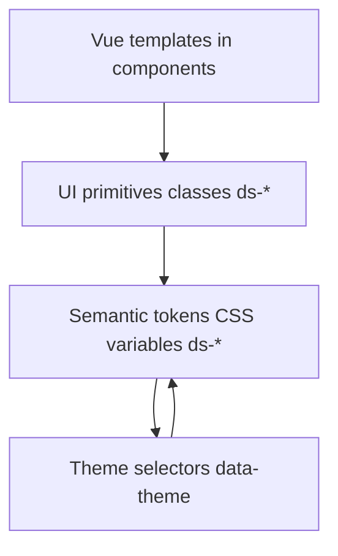

<!-- AI Agent Guide: UI-kit design-system -->
# UI-kit Design System Guide (for AI agent)

Цель: создавать и поддерживать **каноничные стили UI-оверлеев** симулятора без «зоопарка» библиотек: **Vue 3 + обычный CSS**, но с **тематизацией** и едиными примитивами.

Эта инструкция задаёт правила, по которым агент должен добавлять новые стили/компоненты и не плодить дубликаты.

## 0) Каноническая архитектура

Принцип слоёв: **tokens → primitives → composition**.

### Источники правды в репозитории

- Tokens: [`designSystem.tokens.css`](simulator-ui/v2/src/ui-kit/designSystem.tokens.css:1)
- Primitives: [`designSystem.primitives.css`](simulator-ui/v2/src/ui-kit/designSystem.primitives.css:1)
- Demo usage: [`DesignSystemDemoApp.vue`](simulator-ui/v2/src/dev/DesignSystemDemoApp.vue:1)

### Где смотреть изменения визуала (обязательно)

Да, ссылка на демо-страницу **должна** быть в гайде: это дисциплинирует агента и предотвращает расползание стилей.

Каноничная витрина примитивов и тем:

- HTML entry: [`design-system-demo.html`](simulator-ui/v2/design-system-demo.html:1)
- Vue entry: [`design-system-demo.ts`](simulator-ui/v2/src/design-system-demo.ts:1)

Правило: любой новый примитив или изменение токенов **обязательно отражать** в этой демо-странице.

## 1) Главные правила (нельзя нарушать)

1. **Vue-компоненты не задают «визуал» напрямую**
   - Запрещено: хардкод цветов, теней, blur, градиентов в scoped CSS внутри компонентов.
   - Разрешено: только layout-частности конкретного компонента (позиционирование, гриды), и то по возможности через утилитарные layout-классы.

2. **Компоненты используют только примитивы**
   - В темплейтах используем классы `ds-*` (panel/button/input/badge и т.д.).
   - Никаких альтернативных параллельных наборов `.hud-*`, `.panel__*` и т.п. внутри SFC.

3. **Примитивы используют только semantic tokens**
   - Примитивы НЕ должны зависеть от конкретной темы.
   - Допускаются theme-override блоки вида `[data-theme='hud'] .ds-btn { ... }`, но внутри них всё равно опираться на токены: `var(--ds-accent)` и т.д.

4. **Тема меняет только значения токенов**
   - В идеале темы переопределяют переменные в [`designSystem.tokens.css`](simulator-ui/v2/src/ui-kit/designSystem.tokens.css:8)
   - Примитивы и композиции остаются прежними.

5. **Один компонент = один визуальный язык**
   - Если нужен новый элемент управления, сначала пытаемся выразить его существующими примитивами.
   - Если не получается, добавляем новый примитив (см. раздел 4).

## 2) Механика тематизации

Тема задаётся атрибутом на корневом контейнере приложения (или demo-страницы):

- `data-theme = saas | library | hud`
- `data-density = comfortable | compact`
- `data-motion = full | reduced`

Смысл:

- `data-theme` переключает визуальный язык через переопределение токенов в [`designSystem.tokens.css`](simulator-ui/v2/src/ui-kit/designSystem.tokens.css:79)
- `data-density` меняет масштабы отступов/высоты контролов (переменные `--ds-space-*`) в [`designSystem.tokens.css`](simulator-ui/v2/src/ui-kit/designSystem.tokens.css:64)
- `data-motion` выключает анимации, обнуляя длительности `--ds-dur-*` в [`designSystem.tokens.css`](simulator-ui/v2/src/ui-kit/designSystem.tokens.css:72)

## 3) Словарь токенов (semantic tokens)

Добавлять новые токены можно, но строго по правилам.

### Базовые группы (уже есть)

См. [`designSystem.tokens.css`](simulator-ui/v2/src/ui-kit/designSystem.tokens.css:8)

- Typography: `--ds-font-sans`, `--ds-font-mono`
- Geometry: `--ds-radius-*`, `--ds-cut` (HUD)
- Spacing: `--ds-space-1..4`
- Motion: `--ds-ease`, `--ds-dur-*`
- Surfaces: `--ds-surface-0..2`
- Text: `--ds-text-1..3`
- Borders: `--ds-border`
- Shadows: `--ds-shadow`, `--ds-shadow-soft`, `--ds-inner-highlight`
- Accents: `--ds-accent`, `--ds-accent-2`, `--ds-ring`
- Status colors: `--ds-ok`, `--ds-warn`, `--ds-err`, `--ds-info`
- FX: `--ds-glow`, `--ds-glow-strong`, `--ds-scanline`

### Правила добавления нового токена

1. Токен должен быть **semantic**, а не «сырым»
   - Хорошо: `--ds-surface-3`, `--ds-border-danger`, `--ds-focus-ring`
   - Плохо: `--ds-cyan-500`, `--ds-rgba-0-229-255-0-18`

2. Токен должен быть нужен **минимум двум примитивам**
   - Иначе это частный случай и должен жить в конкретном примитиве (но всё равно через existing tokens).

3. Каждая тема должна иметь осмысленное значение
   - Если новый токен введён, добавь его переопределение минимум в `saas`, `library`, `hud` (даже если значение совпадает).

## 4) Примитивы (каноничные UI элементы)

Примитив = переиспользуемый строительный блок UI (класс `ds-*`) из [`designSystem.primitives.css`](simulator-ui/v2/src/ui-kit/designSystem.primitives.css:1).

### Правила примитивов

1. Примитивы отвечают за:
   - формы
   - состояния `hover/focus/active/disabled`
   - размерность/плотность
   - доступность фокуса (focus ring)

2. Примитивы НЕ отвечают за:
   - позиционирование конкретных панелей HUD
   - бизнес-логику
   - уникальные одноразовые эффекты

3. Именование

- Префикс всегда `ds-`
- Модификаторы: `ds-btn ds-btn--primary`
- Элементы: `ds-panel__header` (допустимо)

### Канонические примитивы (минимальный набор)

- Surface: `ds-panel`, `ds-panel--elevated`, `ds-subpanel`
- Buttons: `ds-btn`, `ds-btn--primary|secondary|danger|ghost|icon`
- Inputs: `ds-input`, `ds-select`, `ds-field`, `ds-label`
- Status: `ds-badge ds-badge--ok|warn|err|info`, `ds-alert ds-alert--ok|err`
- Data: `ds-node-card` и его элементы
- Progress: `ds-progress__track`, `ds-progress__bar`

## 5) Как добавить новый примитив (процедура)

Шаги для агента:

1. Определи, что именно не выражается текущими примитивами.
2. Проверь, нет ли похожего класса в [`designSystem.primitives.css`](simulator-ui/v2/src/ui-kit/designSystem.primitives.css:1).
3. Если примитива нет — добавь:
   - базовый стиль (не привязанный к теме)
   - состояния `hover/focus/active/disabled`
   - при необходимости: theme overrides блоки `[data-theme='hud'] ...`
4. Если нужен новый токен — добавь его в [`designSystem.tokens.css`](simulator-ui/v2/src/ui-kit/designSystem.tokens.css:8) и переопредели во всех темах.
5. Обнови demo, чтобы примитив был виден и сравним (см. [`DesignSystemDemoApp.vue`](simulator-ui/v2/src/dev/DesignSystemDemoApp.vue:1)).

## 6) Как делать «HUD стиль», не ломая архитектуру

HUD — это **не отдельный CSS зоопарк**, а:

1) HUD-тема токенов в [`designSystem.tokens.css`](simulator-ui/v2/src/ui-kit/designSystem.tokens.css:129)
2) HUD-оверрайды примитивов в [`designSystem.primitives.css`](simulator-ui/v2/src/ui-kit/designSystem.primitives.css:120)

Что допустимо в HUD overrides:

- `clip-path`/угловатая геометрия
- scanline overlay
- monospace для labels/section labels
- glow на hover/focus

Что недопустимо:

- новый параллельный набор классов (например `.hud-btn2`)
- копипастить целые панели в scoped CSS компонентов

## 7) Чеклист качества для PR от агента

Перед завершением работ агент обязан проверить:

- Нет новых «магических» цветов в компонентах (всё через токены)
- Нет дублирования панелей/кнопок в scoped CSS
- Новые примитивы покрыты темами `saas|library|hud`
- Фокус видим (`:focus-visible` с ring)
- `data-motion='reduced'` отключает тяжёлые анимации
- Demo страница обновлена и показывает новый примитив

## 8) Рекомендация: какой уровень детализации гайда держать

Лучший баланс (чтобы агент был эффективен и не устроил рефакторинг ради рефакторинга):

1) **В этом гайде держать правила и канон** (уже сделано)
2) Добавить **короткий чеклист миграции + таблицу соответствий старых классов новым `ds-*`**
3) Примеры «до/после» держать **по 1–2 ключевых компонента**, чтобы агент понимал паттерн, но не копировал гигантские простыни.

Причина: в `simulator-ui/v2` сейчас много hand-crafted стилей в SFC. Если не дать агенту явную таблицу соответствий, он начнёт изобретать новые классы.

### 8.1 Таблица соответствий (шаблон)

Заполнять по мере миграции.

| Старое | Новое | Примечание |
|---|---|---|
| .panel | .ds-panel + .ds-panel--elevated | Surface-контейнер |
| .btn | .ds-btn | Выбрать модификатор (primary/secondary/ghost/danger) |
| .hud-input | .ds-input | Везде одинаковое поведение focus |
| .hud-select | .ds-select | Стрелка/appearance задаются примитивом |
| .hud-badge | .ds-badge | Статус через модификатор ok/warn/err/info |
| .hud-alert | .ds-alert | Варианты ok/err |

### 8.2 Чеклист миграции компонента

Для каждого Vue-компонента (например [`SimulatorAppRoot.vue`](simulator-ui/v2/src/components/SimulatorAppRoot.vue:1)):

1. В темплейте заменить локальные классы на `ds-*` примитивы
2. Удалить дублирующиеся `scoped` стили, которые описывают внешний вид элементов управления
3. Оставить только layout-частности (grid/position), если их нельзя выразить примитивами
4. Если нужно — добавить отсутствующий примитив (раздел 5)
5. Проверить 3 темы (`saas|library|hud`) на [`design-system-demo.html`](simulator-ui/v2/design-system-demo.html:1)

